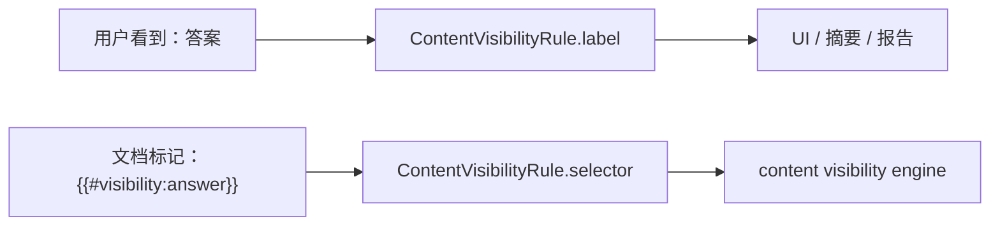

# 内容块显隐规则 Label 与 Selector 边界执行记录 2026-06-30

## 本轮结论

上一轮已经让场景页和执行页共享“内容块 selector -> 业务显示名”的投影，但写入 `ContentVisibilityRule` 时仍存在一个边界问题：

- `selector` 是运行时用的稳定 key，例如 `answer`。
- `label` 是给人看的名称，但此前很多入口也写成 `answer`。

这会让数据模型里“可读名”和“执行 key”没有分工，后续做结构化规则列表、审计记录、报告摘要时仍会把内部 key 暴露到主路径。

本轮把用户操作入口写入的 `ContentVisibilityRule.label` 改为业务名，同时保持 `ContentVisibilityRule.selector` 不变。

## 改动范围

### 场景页手动规则

用户在“内容块规则”文本区写：

```text
answer=remove
analysis=hide
```

解析后现在得到：

```text
selector: answer / label: 答案 / action: remove
selector: analysis / label: 解析 / action: hide
```

### 场景页业务模板

使用“学生版”等业务模板创建交付版本时，规则仍写入：

```text
answer=remove
analysis=remove
solution=remove
```

但模型中的 label 改为：

```text
答案
解析
解题过程
```

### 执行页扫描写回

执行页扫描到 `{{#visibility:answer}}` 后，用户选择“答案”并添加规则：

```text
ContentVisibilityRule(selector="answer", label="答案", action="remove")
```

因此执行引擎继续消费 `selector`，UI/报告可以优先展示 `label`。

## 边界原则



本轮只改变 `label` 的写入值，不改变：

- `selector`
- `rule_id`
- `action`
- 文本规则格式
- pipeline 执行逻辑

## 测试证据

新增/更新测试覆盖：

- 场景页文本规则解析后，selector 仍是 `answer / analysis`，label 是“答案 / 解析”。
- 复制交付版本后，规则 label 与 selector 都保持。
- 场景页业务模板生成“学生版”后，label 是“答案 / 解析 / 解题过程”。
- 场景页按钮添加内容块后，label 是“答案”。
- 执行页扫描写回后，label 是“答案”，selector 仍是 `answer`。

已运行：

```text
python -X utf8 -m py_compile src\ui\panels\scene_panel.py src\ui\panels\workbench\quick_execution_detail.py tests\test_scene_panel_architecture.py tests\test_quick_execution_detail_architecture.py
python -X utf8 -m pytest tests\test_scene_panel_architecture.py::test_scene_panel_profile_controls_write_back_to_scene tests\test_scene_panel_architecture.py::test_scene_panel_delivery_business_preset_templates_create_common_versions tests\test_scene_panel_architecture.py::test_scene_panel_delivery_visibility_rule_inserter_updates_current_preset tests\test_quick_execution_detail_architecture.py::test_quick_execution_detail_adds_scanned_selector_to_default_delivery_preset -q
python -X utf8 -m pytest tests\test_scene_panel_architecture.py tests\test_quick_execution_detail_architecture.py -q
```

结果：4 个 label/selector 聚焦测试通过；场景页 + 执行页整组 108 个测试通过。

## 后续继续推进

1. 场景族默认配置仍位于 `src/config`，不应直接依赖 UI adapter；后续可把内容块命名投影下沉到 `shared` 或配置安全的语义模块，再接入场景族默认生成。
2. 输出设置中的文本规则区仍然是高级编辑方式，下一步可加结构化规则列表，让用户看到“答案 -> 删除块”。
3. 执行报告/中间产物可以优先展示 `label`，将 selector 放到 tooltip 或诊断字段。
