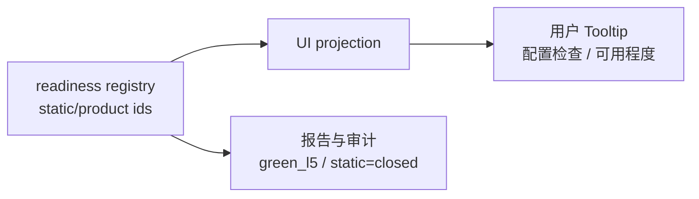

# 场景可用度 Tooltip 工程语下沉执行记录

日期：2026-06-28

## 本轮目标

上一轮已经把导航高亮 Tooltip 中的 raw key 下沉到控件诊断属性。本轮继续处理场景概览和高级证据里的工程化表达。

这次定位到的主要泄漏点是 `product_readiness` 的 Tooltip。它原本会显示：

```text
product readiness 与 static closure 分开治理；static closed 不能直接宣称 Green/L5。
pack:contract_delivery static=closed; readiness=green_l5
```

这类话对开发和审计有意义，但对用户仍然像“内部成熟度报表”。即便它出现在高级证据 Tooltip 中，也仍然是用户可见界面，不应该要求用户理解 `static closure / readiness / green_l5`。

## 本轮实现

### 1. 可用度 Tooltip 改为中文任务语言

文件：`src/ui/panels/scene_summary_projection.py`

原始表达：

```text
product readiness
static closure
static=
readiness=
Green/L5
```

改为：

```text
可用程度会同时看配置闭合和真实交付证据，避免只通过静态检查就直接承诺可交付。
合同交付：配置检查 已闭合；可用程度 可直接使用
证据面：7 项
```

新增/调整的投影 helper：

- `_readiness_subject_display()`
- `_static_closure_label()`
- `_readiness_rationale_display()`

其中 subject id 会走已有显示名：

- `quick_formatting` -> `通用格式清理`
- `contract_delivery` -> `合同交付`
- `journal_en` -> `英文期刊投稿`

### 2. 保留底层 readiness registry，不改审计语义

本轮没有改变：

- `src/config/scene_product_readiness.py`
- 报告中的结构化 readiness 字段
- 审计测试中对 `green_l5` 等内部 id 的验证

改动只发生在 UI 投影层。也就是说，底层仍能追溯 `static_closure_level` 和 `product_readiness_level`，但普通可见 tooltip 不再直接展示这些字段名。

### 3. UI copy guardrail 扩展禁词

文件：`tests/test_ui_copy_guardrails.py`

新增禁止泄漏的词：

```text
product readiness
static closure
static=
readiness=
Green/L5
green_l5
```

同时要求可见摘要中出现：

```text
配置检查
可用程度
```

这样后续如果有人把 maturity registry 文案直接塞回 UI，测试会失败。

## 当前边界



边界规则：

- UI Tooltip：说“配置检查”“可用程度”“证据面 N 项”。
- 高级证据正文：可以展示中文证据分类和样本名称。
- 报告/审计：继续保留 raw readiness id。
- 测试：普通 UI copy 不允许出现 maturity registry 的英文/字段格式。

## 为什么这一步重要

用户在场景页想知道的是：

- 这个场景能不能直接用？
- 还需要我确认什么？
- 为什么不能自动处理？

而不是：

- `static=closed`
- `readiness=green_l5`
- `product readiness`

把这些词从 Tooltip 里下沉，能让高级证据也保持“人话”，而不是只有首屏做了文案清理。

## 后续建议

1. 继续清理其他高级证据 Tooltip，例如矩阵 dashboard、drilldown、boundary capability 中仍可能存在英文审计句。
2. 将 `_evidence_detail()` 中的 schema/report/fixture id 分成“普通摘要”和“诊断明细”两套输出，避免 detail 中继续出现大量下划线 id。
3. 给 `build_scene_overview_summary_items()` 增加“可见 UI 文案扫描”辅助，统一检测下划线 id、`key=value`、`a:b` 等机器格式。
4. 把用户可见的“高级证据”改名为“处理依据”，把更底层的 raw trace 放到二级折叠或导出的报告里。

## 测试记录

编译通过：

```bash
python -m compileall src/ui/panels/scene_summary_projection.py tests/test_ui_copy_guardrails.py tests/test_scene_panel_architecture.py tests/test_scene_overview_projection.py
```

聚焦测试通过：

```bash
python -m pytest tests/test_ui_copy_guardrails.py::test_scene_visible_copy_guard_keeps_machine_terms_out_of_main_paths tests/test_scene_overview_projection.py tests/test_scene_panel_architecture.py::test_scene_overview_summary_projects_contract_green_with_field_evidence tests/test_scene_panel_architecture.py::test_scene_panel_overview_shows_planning_family_governance -q
```

结果：`7 passed`

相邻回归通过：

```bash
python -m pytest tests/test_ui_copy_guardrails.py tests/test_scene_overview_projection.py tests/test_scene_panel_architecture.py tests/test_workbench_execution_center.py tests/test_quick_execution_detail_architecture.py -q
```

结果：`174 passed in 174.94s`
