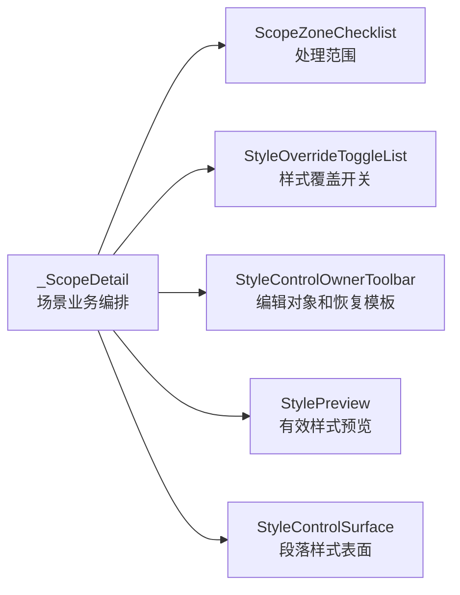

# 场景处理范围 Checklist 组件化与边界拆分执行记录

日期：2026-06-28

## 本轮结论

上一轮已经把“样式覆盖”的分区 toggle 列表抽成 `StyleOverrideToggleList`。这让 `_ScopeDetail` 内部的样式覆盖区域开始有清晰组件边界。但另一半“处理范围”仍然是手写 checkbox + FlowLayout：

```text
_ScopeDetail
  - 创建 zone_labels
  - 创建 zones_widget
  - 创建 FlowLayout
  - 循环创建 QCheckBox
  - 保存 _zone_checks
  - 连接 _on_edited
```

这让“处理范围”和“样式覆盖”在代码结构上不对称：一个已经组件化，一个还是页面内部拼装。用户要求“功能分布更合理、边界更清晰”，这里正是继续推进的低风险切口。

本轮新增 `ScopeZoneChecklist`，把处理范围的 checkbox 列表抽成独立小组件；场景页保留 `_zone_checks` 兼容入口，保证工作台跳转和高亮链路不被打断。

## 本轮实现

### 1. 新增 ScopeZoneChecklist

文件：`src/shared/ui/scope_zone_checklist.py`

新增：

- `ScopeZoneOption`
  - `key`
  - `label`
- `ScopeZoneChecklist`
  - 内部使用 `FlowLayout` 管理 checkbox 排布。
  - 内部使用 `QCheckBox` 生成处理范围选项。
  - 内部使用 `build_checkbox_stylesheet()` 统一 checkbox 样式。
  - 暴露 `checks` 字典，供现有跳转和测试定位真实 checkbox。
  - 暴露 `set_checked()`，供页面同步场景状态。
  - 发出 `checked_changed = Signal(str, bool)`，页面只处理业务 key 和 checked。

组件边界：

```text
输入：zone key / label
输出：哪个 zone 被勾选或取消
不做：写入 SceneWorkspace、不控制样式覆盖、不刷新预览
```

### 2. 场景页迁移

文件：`src/ui/panels/scene_panel.py`

原来 `_ScopeDetail.__init__()` 内部直接创建范围 checkbox。现在改为：

```python
self._scope_zone_checklist = ScopeZoneChecklist(...)
self._scope_zone_checklist.set_options(...)
self._scope_zone_checklist.checked_changed.connect(self._on_scope_zone_changed)
self._zone_checks = self._scope_zone_checklist.checks
```

新增 `_on_scope_zone_changed()`，保持业务写回仍走原来的 `_on_edited()`。

保留 `_zone_checks` 是关键决策：工作台问题跳转、导航高亮和测试都需要能定位到真实范围 checkbox。例如：

```text
format_scope.sections.references -> _zone_checks["references"]
```

本轮没有破坏这条链路。

## 当前结构

现在 `_ScopeDetail` 内部两个列表都已经从手写 UI 变成组件：



对比前一轮：

| 区域 | 之前 | 现在 |
| --- | --- | --- |
| 处理范围 | `_ScopeDetail` 手写 `QCheckBox + FlowLayout` | `ScopeZoneChecklist` |
| 样式覆盖列表 | `_ScopeDetail` 手写 `QWidget + QLabel + ToggleSwitch` | `StyleOverrideToggleList` |
| 样式编辑对象 | 页面手写 combo/button/hint | `StyleControlOwnerToolbar` |
| 样式控件 | 页面手写字段控件 | `StyleControlSurface` |
| 状态文案 | 页面拼接 | `StyleOwnerViewState` + projection |

这说明当前结构已经从“一个 detail 里堆所有控件”推进到“业务编排层 + 多个小组件”。

## 测试补强

### 1. 小组件测试

文件：`tests/test_small_widget_architecture.py`

新增 `test_scope_zone_checklist_manages_checks_and_signals`，覆盖：

- `ScopeZoneChecklist` 能生成 `body / references / appendix` 三个 checkbox。
- checkbox 文本正确。
- checkbox 应用 shared checkbox stylesheet。
- `set_checked()` 能同步选中状态。
- 勾选变化发出 `(key, checked)`。

### 2. 场景架构护栏

文件：`tests/test_scene_panel_architecture.py`

新增断言：

- 场景页必须使用 `ScopeZoneChecklist`。
- 场景页必须使用 `ScopeZoneOption`。
- 旧的 `_zones_flow = FlowLayout(...)` 不应继续出现在场景页。
- `scope_zone_checklist.py` 内部集中使用 `QCheckBox(option.label, self)`。
- `ScopeZoneChecklist` 必须暴露 `checked_changed = Signal(str, bool)`。
- `ScopeZoneChecklist` 必须使用 `build_checkbox_stylesheet()`。

这些测试确保处理范围列表不会回退为页面私有拼装。

## 验证记录

编译通过：

```powershell
python -m compileall src/shared/ui/scope_zone_checklist.py src/ui/panels/scene_panel.py tests/test_small_widget_architecture.py tests/test_scene_panel_architecture.py
```

聚焦测试通过：

```powershell
python -m pytest tests/test_small_widget_architecture.py::test_scope_zone_checklist_manages_checks_and_signals tests/test_scene_panel_architecture.py::test_scene_panel_uses_shared_card_header_and_flow_scope_layout tests/test_scene_panel_architecture.py::test_scene_panel_controls_follow_template_management_contract tests/test_scene_panel_architecture.py::test_scene_panel_scope_style_override_editor_writes_section_styles -q
```

结果：

```text
4 passed in 36.90s
```

相邻回归通过：

```powershell
python -m pytest tests/test_small_widget_architecture.py tests/test_style_variant_semantics.py tests/test_style_field_descriptors.py tests/test_field_display_names.py tests/test_paragraph_style_editor.py tests/test_template_style_detail.py tests/test_scene_panel_architecture.py tests/test_workbench_issue_navigation.py tests/test_control_contract_registry.py -q
```

结果：

```text
111 passed in 267.18s
```

## 仍未完成

组件边界更清楚了，但 `_ScopeDetail` 还没有完全拆干净：

1. 处理范围的业务写回仍在 `_ScopeDetail._on_edited()`。
2. 样式覆盖的启用/关闭、恢复模板、projection 计算仍在 `_ScopeDetail`。
3. 处理范围和样式覆盖仍属于同一个 detail 页面，还没有变成两个可独立导航的 detail。
4. 样式覆盖 summary 仍由 `_ScopeDetail` 拼装。
5. 还没有截图级验收，无法证明视觉层面已达到模板管理一致性。

## 下一轮建议

下一轮可以继续做两件事之一：

1. 抽 `SectionStyleOverrideController`：把启用覆盖、关闭覆盖、恢复模板、projection、预览投影等业务编排从 `_ScopeDetail` 下沉。
2. 抽 `SceneScopeStateProjection`：把处理范围 summary 和样式覆盖 summary 从页面里拿出来，形成可测试的状态投影。

如果继续以“边界清晰”为优先，建议先抽 `SectionStyleOverrideController`。因为现在 UI 小组件已经拆出来，剩下最重的混杂就是样式覆盖业务编排。

## 当前判断

本轮和上一轮合在一起，已经把 `_ScopeDetail` 里两个最明显的列表型 UI 都组件化了：

- `ScopeZoneChecklist` 管处理范围。
- `StyleOverrideToggleList` 管样式覆盖开关。

这一步不改变用户可见大布局，但它让页面内部边界更接近用户心智，也为后续把“处理范围”和“样式覆盖”拆成更独立的功能域打下了基础。
