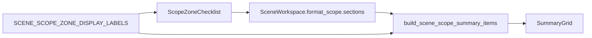

# 场景处理范围 Summary 动态投影执行记录

日期：2026-06-28

## 本轮结论

前几轮已经把 `_ScopeDetail` 的处理范围 checklist、样式覆盖 toggle list、样式覆盖 summary、样式覆盖 service 都逐步外移。但处理范围 summary 仍停留在静态说明：

```text
选择处理区域
范围变更会影响全文
```

这类文案能解释规则，却不能告诉用户“当前到底启用了哪些区域”。模板管理页面更成熟的地方在于 summary 会表达当前对象状态，而不是只放说明文字。因此本轮把处理范围 summary 下沉为动态投影：

```text
已启用 3 个区域
正文、参考文献、附录
```

当没有区域启用时显示：

```text
未启用区域
当前场景不会主动处理文档区域。
```

这继续把页面从“解释规则”推进到“呈现状态”。

## 本轮实现

### 1. 新增处理范围显示名

文件：`src/ui/panels/scene_summary_projection.py`

新增：

- `SCENE_SCOPE_ZONE_DISPLAY_LABELS`
- `SCENE_SCOPE_ZONE_ORDER`

这些显示名同时供 summary 投影和场景页 checklist 选项使用，避免页面和 projection 各维护一份区域名称。

### 2. 新增 build_scene_scope_summary_items()

文件：`src/ui/panels/scene_summary_projection.py`

新增函数：

```python
build_scene_scope_summary_items(scene)
```

输出仍沿用原来的 key：

- `main_controls`
- `risk_note`

但 value/detail 变成动态状态：

- 无 scene：`选择处理区域`
- 有 scene 且启用区域：`已启用 N 个区域`
- 有 scene 但无启用区域：`未启用区域`
- detail 展示启用区域名称，例如 `正文、参考文献、附录`

保留原 key 是为了不改 SummaryGrid 消费层，同时让测试和工作台上下文更稳定。

### 3. 场景页迁移

文件：`src/ui/panels/scene_panel.py`

调整：

- `ScopeZoneChecklist` 的 option label 改为来自 `SCENE_SCOPE_ZONE_DISPLAY_LABELS`。
- 处理范围 summary 初始化改为 `build_scene_scope_summary_items(None)`。
- 新增 `_refresh_scope_summary()`。
- `set_scene()` 后刷新处理范围 summary。
- `_on_edited()` 写回处理范围后刷新 summary。

同时移除 `_SCENE_DETAIL_SUMMARY_COPY` 中旧的“处理范围”和“样式覆盖”静态 copy，避免后续误用旧文案。

## 当前结构

处理范围现在的链路是：



这让处理范围和样式覆盖形成对称结构：

| 功能域 | UI 组件 | Summary 投影 |
| --- | --- | --- |
| 处理范围 | `ScopeZoneChecklist` | `build_scene_scope_summary_items()` |
| 样式覆盖 | `StyleOverrideToggleList` | `build_scene_style_override_summary_items()` |

## 测试补强

文件：`tests/test_scene_panel_architecture.py`

新增：

- `test_scene_scope_summary_projection_tracks_enabled_zones`

覆盖：

- 所有区域关闭时显示 `未启用区域`。
- 启用正文、参考文献、附录后显示 `已启用 3 个区域`。
- detail 显示 `正文、参考文献、附录`。
- risk 显示 `关闭区域会跳过内容`。

同时更新场景页架构测试：

- 场景页必须使用 `build_scene_scope_summary_items`。
- 场景页测试不再断言固定文案 `选择处理区域 / 范围变更会影响全文`，而是按真实启用数量断言。

## 验证记录

编译通过：

```powershell
python -m compileall src/ui/panels/scene_summary_projection.py src/ui/panels/scene_panel.py tests/test_scene_panel_architecture.py
```

聚焦测试通过：

```powershell
python -m pytest tests/test_scene_panel_architecture.py::test_scene_panel_projects_scene_profiles_with_shared_summary_grid tests/test_scene_panel_architecture.py::test_scene_scope_summary_projection_tracks_enabled_zones tests/test_scene_panel_architecture.py::test_scene_panel_controls_follow_template_management_contract tests/test_scene_panel_architecture.py::test_scene_panel_scope_style_override_editor_writes_section_styles -q
```

结果：

```text
4 passed in 37.57s
```

相邻回归通过：

```powershell
python -m pytest tests/test_small_widget_architecture.py tests/test_style_variant_semantics.py tests/test_style_field_descriptors.py tests/test_field_display_names.py tests/test_paragraph_style_editor.py tests/test_template_style_detail.py tests/test_scene_panel_architecture.py tests/test_workbench_issue_navigation.py tests/test_control_contract_registry.py -q
```

结果：

```text
115 passed in 266.08s
```

## 仍未完成

处理范围 summary 已经动态化，但还有几个未完成点：

1. 处理范围和样式覆盖仍在同一个 `_ScopeDetail` 类里。
2. 处理范围的业务规则仍在 `_on_edited()` 中，例如关闭范围后联动清理覆盖。
3. 尚未抽出 `SceneScopeService` 或 `SceneScopeStateProjection` 来统一处理范围写回和联动规则。
4. 尚未做截图级验收，无法确认视觉层面的 summary 密度是否已经足够像模板管理。

## 下一轮建议

下一轮可以继续抽处理范围服务层：

- `set_scene_scope_zone(scene, zone_id, enabled)`
- `sync_scope_dependent_overrides(scene)`
- `scene_scope_summary(scene)`

或者更直接地把 `_ScopeDetail` 拆成两个内部 detail：

- `ScopeZoneDetail`
- `SceneStyleOverrideDetail`

前者风险更低，后者结构收益更大。

## 当前判断

这轮把处理范围从静态说明推进为动态状态。用户不再只看到“选择处理区域”，而能看到“已启用 N 个区域”和具体区域名称。

到这里，`_ScopeDetail` 里的两个核心功能域已经都具备了：

- 独立 UI 组件。
- 独立 summary 投影。
- 更短、更状态化的文案。

剩下的问题不再是局部控件，而是是否要把两个功能域拆成更独立的 detail 或服务层。
