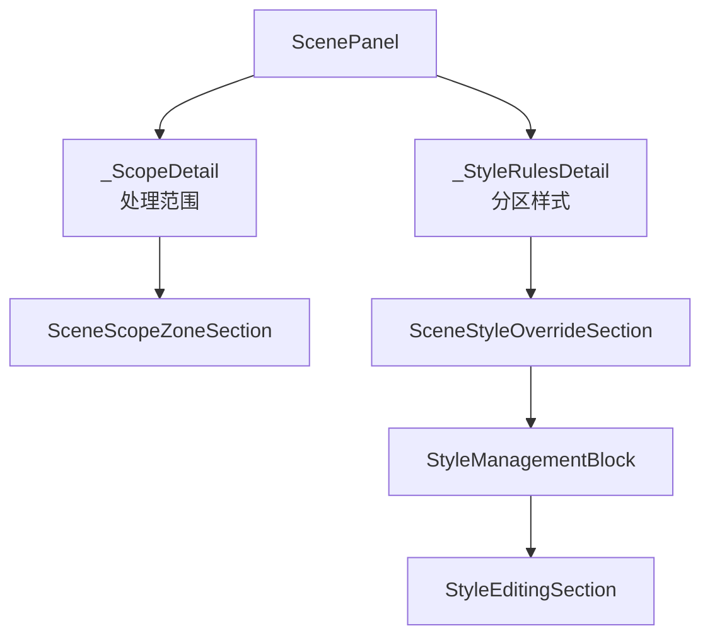

# 场景处理范围与分区样式导航拆分执行记录

日期：2026-06-29

## 1. 本轮目标

上一轮已经把样式管理提升到共享 `StyleManagementBlock`，但信息架构上仍然有一个关键问题：`scn_scope` 同时承载“处理哪些区域”和“这些区域是否使用独立样式”。这会让用户误以为样式覆盖只是处理范围的附属设置，也会让页面继续变长。

本轮把它们拆成两个独立详情：

- `处理范围`：只回答“这次处理哪些区域？”
- `分区样式`：只回答“这些区域跟随模板，还是当前场景单独覆盖？”

## 2. 代码变更

### 2.1 新增导航卡

文件：`src/ui/panels/scene_panel.py`

新增：

```python
"scn_style_rules": ("分区样式", "type-outline")
```

并加入：

- `CARD_ORDER`
- `FIXED_CARDS`
- `FORMAT_TEMPLATE_CARDS`
- `_detail_map`

现在“格式与模板”组下的固定顺序变为：

```text
处理范围
分区样式
启用模块
表格与图表
页面元素
公式规范
参考文献
```

### 2.2 `_ScopeDetail` 收窄为处理范围页

`_ScopeDetail` 现在只保留：

- `SceneScopeZoneSection`
- 范围 summary
- 范围 checkbox
- 范围字段高亮
- `apply_scene_scope_zone_states(...)`

它不再持有：

- `SceneStyleOverrideSection`
- 样式覆盖 summary
- 样式分区 toggle
- 样式编辑器字段
- 样式预览

### 2.3 新增 `_StyleRulesDetail`

`_StyleRulesDetail` 承接原来的分区样式逻辑：

- `SceneStyleOverrideSection`
- 覆盖分区开关
- 编辑分区 selector
- 恢复模板 action
- 轻量样式预览
- `StyleManagementBlock`
- 样式字段编辑与导航高亮

这让代码职责变成：



### 2.4 范围与样式联动

范围变化后仍然要清理已关闭区域的样式覆盖。本轮保持这条业务链：

```text
_ScopeDetail._on_scope_zone_changed
-> apply_scene_scope_zone_states(...)
-> ScenePanel._on_scope_changed
-> _StyleRulesDetail.set_scene(...)
-> _on_scene_edited()
```

这样关闭“参考文献”等处理范围时，对应 `references_body` 样式覆盖仍会被清理，分区样式页也会刷新。

### 2.5 工作台跳转同步拆分

文件：`src/ui/adapters/workbench_issue_navigation.py`

调整：

```python
"scene_scope_field": "scn_scope"
"scene_style_field": "scn_style_rules"
```

结果：

- `format_scope.sections.references` 跳到 `处理范围`
- `scene.section_styles.references_body.font_cn` 跳到 `分区样式`
- `scene.section_styles.*.line_spacing_pt` 跳到 `分区样式`

### 2.6 修复路由证据同步

文件：`src/config/scene_repair_routing.py`

更新了 `scene_field_repair` 的说明和证据：

- 不再说所有场景字段都进入 scope detail。
- 明确 scope/style 分别进入 `scn_scope` / `scn_style_rules`。

同时修复了 `template_field_repair` 的证据标记：模板正文详情已迁入共享 `StyleManagementBlock`，`ParagraphStyleEditor(` 不再直接出现在 `template_style_detail.py`，证据改为 `src/shared/ui/paragraph_style_surface.py`。

## 3. 视觉审查

新增截图：

- `docs/visual_audit/2026-06-29/scene_scope_split_panel.png`
- `docs/visual_audit/2026-06-29/scene_scope_split_detail.png`
- `docs/visual_audit/2026-06-29/scene_style_rules_panel.png`
- `docs/visual_audit/2026-06-29/scene_style_rules_detail.png`

辅助裁剪：

- `docs/visual_audit/2026-06-29/scene_scope_split_content_crop.png`
- `docs/visual_audit/2026-06-29/scene_style_rules_content_crop.png`
- `docs/visual_audit/2026-06-29/scene_style_rules_nav_crop.png`

观察结果：

- `处理范围` 页只显示范围 summary 和范围开关。
- `分区样式` 页单独显示样式覆盖 summary、覆盖开关、编辑分区、预览。
- 左侧导航已出现独立 `分区样式` 卡片。
- 未启用覆盖时，分区样式页继续保持字段区折叠，不显示大面积灰色字段。

说明：离屏截图中文仍可能显示为方块，这是测试环境字体限制；用户实际截图中的中文显示正常。

## 4. 测试验证

编译通过：

```powershell
python -X utf8 -m compileall src/ui/panels/scene_panel.py src/ui/adapters/workbench_issue_navigation.py src/config/scene_repair_routing.py
```

聚焦测试通过：

```powershell
python -X utf8 -m pytest tests/test_scene_panel_architecture.py::test_scene_panel_scope_style_override_editor_writes_section_styles tests/test_workbench_issue_navigation.py tests/test_workbench_execution_session_architecture.py::test_workbench_panel_routes_scene_field_issue_repair_to_scene_scope_detail tests/test_workbench_execution_session_architecture.py::test_workbench_scene_field_repair_intent_reaches_scene_scope_widgets -q
```

结果：

```text
13 passed in 35.28s
```

修复路由与关键链路验证通过：

```powershell
python -X utf8 -m pytest tests/test_scene_repair_routing.py tests/test_scene_panel_architecture.py::test_scene_panel_scope_style_override_editor_writes_section_styles tests/test_workbench_issue_navigation.py tests/test_workbench_execution_session_architecture.py::test_workbench_scene_field_repair_intent_reaches_scene_scope_widgets -q
```

结果：

```text
16 passed in 31.95s
```

相邻回归通过：

```powershell
python -X utf8 -m pytest tests/test_scene_panel_architecture.py tests/test_workbench_issue_navigation.py tests/test_workbench_execution_session_architecture.py tests/test_scene_repair_routing.py tests/test_workbench_execution_center.py::test_batch_execution_issue_items_infer_scene_field_targets_from_parameter_paths tests/test_workbench_execution_center.py::test_execution_diagnostic_issue_items_infer_scene_field_targets -q
```

结果：

```text
87 passed in 298.81s
```

## 5. 本轮判断

这轮完成的是信息架构层的实质拆分，不只是控件移动：

```text
之前：
scn_scope = 处理范围 + 分区样式

现在：
scn_scope = 处理范围
scn_style_rules = 分区样式
```

这让用户可以按任务理解页面：

- 想决定处理哪些区域，进 `处理范围`。
- 想决定样式跟随模板还是当前场景覆盖，进 `分区样式`。

这一步比继续压缩文案更重要，因为它让功能边界自己说话。

## 6. 后续建议

下一步可以继续推进三件事：

1. 把 `SceneStyleOverrideSection` 标题从“样式覆盖”进一步改成更用户化的“分区样式”，减少“覆盖”这个工程词的主界面存在感。
2. 给场景概览增加独立的 `分区样式` 入口卡，让用户从概览能直接进入样式规则，而不是只看到处理范围。
3. 清理测试和兼容字段里仍沿用的旧命名，例如 `scope_style_override_editor` 这类历史测试名。
