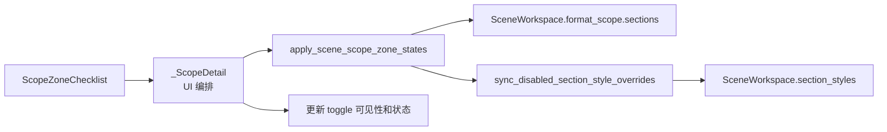

# 场景处理范围服务层抽取执行记录

日期：2026-06-28

## 本轮结论

上一轮处理范围 summary 已经从静态说明改为动态投影，但 `_ScopeDetail._on_edited()` 仍然直接做两件业务事：

- 从 checkbox 读取状态并写入 `scene.format_scope.sections`。
- 调用样式覆盖清理逻辑，删除不再处理的分区覆盖。

这说明处理范围的 UI 边界已经清楚了，但业务写回还留在页面层。为了继续让 `_ScopeDetail` 变成 UI 编排层，本轮新增 `scene_scope_service.py`，把处理范围写回和依赖覆盖清理合成一个服务入口。

## 本轮实现

### 1. 新增 scene_scope_service.py

文件：`src/ui/panels/scene_scope_service.py`

新增：

```python
apply_scene_scope_zone_states(scene, zone_states)
```

职责：

- 将 `{zone_id: checked}` 写入 `scene.format_scope.sections`。
- 调用 `sync_disabled_section_style_overrides(scene)`。
- 返回被清理掉的样式覆盖 variant key。

这个函数不碰 UI，不知道 checkbox，也不刷新 layout。它只处理“处理范围状态写回 + 依赖样式覆盖清理”这条业务规则。

### 2. 迁移 ScopeDetail

文件：`src/ui/panels/scene_panel.py`

迁移前：

```python
for zone_id, cb in self._zone_checks.items():
    self._current_scene.format_scope.sections[zone_id] = cb.isChecked()

for variant_key in sync_disabled_section_style_overrides(self._current_scene):
    self._set_variant_toggle_checked(variant_key, False)
```

迁移后：

```python
dropped_overrides = apply_scene_scope_zone_states(
    self._current_scene,
    {zone_id: cb.isChecked() for zone_id, cb in self._zone_checks.items()},
)
```

页面仍负责：

- 从真实 checkbox 读取当前状态。
- 更新样式覆盖行的可见性。
- 将被清理的 override 对应 toggle 置回关闭。
- 刷新 summary、style editor 和 layout。

但页面不再直接写 `format_scope.sections`，也不再直接调用覆盖清理函数。

## 当前链路



现在处理范围和样式覆盖都有了服务入口：

| 功能 | 服务入口 |
| --- | --- |
| 处理范围写回 | `apply_scene_scope_zone_states()` |
| 样式覆盖启用/恢复/projection | `scene_style_override_service.py` |

## 测试补强

文件：`tests/test_scene_panel_architecture.py`

新增：

- `test_scene_scope_service_applies_zone_states_and_cleans_overrides`

覆盖：

- 写入 `references=False`、`appendix=True`。
- `scene.format_scope.sections` 被正确更新。
- `references_body` 覆盖被清理。
- `appendix_body` 覆盖被保留。

架构护栏调整：

- 场景页必须使用 `apply_scene_scope_zone_states`。
- 场景页不能直接出现 `sync_disabled_section_style_overrides`。
- `scene_scope_service.py` 必须引用 `sync_disabled_section_style_overrides`，说明清理规则被集中到服务层。

## 验证记录

编译通过：

```powershell
python -m compileall src/ui/panels/scene_scope_service.py src/ui/panels/scene_panel.py tests/test_scene_panel_architecture.py
```

聚焦测试通过：

```powershell
python -m pytest tests/test_scene_panel_architecture.py::test_scene_panel_controls_follow_template_management_contract tests/test_scene_panel_architecture.py::test_scene_scope_service_applies_zone_states_and_cleans_overrides tests/test_scene_panel_architecture.py::test_scene_panel_scope_style_override_editor_writes_section_styles -q
```

结果：

```text
3 passed in 8.91s
```

相邻回归通过：

```powershell
python -m pytest tests/test_small_widget_architecture.py tests/test_style_variant_semantics.py tests/test_style_field_descriptors.py tests/test_field_display_names.py tests/test_paragraph_style_editor.py tests/test_template_style_detail.py tests/test_scene_panel_architecture.py tests/test_workbench_issue_navigation.py tests/test_control_contract_registry.py -q
```

结果：

```text
116 passed in 61.43s
```

## 仍未完成

本轮下沉了处理范围写回，但 `_ScopeDetail` 仍然同时承载两个功能域：

1. 处理范围 checklist 和 summary。
2. 样式覆盖列表、owner、预览、surface。

下一步如果继续追求更清晰的功能分布，应考虑把 `_ScopeDetail` 内部拆成两个子 detail 或子 widget，而不是继续让一个类编排所有区域。

## 下一轮建议

建议下一轮做结构级拆分前的轻量准备：

- 抽 `ScopeZoneSection`：包含处理范围说明、summary、checklist。
- 抽 `StyleOverrideSection`：包含样式覆盖 summary、toggle list、owner toolbar、preview、surface。

这样可以先在同一个导航页里拆成两个子 section，验证稳定后再决定是否升级成两个独立导航项。

## 当前判断

到这一轮为止，处理范围已经具备：

- 独立 checklist 组件。
- 独立 summary projection。
- 独立 service 写回入口。

样式覆盖也具备：

- 独立 toggle list。
- 独立 owner toolbar。
- 独立 style surface。
- 独立 summary projection。
- 独立 service 动作入口。

也就是说，`_ScopeDetail` 里的两个功能域已经有了明确的外围边界。剩下的问题，是是否要把这两个域从同一个类和同一个页面结构中进一步拆出来。
