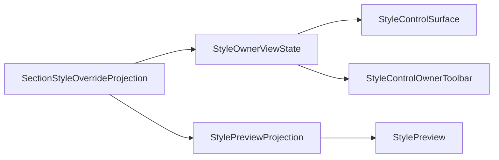

# 场景样式状态文案瘦身与可读性执行记录

日期：2026-06-28

## 本轮结论

前几轮已经把样式字段、控件表面、Owner 工具条、Owner 状态投影串成共享链路。但用户仍会觉得“不说人话”的一个原因，是场景样式覆盖区的状态文案仍然偏解释型。

典型旧表达：

- `输出使用模板中的有效样式；开启覆盖后只影响当前场景。`
- `已开启覆盖，但当前值与模板有效样式一致。`
- `「参考文献」当前跟随模板正文；开启覆盖后可编辑。`
- `不同项：中文字体、字号、行距`

这些句子本身不算错，但它们把规则说明放在主界面和 tooltip 里。优秀的模板管理式界面应该先给用户状态，再在需要时给解释。用户真正需要第一眼看到的是：

- 跟随模板
- 使用模板样式
- 与模板一致
- 不同：中文字体、字号、行距
- 恢复模板

本轮将场景样式 projection 和 owner fallback 的状态文案收敛为短状态，删除运行路径中的长解释句。

## 本轮实现

### 1. 收敛 SectionStyleOverrideProjection 文案

文件：`src/config/style_variant_semantics.py`

调整前：

```text
跟随模板：输出使用模板中的有效样式；开启覆盖后只影响当前场景。
已覆盖 0 项：已开启覆盖，但当前值与模板有效样式一致。
已覆盖 N 项：不同项：中文字体、字号、行距
```

调整后：

```text
跟随模板：使用模板样式。
已覆盖 0 项：与模板一致。
已覆盖 N 项：不同：中文字体、字号、行距
```

同时调整 editor hint：

```text
参考文献：跟随模板。开启覆盖后可编辑。
参考文献：已开启覆盖，与模板一致。
参考文献：正在编辑，不同：中文字体、字号、行距。
```

这让 tooltip、summary detail、owner hint 使用同一套短状态语言。

### 2. 收敛场景页样式覆盖说明

文件：`src/ui/panels/scene_panel.py`

调整：

```text
默认跟随模板；只有需要让某个分区不同于模板时开启覆盖。
```

改为：

```text
默认跟随模板；需要单独设置时再开启覆盖。
```

样式覆盖摘要中的边界说明：

```text
开启后只影响当前场景，不修改模板默认格式。
```

改为：

```text
开启后仅影响当前场景。
```

主界面不再重复解释“不修改模板默认格式”，因为“仅当前场景”和“恢复模板”已经承担了主要心智。

### 3. 同步共享 owner fallback 口吻

文件：`src/shared/ui/style_owner_state.py`

调整 fallback hint：

```text
「参考文献」当前跟随模板；开启覆盖后可编辑。
```

改为：

```text
参考文献：跟随模板。开启覆盖后可编辑。
```

并将“正在编辑独立样式”压短为：

```text
参考文献：正在编辑。
```

这保证有 projection 和没有 projection 的路径不会出现两种语气。

### 4. 更新测试样例，防止旧口吻回流

同步更新：

- `tests/test_style_variant_semantics.py`
- `tests/test_scene_panel_architecture.py`
- `tests/test_small_widget_architecture.py`
- `tests/test_paragraph_style_editor.py`

并增加了检索护栏：

```powershell
rg -n "输出使用模板中的有效样式|当前跟随模板正文|模板有效样式一致|已开启覆盖，但当前值|当前值仍|不同项：|只影响当前场景，不修改模板默认格式|只有需要让某个分区不同于模板" src tests
```

结果：无匹配。

历史文档中仍保留旧表达，因为它们是当时执行记录，不应被回写改造。

## 当前链路变化

本轮没有新增大组件，而是改了状态语言的出口：



旧链路里，projection 会把说明句一路传到 toolbar、surface property、summary 和 preview tooltip。现在 projection 输出更短的状态句，下游组件不需要各自再做文案清洗。

## 可读性收益

### 1. 用户先看状态，不读规则

用户看到：

```text
参考文献 · 跟随模板
```

就能理解当前不需要编辑。

用户看到：

```text
参考文献 · 已覆盖 3 项
不同：中文字体、字号、行距
```

就能理解当前改了什么。

### 2. tooltip 不再像说明文档

之前 tooltip 会出现“输出使用模板中的有效样式；开启覆盖后只影响当前场景”这类完整规则句。现在 tooltip 更接近状态补充：

```text
跟随模板：使用模板样式。
已覆盖 0 项：与模板一致。
已覆盖 3 项：不同：中文字体、字号、行距
```

### 3. 与模板管理语言更接近

模板管理的成熟点在于它主要显示状态和动作，而不是解释实现。场景样式覆盖现在更靠近这个节奏：

- 状态：跟随模板 / 已覆盖 N 项
- 差异：不同：中文字体、字号、行距
- 动作：恢复模板
- 边界：仅当前场景

## 验证记录

编译通过：

```powershell
python -m compileall src/config/style_variant_semantics.py src/shared/ui/style_owner_state.py src/ui/panels/scene_panel.py tests/test_style_variant_semantics.py tests/test_scene_panel_architecture.py tests/test_small_widget_architecture.py tests/test_paragraph_style_editor.py
```

聚焦测试通过：

```powershell
python -m pytest tests/test_style_variant_semantics.py tests/test_small_widget_architecture.py::test_style_preview_applies_shared_projection_state tests/test_small_widget_architecture.py::test_style_owner_view_state_projects_template_and_scene_states tests/test_paragraph_style_editor.py::test_style_control_surface_projects_descriptor_rows_to_shared_cards tests/test_scene_panel_architecture.py::test_scene_panel_scope_style_override_editor_writes_section_styles -q
```

结果：

```text
6 passed in 31.58s
```

相邻回归通过：

```powershell
python -m pytest tests/test_small_widget_architecture.py tests/test_style_variant_semantics.py tests/test_style_field_descriptors.py tests/test_field_display_names.py tests/test_paragraph_style_editor.py tests/test_template_style_detail.py tests/test_scene_panel_architecture.py tests/test_workbench_issue_navigation.py tests/test_control_contract_registry.py -q
```

结果：

```text
109 passed in 269.87s
```

## 仍未完成

本轮只处理了场景样式状态文案。还没有解决：

1. 场景“处理范围”和“样式覆盖”仍在同一个 detail 类里，功能域边界还可继续拆清。
2. 模板页和场景页顶部动作区还没有统一到同一个 header/shell。
3. 场景页其它 summary 仍可能有工程化 detail，需要继续逐块瘦身。
4. 尚未做截图级验收，无法证明视觉密度、留白、禁用态和模板管理完全一致。

## 下一轮建议

继续推进两个方向：

1. 抽 `StyleSettingsHeader` 或更高层的样式设置壳，把当前对象、状态、恢复/保存动作统一到模板和场景都能复用的上沿。
2. 对 `_ScopeDetail` 做功能域拆分，让处理范围只回答“处理哪里”，样式覆盖只回答“哪些分区不跟随模板”，减少混杂。

## 当前判断

这轮改动很小，但方向关键：它把场景样式覆盖区从“解释规则”继续推向“呈现状态”。当状态、动作、预览都越来越短，用户才更容易把它理解为一个可操作的设置页，而不是一份工程契约说明。
