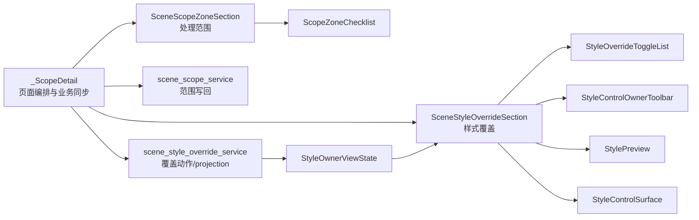

# 场景样式覆盖 Section 化与模板管理一致性执行记录

日期：2026-06-28

## 本轮结论

上一轮已经把“处理范围”抽成 `SceneScopeZoneSection`，但 `_ScopeDetail` 仍直接拼装“样式覆盖”区域：summary、覆盖开关、编辑分区、恢复模板、轻量预览、样式控件表面都散在页面类里。这样虽然底层小控件已经共享，但用户看到的功能板块仍不像模板管理，代码边界也不够清晰。

本轮新增 `SceneStyleOverrideSection`，把样式覆盖提升成与处理范围对等的语义 section。现在 `_ScopeDetail` 的主要结构已经变成：

```python
self._scope_zone_section = SceneScopeZoneSection(...)
self._style_override_section = SceneStyleOverrideSection(...)
```

这比继续调文案更关键：界面可读性首先来自功能边界，而不是解释句。原来的冗余说明句“默认跟随模板；需要单独设置时再开启覆盖。”不再作为样式覆盖 section 的默认可见说明，改由 summary、owner hint、preview 和恢复动作表达状态。

## 本轮实现

### 1. 新增 SceneStyleOverrideSection

文件：`src/ui/panels/scene_style_override_sections.py`

新增：

- `SCENE_STYLE_OVERRIDE_SECTION_TITLE`
- `SceneStyleOverrideSection`

该 section 内部承载：

- `Card`：样式覆盖标题。
- `SummaryGrid`：覆盖状态、影响边界。
- `StyleOverrideToggleList`：哪些分区启用独立样式。
- `StyleControlOwnerToolbar`：当前编辑分区、恢复模板动作、状态提示。
- `StylePreview`：当前分区轻量预览。
- `StyleControlSurface`：正文排版同款样式控件表面。

转发信号：

- `override_toggled`
- `current_variant_changed`
- `restore_requested`
- `style_changed`

这让 section 只负责 UI 组合与事件转发，不直接知道场景业务写回规则。

### 2. 迁移 _ScopeDetail

文件：`src/ui/panels/scene_panel.py`

迁移前，`_ScopeDetail` 直接实例化：

- `StyleOverrideToggleList`
- `StyleOverrideToggleOption`
- `StyleControlOwnerToolbar`
- `StyleOwnerOption`
- `StylePreview`
- `StyleControlSurface`

迁移后，`_ScopeDetail` 不再直接导入或实例化这些底层 UI 类，只接入：

```python
SceneStyleOverrideSection
```

为了不打断现有测试、工作台跳转和字段高亮，仍保留兼容字段：

- `_style_override_summary`
- `_style_override_toggle_list`
- `_variant_toggles`
- `_variant_rows`
- `_style_owner_toolbar`
- `_style_variant_combo`
- `_restore_section_style_btn`
- `_style_editor_hint`
- `_section_style_preview`
- `_style_surface`
- `_section_*` 字段控件引用

但这些字段现在全部来自 `SceneStyleOverrideSection`，不再由 `_ScopeDetail` 直接构造。

### 3. 下沉 UI 同步动作

样式覆盖 summary 刷新：

```python
self._style_override_section.set_summary_items(...)
```

分区行显示/隐藏：

```python
self._style_override_section.set_override_row_visible(...)
```

预览刷新：

```python
self._style_override_section.apply_preview_projection(...)
```

owner 状态刷新：

```python
self._style_override_section.apply_owner_state(owner_state)
```

这让 `_ScopeDetail` 更像流程编排层：它知道当前 scene/template/variant，知道什么时候刷新，但不再负责样式覆盖 UI 的内部组成。

## 当前链路



到这一轮为止，处理范围与样式覆盖的 UI 边界已经对称：

| 功能域 | Section | 小控件 | 业务入口 |
| --- | --- | --- | --- |
| 处理范围 | `SceneScopeZoneSection` | `ScopeZoneChecklist` | `apply_scene_scope_zone_states()` |
| 样式覆盖 | `SceneStyleOverrideSection` | `StyleOverrideToggleList` / `StyleControlOwnerToolbar` / `StylePreview` / `StyleControlSurface` | `scene_style_override_service.py` |

## 与模板管理的一致性提升

模板管理的核心优势不是“有卡片”，而是“页面不直接拼每个控件，而是用清晰的详情/section 承接功能”。本轮后，场景规划也更接近这个结构：

```text
页面层：_ScopeDetail
  - 当前 scene/template
  - 两个 section 的联动
  - 导航高亮
  - scope_changed

section 层：
  - SceneScopeZoneSection
  - SceneStyleOverrideSection

共享控件层：
  - ScopeZoneChecklist
  - StyleOverrideToggleList
  - StyleControlOwnerToolbar
  - StylePreview
  - StyleControlSurface

projection/service 层：
  - build_scene_scope_summary_items
  - build_scene_style_override_summary_items
  - scene_scope_service
  - scene_style_override_service
```

这意味着“样式覆盖”和“模板正文排版”之间的复用不再停留在字段控件，而是提升到样式表面与 owner 控件组合这一层。

## 可读性变化

本轮没有大改视觉样式，但可读性已经有三个实际变化：

1. 样式覆盖成为独立语义 section，不再是 `_ScopeDetail` 里的一串控件拼装。
2. 删除样式覆盖区域默认解释句，减少“说明文字替界面解释”的问题。
3. 页面层只表达“处理范围 section + 样式覆盖 section”，代码结构更接近用户决策链。

用户实际要理解的是：

```text
先决定处理哪些区域。
再决定哪些区域要脱离模板单独设置。
开启覆盖后，编辑当前分区样式。
恢复模板会取消当前场景覆盖。
```

现在结构已经开始直接表达这四步。

## 仍然不足

### 1. _ScopeDetail 仍保留大量兼容字段

为了不打断现有测试和导航高亮，本轮保留了很多 `_section_*`、`_style_*` 别名。它们不再由 `_ScopeDetail` 构造，但仍暴露在 `_ScopeDetail` 上。

下一步可以逐步减少这些兼容入口，让测试和跳转更多通过 section API 访问。

### 2. 样式编辑 shell 还没有抽成模板/场景共用的更高层

现在场景样式覆盖已经有 `SceneStyleOverrideSection`，模板管理仍有自己的详情结构。两边共享了：

- `StyleControlSurface`
- `StyleOwnerViewState`
- `StylePreviewProjection`
- `StyleControlOwnerToolbar`

但还没有共享一个更高层的：

```text
StyleEditingSection
  - owner toolbar
  - preview
  - style surface
```

这会是下一轮真正把模板管理和场景覆盖“高度复用”的重点。

### 3. 视觉验收仍不足

本轮验证了代码链路和测试链路，但还没有用截图/运行界面验证：

- section 间距是否与模板管理一致。
- 样式覆盖 section 内部是否过长。
- 删除说明句后用户是否仍能从 summary/preview/hint 理解状态。
- 小屏或窄窗口下控件是否拥挤。

后续如果继续走向优秀设计，需要启动界面做截图级检查。

## 下一步建议

### P0：抽共享 StyleEditingSection

把这三件组合成更高层共享件：

- `StyleControlOwnerToolbar`
- `StylePreview`
- `StyleControlSurface`

场景传入“当前分区 / 恢复模板 / 覆盖状态”，模板传入“当前样式对象 / 保存或恢复动作 / 模板状态”。这样才能避免未来模板页和场景页各自组合 owner、preview、surface。

### P1：减少 _ScopeDetail 的字段别名

建议优先替换测试中的直接访问：

- 从 `scope._style_override_summary` 逐步改为 `scope._style_override_section.summary`
- 从 `scope._section_style_preview` 逐步改为 `scope._style_override_section.preview`
- 从 `scope._style_surface` 逐步改为 `scope._style_override_section.style_surface`

等测试和导航稳定后，再减少 `_ScopeDetail` 上的兼容字段。

### P2：运行界面截图验收

建议用实际启动程序或测试入口打开场景规划页，对比模板管理页检查：

- 标题层级。
- section 间距。
- summary 密度。
- owner toolbar 的位置。
- preview 与样式表面的上下关系。
- 不同窗口宽度下是否清晰。

## 本轮验证

编译通过：

```powershell
python -m compileall src/ui/panels/scene_style_override_sections.py src/ui/panels/scene_scope_sections.py src/ui/panels/scene_panel.py tests/test_scene_panel_architecture.py
```

聚焦测试通过：

```powershell
python -m pytest tests/test_scene_panel_architecture.py::test_scene_panel_uses_shared_card_header_and_flow_scope_layout tests/test_scene_panel_architecture.py::test_scene_style_override_section_wraps_owner_preview_and_surface tests/test_scene_panel_architecture.py::test_scene_panel_controls_follow_template_management_contract tests/test_scene_panel_architecture.py::test_scene_panel_scope_style_override_editor_writes_section_styles -q
```

结果：

```text
4 passed in 9.12s
```

相邻回归通过：

```powershell
python -m pytest tests/test_small_widget_architecture.py tests/test_style_variant_semantics.py tests/test_style_field_descriptors.py tests/test_field_display_names.py tests/test_paragraph_style_editor.py tests/test_template_style_detail.py tests/test_scene_panel_architecture.py tests/test_workbench_issue_navigation.py tests/test_control_contract_registry.py -q
```

结果：

```text
118 passed in 67.05s
```

## 本轮判断

这一轮完成了用户前面一直指出的核心方向之一：功能分布更合理、边界更清晰、冗余说明文本更少。现在 `_ScopeDetail` 不再是“处理范围 + 样式覆盖所有控件的大拼装类”，而是接入两个 section 的编排层。

但它还不是最终优秀设计。真正的下一步，是把模板管理和场景覆盖共同使用的“样式编辑 shell”再往上抽一层，并做实际界面截图验收。到那一步，才算从代码复用进一步走到用户可感知的一致性。
