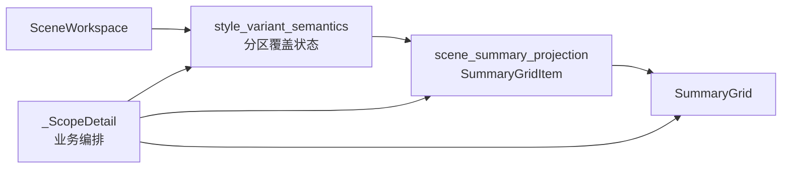

# 场景样式覆盖 Summary 投影下沉执行记录

日期：2026-06-28

## 本轮结论

前两轮已经把 `_ScopeDetail` 里的两个列表型 UI 抽出来：

- `ScopeZoneChecklist`：处理范围。
- `StyleOverrideToggleList`：样式覆盖开关。

但 `_ScopeDetail` 里仍然有一块偏“投影层”的逻辑：`_refresh_style_override_summary()` 直接拼 `SummaryGridItem`。这意味着页面还在决定：

- 覆盖状态显示什么。
- 当前分区显示什么。
- 影响边界显示什么。
- 每个 summary item 的 key、label、value、detail、variant。

这和模板管理的方向不一致。模板管理里越来越多 summary 已经通过 projection 函数生成，页面只负责把 items 交给 `SummaryGrid`。本轮把场景样式覆盖 summary 下沉到 `scene_summary_projection.py`，让 `_ScopeDetail` 少承担一层文案与结构投影。

## 本轮实现

### 1. 新增 build_scene_style_override_summary_items()

文件：`src/ui/panels/scene_summary_projection.py`

新增函数：

```python
build_scene_style_override_summary_items(scene, projection)
```

输出三类 summary item：

- `override_status`
  - `全部跟随模板`
  - `已覆盖 N 个分区`
- `current_variant_status`
  - `参考文献 · 跟随模板`
  - `参考文献 · 已覆盖 0 项`
  - `参考文献 · 已覆盖 N 项`
- `owner_boundary`
  - `仅当前场景`

函数只消费 `scene` 和当前分区的 `projection`，不负责构建 projection 本身。这样边界保持清楚：

```text
style_variant_semantics -> 计算当前分区覆盖状态
scene_summary_projection -> 投成 SummaryGridItem
scene_panel -> 调用并渲染
```

### 2. 场景页迁移

文件：`src/ui/panels/scene_panel.py`

原来 `_refresh_style_override_summary()` 手写：

- 遍历 `STYLE_VARIANTS`。
- 判断哪些分区已覆盖。
- 拼 `SummaryGridItem`。
- 判断 projection 是否存在。
- 拼影响边界。

现在改为：

```python
self._style_override_summary.set_items(
    build_scene_style_override_summary_items(scene, projection)
)
```

`_ScopeDetail` 仍负责取当前 `scene` 和当前 `projection`，但不再负责 summary 的文案和 item 结构。

### 3. 测试补强

文件：`tests/test_scene_panel_architecture.py`

新增：

- `test_scene_style_override_summary_projection_tracks_follow_and_override`

覆盖：

- 全部跟随模板时，`override_status` 为 `全部跟随模板`。
- 当前参考文献分区跟随模板时，`current_variant_status` 为 `参考文献 · 跟随模板`。
- 开启参考文献覆盖后，`override_status` 变为 `已覆盖 1 个分区`。
- 开启覆盖但未改值时，`current_variant_status` 为 `参考文献 · 已覆盖 0 项`。
- detail 使用短状态：`使用模板样式。`、`与模板一致。`

同时架构测试补充：

- 场景页必须调用 `build_scene_style_override_summary_items`。
- `scene_summary_projection.py` 必须包含 `build_scene_style_override_summary_items`。

## 当前结构

下沉后，样式覆盖链路更像这样：



这让 `_ScopeDetail` 少了一类责任：它不再是 summary 文案和结构的作者，而只是“把当前场景状态传给投影层”。

## 边界收益

### 1. Summary 文案集中

之前如果要调整“全部跟随模板 / 已覆盖 N 个分区 / 仅当前场景”，需要进 `_ScopeDetail`。现在这些属于 projection 层，和其它场景 summary 一样可测试、可检索。

### 2. 页面更接近编排层

`_ScopeDetail` 现在主要负责：

- 当前 scene/template。
- 用户勾选处理范围。
- 用户开启/关闭覆盖。
- 用户编辑样式。
- 调用 projection。
- 渲染到控件。

它不再直接组织样式覆盖 summary 的 item 结构。

### 3. 后续更容易继续拆

如果下一轮要抽 `SectionStyleOverrideController`，summary 已经先下沉了。Controller 只需要产出 scene/projection 或 owner state，不需要同时考虑 SummaryGridItem。

## 验证记录

编译通过：

```powershell
python -m compileall src/ui/panels/scene_summary_projection.py src/ui/panels/scene_panel.py tests/test_scene_panel_architecture.py
```

聚焦测试通过：

```powershell
python -m pytest tests/test_scene_panel_architecture.py::test_scene_panel_projects_scene_profiles_with_shared_summary_grid tests/test_scene_panel_architecture.py::test_scene_style_override_summary_projection_tracks_follow_and_override tests/test_scene_panel_architecture.py::test_scene_panel_scope_style_override_editor_writes_section_styles -q
```

结果：

```text
3 passed in 31.53s
```

相邻回归通过：

```powershell
python -m pytest tests/test_small_widget_architecture.py tests/test_style_variant_semantics.py tests/test_style_field_descriptors.py tests/test_field_display_names.py tests/test_paragraph_style_editor.py tests/test_template_style_detail.py tests/test_scene_panel_architecture.py tests/test_workbench_issue_navigation.py tests/test_control_contract_registry.py -q
```

结果：

```text
112 passed in 269.10s
```

## 仍未完成

这轮只下沉了 summary 投影。`_ScopeDetail` 仍有几类混杂：

1. 启用覆盖、关闭覆盖、恢复模板仍在页面类里。
2. 当前分区 projection 的加载和 template fallback 仍在页面类里。
3. 处理范围关闭时级联关闭样式覆盖的规则仍在页面类里。
4. 预览 projection 和 owner state 仍由页面编排。

## 下一轮建议

下一轮可以抽 `SectionStyleOverrideController` 或更轻量的 `SceneSectionStyleOverrideService`，先把这些业务动作下沉：

- `enable_override(scene, template, variant_key)`
- `disable_override(scene, variant_key)`
- `restore_template(scene, variant_key)`
- `sync_scope_disabled_overrides(scene)`
- `override_projection(scene, template, variant_key)`
- `preview_projection(scene, template, variant_key)`

这样 `_ScopeDetail` 就能继续瘦身为真正的 UI 编排层。

## 当前判断

这轮推进的是“投影边界”，不是视觉重做。它让样式覆盖 summary 和其它场景 summary 一样进入可测试的 projection 层。

结合前几轮，现在 `_ScopeDetail` 已经少管了很多 UI 拼装和状态文案：范围 checklist、覆盖 toggle list、owner toolbar、style surface、owner state、preview projection、summary projection 都在逐步外移。剩下最重的一块，就是样式覆盖业务动作本身。
