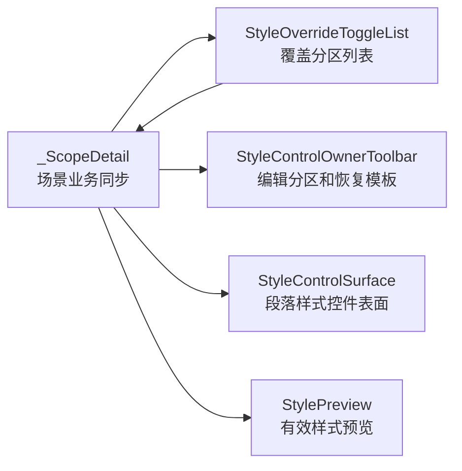

# 场景样式覆盖列表组件化与边界拆分执行记录

日期：2026-06-28

## 本轮结论

前几轮已经统一了样式字段、控件表面、Owner 工具条、Owner 状态和短状态文案。但 `_ScopeDetail` 内部仍然混着两件不同的事：

- 处理范围：本场景处理哪些文档区域。
- 样式覆盖：哪些分区不跟随模板样式。

这两个问题有关联，但不是同一类功能。处理范围回答“处理哪里”，样式覆盖回答“这些区域是否单独设置样式”。如果继续把分区 checkbox、覆盖 toggle、样式编辑器、预览和恢复模板都堆在 `_ScopeDetail` 里，后续很难继续做到模板管理那种清晰的控件边界。

本轮没有做一次性大拆，因为 `_ScopeDetail` 还承载工作台跳转、高亮、场景写回和布局刷新。直接拆成多个页面级 detail 风险较高。更稳的切口是先把“覆盖分区列表”抽成小组件：它只负责渲染分区名称、toggle、可见性和 toggle 信号，不碰场景业务。

## 本轮实现

### 1. 新增 StyleOverrideToggleList

文件：`src/shared/ui/style_override_toggle_list.py`

新增：

- `StyleOverrideToggleOption`
  - `key`
  - `label`
  - `tooltip`
- `StyleOverrideToggleList`
  - 管理标题、分区行、分区标签、`ToggleSwitch`。
  - 暴露 `toggles`、`rows`、`labels`，供现有导航和测试兼容。
  - 暴露 `set_checked()` 和 `set_row_visible()`。
  - 发出 `toggled = Signal(str, bool)`，页面只接收业务 key 和 checked。
  - 内部统一主题样式，不再让父页面手工拼 row 和 label。

这个组件是“样式覆盖入口列表”，不是业务 owner，也不是段落样式编辑器。它的边界很窄：

```text
输入：覆盖项 key / label / tooltip
输出：用户切换了哪个 key
不做：启用覆盖、恢复模板、写入 SceneWorkspace、计算差异
```

### 2. 场景页迁移

文件：`src/ui/panels/scene_panel.py`

原来 `_ScopeDetail.__init__()` 直接手写：

- `style_header = QLabel("覆盖分区")`
- 每个 variant 一行 `QWidget`
- 每行一个 `QLabel`
- 每行一个 `ToggleSwitch`
- lambda 连接 `_on_variant_toggled`
- `_variant_toggles`
- `_variant_rows`
- `_variant_labels`

现在改为：

```python
self._style_override_toggle_list = StyleOverrideToggleList(...)
self._style_override_toggle_list.set_options(...)
self._style_override_toggle_list.toggled.connect(self._on_variant_toggled)
self._variant_toggles = self._style_override_toggle_list.toggles
self._variant_rows = self._style_override_toggle_list.rows
```

保留 `_variant_toggles` 和 `_variant_rows` 是刻意的：工作台跳转和既有测试仍依赖这些属性定位分区开关。组件化不应该为了“看起来更干净”而破坏已经打通的跳转链路。

### 3. 测试补强

文件：`tests/test_small_widget_architecture.py`

新增 `test_style_override_toggle_list_manages_rows_and_signals`，覆盖：

- 设置两个分区选项。
- 生成对应 `toggles` 和 `rows`。
- 标签文本顺序稳定。
- 自定义 tooltip 生效。
- 程序化 `set_checked()` 只同步状态，不模拟用户事件。
- 用户点击 toggle 后发出 `(key, checked)`。
- `set_row_visible()` 可以隐藏/显示分区行。

文件：`tests/test_scene_panel_architecture.py`

补充架构断言：

- 场景页必须使用 `StyleOverrideToggleList`。
- 场景页必须使用 `StyleOverrideToggleOption`。
- 共享组件内部集中使用 `ToggleSwitch(row, checked=False)`。
- 组件暴露 `toggled = Signal(str, bool)`。

这些护栏防止未来又把覆盖分区列表改回 `_ScopeDetail` 里的手写 row。

## 当前链路

组件化后，样式覆盖区的责任边界更清楚：



`_ScopeDetail` 仍然是编排者，但它少管了一块 UI 结构。后续如果继续拆分，可以沿着这个方向把处理范围 checkbox 也抽成独立组件。

## 为什么这一步是必要的

用户要求的是“功能分布更合理，边界更清晰，同时删除不必要的冗余文本描述”。这不只靠文案能解决，还要让代码边界也对齐用户心智。

本轮之前：

```text
处理范围卡片
  - 范围说明
  - 范围摘要
  - 范围 checkbox

样式覆盖卡片
  - 覆盖说明
  - 覆盖摘要
  - 覆盖分区手写列表
  - 编辑分区工具条
  - 预览
  - 样式 surface
```

其中“覆盖分区手写列表”没有组件边界，导致样式覆盖内部仍然像一段临时 UI 拼装。

本轮之后：

```text
样式覆盖卡片
  - 覆盖摘要
  - StyleOverrideToggleList
  - StyleControlOwnerToolbar
  - StylePreview
  - StyleControlSurface
```

用户看见的是同一个页面，但代码和测试已经开始按功能块划分。这是后续继续减少冗余文本、做视觉验收和拆分 detail 的基础。

## 验证记录

编译通过：

```powershell
python -m compileall src/shared/ui/style_override_toggle_list.py src/ui/panels/scene_panel.py tests/test_small_widget_architecture.py tests/test_scene_panel_architecture.py
```

聚焦测试通过：

```powershell
python -m pytest tests/test_small_widget_architecture.py::test_style_override_toggle_list_manages_rows_and_signals tests/test_scene_panel_architecture.py::test_scene_panel_controls_follow_template_management_contract tests/test_scene_panel_architecture.py::test_scene_panel_scope_style_override_editor_writes_section_styles -q
```

结果：

```text
3 passed in 35.87s
```

相邻回归通过：

```powershell
python -m pytest tests/test_small_widget_architecture.py tests/test_style_variant_semantics.py tests/test_style_field_descriptors.py tests/test_field_display_names.py tests/test_paragraph_style_editor.py tests/test_template_style_detail.py tests/test_scene_panel_architecture.py tests/test_workbench_issue_navigation.py tests/test_control_contract_registry.py -q
```

结果：

```text
110 passed in 277.93s
```

## 仍未完成

本轮只抽了覆盖分区列表，还没有完成整个 `_ScopeDetail` 的功能域拆分：

1. 处理范围 checkbox 仍在 `_ScopeDetail` 内手写。
2. 样式覆盖 summary 仍由 `_ScopeDetail` 拼装。
3. 样式覆盖业务写回仍在 `_ScopeDetail`，没有独立 owner adapter。
4. 处理范围和样式覆盖仍在同一个 detail 页面里，还没有成为两个独立 detail。
5. 尚未做截图级验收，不能证明视觉节奏已经达到模板管理水平。

## 下一轮建议

下一轮可以继续沿两个方向推进：

1. 抽 `ScopeZoneChecklist`：把处理范围 checkbox 也组件化，和 `StyleOverrideToggleList` 对称。
2. 抽 `SectionStyleOverrideController` 或 `StyleOwnerAdapter`：把启用覆盖、恢复模板、计算 projection、写回场景的业务编排从 `_ScopeDetail` 中再下沉一层。

## 当前判断

这轮不是大视觉改造，但它把“样式覆盖”内部的一个手写 UI 块变成了可复用、可测试的小组件。边界从这里开始变得更硬：处理范围、覆盖列表、样式 owner、样式控件、预览，各自有了更明确的位置。

继续这样推进，比一次性重写更稳，也更符合当前已经打通的工作台跳转和模板管理复用链路。
