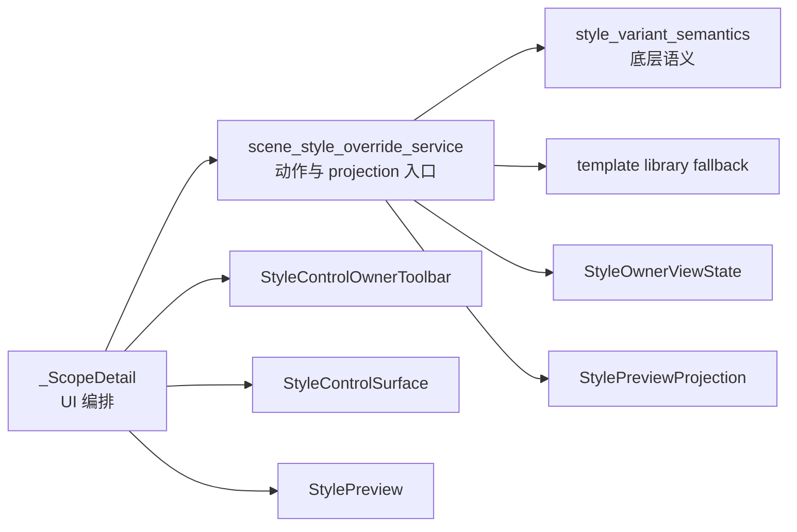

# 场景样式覆盖服务层抽取执行记录

日期：2026-06-28

## 本轮结论

前几轮已经把 `_ScopeDetail` 中的 UI 拼装和 summary 投影逐步外移：

- `ScopeZoneChecklist` 管处理范围 checkbox。
- `StyleOverrideToggleList` 管覆盖分区 toggle。
- `StyleControlOwnerToolbar` 管编辑对象和恢复模板动作。
- `StyleControlSurface` 管段落样式控件表面。
- `StyleOwnerViewState` 管 owner 状态。
- `build_scene_style_override_summary_items()` 管样式覆盖 summary。

剩下最重的一块，是样式覆盖业务动作仍散在 `_ScopeDetail`：

- 缺模板时如何 fallback。
- 开启覆盖时如何复制模板有效样式。
- 关闭覆盖时如何删除 scene override。
- 恢复模板时如何回到跟随模板。
- 处理范围关闭时如何级联删除对应覆盖。
- 当前分区有效样式、状态 projection、预览 projection 如何计算。

这些不是 UI 控件逻辑，而是场景样式覆盖 workflow。继续放在 `_ScopeDetail` 里，会让页面类重新变胖。本轮新增 `scene_style_override_service.py`，把这组动作集中到服务层。

## 本轮实现

### 1. 新增 scene_style_override_service.py

文件：`src/ui/panels/scene_style_override_service.py`

新增函数：

- `resolve_scene_style_template(scene, template)`
  - 有显式 template 时直接使用。
  - 没有 template 时按 `scene.template_id` 从模板库加载。
  - 加载失败时回退到内置 default 模板。
- `scene_section_effective_style(scene, template, variant_key)`
  - 返回场景分区最终有效样式。
- `scene_section_style_override_projection(scene, template, variant_key)`
  - 返回当前分区覆盖状态 projection。
- `scene_section_style_preview_projection(scene, template, variant_key)`
  - 返回当前分区轻量预览 projection。
- `set_scene_section_style_override(scene, template, variant_key, enabled)`
  - 统一启用/关闭分区覆盖。
- `restore_scene_section_style_to_template(scene, variant_key)`
  - 删除当前场景覆盖，让分区重新跟随模板。
- `sync_disabled_section_style_overrides(scene)`
  - 当处理范围关闭时，删除对应分区的样式覆盖。

### 2. 场景页迁移

文件：`src/ui/panels/scene_panel.py`

迁移前 `_ScopeDetail` 直接调用：

- `load_template_from_library(scene.template_id or "default")`
- `create_builtin_template("default")`
- `enable_section_style_override()`
- `disable_section_style_override()`
- `get_effective_section_style()`
- `build_section_style_override_projection()`
- `build_section_style_preview_projection()`

迁移后改为调用：

- `scene_section_effective_style()`
- `scene_section_style_override_projection()`
- `scene_section_style_preview_projection()`
- `set_scene_section_style_override()`
- `restore_scene_section_style_to_template()`
- `sync_disabled_section_style_overrides()`

`_ScopeDetail` 仍负责：

- 当前选中哪个分区。
- 当前 scene/template。
- UI 同步。
- 高亮和刷新。

但不再负责底层覆盖动作和模板 fallback。

### 3. 测试补强

文件：`tests/test_scene_panel_architecture.py`

新增：

- `test_scene_section_style_override_service_tracks_actions_and_projections`
  - 验证 service 能计算跟随模板状态。
  - 验证开启覆盖后复制模板分区基线。
  - 验证 projection 和 preview projection 都进入 `已覆盖 0 项`。
  - 验证恢复模板删除 scene override。

- `test_scene_section_style_override_service_drops_disabled_scope_overrides`
  - 验证处理范围关闭时，service 会删除对应分区覆盖。
  - 验证仍启用处理范围的覆盖不会被误删。

架构护栏补充：

- 场景页必须使用 `scene_section_style_override_projection`。
- 场景页必须使用 `set_scene_section_style_override`。
- 场景页必须使用 `restore_scene_section_style_to_template`。
- 场景页必须使用 `sync_disabled_section_style_overrides`。
- 场景页不能直接调用 `enable_section_style_override` / `disable_section_style_override` / `build_section_style_override_projection` / `build_section_style_preview_projection`。

## 当前链路

本轮后，场景样式覆盖链路变成：



这让 `_ScopeDetail` 的角色更接近模板管理详情页：页面层负责接线和刷新，业务动作和状态投影由共享函数处理。

## 边界收益

### 1. 模板 fallback 不再散落

之前 `_selected_style_override_projection()`、`_selected_style_preview_projection()`、`_display_section_style()`、`_on_variant_toggled()` 都各自写了一段模板 fallback。现在集中在：

```python
resolve_scene_style_template()
```

以后如果模板缺失策略要改，只改一个地方。

### 2. 恢复模板成为明确服务动作

之前恢复模板是页面里判断 `is_section_style_overridden()` 后调用 `disable_section_style_override()`。现在是：

```python
restore_scene_section_style_to_template()
```

页面只看是否成功。

### 3. 处理范围关闭的级联规则更清楚

之前在 `_on_edited()` 里边更新 row 可见性，边检查 toggle，边删除覆盖。现在变成：

```python
sync_disabled_section_style_overrides(scene)
```

这让“范围关闭会移除对应覆盖”成为可测试的业务规则。

## 验证记录

编译通过：

```powershell
python -m compileall src/ui/panels/scene_style_override_service.py src/ui/panels/scene_panel.py tests/test_scene_panel_architecture.py
```

聚焦测试通过：

```powershell
python -m pytest tests/test_scene_panel_architecture.py::test_scene_panel_controls_follow_template_management_contract tests/test_scene_panel_architecture.py::test_scene_section_style_override_service_tracks_actions_and_projections tests/test_scene_panel_architecture.py::test_scene_section_style_override_service_drops_disabled_scope_overrides tests/test_scene_panel_architecture.py::test_scene_panel_scope_style_override_editor_writes_section_styles -q
```

结果：

```text
4 passed in 36.75s
```

相邻回归通过：

```powershell
python -m pytest tests/test_small_widget_architecture.py tests/test_style_variant_semantics.py tests/test_style_field_descriptors.py tests/test_field_display_names.py tests/test_paragraph_style_editor.py tests/test_template_style_detail.py tests/test_scene_panel_architecture.py tests/test_workbench_issue_navigation.py tests/test_control_contract_registry.py -q
```

结果：

```text
114 passed in 267.84s
```

## 仍未完成

服务层抽出来后，仍有几件事还没有完全优秀：

1. `_ScopeDetail` 仍同时承载处理范围和样式覆盖两个功能域。
2. 样式覆盖和处理范围还没有拆成两个独立 detail 导航项。
3. `scene_style_override_service.py` 目前放在 `ui.panels` 下，未来如果其它非 UI 层也要复用，可能需要再迁移到更低层。
4. 还没有截图级验收模板管理和场景样式覆盖的视觉一致性。

## 下一轮建议

下一轮可以考虑更上层的结构拆分：

1. 将 `_ScopeDetail` 拆成 `ScopeDetail` 和 `SceneStyleOverrideDetail` 两个内部 detail，先不一定暴露为两个导航卡，但代码结构上分开。
2. 或者抽 `SceneScopeStateProjection`，先把处理范围 summary 也下沉，和样式覆盖 summary 对齐。

如果继续以“边界更清晰”为优先，建议先抽 `SceneScopeStateProjection`，因为它风险小、可测试，也能继续减少 `_ScopeDetail` 的 projection 责任。

## 当前判断

这轮把场景样式覆盖从“页面里直接操作底层语义函数”推进到“页面调用服务层”。结合前几轮，`_ScopeDetail` 已经明显变薄：UI 列表、样式表面、owner 状态、preview、summary、业务动作都在外移。

它还不是最终优秀设计，但已经接近一个更健康的结构：页面负责组织用户流程，服务层负责场景样式动作，projection 层负责可读状态，shared UI 负责控件呈现。
