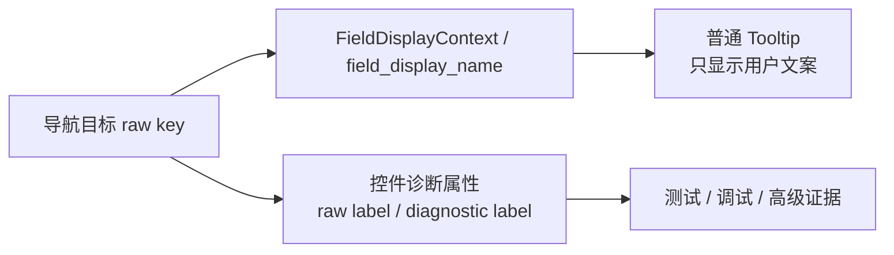

# 导航高亮普通提示与诊断属性分层执行记录

日期：2026-06-28

## 本轮目标

上一轮已经让工作台跳转、返回条和高亮提示使用“板块：控件名”。但高亮 Tooltip 仍然把 raw key 拼在括号里，例如：

```text
当前执行问题定位：文字样式：参考文献正文中文字体（scene.section_styles.references_body.font_cn）
```

这对普通用户仍然偏工程化。用户真正需要的是“这里就是要处理的控件”，不需要在第一眼看到 `scene.section_styles...`。

本轮目标是：

- 普通 Tooltip 只显示用户文案。
- raw key 不丢，迁移到控件诊断属性。
- 测试仍能验证跳转落点和 raw key，不依赖普通 Tooltip 暴露工程字段。

## 本轮实现

### 1. NavigationHighlighter 增加普通/诊断分层属性

文件：`src/shared/ui/navigation_highlight.py`

新增动态属性：

```text
navigation_field_display_label
navigation_field_raw_label
navigation_field_diagnostic_label
```

行为：

| 层级 | 存放内容 | 示例 |
| --- | --- | --- |
| 普通 Tooltip | 用户可读文案 | `当前执行问题定位：文字样式：参考文献正文中文字体` |
| `navigation_field_display_label` | 当前显示文案 | `文字样式：参考文献正文中文字体` |
| `navigation_field_raw_label` | 原始目标 | `scene.section_styles.references_body.font_cn` |
| `navigation_field_diagnostic_label` | 诊断目标 | `scene.section_styles.references_body.font_cn` |

同时 `clear()` 现在会恢复原 Tooltip，并清空这些诊断属性，避免旧高亮信息残留在前一个控件上。

### 2. 模板/场景测试从 Tooltip raw key 迁移到诊断属性

已调整的典型断言：

```python
assert "scene.section_styles.references_body.font_cn" not in widget.toolTip()
assert widget.property("navigation_field_raw_label") == (
    "scene.section_styles.references_body.font_cn"
)
```

覆盖入口包括：

- 模板正文样式控件
- 模板页面设置控件
- 场景样式覆盖控件
- 场景输出文件名控件
- 场景资料 Schema 控件

### 3. 证据按钮仍保留 raw key

本轮没有改工作台问题详情里的“定位参数”按钮 Tooltip。

原因：它不是页面普通高亮提示，而是诊断/证据动作入口。它显示 raw key 是合理的，用户点击它本来就是为了定位或排查具体参数。

## 用户体验变化

以前：

```text
当前执行问题定位：文件名规则（filename_template）
当前执行问题定位：主资料 Schema（input_source_profile.material_schema_id）
当前执行问题定位：文字样式：正文中文字体（body.font_name）
```

现在：

```text
当前执行问题定位：文件名规则
当前执行问题定位：主资料 Schema
当前执行问题定位：文字样式：正文中文字体
```

诊断信息仍可通过控件属性读取：

```text
navigation_field_raw_label = filename_template
navigation_field_raw_label = input_source_profile.material_schema_id
navigation_field_raw_label = body.font_name
```

## 当前边界



边界规则：

- 页面控件高亮 Tooltip：不显示 raw key。
- 工作台证据按钮 Tooltip：可以显示 raw key。
- 问题详情证据行 action value：继续保留 raw key。
- 导航 intent payload：继续保留 raw key 和普通显示名。

## 为什么这一步重要

这一步把“删除冗余文本”从单纯改文案推进到架构层：

- 普通用户界面不再混入工程字段。
- 测试和诊断仍然有稳定证据。
- 后续可以放心继续精简场景概览和问题卡片里的 `schema / contract / fixture / raw path` 文本，因为有明确的承接层。

## 后续建议

1. 将场景概览卡片里的 raw 统计拆到高级证据，普通卡片只保留“待处理任务数”和“阻断/可继续”状态。
2. 为工作台问题详情增加“显示高级证据”折叠区，统一放 raw key、source file、contract id。
3. 建立 UI copy guardrail：普通 Tooltip 不允许出现 `template.`、`scene.section_styles.`、`input_source_profile.` 这类工程路径。
4. 继续把非样式目标也纳入显示上下文，例如输出设置、资料字段、对象预检。

## 测试记录

编译通过：

```bash
python -m compileall src/shared/ui/navigation_highlight.py tests/test_navigation_highlight.py tests/test_template_page_detail.py tests/test_template_panel_architecture.py tests/test_scene_panel_architecture.py
```

聚焦测试通过：

```bash
python -m pytest tests/test_navigation_highlight.py tests/test_template_page_detail.py::test_page_setup_detail_focus_navigation_field_highlights_page_controls tests/test_template_panel_architecture.py::test_template_panel_selector_scopes_to_current_scene_compatible_templates tests/test_scene_panel_architecture.py::test_scene_panel_scope_style_override_editor_writes_section_styles -q
```

结果：`4 passed`

补充聚焦测试通过：

```bash
python -m pytest tests/test_scene_panel_architecture.py::test_scene_panel_navigation_intent_shows_return_to_execution_action tests/test_scene_panel_architecture.py::test_scene_panel_content_detail_focuses_material_schema_contract_controls -q
```

结果：`2 passed`

相邻回归通过：

```bash
python -m pytest tests/test_navigation_highlight.py tests/test_template_page_detail.py tests/test_template_panel_architecture.py tests/test_template_style_detail.py tests/test_scene_panel_architecture.py tests/test_workbench_issue_navigation.py tests/test_workbench_execution_session_architecture.py tests/test_workbench_execution_center.py tests/test_quick_execution_detail_architecture.py -q
```

结果：`242 passed in 224.46s`
