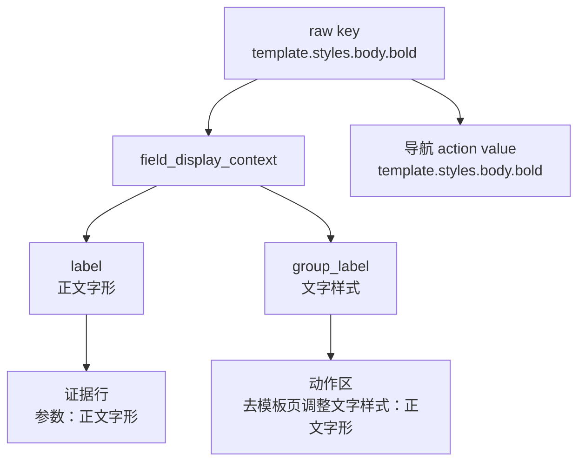

# 工作台样式板块上下文动作文案执行记录

日期：2026-06-28

## 本轮目标

上一轮已经让 `bold/italic` 等底层字段在普通文案中归并到布局项“字形”。本轮继续把布局项所属板块接入工作台问题详情，让用户不仅知道要调整“正文字形”，还知道它在模板管理里的“文字样式”板块。

这解决的是工作台问题解释的下一层“不说人话”：

- 只显示 `template.styles.body.bold`：太内部。
- 只显示“正文字形”：能理解，但不知道页面里在哪个板块。
- 显示“文字样式：正文字形”：更接近模板管理里的实际操作路径。

## 本轮实现

### 1. 新增字段显示上下文

在 `field_display_names.py` 中新增：

```python
FieldDisplayContext
field_display_context(value, target_type="")
```

它返回：

- `label`：字段或布局项普通显示名，例如“正文字形”
- `group_label`：样式布局板块，例如“文字样式”
- `label_with_group()`：组合文案，例如“文字样式：正文字形”

非样式字段不会强行带板块，例如：

```text
company_name -> 公司名称
```

### 2. 工作台动作文案接入样式板块

`QuickExecutionDetail` 中：

- `template_style_field` 动作改为使用 `field_display_context()`
- 新增 `scene_style_field` 动作文案
- 问题队列可处理目标统计也接入样式板块

效果：

```text
处理：去模板页调整文字样式：正文字形
处理当前问题：去模板页调整文字样式：正文字形
可处理目标：模板样式：文字样式：正文字形 1
```

### 3. 证据行保持短文案，诊断路径保留

本轮刻意没有把证据行也扩写成“文字样式：正文字形”。

原因：

- 证据行是列表信息，应该短、利于扫描。
- 动作区是用户点击前的决策信息，适合给出板块上下文。
- action value 仍必须保持 raw key，避免导航失效。

当前效果：

```text
参数：正文字形
```

但 action value 仍是：

```text
template.styles.body.bold
```

## 当前普通/诊断边界



## 与模板管理的一致性

模板管理里的正文样式页当前是：

- 文字样式
  - 中文字体 / 字号
  - 英文字体 / 字形
- 对齐与缩进
- 行距与段距

工作台现在可以使用同一套样式板块语言：

- `bold/italic` -> 文字样式：正文字形
- `line_spacing_pt` -> 行距与段距：正文行距
- `special_indent` -> 对齐与缩进：正文特殊缩进

这让用户从问题队列进入模板页时，脑中路径更一致。

## 测试记录

编译通过：

```bash
python -m compileall src/ui/adapters/field_display_names.py src/ui/panels/workbench/quick_execution_detail.py tests/test_field_display_names.py tests/test_quick_execution_detail_architecture.py
```

聚焦测试通过：

```bash
python -m pytest tests/test_field_display_names.py tests/test_quick_execution_detail_architecture.py::test_quick_execution_detail_action_copy_includes_style_layout_group tests/test_quick_execution_detail_architecture.py::test_quick_execution_detail_evidence_parameter_action_routes_scene_style -q
```

结果：`6 passed`

相邻回归通过：

```bash
python -m pytest tests/test_style_field_descriptors.py tests/test_field_display_names.py tests/test_workbench_execution_center.py tests/test_quick_execution_detail_architecture.py tests/test_workbench_issue_navigation.py tests/test_template_style_detail.py tests/test_scene_panel_architecture.py tests/test_control_contract_registry.py -q
```

结果：`207 passed`

## 下一步建议

下一轮可以继续把板块上下文用于问题详情结构本身：

1. 在问题详情 meta 或 evidence list 中增加“所属板块”字段，而不是只在动作文案里出现。
2. 对 `scene_style_field` 问题也显示“场景页调整文字样式：参考文献正文字形”。
3. 把 `FieldDisplayContext` 扩展为普通模式/诊断模式双投影，普通模式显示板块与布局项，诊断模式显示 raw key、field ids、contract id。
4. 将场景页返回条也接入 `field_display_context()`，让跨页面返回提示继续和工作台一致。
