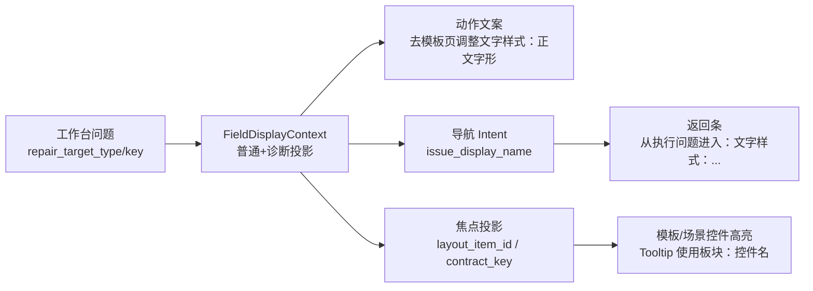

# 工作台样式跳转投影与高亮提示复用闭环执行记录

日期：2026-06-28

## 本轮目标

上一轮已经把工作台问题详情中的样式字段改成“普通投影 + 诊断投影”。本轮继续检查点击“处理”之后的链路：工作台发出的导航 intent、模板/场景页面的焦点投影、目标控件的高亮 Tooltip 是否仍然和模板管理保持一致。

结论：原链路可以跳到正确页面和字段，但焦点投影只保留 `normalized_key`，缺少“模板管理控件身份”。这会造成一个隐性问题：文案已经说“文字样式：正文字形”，但跳转层仍只知道 `template.styles.body.bold` 或 `scene.section_styles.references_body.font_cn`，没有稳定携带“文字样式 / 字形 / emphasis / contract”的上下文。

## 本轮实现

### 1. 工作台字段焦点投影接入 FieldDisplayContext

文件：`src/ui/adapters/workbench_issue_navigation.py`

扩展：

- `WorkbenchSceneFieldFocusProjection`
- `WorkbenchTemplateFieldFocusProjection`

新增字段：

```text
display_label
display_label_with_group
layout_item_id
field_ids
control_contract_key
```

示例：

```text
scene.section_styles.references_body.font_cn
-> display_label: 参考文献正文中文字体
-> display_label_with_group: 文字样式：参考文献正文中文字体
-> layout_item_id: font_cn
-> field_ids: font_cn
-> control_contract_key: body.font_cn
```

```text
scene.section_styles.*.line_spacing_value
-> normalized_key: scene.section_styles.*.line_spacing_pt
-> display_label_with_group: 行距与段距：所有处理分区行距
-> layout_item_id: line_spacing_pt
-> control_contract_key: body.line_spacing
```

### 2. 工作台导航 intent 优先使用板块级样式名称

文件：`src/ui/panels/workbench/panel_v2.py`

当目标类型是：

- `template_style_field`
- `scene_style_field`

且没有更明确的 `issue_target_label_with_group` 时，导航 payload 中的 `issue_display_name` 现在会使用：

```python
field_display_context(issue_key, target_type=issue_type).label_with_group()
```

因此返回条不再只显示：

```text
从执行问题进入：参考文献正文中文字体
```

而是显示：

```text
从执行问题进入：文字样式：参考文献正文中文字体
```

这和工作台动作文案“去场景页调整文字样式：参考文献正文中文字体”保持一致。

### 3. 模板详情和场景样式高亮 Tooltip 接入板块语义

文件：

- `src/ui/panels/template_style_detail.py`
- `src/ui/panels/scene_panel.py`

高亮控件 Tooltip 现在优先使用：

```text
field_display_context(label).label_with_group()
```

效果：

```text
当前执行问题定位：文字样式：正文中文字体（body.font_name）
当前执行问题定位：文字样式：参考文献正文中文字体（scene.section_styles.references_body.font_cn）
当前执行问题定位：行距与段距：所有处理分区行距（scene.section_styles.*.line_spacing_pt）
```

raw key 仍保留在括号里，因为当前高亮 Tooltip 同时承担定位和轻量诊断功能。后续如果要进一步精简普通 Tooltip，可以在保留投影字段的前提下，把 raw key 移入高级证据。

## 当前链路状态



现在比较完整的闭环是：

1. 问题队列说明用户要处理的目标。
2. 详情动作说明去哪个页面、哪个板块、哪个控件。
3. 导航 intent 带上同样的目标名称。
4. 目标页面返回条显示同样的目标名称。
5. 目标控件高亮 Tooltip 仍显示同样的板块/控件名称。
6. 诊断层保留 raw key、layout item、contract key。

## 与模板管理复用的边界

模板管理继续是样式控件母版：

- 控件标签来自 `style_field_descriptors.py`
- 控件布局来自 `style_field_layout_rows()`
- 普通名称来自 `field_display_context()`
- 跳转焦点来自 `workbench_issue_navigation.py`

场景页和工作台不再各自解释：

- `font_cn`
- `line_spacing_value`
- `left_indent_chars`
- `bold/italic`

它们只消费母版投影后的结果。

## 还没做、但下一步应该做的事

1. 将 `NavigationHighlighter` 拆成普通 Tooltip 和诊断 Tooltip 两层：普通层不显示 raw key，高级证据层显示 raw key。
2. 增加架构扫描测试，禁止样式字段高亮直接调用 `field_display_name()`，应统一走 `field_display_context()`。
3. 将场景概览中的样式卡片从工程统计口径改成任务口径，例如“样式覆盖 3 项待处理”，详情展开后再显示 `template/scene/material/output` 来源。
4. 对非样式目标也建立类似上下文对象，例如资料字段、输出设置、对象预检，避免工作台不同问题类型的文案模型再次分裂。

## 测试记录

编译通过：

```bash
python -m compileall src/ui/adapters/workbench_issue_navigation.py src/ui/panels/workbench/panel_v2.py src/ui/panels/template_style_detail.py src/ui/panels/scene_panel.py tests/test_workbench_issue_navigation.py tests/test_workbench_execution_session_architecture.py tests/test_scene_panel_architecture.py tests/test_template_panel_architecture.py
```

聚焦测试通过：

```bash
python -m pytest tests/test_workbench_issue_navigation.py tests/test_workbench_execution_session_architecture.py::test_workbench_panel_routes_template_field_issue_repair_to_template_panel tests/test_workbench_execution_session_architecture.py::test_workbench_panel_routes_scene_field_issue_repair_to_scene_scope_detail tests/test_workbench_execution_session_architecture.py::test_workbench_scene_field_repair_intent_reaches_scene_scope_widgets -q
```

结果：`13 passed`

面板高亮聚焦测试通过：

```bash
python -m pytest tests/test_template_panel_architecture.py::test_template_panel_selector_scopes_to_current_scene_compatible_templates tests/test_scene_panel_architecture.py::test_scene_panel_scope_style_override_editor_writes_section_styles -q
```

结果：`2 passed`

相邻回归通过：

```bash
python -m pytest tests/test_style_field_descriptors.py tests/test_field_display_names.py tests/test_workbench_issue_navigation.py tests/test_workbench_execution_session_architecture.py tests/test_template_panel_architecture.py tests/test_scene_panel_architecture.py tests/test_template_style_detail.py tests/test_workbench_execution_center.py tests/test_quick_execution_detail_architecture.py tests/test_control_contract_registry.py -q
```

结果：`236 passed in 203.21s`
