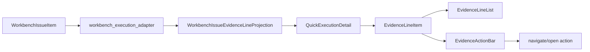

# 工作台证据投影下沉适配器执行记录

日期：2026-06-28

## 本轮目标

上一轮已经把工作台证据区改成了共享控件：

- `EvidenceLineList`
- `EvidenceActionBar`
- `EvidenceLineItem`

但当时仍有一个重要问题：证据语义还在 `QuickExecutionDetail` 里。

也就是说，UI 文件仍然负责这些事情：

- 识别 `参数路径：`
- 识别 `证据：`
- 识别 `输出路径：`
- 识别 `替换来源：`
- 决定动作文案是“定位参数 / 打开证据 / 打开输出 / 打开来源”
- 决定证据行 tone
- 把 raw source note 转成人话

这会导致后续模板管理、场景预检、工作台预检复用时，还要复制同一套证据规则。

本轮目标是把这些规则下沉到 `workbench_execution_adapter`，让 UI 只负责展示和触发动作。

## 执行结论

已完成证据 projection 下沉。

新增 adapter projection：

- `WorkbenchIssueEvidenceLineProjection`

新增 adapter 函数：

- `workbench_issue_evidence_lines(issue)`
- `workbench_issue_evidence_actions(issue)`
- `workbench_issue_evidence_body_text(issue)`
- `workbench_issue_display_text(text)`
- `workbench_issue_source_note_label(note)`

调整后：

- `QuickExecutionDetail` 不再维护 `IssueEvidenceLineProjection`。
- `QuickExecutionDetail` 不再维护证据前缀解析。
- `QuickExecutionDetail` 不再维护 source note 映射。
- `QuickExecutionDetail` 只把 adapter projection 转换成共享 UI 的 `EvidenceLineItem`。

## 新边界

### Adapter 负责

Adapter 现在负责“工作台问题应该如何被用户理解”。

包括：

- 问题详情文本的人话化。
- source note 的人话化。
- 证据行的结构化 projection。
- 证据动作的稳定元组。
- fallback 文本 body。
- 证据行动作文案。
- 证据行 tone。

### QuickExecutionDetail 负责

工作台详情 UI 现在只负责“如何呈现和触发”。

包括：

- 当前选中问题。
- 把 `WorkbenchIssueEvidenceLineProjection` 转成 `EvidenceLineItem`。
- 把 `EvidenceLineItem` 交给 `EvidenceLineList`。
- 把 `EvidenceLineItem` 交给 `EvidenceActionBar`。
- 收到动作信号后执行导航或打开文件。

### Shared UI 负责

共享 UI 仍然保持无业务语义。

包括：

- 结构化证据行怎么排版。
- 动作条怎么生成按钮。
- 动作去重。
- 发出 `action_requested(action_type, action_value)`。

## 链路状态



当前链路含义：

- `WorkbenchIssueItem` 是业务事实。
- adapter 将业务事实变成用户可读 projection。
- UI 不再解析业务事实，只做控件绑定。
- shared UI 不理解工作台问题，只渲染通用证据控件。

## 本轮代码调整

### Adapter

文件：`src/ui/adapters/workbench_execution_adapter.py`

新增：

- `WorkbenchIssueEvidenceLineProjection`
- `workbench_issue_evidence_lines(...)`
- `workbench_issue_evidence_actions(...)`
- `workbench_issue_evidence_body_text(...)`
- `workbench_issue_display_text(...)`
- `workbench_issue_source_note_label(...)`

证据前缀规则现在集中在 adapter：

| 前缀 | kind | label | action |
| --- | --- | --- | --- |
| `参数路径：` | `parameter_path` | 参数 | `navigate_parameter` |
| `证据：` | `evidence_file` | 证据文件 | `open_evidence` |
| `输出路径：` | `output_path` | 输出 | `open_output` |
| `替换来源：` | `replacement` | 替换来源 | `open_replacement` |
| `记录名称：` | `record` | 记录 | 无 |
| `来源：` | `source` | 来源 | 无 |
| `保护模式：` | `guard` | 保护 | 无 |
| `扫描对象：` | `scan_target` | 扫描 | 无 |

### QuickExecutionDetail

文件：`src/ui/panels/workbench/quick_execution_detail.py`

删除：

- 私有 `IssueEvidenceLineProjection`
- 私有 `_issue_evidence_line_projection(...)`
- 私有 `_issue_evidence_line_projections(...)`
- 私有 `_issue_evidence_body_text(...)`
- 私有 `_issue_display_text(...)`
- 私有 `_issue_source_note_label(...)`
- 私有证据动作文案函数

保留：

- `_issue_evidence_line_items(...)`

这个函数现在只是 thin mapping：

- adapter projection -> shared UI `EvidenceLineItem`

### 测试

文件：`tests/test_workbench_execution_center.py`

新增：

- `test_workbench_issue_evidence_projection_keeps_ui_semantics_in_adapter`

覆盖：

- 证据行顺序。
- kind/label/text。
- action_type/action_label/tone。
- `workbench_issue_evidence_actions(...)` 的稳定 tuple。
- fallback body 文本。
- source note 映射。
- coverage pack 文本人话化。

## 为什么这一步重要

用户前面指出“功能交互不友好，不说人话”。这类问题不能只靠 UI 里多写几个 label 解决。

更关键的是建立稳定的 projection 层：

- 业务事实层：`WorkbenchIssueItem`
- 用户理解层：`WorkbenchIssueEvidenceLineProjection`
- 控件输入层：`EvidenceLineItem`
- 控件展示层：`EvidenceLineList / EvidenceActionBar`

只有中间 projection 稳定，模板管理、场景管理、工作台才能共享同一种语言。

## 与模板管理一致性的推进

模板管理的好设计不是页面里写很多解释，而是：

- 参数由配置模型提供。
- 摘要由 projection 提供。
- 控件只负责展示。
- 预览只消费稳定输入。

工作台现在也开始走同样模式：

- 问题由 `WorkbenchIssueItem` 提供。
- 证据由 adapter projection 提供。
- 控件由 shared UI 提供。
- 导航由工作台主面板处理。

这比“在工作台里继续堆逻辑”更接近模板管理的结构。

## 仍然未完成

### 1. 导航规则还在 UI 层

`navigate_parameter` 到具体面板目标的映射仍在 `QuickExecutionDetail`：

- `scene.section_styles.*` -> `scene_style_field`
- `scene.format_scope.*` -> `scene_scope_field`
- 其他路径 fallback 到当前问题修复目标

下一轮应该抽成：

- `IssueNavigationRegistry`
- 或 `workbench_issue_navigation_target(...)`

### 2. `EvidenceLineItem` 与 adapter projection 仍需一层转换

这是刻意保留的边界：adapter 不直接导入 shared UI 控件模块。

后续如果想进一步减少转换，可以把 `EvidenceLineItem` 拆到纯数据模块，例如：

- `src/shared/projections/evidence.py`

这样 adapter 和 shared UI 都能依赖纯数据定义。

### 3. 人话化词典仍散在多个地方

`workbench_issue_display_text(...)` 已经下沉，但它仍复用了场景 summary 的 label 常量，也保留了一段 replacements。

后续更合理的结构是：

- `display_label_registry`
- 覆盖资料包、场景族、边界文本、插件风险、人审门槛统一登记。

### 4. 模板预检尚未接入证据 projection

目前下沉只服务工作台问题。后续模板管理可以接入：

- 模板预检问题。
- 模板导入诊断。
- 样式覆盖差异。
- 预览不一致证据。

## 推荐下一步

下一轮建议做 `IssueNavigationRegistry`。

理由：

- 证据 projection 已经从 UI 下沉。
- 共享证据控件已经就位。
- 剩下最明显的耦合是“点击后去哪”仍散在工作台详情和主面板路由里。

推荐目标：

1. 新增导航 projection 数据类。
2. 集中登记问题类型 -> 面板 -> 卡片 -> key 的映射。
3. 让 `QuickExecutionDetail` 只 emit 已解析好的导航目标。
4. 让 `panel_v2` 只执行目标，不再猜测问题类型。

## 验证记录

已执行：

```powershell
python -m compileall src/ui/adapters/workbench_execution_adapter.py src/ui/panels/workbench/quick_execution_detail.py tests/test_workbench_execution_center.py tests/test_quick_execution_detail_architecture.py
python -m pytest tests/test_workbench_execution_center.py::test_workbench_issue_evidence_projection_keeps_ui_semantics_in_adapter tests/test_quick_execution_detail_architecture.py::test_quick_execution_detail_exposes_control_contract_issue_queue tests/test_quick_execution_detail_architecture.py::test_quick_execution_detail_evidence_parameter_action_routes_scene_style tests/test_evidence_widgets.py -q
python -m pytest tests/test_workbench_execution_center.py tests/test_quick_execution_detail_architecture.py tests/test_evidence_widgets.py tests/test_ui_copy_guardrails.py tests/test_button_style.py -q
```

结果：

- 编译通过。
- 聚焦测试：5 passed。
- 相关测试：127 passed。

## 当前状态

这一轮后，工作台证据链路更清晰：

- adapter 负责说人话。
- UI 负责摆控件。
- shared UI 负责复用控件。
- 主面板负责实际跳转。

这已经比上一轮更接近“模板管理式”的架构：业务 projection 与控件展示分离，后续可以继续把导航路由也从 UI 中抽出来。
