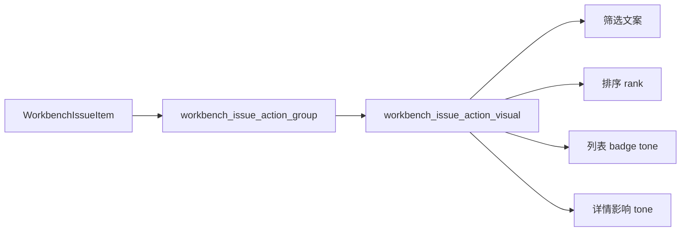

# 工作台问题动作视觉投影统一执行记录

日期：2026-06-28

## 1. 本轮继续判断

前几轮已经把工作台问题队列推进到：

- 动作分组：`先处理 / 建议确认 / 仅查看`
- 动作筛选
- 行内 badge
- 结构化详情：`影响 / 动作 / 证据`
- 详情小节组件 `IssueDetailSection`

但继续检查代码后发现，动作语义仍然分散在多个地方：

- `_issue_action_group_label(...)` 管中文文案。
- `_issue_action_group_rank(...)` 管排序。
- `_issue_action_badge_stylesheet(...)` 根据动作组推颜色。
- `_issue_detail_impact_tone(...)` 根据动作组和状态推详情 tone。
- adapter 层的 action count 又有自己的顺序。

这说明 UI 看起来已经统一，但规则还没有真正统一。只要后续新增一个动作组或改一个文案，就可能出现列表、筛选、badge、详情 tone 不一致。

所以本轮把动作视觉语义抽成统一投影。

## 2. 本轮实现

### 2.1 新增动作视觉投影

文件：`src/ui/adapters/workbench_execution_adapter.py`

新增：

- `WorkbenchIssueActionVisualProjection`
- `workbench_issue_action_visual(...)`
- `workbench_issue_action_visual_for_item(...)`

投影字段：

| 字段 | 含义 |
| --- | --- |
| `group` | 动作组内部值 |
| `label` | 前台文案 |
| `rank` | 排序优先级 |
| `badge_tone` | 列表 badge 语义色 |
| `detail_tone` | 详情影响块语义色 |

当前映射：

| 动作组 | label | rank | badge tone | detail tone |
| --- | --- | --- | --- | --- |
| `handle_first` | 先处理 | 0 | error | error |
| `confirm` | 建议确认 | 1 | info | info |
| `view_only` | 仅查看 | 2 | neutral | neutral |
| `view_only + resolved` | 仅查看 | 2 | neutral | success |

### 2.2 action count 使用同一排序规则

`_count_issue_action_values(...)` 不再靠 `ISSUE_ACTION_GROUP_VALUES` 的硬编码顺序输出，而是通过：

```python
workbench_issue_action_visual(item[0]).rank
```

排序。这样筛选下拉、摘要显示和列表排序使用同一个 rank。

### 2.3 列表排序和行内 badge 接入投影

文件：`src/ui/panels/workbench/quick_execution_detail.py`

列表排序现在使用：

```python
workbench_issue_action_visual_for_item(issue).rank
```

行内 badge 现在使用：

- `visual.label`
- `visual.badge_tone`

并给 badge 写入：

- `issue_action_group`
- `issue_action_tone`

这样测试和后续组件都可以直接检查 badge 的动作语义。

### 2.4 详情影响 tone 接入投影

`_issue_detail_impact_tone(...)` 不再维护一套独立判断，而是读取：

```python
workbench_issue_action_visual(action_group, status=status).detail_tone
```

这样列表 badge 和详情影响块不再各自判断。

## 3. 链路意义

本轮后，动作语义链路变成：



这比上一轮更进一步：不只是 UI 复用了小节组件，动作本身也有了稳定投影。

## 4. 与模板/场景一致性的关系

模板管理正在走向“样式数据 -> 投影 -> 控件/预览”。

场景页正在走向“场景覆盖 -> 投影 -> 共享控件/轻量预览”。

工作台现在也在走同一个方向：

```text
问题数据 -> 动作投影 -> 筛选 / 列表 / 详情 / 跳转
```

这能减少“同一个概念在不同位置长得不一样”的问题，也减少解释文字的需求。

## 5. 仍然不足

还可以继续推进：

- badge 的实际颜色仍在 Qt 层根据 tone 转换，后续可以抽 `TonePalette`。
- 详情影响文案仍在 UI 层，后续可纳入同一个 `IssueViewProjection`。
- 证据仍然是多行纯文本，下一步应结构化为来源、路径、参数、说明。
- `QuickExecutionDetail` 仍承担了较多问题队列 UI 逻辑，长期应抽出 `IssueQueuePanel`。

## 6. 本轮验证

已运行：

```text
python -m compileall src/ui/adapters/workbench_execution_adapter.py src/ui/panels/workbench/quick_execution_detail.py tests/test_workbench_execution_center.py tests/test_quick_execution_detail_architecture.py
```

结果：通过。

已运行聚焦测试：

```text
python -m pytest tests/test_workbench_execution_center.py::test_workbench_issue_action_group_keeps_user_action_language_stable tests/test_workbench_execution_center.py::test_workbench_issue_queue_summary_filters_by_category tests/test_quick_execution_detail_architecture.py::test_quick_execution_detail_filters_issue_queue_by_action_group tests/test_quick_execution_detail_architecture.py::test_quick_execution_detail_issue_panel_shows_detail_and_rechecks_current_issue -q
```

结果：`4 passed`。

已运行链路测试：

```text
python -m pytest tests/test_workbench_execution_center.py::test_workbench_issue_queue_summary_filters_by_category tests/test_workbench_execution_center.py::test_workbench_issue_action_group_keeps_user_action_language_stable tests/test_quick_execution_detail_architecture.py::test_quick_execution_detail_issue_panel_shows_detail_and_rechecks_current_issue tests/test_quick_execution_detail_architecture.py::test_quick_execution_detail_exposes_material_readiness_issue_queue tests/test_quick_execution_detail_architecture.py::test_quick_execution_detail_filters_issue_queue_by_category tests/test_quick_execution_detail_architecture.py::test_quick_execution_detail_filters_issue_queue_by_action_group tests/test_quick_execution_detail_architecture.py::test_quick_execution_detail_exposes_coverage_boundary_issue_queue tests/test_quick_execution_detail_architecture.py::test_quick_execution_detail_exposes_control_contract_issue_queue tests/test_workbench_execution_center.py::test_execution_diagnostic_issue_items_infer_scene_field_targets tests/test_workbench_execution_center.py::test_batch_execution_issue_items_infer_scene_field_targets_from_parameter_paths tests/test_workbench_execution_session_architecture.py::test_workbench_scene_field_repair_intent_reaches_scene_scope_widgets tests/test_scene_panel_architecture.py::test_scene_panel_scope_style_override_editor_writes_section_styles tests/test_paragraph_style_editor.py tests/test_small_widget_architecture.py::test_style_preview_tracks_paragraph_layout_parameters tests/test_small_widget_architecture.py::test_issue_detail_section_exposes_reusable_title_body_tone tests/test_ui_copy_guardrails.py -q
```

结果：`20 passed`。
