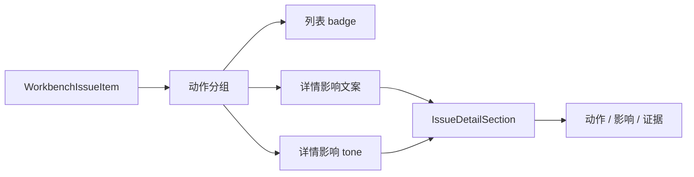

# 工作台问题详情共享小节与语义色执行记录

日期：2026-06-28

## 1. 本轮继续判断

上一轮已经把问题详情区改成：

```text
影响
动作
证据
```

这解决了“不说人话”的核心结构问题。但继续看实现层，详情区仍然是六个散落的 `QLabel`：

- `_issue_detail_impact_title`
- `_issue_detail_impact`
- `_issue_detail_action_title`
- `_issue_detail_advice`
- `_issue_detail_evidence_title`
- `_issue_detail_body`

这会带来两个问题：

1. 样式不可复用，后续其它面板想用“标题 + 正文 + tone”的结构还要再拼一次。
2. 影响块一直使用 warning 色，不能表达“先处理 / 建议确认 / 已处理 / 仅查看”的不同语义。

所以本轮继续把“动作 / 影响 / 证据”从文案结构推进到控件结构。

## 2. 本轮实现

### 2.1 新增共享组件 `IssueDetailSection`

文件：`src/shared/ui/issue_detail_section.py`

新增 `IssueDetailSection`：

- `title_label`
- `body_label`
- `set_title(...)`
- `set_body(...)`
- `set_tone(...)`
- `tone()`

支持 tone：

```text
error / warning / info / success / primary / neutral
```

组件自己响应主题变化，不再由业务面板逐个 label 写样式。

### 2.2 导出共享组件

文件：`src/shared/ui/__init__.py`

新增导出：

```python
"IssueDetailSection": (".issue_detail_section", "IssueDetailSection")
```

这样后续其它面板可以通过共享 UI 入口复用同一结构。

### 2.3 工作台详情区接入共享小节

文件：`src/ui/panels/workbench/quick_execution_detail.py`

详情区现在由三个 section 组成：

- `_issue_detail_impact_section`
- `_issue_detail_action_section`
- `_issue_detail_evidence_section`

为了兼容现有代码和测试，保留旧别名：

- `_issue_detail_impact_title`
- `_issue_detail_impact`
- `_issue_detail_action_title`
- `_issue_detail_advice`
- `_issue_detail_evidence_title`
- `_issue_detail_body`

这些别名指向 section 内部的 `title_label` 和 `body_label`。

### 2.4 影响块接入语义色

新增 `_issue_detail_impact_tone(...)`：

| 状态/动作 | tone |
| --- | --- |
| 已处理 | `success` |
| 已忽略 | `neutral` |
| 先处理 | `error` |
| 建议确认 | `info` |
| 仅查看 | `neutral` |

这样影响区的视觉语义和前面的动作 badge 保持一致，不再所有问题都使用 warning。

## 3. 链路意义

现在工作台问题链路更完整：



这说明我们不是只在界面上改几个标题，而是在把问题队列沉淀成稳定的 UI 构件。

## 4. 与模板/场景一致性的关系

模板页已经开始复用 `ParagraphStyleEditor`。

场景页已经开始复用样式投影和轻量预览。

工作台详情区现在也有了 `IssueDetailSection`，后续可以把运行诊断、样本证据、对象预检等详情块逐步统一到同一结构。

这对“功能分布合理、边界清晰、删除冗余文本”很关键：可复用控件越明确，越不需要靠每个页面自己写一段解释文字。

## 5. 仍然不足

还有几个缺口：

- `IssueDetailSection` 只是基础小节，还不是完整问题详情面板。
- 证据内容仍然是纯文本，后续应拆成来源、参数路径、证据文件等结构化行。
- 影响 tone 和 badge tone 仍在不同函数里维护，后续可以统一成动作视觉投影。
- 自定义列表行和详情小节还没有共同的 issue projection 类型，未来可抽 `IssueViewProjection`。

## 6. 本轮验证

已运行：

```text
python -m compileall src/shared/ui/issue_detail_section.py src/shared/ui/__init__.py src/ui/panels/workbench/quick_execution_detail.py tests/test_small_widget_architecture.py tests/test_quick_execution_detail_architecture.py
```

结果：通过。

已运行聚焦测试：

```text
python -m pytest tests/test_small_widget_architecture.py::test_issue_detail_section_exposes_reusable_title_body_tone tests/test_quick_execution_detail_architecture.py::test_quick_execution_detail_issue_panel_shows_detail_and_rechecks_current_issue tests/test_quick_execution_detail_architecture.py::test_quick_execution_detail_filters_issue_queue_by_action_group -q
```

结果：`3 passed`。

已运行链路测试：

```text
python -m pytest tests/test_workbench_execution_center.py::test_workbench_issue_queue_summary_filters_by_category tests/test_workbench_execution_center.py::test_workbench_issue_action_group_keeps_user_action_language_stable tests/test_quick_execution_detail_architecture.py::test_quick_execution_detail_issue_panel_shows_detail_and_rechecks_current_issue tests/test_quick_execution_detail_architecture.py::test_quick_execution_detail_exposes_material_readiness_issue_queue tests/test_quick_execution_detail_architecture.py::test_quick_execution_detail_filters_issue_queue_by_category tests/test_quick_execution_detail_architecture.py::test_quick_execution_detail_filters_issue_queue_by_action_group tests/test_quick_execution_detail_architecture.py::test_quick_execution_detail_exposes_coverage_boundary_issue_queue tests/test_quick_execution_detail_architecture.py::test_quick_execution_detail_exposes_control_contract_issue_queue tests/test_workbench_execution_center.py::test_execution_diagnostic_issue_items_infer_scene_field_targets tests/test_workbench_execution_center.py::test_batch_execution_issue_items_infer_scene_field_targets_from_parameter_paths tests/test_workbench_execution_session_architecture.py::test_workbench_scene_field_repair_intent_reaches_scene_scope_widgets tests/test_scene_panel_architecture.py::test_scene_panel_scope_style_override_editor_writes_section_styles tests/test_paragraph_style_editor.py tests/test_small_widget_architecture.py::test_style_preview_tracks_paragraph_layout_parameters tests/test_small_widget_architecture.py::test_issue_detail_section_exposes_reusable_title_body_tone tests/test_ui_copy_guardrails.py -q
```

结果：`20 passed`。
