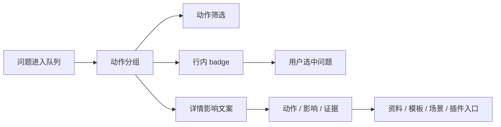

# 工作台问题详情动作影响证据重构执行记录

日期：2026-06-28

## 1. 本轮继续判断

前几轮已经把工作台问题队列推进到：

- 标题显示动作摘要。
- 支持按动作筛选。
- 列表行显示动作 badge。
- 列表按动作优先级排序。

但继续检查后，详情区仍然停留在旧表达：

```text
处理说明
建议：点击“处理”...
审计证据
```

这类文案的问题不是长短，而是结构不对。用户点开问题详情时，真正需要知道的是：

1. 现在要做什么。
2. 不做会有什么影响。
3. 证据是什么。

所以本轮把问题详情从“说明型文案”改成“决策型结构”。

## 2. 本轮实现

### 2.1 详情区新增影响块

文件：`src/ui/panels/workbench/quick_execution_detail.py`

新增：

- `_issue_detail_impact_title`
- `_issue_detail_impact`

详情区现在的结构是：

```text
标题
状态标签
影响
动作
证据
复检
```

影响块直接回答“这件事为什么重要”。

### 2.2 标题从说明口径改成任务口径

旧口径：

```text
处理说明
审计证据
```

新口径：

```text
影响
动作
证据
```

这和列表里的动作 badge 一致：用户先看动作，再看影响，再看证据。

### 2.3 压缩动作文案

旧文案：

```text
建议：点击“处理”去资料页补齐公司名称。处理完成后点“复检”。
```

新文案：

```text
处理：去资料页补齐公司名称
```

原因是“点击处理”和“处理完成后复检”属于界面操作常识，放在每条详情里会增加噪音。复检按钮已经在详情区下方，重复说明会削弱主要动作。

### 2.4 影响文案由动作分组投影生成

新增：

- `_issue_detail_impact_text(...)`
- `_issue_detail_action_text(...)`

影响文案基于既有动作分组，不新增业务状态：

| 动作分组 | 影响文案 |
| --- | --- |
| 先处理 + blocking | 会阻断本次运行，需要先处理。 |
| 先处理 + 非 blocking 严重问题 | 可能导致执行失败或结果不可用，需要先处理。 |
| 建议确认 | 不一定阻断运行，但会影响边界判断或修复选择。 |
| 仅查看 | 仅供查看，不需要立即处理。 |
| 已处理 | 已处理，保留记录。 |
| 已忽略 | 已忽略，不再作为当前阻断。 |

这样详情区继续复用 `workbench_issue_action_group(...)`，不会和列表 badge、动作筛选、排序产生第二套判断标准。

## 3. 链路复查

本轮完成后，工作台问题链路变成：



关键点：

- 列表和详情使用同一动作分组。
- 详情区不暴露内部 target key。
- 证据仍然保留来源映射，例如 `control_contract_registry` 仍显示为“控件边界登记”。
- `处理` 按钮仍走 `workbench_issue_action_target(...)`，没有改真实路由。

## 4. 与模板/场景一致性的关系

模板管理的问题是“配置对象清楚、控件清楚、预览清楚”。

场景页现在正在靠近这个结构：范围、样式覆盖、恢复模板、轻量预览都逐步明确。

工作台详情也应该遵守同样的结构纪律：

- 不堆长句解释。
- 不让用户读内部 key。
- 不重复按钮已经表达的操作。
- 把“动作”和“影响”放在证据之前。

本轮让工作台问题详情不再像诊断日志，而更像执行前的决策卡片。

## 5. 仍然不足

还可以继续推进：

- “影响 / 动作 / 证据”现在是文本块，后续可以做成统一的 `IssueDetailSection` 组件。
- 影响块的颜色目前统一使用 warning，未来可按动作分组区分 `error / info / neutral`。
- 证据仍然是多行文本，后续可以把来源、参数路径、证据文件拆成可点击结构。
- 复检按钮仍是通用按钮，后续可根据已处理/已忽略状态调整主次关系。

## 6. 本轮验证

已运行：

```text
python -m compileall src/ui/panels/workbench/quick_execution_detail.py tests/test_quick_execution_detail_architecture.py
```

结果：通过。

已运行聚焦测试：

```text
python -m pytest tests/test_quick_execution_detail_architecture.py::test_quick_execution_detail_issue_panel_shows_detail_and_rechecks_current_issue tests/test_quick_execution_detail_architecture.py::test_quick_execution_detail_filters_issue_queue_by_action_group tests/test_quick_execution_detail_architecture.py::test_quick_execution_detail_exposes_control_contract_issue_queue -q
```

结果：`3 passed`。

已运行文案守卫：

```text
python -m pytest tests/test_ui_copy_guardrails.py -q
```

结果：`4 passed`。

已运行链路测试：

```text
python -m pytest tests/test_workbench_execution_center.py::test_workbench_issue_queue_summary_filters_by_category tests/test_workbench_execution_center.py::test_workbench_issue_action_group_keeps_user_action_language_stable tests/test_quick_execution_detail_architecture.py::test_quick_execution_detail_issue_panel_shows_detail_and_rechecks_current_issue tests/test_quick_execution_detail_architecture.py::test_quick_execution_detail_exposes_material_readiness_issue_queue tests/test_quick_execution_detail_architecture.py::test_quick_execution_detail_filters_issue_queue_by_category tests/test_quick_execution_detail_architecture.py::test_quick_execution_detail_filters_issue_queue_by_action_group tests/test_quick_execution_detail_architecture.py::test_quick_execution_detail_exposes_coverage_boundary_issue_queue tests/test_quick_execution_detail_architecture.py::test_quick_execution_detail_exposes_control_contract_issue_queue tests/test_workbench_execution_center.py::test_execution_diagnostic_issue_items_infer_scene_field_targets tests/test_workbench_execution_center.py::test_batch_execution_issue_items_infer_scene_field_targets_from_parameter_paths tests/test_workbench_execution_session_architecture.py::test_workbench_scene_field_repair_intent_reaches_scene_scope_widgets tests/test_scene_panel_architecture.py::test_scene_panel_scope_style_override_editor_writes_section_styles tests/test_paragraph_style_editor.py tests/test_small_widget_architecture.py::test_style_preview_tracks_paragraph_layout_parameters tests/test_ui_copy_guardrails.py -q
```

结果：`19 passed`。
