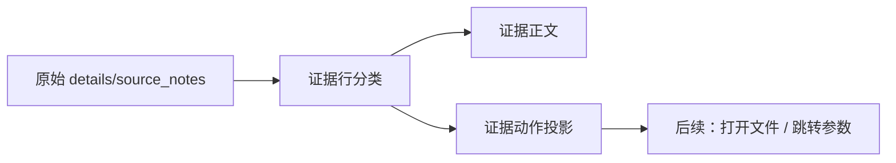

# 工作台问题详情证据行动作投影执行记录

日期：2026-06-28

## 1. 本轮继续判断

上一轮已经把详情区证据从纯文本改为轻量分类：

- 说明
- 参数
- 证据文件
- 来源
- 输出
- 记录

但继续看还差一步：这些证据虽然“看起来有结构”，程序还不知道哪些证据可以进一步操作。

例如：

```text
参数：body.special_indent
证据文件：src/shared/ui/paragraph_style_inputs.py:120#class SpecialIndentInput
来源：控件边界登记
```

用户看到前两行自然会期待“能定位参数 / 能打开证据文件”，但当前只是文本。为了后续接点击，不应该再从显示字符串里临时解析，所以本轮先给证据行增加稳定 action 投影。

## 2. 本轮实现

### 2.1 `IssueEvidenceLineProjection` 增加动作字段

文件：`src/ui/panels/workbench/quick_execution_detail.py`

新增字段：

- `action_type`
- `action_value`

证据行仍然保留：

- `kind`
- `label`
- `text`

也就是说，一行证据现在同时有“显示语义”和“动作语义”。

### 2.2 可操作证据映射

当前动作映射：

| 证据类型 | action_type | action_value |
| --- | --- | --- |
| 参数路径 | `navigate_parameter` | 参数路径 |
| 证据文件 | `open_evidence` | 文件/行/marker |
| 输出路径 | `open_output` | 输出路径 |
| 替换来源 | `open_replacement` | 替换来源路径 |

不可操作证据：

- 来源
- 说明
- 记录
- 保护模式
- 扫描对象

这些仍然展示，但不会进入动作列表。

### 2.3 暴露当前问题证据动作

新增：

```python
QuickExecutionDetail.current_issue_evidence_actions()
```

返回：

```python
[(kind, action_type, action_value), ...]
```

例如控件契约问题会返回：

```python
[
    ("parameter_path", "navigate_parameter", "body.special_indent"),
    (
        "evidence_file",
        "open_evidence",
        "src/shared/ui/paragraph_style_inputs.py:120#class SpecialIndentInput",
    ),
]
```

来源“控件边界登记”不会进入动作列表，避免把登记来源误当成可打开目标。

## 3. 链路意义

现在证据区的链路更完整：



本轮还没有做点击 UI，但已经把“什么可点击”从文本里分离出来。下一轮如果要加按钮或双击，只需要消费 `current_issue_evidence_actions()`，不用再解析中文显示文本。

## 4. 与整体规划的关系

模板、场景、工作台现在都在向同一模式靠近：

```text
原始数据 -> 投影 -> UI 控件 -> 可操作入口
```

这轮让“证据”也进入这个模式：

```text
证据文本 -> EvidenceLineProjection -> 证据动作
```

这比继续堆说明更可靠，也能减少未来的重复解析。

## 5. 仍然不足

还没有完成的部分：

- 证据行还没有独立 widget。
- `open_evidence` 还没有真正绑定打开文件。
- `navigate_parameter` 还没有真正绑定场景/模板字段高亮。
- 证据动作还在 `QuickExecutionDetail` 内，后续可以抽到共享 issue projection 模块。

## 6. 本轮验证

已运行：

```text
python -m compileall src/ui/panels/workbench/quick_execution_detail.py tests/test_quick_execution_detail_architecture.py
```

结果：通过。

已运行聚焦测试：

```text
python -m pytest tests/test_quick_execution_detail_architecture.py::test_quick_execution_detail_exposes_control_contract_issue_queue tests/test_quick_execution_detail_architecture.py::test_quick_execution_detail_issue_panel_shows_detail_and_rechecks_current_issue tests/test_ui_copy_guardrails.py -q
```

结果：`6 passed`。

已运行链路测试：

```text
python -m pytest tests/test_workbench_execution_center.py::test_workbench_issue_queue_summary_filters_by_category tests/test_workbench_execution_center.py::test_workbench_issue_action_group_keeps_user_action_language_stable tests/test_quick_execution_detail_architecture.py::test_quick_execution_detail_issue_panel_shows_detail_and_rechecks_current_issue tests/test_quick_execution_detail_architecture.py::test_quick_execution_detail_exposes_material_readiness_issue_queue tests/test_quick_execution_detail_architecture.py::test_quick_execution_detail_filters_issue_queue_by_category tests/test_quick_execution_detail_architecture.py::test_quick_execution_detail_filters_issue_queue_by_action_group tests/test_quick_execution_detail_architecture.py::test_quick_execution_detail_exposes_coverage_boundary_issue_queue tests/test_quick_execution_detail_architecture.py::test_quick_execution_detail_exposes_control_contract_issue_queue tests/test_workbench_execution_center.py::test_execution_diagnostic_issue_items_infer_scene_field_targets tests/test_workbench_execution_center.py::test_batch_execution_issue_items_infer_scene_field_targets_from_parameter_paths tests/test_workbench_execution_session_architecture.py::test_workbench_scene_field_repair_intent_reaches_scene_scope_widgets tests/test_scene_panel_architecture.py::test_scene_panel_scope_style_override_editor_writes_section_styles tests/test_paragraph_style_editor.py tests/test_small_widget_architecture.py::test_style_preview_tracks_paragraph_layout_parameters tests/test_small_widget_architecture.py::test_issue_detail_section_exposes_reusable_title_body_tone tests/test_ui_copy_guardrails.py -q
```

结果：`20 passed`。
