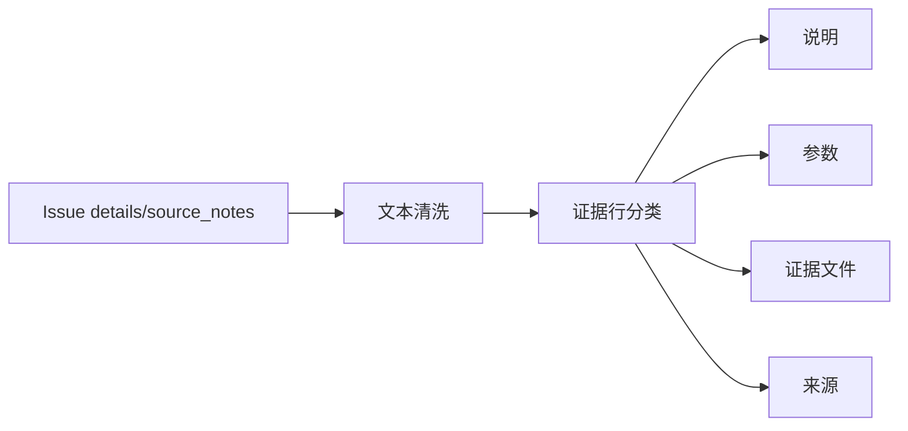

# 工作台问题详情证据行结构化投影执行记录

日期：2026-06-28

## 1. 本轮继续判断

前几轮已经把工作台问题详情推进到：

- `影响 / 动作 / 证据` 三段结构。
- `IssueDetailSection` 共享小节。
- 动作视觉投影统一了 label、rank、badge tone、detail tone。

但继续看“证据”段，仍然只是把明细文本按换行拼起来：

```text
缺少必审控件契约：body.special_indent
规范控件：SpecialIndentInput
参数路径：body.special_indent
证据：src/shared/ui/...
来源：控件边界登记
```

这比完全不展示证据好，但用户仍然需要自己判断每一行是什么类型。证据段应该至少回答：

- 哪些是说明。
- 哪些是参数。
- 哪些是文件证据。
- 哪些是来源。

所以本轮先做轻量结构化投影，不急着做复杂表格或可点击证据组件。

## 2. 本轮实现

### 2.1 新增证据行投影

文件：`src/ui/panels/workbench/quick_execution_detail.py`

新增：

- `IssueEvidenceLineProjection`
- `_issue_evidence_line_projections(...)`
- `_issue_evidence_line_projection(...)`
- `_issue_evidence_body_text(...)`

每一行证据现在先归类，再格式化显示。

### 2.2 支持的轻量分类

当前分类规则：

| 原始前缀 | 展示标签 |
| --- | --- |
| `参数路径：` | 参数 |
| `证据：` | 证据文件 |
| `输出路径：` | 输出 |
| `记录名称：` | 记录 |
| `来源：` | 来源 |
| `替换来源：` | 替换来源 |
| `保护模式：` | 保护 |
| `扫描对象：` | 扫描 |
| 其它文本 | 说明 |

例如控件契约问题详情从原始行变成：

```text
说明：缺少必审控件契约：body.special_indent
说明：规范控件：SpecialIndentInput
参数：body.special_indent
证据文件：src/shared/ui/paragraph_style_inputs.py:120#class SpecialIndentInput
来源：控件边界登记
```

用户能更快分辨“问题说明”和“证据文件”。

### 2.3 source note 不再一律塞进来源

如果 source note 本身已经带有结构前缀，例如：

```text
输出路径：C:/tmp/review.docx
保护模式：strict
扫描对象：comments, fields
```

详情区会按对应类别显示，而不是变成：

```text
来源：输出路径：...
```

这一步能减少嵌套标签带来的阅读噪音。

## 3. 与前几轮链路的关系

现在详情区逐步变成：

```text
影响：为什么要管
动作：现在去哪里处理
证据：为什么系统这么判断
```

而证据段内部也不再是一段日志，而是轻量分层：



这继续服务于同一个目标：减少解释文字，让界面结构自己说话。

## 4. 与模板/场景一致性的关系

模板和场景现在都在走“数据 -> 投影 -> 共享控件”的路径。

本轮把工作台证据也推进到投影层：

```text
原始证据文本 -> EvidenceLineProjection -> 证据正文
```

这样后续要做可点击文件、参数路径跳转、证据来源过滤时，不需要重新解析一整段文本。

## 5. 仍然不足

这轮只是轻量结构化，仍有明显缺口：

- 证据行还不是独立 widget，仍然显示在 `IssueDetailSection.body_label` 里。
- 证据文件还不可点击。
- 参数路径还没有和场景/模板字段跳转联动。
- 分类规则仍在 `QuickExecutionDetail` 中，后续可抽到 issue projection 模块。
- tooltip 仍保留原明细文本，未来可以统一为结构化 tooltip。

## 6. 本轮验证

已运行：

```text
python -m compileall src/ui/panels/workbench/quick_execution_detail.py tests/test_quick_execution_detail_architecture.py
```

结果：通过。

已运行聚焦测试：

```text
python -m pytest tests/test_quick_execution_detail_architecture.py::test_quick_execution_detail_exposes_control_contract_issue_queue tests/test_quick_execution_detail_architecture.py::test_quick_execution_detail_issue_panel_shows_detail_and_rechecks_current_issue tests/test_ui_copy_guardrails.py -q
```

结果：`6 passed`。

已运行链路测试：

```text
python -m pytest tests/test_workbench_execution_center.py::test_workbench_issue_queue_summary_filters_by_category tests/test_workbench_execution_center.py::test_workbench_issue_action_group_keeps_user_action_language_stable tests/test_quick_execution_detail_architecture.py::test_quick_execution_detail_issue_panel_shows_detail_and_rechecks_current_issue tests/test_quick_execution_detail_architecture.py::test_quick_execution_detail_exposes_material_readiness_issue_queue tests/test_quick_execution_detail_architecture.py::test_quick_execution_detail_filters_issue_queue_by_category tests/test_quick_execution_detail_architecture.py::test_quick_execution_detail_filters_issue_queue_by_action_group tests/test_quick_execution_detail_architecture.py::test_quick_execution_detail_exposes_coverage_boundary_issue_queue tests/test_quick_execution_detail_architecture.py::test_quick_execution_detail_exposes_control_contract_issue_queue tests/test_workbench_execution_center.py::test_execution_diagnostic_issue_items_infer_scene_field_targets tests/test_workbench_execution_center.py::test_batch_execution_issue_items_infer_scene_field_targets_from_parameter_paths tests/test_workbench_execution_session_architecture.py::test_workbench_scene_field_repair_intent_reaches_scene_scope_widgets tests/test_scene_panel_architecture.py::test_scene_panel_scope_style_override_editor_writes_section_styles tests/test_paragraph_style_editor.py tests/test_small_widget_architecture.py::test_style_preview_tracks_paragraph_layout_parameters tests/test_small_widget_architecture.py::test_issue_detail_section_exposes_reusable_title_body_tone tests/test_ui_copy_guardrails.py -q
```

结果：`20 passed`。
