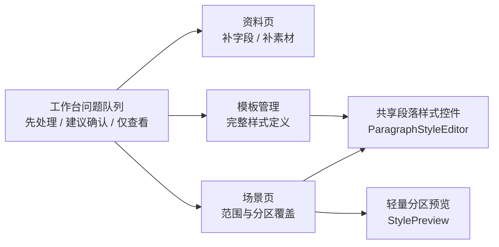

# 工作台问题队列动作分组与场景模板一致性执行记录

日期：2026-06-28

## 1. 本轮继续判断

前面几轮已经把“场景样式覆盖”和“模板管理”拉近了很多：

- 模板正文排版和场景分区样式覆盖共用 `ParagraphStyleEditor`。
- 场景样式覆盖的初始值来自模板有效样式，不再总是退回正文样式。
- 场景页有“恢复模板”，能把分区覆盖退回模板基线。
- 场景样式轻量预览已经能表达字体、字号、粗体、斜体、对齐、行距、缩进、段前段后。
- 工作台运行诊断已经能把 `parameter_path` 路由到场景范围或场景样式控件。

但继续比对模板管理后，问题仍然存在：控件层逐步统一了，问题分诊层仍然偏技术化。用户看到的是“分类、严重度、状态、字段 key、插件边界”，而不是“我现在应该先处理什么”。这会让场景页、模板页做得再像，入口链路仍然显得“不说人话”。

所以本轮不再继续堆说明文案，而是把工作台问题队列从“技术分类优先”改成“用户动作优先”。

## 2. 与模板管理的角色边界

模板管理应当是完整样式定义中心：

- 管页面、正文、标题、表格、页眉页脚、目录、参考文献等完整模板规则。
- 提供完整预览和长期保存的配置。
- 使用共享样式控件，保证所有样式字段的输入方式一致。

场景页应当是业务策略和局部覆盖中心：

- 管某个业务场景启用哪些范围、哪些功能、哪些输出。
- 样式只允许按分区做覆盖，不替代模板页。
- 分区覆盖必须清楚显示“跟随模板 / 已覆盖 / 与模板一致 / 恢复模板”。

工作台应当是执行前分诊和跳转中心：

- 管当前运行能不能开始。
- 把资料缺失、模板样式问题、场景参数问题、插件边界等汇总成问题队列。
- 用户首先看到动作含义，再通过跳转进入资料、模板或场景的真实控件。

这三个边界合在一起，才是当前项目更合理的功能分布：



## 3. 本轮落地：动作分组

新增三个用户动作分组：

| 内部值 | 前台文案 | 进入条件 | 用户理解 |
| --- | --- | --- | --- |
| `handle_first` | 先处理 | 阻断项，或 error/fatal/critical 严重度 | 不处理就不适合继续运行 |
| `confirm` | 建议确认 | 未终态、非阻断，但存在可跳转修复目标 | 可以继续，但最好先看一下 |
| `view_only` | 仅查看 | 已解决、已忽略，或没有可操作目标 | 作为信息保留，不催促用户动作 |

这个分组不替代原有分类筛选。分类仍然存在，用来回答“它属于资料、模板、场景还是插件边界”；动作分组回答“我现在该怎么办”。

## 4. 实现记录

### 4.1 队列摘要增加动作投影

文件：`src/ui/adapters/workbench_execution_adapter.py`

新增：

- `WorkbenchIssueQueueSummary.action_group_counts`
- `WorkbenchIssueQueueSummary.visible_action_group_counts`
- `ISSUE_ACTION_GROUP_VALUES`
- `workbench_issue_action_group(...)`

`summarize_workbench_issue_queue(...)` 现在同时统计全量队列和当前筛选后的动作分布。这样 UI 不需要重新理解阻断、状态、严重度和修复目标，只消费稳定投影。

### 4.2 工作台问题队列显示动作摘要

文件：`src/ui/panels/workbench/quick_execution_detail.py`

问题队列标题现在在冒号后优先显示动作摘要：

```text
运行前问题 2 项：先处理 2；资料字段缺失...
```

筛选后也使用当前可见项的动作摘要：

```text
运行前问题 2 项（资料资产 1/2）：先处理 1；资料资产缺失...
```

tooltip 增加：

```text
行动：先处理 2
```

分类、严重度、状态、负责人、可处理目标仍然保留在 tooltip 中，但不再抢占第一阅读层。

## 5. 链路是否打通

本轮检查后，当前链路是通的：

1. 执行前资料问题进入 `WorkbenchIssueItem`。
2. 普通运行诊断和批量诊断可通过 `parameter_path` 推断场景字段目标。
3. 工作台问题队列通过动作分组提示用户优先级。
4. 可处理项仍然通过 `workbench_issue_action_target(...)` 跳转到资料、模板、场景或题图行。
5. 场景样式字段最终落到共享 `ParagraphStyleEditor`，模板正文样式也使用同一个编辑器。
6. 场景样式覆盖预览使用 `StylePreview`，并由 `SectionStylePreviewProjection` 从模板有效样式和场景覆盖生成。

这说明“运行问题 -> 用户动作 -> 目标控件 -> 模板/场景一致控件”的主链路已经形成。

## 6. 仍然不足

这轮只是把问题队列的第一层语义改成用户动作，还没有做到完整优秀：

- 问题队列行内还没有显示动作徽标，用户需要从标题或 tooltip 判断。
- 当前筛选仍然只有类别筛选，后续应增加“先处理 / 建议确认 / 仅查看”的动作筛选。
- 问题队列还没有抽成共享组件，工作台内部逻辑仍然偏重。
- 模板页的完整预览和场景页轻量预览仍然是两个组件；短期可接受，长期应抽一个预览投影协议，避免未来再次分叉。
- 部分场景参数区仍有解释性文字，下一轮应继续删掉重复说明，把说明压缩为状态、按钮、tooltip 和可跳转动作。

## 7. 本轮验证

已运行：

```text
python -m compileall src/ui/adapters/workbench_execution_adapter.py src/ui/panels/workbench/quick_execution_detail.py tests/test_workbench_execution_center.py tests/test_quick_execution_detail_architecture.py
```

结果：通过。

已运行：

```text
python -m pytest tests/test_workbench_execution_center.py::test_workbench_issue_queue_summary_filters_by_category tests/test_workbench_execution_center.py::test_workbench_issue_action_group_keeps_user_action_language_stable tests/test_quick_execution_detail_architecture.py::test_quick_execution_detail_exposes_material_readiness_issue_queue tests/test_quick_execution_detail_architecture.py::test_quick_execution_detail_filters_issue_queue_by_category tests/test_quick_execution_detail_architecture.py::test_quick_execution_detail_exposes_coverage_boundary_issue_queue -q
```

结果：`5 passed`。

已运行：

```text
python -m pytest tests/test_workbench_execution_center.py::test_execution_diagnostic_issue_items_infer_scene_field_targets tests/test_workbench_execution_center.py::test_batch_execution_issue_items_infer_scene_field_targets_from_parameter_paths tests/test_workbench_execution_session_architecture.py::test_workbench_scene_field_repair_intent_reaches_scene_scope_widgets tests/test_scene_panel_architecture.py::test_scene_panel_scope_style_override_editor_writes_section_styles tests/test_paragraph_style_editor.py tests/test_small_widget_architecture.py::test_style_preview_tracks_paragraph_layout_parameters -q
```

结果：`7 passed`。
