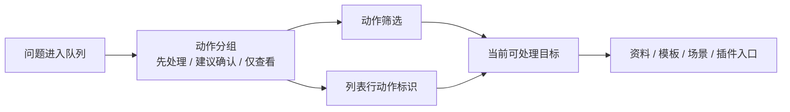

# 工作台问题队列动作筛选与行内标识执行记录

日期：2026-06-28

## 1. 本轮继续判断

上一轮已经把工作台问题队列的摘要从“技术分类优先”推进到“用户动作优先”，标题和 tooltip 中能看到：

- 先处理
- 建议确认
- 仅查看

但继续从真实使用路径看，这仍然不够。用户不是只读标题，真正操作时会进入问题列表、选中某一条、点击“处理”。如果列表行仍然只显示“问题摘要 + 状态”，动作语义就会断在标题层：

```text
标题知道要先处理，但每一行不知道哪条要先处理。
```

这会造成两个问题：

1. 用户无法快速按动作整理问题。
2. “类别筛选”仍然是唯一筛选入口，界面会继续偏向内部分类，而不是用户任务。

所以本轮继续把动作语义下沉到列表行和筛选控件。

## 2. 功能边界再确认

本轮没有改变资料、模板、场景三处真实修复入口：

- 资料缺失仍然跳到资料页。
- 模板样式问题仍然跳到模板页。
- 场景参数和场景样式问题仍然跳到场景页。
- 插件和专业边界仍然作为人工确认入口。

本轮只改变工作台问题队列的“分诊方式”：



这样工作台仍然是执行前分诊中心，不越界变成资料、模板或场景配置页。

## 3. 本轮实现

### 3.1 摘要层支持动作筛选

文件：`src/ui/adapters/workbench_execution_adapter.py`

`WorkbenchIssueQueueSummary` 新增：

- `active_action_group`

`summarize_workbench_issue_queue(...)` 新增参数：

- `action_group`

现在摘要支持同时按两类条件筛选：

```text
category + action_group
```

例子：

```text
资料字段 + 建议确认 -> 0 项
插件边界 + 建议确认 -> 1 项
全部类别 + 先处理 -> 多项阻断问题
```

同时 `has_filter` 也从只识别类别筛选，改为同时识别动作筛选。否则只按动作筛选且结果为空时，标题会误判为“查看明细”。

### 3.2 工作台增加动作筛选下拉

文件：`src/ui/panels/workbench/quick_execution_detail.py`

问题筛选行现在包含两个并列筛选：

- 类别筛选：回答“问题属于哪里”
- 动作筛选：回答“我现在要怎么处理”

动作筛选只在队列中存在多个动作组时显示，避免单一动作时增加无意义控件。

### 3.3 列表行增加动作标识

问题列表行从：

```text
资料字段缺失：company_name... · 待处理
```

变为：

```text
先处理 · 资料字段缺失：company_name... · 待处理
```

插件边界等非阻断确认项会显示：

```text
建议确认 · 插件/专业边界：试卷/教学资料 · 待处理
```

tooltip 第一行同步显示动作：

```text
行动：建议确认
```

这样用户扫列表时能先看动作，不需要先理解类别、严重度、owner 或内部 target key。

### 3.4 当前筛选显示合并

标题和 tooltip 现在支持组合筛选：

```text
运行前问题 3 项（建议确认 1/3）：建议确认 1；...
```

组合为空时：

```text
运行前问题 3 项（资料字段 / 建议确认 0/3）：当前筛选没有问题
```

tooltip 中会显示：

```text
当前筛选：资料字段 / 建议确认
```

这保留了类别筛选的精确性，也把动作筛选放到同等地位。

## 4. 与模板管理一致性的意义

模板管理优秀的地方不只是控件样式一致，而是信息结构清楚：

- 用户知道当前在编辑哪类样式。
- 用户知道修改会影响什么范围。
- 用户知道预览和设置之间的关系。

工作台问题队列也需要同样的结构：

- 用户知道当前问题该先处理还是只确认。
- 用户知道它属于资料、模板、场景还是插件边界。
- 用户点击处理后能进入真实控件，而不是停在说明文字。

本轮动作筛选和行内标识，就是把工作台从“诊断日志列表”继续推进成“任务分诊列表”。

## 5. 仍然不足

本轮之后，问题队列比上一轮更可读，但还没有达到优秀设计：

- 动作标识目前是文本前缀，不是独立 badge；视觉层级还可以更清晰。
- 类别筛选和动作筛选仍然是两个普通下拉，未来可以改成更轻的分段控件或 chip 组。
- 问题列表还没有按动作自动排序；现在仍然保持原队列顺序。
- 问题详情里的“处理说明”仍有说明句，后续应继续压缩为动作按钮、状态和证据。
- 这套问题队列还没有抽成共享组件，工作台内部仍然承担较多 UI 拼装。

## 6. 本轮验证

已运行：

```text
python -m compileall src/ui/adapters/workbench_execution_adapter.py src/ui/panels/workbench/quick_execution_detail.py tests/test_workbench_execution_center.py tests/test_quick_execution_detail_architecture.py
```

结果：通过。

已运行聚焦测试：

```text
python -m pytest tests/test_workbench_execution_center.py::test_workbench_issue_queue_summary_filters_by_category tests/test_quick_execution_detail_architecture.py::test_quick_execution_detail_filters_issue_queue_by_action_group tests/test_quick_execution_detail_architecture.py::test_quick_execution_detail_filters_issue_queue_by_category -q
```

结果：`3 passed`。

已运行链路测试：

```text
python -m pytest tests/test_workbench_execution_center.py::test_workbench_issue_queue_summary_filters_by_category tests/test_workbench_execution_center.py::test_workbench_issue_action_group_keeps_user_action_language_stable tests/test_quick_execution_detail_architecture.py::test_quick_execution_detail_exposes_material_readiness_issue_queue tests/test_quick_execution_detail_architecture.py::test_quick_execution_detail_filters_issue_queue_by_category tests/test_quick_execution_detail_architecture.py::test_quick_execution_detail_filters_issue_queue_by_action_group tests/test_quick_execution_detail_architecture.py::test_quick_execution_detail_exposes_coverage_boundary_issue_queue tests/test_workbench_execution_center.py::test_execution_diagnostic_issue_items_infer_scene_field_targets tests/test_workbench_execution_center.py::test_batch_execution_issue_items_infer_scene_field_targets_from_parameter_paths tests/test_workbench_execution_session_architecture.py::test_workbench_scene_field_repair_intent_reaches_scene_scope_widgets tests/test_scene_panel_architecture.py::test_scene_panel_scope_style_override_editor_writes_section_styles tests/test_paragraph_style_editor.py tests/test_small_widget_architecture.py::test_style_preview_tracks_paragraph_layout_parameters -q
```

结果：`13 passed`。
