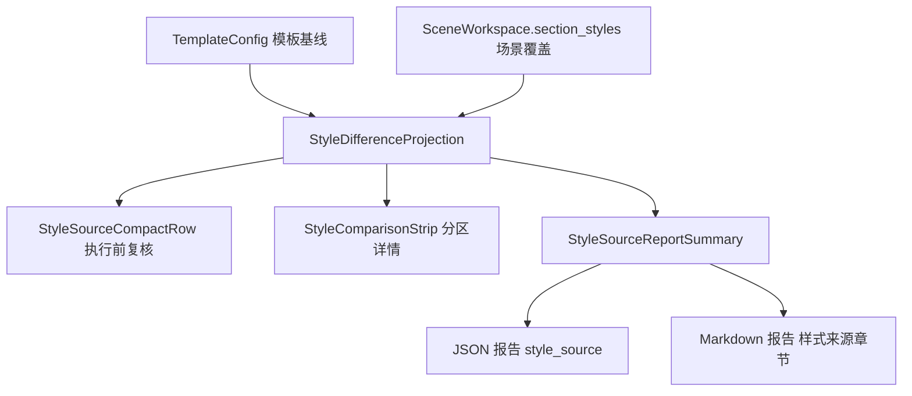

# 执行报告样式来源追溯闭环执行记录

日期：2026-06-29

## 1. 本轮继续解决的问题

上一轮已经把 `StyleDifferenceProjection` 抽成独立投影，并接入了：

- 场景概览样式来源行
- Workbench 执行前复核
- 分区样式详情对照条

但链路仍然停在“执行前”。用户真正交付时还会看执行报告，如果报告里没有写明：

```text
本次按哪个模板处理？
哪些分区使用了场景独立样式？
独立样式具体差在哪些字段？
```

那么“配置 -> 执行 -> 报告”的闭环仍然不完整。本轮目标就是把样式来源写入执行后的 JSON/Markdown 报告。

## 2. 核心设计

本轮没有让 `report_writer` 自己去猜模板和场景，因为报告 writer 只拿到 `PipelineResult`，并不天然知道“原始模板基线”和“场景覆盖”之间的关系。

正确边界是：

```text
CLI / Workbench Runner 持有 template + scene
-> 构建 style_source_summary
-> report_writer 只负责写入 JSON / Markdown
```

这保持了职责清晰：

| 层级 | 职责 |
| --- | --- |
| `StyleDifferenceProjection` | 比较模板基线和场景分区样式 |
| `style_source_report_summary` | 把差异投影转换为报告摘要 |
| `report_writer` | 清洗并写入 JSON/Markdown |
| CLI / Workbench | 在有上下文的位置传入摘要 |

## 3. 本轮代码落点

### 3.1 差异投影下沉到 config 层

新增：

- `src/config/style_difference_projection.py`

保留兼容：

- `src/ui/panels/style_difference_projection.py`

原因：

```text
执行报告和 CLI 不应该依赖 UI 包。
```

原 UI 路径现在只 re-export 配置层实现，现有 UI 和测试不需要改调用路径。

### 3.2 新增报告摘要 builder

新增：

- `src/config/style_source_report_summary.py`

核心函数：

```text
build_style_source_report_summary(scene, template, template_label="")
```

输出结构：

```json
{
  "template_label": "默认格式",
  "summary": "本次按模板“默认格式”处理；参考文献（行距）使用场景独立样式。",
  "section_status": "1 个分区独立设置",
  "independent_section_count": 1,
  "changed_section_count": 1,
  "sections": [
    {
      "variant_key": "references_body",
      "label": "参考文献",
      "compact_label": "参考文献（行距）",
      "changed_labels": ["行距"],
      "difference_status": "已调整 1 项"
    }
  ]
}
```

这个结构同时适合机器读取和 Markdown 展示。

### 3.3 报告 writer 接入

更新：

- `src/report_writer.py`

新增可选参数：

```text
style_source_summary
```

JSON 报告新增字段：

```text
style_source
```

Markdown 报告新增章节：

```text
## 样式来源
- 摘要: 本次按模板“默认格式”处理；参考文献（行距）使用场景独立样式。
- 模板: 默认格式
- 分区: 1 个分区独立设置

- 参考文献（行距）: 已调整 1 项：不同：行距
```

没有传摘要时，旧报告不新增空章节。

### 3.4 执行入口接入

更新：

- `src/cli_runner.py`
- `src/ui/panels/workbench/execution_runtime.py`
- `src/ui/panels/workbench/panel.py`

覆盖：

| 入口 | 当前状态 |
| --- | --- |
| CLI 标准执行 | 已传入样式来源摘要 |
| Workbench V2 标准执行 | 已传入样式来源摘要 |
| Workbench V2 delivery preset 报告 | 已传入样式来源摘要 |
| 旧 Workbench runner | 已传入样式来源摘要 |

失败预检报告暂未接入，因为它没有完成排版执行，不适合声明“本次按模板处理”的最终结果。

### 3.5 参数归属锚点同步

更新：

- `src/config/scene_parameter_ownership.py`

本轮回归发现 `ScenePanel scope` 的消费者锚点仍在查找旧标记：

```text
_current_scene.format_scope.sections
```

当前真实代码已经使用：

```text
scene.format_scope.sections
```

因此同步更新锚点，恢复 `audit_parameter_execution_consumers()` 为 clean。这个修正与样式来源报告属于同一类问题：共享契约不能只写代码，还要让审计锚点指向真实实现。

## 4. 当前链路状态



这轮之后，样式来源已经从配置页走到了执行报告。

## 5. 仍未完成的边界

### 5.1 执行中心 UI 摘要尚未显示报告中的样式来源

报告文件已经写入样式来源，但 Workbench 执行中心的结果摘要仍主要展示状态、对象预检、材料一致性、诊断摘要等。

后续可以把 `style_source_summary["summary"]` 也写入 `ExecutionResultState`，让 UI 执行结果区不用打开报告也能看到：

```text
本次按模板“默认格式”处理；参考文献（行距）使用场景独立样式。
```

### 5.2 批量报告摘要需要进一步汇总

当前单次报告已经有样式来源。批量报告如果要做跨文件汇总，应统计：

```text
本批次 12 个文件均使用同一模板；其中 1 个场景分区有独立样式。
```

这属于批量事务层，不应塞进单文件 report writer。

### 5.3 真实执行样本回归还可继续补

当前已经有 writer 级测试。后续可补一个更完整的 Workbench runner 级用例，验证真实运行 payload 的 `report_paths` 指向的 JSON 文件中包含 `style_source`。

## 6. 验证

语法编译：

```powershell
python -X utf8 -m py_compile src/config/style_difference_projection.py src/config/style_source_report_summary.py src/ui/panels/style_difference_projection.py src/report_writer.py src/cli_runner.py src/ui/panels/workbench/execution_runtime.py src/ui/panels/workbench/panel.py tests/test_execution_diagnostics_reporting.py tests/test_style_difference_projection.py
```

结果：通过。

参数归属审计：

```powershell
python -X utf8 -c "from src.config.scene_parameter_ownership import audit_parameter_execution_consumers; r=audit_parameter_execution_consumers(); print(r.is_clean); print(r.missing_anchor_markers)"
```

结果：

```text
True
()
```

聚焦测试：

```powershell
python -X utf8 -m pytest tests/test_execution_diagnostics_reporting.py tests/test_style_difference_projection.py tests/test_scene_overview_projection.py tests/test_style_source_visual_audit.py tests/test_small_widget_architecture.py::test_style_source_compact_row_projects_template_section_and_actions tests/test_quick_execution_detail_architecture.py::test_quick_execution_detail_uses_shared_style_source_row tests/test_workbench_execution_center.py::test_execution_adapter_builds_success_result_state tests/test_workbench_execution_center.py::test_execution_center_result_state_renders_status_and_summary tests/test_execution_worker.py::test_execution_worker_normalizes_report_paths_to_strings -q
```

结果：

```text
42 passed in 11.01s
```

## 7. 当前判断

这一轮把样式来源从“执行前可见”推进到“执行后可追溯”。现在同一套 `StyleDifferenceProjection` 已经服务：

- 场景概览
- Workbench 执行前复核
- 分区样式详情
- JSON 报告
- Markdown 报告

下一步最有价值的是把报告摘要再回流到 Workbench 执行结果 UI，让用户不打开报告文件也能看到本次有效样式来源。
