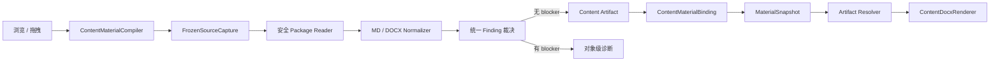

# 文件资料 MD/DOCX 语义编译链重构执行方案（2026-07-13）

## 0. 文档状态

- 状态：已执行完成并通过本次重构范围验收。
- 完成日期：2026-07-13。
- 范围：文件资料的 MD/DOCX 选择、冻结、解析、规范化、持久化、资料包打包、运行装配、诊断和 UI 投影。
- 前提：产品尚未公开发布，不承担 `content-ir-v1`、旧资料快照和旧资料包合同的运行时兼容成本。
- 兼容目标：兼容真实 Word/WPS 常见文档、MD 常见语法、新合同下的资料包持久化与跨机器复制；不以保留未发布的内部 JSON 形状为目标。
- 本文取代此前“保留 v1 运行链并逐步迁移”的保守方案。最终代码不得长期保留 v1/v2 双轨 importer。

## 1. 最终决策

文件资料不再保存“指向外部源文件的活绑定”，而是在用户选择或拖拽文件时执行一次编译：

```text
外部 MD/DOCX
  -> 稳定捕获源字节
  -> 安全解析
  -> 语义规范化
  -> 内容完整性裁决
  -> Content IR v2
  -> 内容寻址制品
```

运行阶段只加载并验证已经编译完成的制品，不再重新解析原 MD/DOCX，也不再为了图片资源第三次打开 DOCX ZIP。

最终只保留一条生产链：



禁止增加以下旁路：

- 遇到复杂 DOCX 时自动切换为 `InsertFile`；
- 直接复制源 Word XML 到目标文档；
- UI 自己做一套宽松预检；
- 执行阶段重新调用源格式 importer；
- 为 WPS 文件名、下载目录或特定样本写硬编码特判。

## 2. 当前链路的结构性问题

### 2.1 同一份源文件被重复读取和解释

当前链路至少存在三次源读取：

1. `build_content_source_binding()` 读取源文件并执行 importer，只为判断能否绑定，生成的 `DocumentFragment` 随即丢弃；
2. `ContentMaterialComposer.compose()` 在每次执行时再次调用 importer；
3. `materialize_content_fragment_resources()` 为提取 DOCX 内嵌图片再次打开源 ZIP，并按摘要搜索媒体成员。

后果：

- WPS 临时下载文件可能在三次读取之间被重写；
- 同一源文件的诊断可能漂移；
- 解析成本在批量执行中重复支付；
- importer、composer、resource materializer 都知道源格式；
- 资源身份已经在 IR 中冻结，却仍需回源查找字节；
- UI 成功预检不等于运行时一定得到同一结果。

### 2.2 Binding 混合了业务身份、外部路径和编译合同

当前 `ContentSourceBinding` 同时承担：

- 业务 `content_id` 和 label；
- 外部源文件路径；
- 文件摘要与大小；
- Markdown 资源清单；
- parser contract；
- source format；
- content revision。

这使业务绑定依赖机器路径，也使 DOCX 与 Markdown 的资源表达不一致：Markdown 资源在 Binding 中声明，DOCX 资源却只能在 importer 运行后发现。

### 2.3 DocumentFragment 已可序列化，却没有成为真正的编译产物

`DocumentFragment` 已有 `to_dict()/from_dict()`，并能完整表达当前 IR。继续每次运行重新解析源格式没有必要。应把 Fragment、规范化回执和资源字节作为同一个不可变制品发布。

### 2.4 严格策略严错了层次

当前 importer 使用“只要存在任意 diagnostic 就整份拒绝”的规则，同时遍历所有 XML part。结果是：

- 设置文件里的 VML 默认值被当作正文对象；
- 页码和普通分节属性被当作内容损失；
- 每个 VML 子节点分别报错；
- 图片失败后继续产生 orphan relationship/resource 连带错误；
- `w:tab` 等高频普通元素也成为 blocker。

真正应严格的是内容完整性、安全性和阅读顺序，而不是源文档存在多少 Word/WPS 格式节点。

### 2.5 配置中存在没有真实选择空间的单值字段

以下字段目前都只有一个枚举值，属于提前设计但没有产品分支的配置噪音：

- `ContentImportStrategy.SEMANTIC`
- `ContentSelectorKind.WHOLE_DOCUMENT`
- `ContentAnchorPolicy.ISOLATED_BODY_PARAGRAPH`
- `ContentStylePolicy.TARGET_SEMANTIC`
- `UnsupportedContentPolicy.BLOCK`

尚未发布，因此本次直接删除这些字段和枚举。固定不变量写入合同和代码，不继续伪装成可配置策略。

保留真正存在产品选择的字段：

- occurrence policy；
- heading policy / heading level offset；
- page break policy；
- required。

## 3. 产品边界

### 3.1 文件资料的承诺

文件资料采用“目标语义重排”模式：

- 保留可见文字和阅读顺序；
- 保留标题、段落、列表、表格、图片、分页等语义结构；
- 保留字段 Token；
- 保留会改变内容含义的行内格式；
- 使用目标母版的样式、页面和排版规则重新生成；
- 不承诺源文档像素级版式、浮动坐标、页眉页脚、纸张、页码和原分页完全不变。

如果未来需要“原样文档合并”，必须作为新的资料类型和独立事务设计，不在 semantic compiler 内增加 fallback 开关。

### 3.2 四类处置动作

| Disposition | 含义 | 是否阻断 | 是否默认展示 |
| --- | --- | --- | --- |
| `ignored` | 与正文无关且确定不应进入目标 | 否 | 否，仅进入技术统计 |
| `normalized` | 内容完整，但结构或表现被确定性转换 | 否 | 通常不弹窗，进入回执 |
| `warning` | 内容保留，但变化值得用户检查 | 否 | 一个聚合状态，可查看详情 |
| `blocker` | 无法证明内容完整、顺序正确或存在安全风险 | 是 | 显示对象级简短原因 |

Finding 不能只有 severity；必须同时表达实际 disposition。

### 3.3 不可妥协不变量

1. 未出现 blocker 时，不得静默丢失可见正文文字。
2. 图片、表格、列表等失败必须按语义对象聚合，不能按 XML 子节点计数。
3. 设置层未知节点不能阻断正文；正文层未知对象不能静默忽略。
4. importer 不访问网络、不解析 `file://` 外部资源、不执行宏或 ActiveX。
5. 同一源字节、compiler contract 和规范化策略必须生成相同 artifact id、IR 和回执。
6. 运行阶段不得依赖最初拖拽路径仍然存在。
7. 运行阶段不得重新解释源格式。
8. 失败不得发布半成品 artifact、半成品目标 DOCX 或不完整资源缓存。

## 4. 新领域模型

### 4.1 ContentMaterialBinding

业务配置只保存业务身份和制品身份：

```text
ContentMaterialBinding
  content_id
  label
  artifact_ref: ContentArtifactRef
```

不再保存：

- 外部绝对路径；
- source format 决策字段；
- Markdown 专属资源清单；
- parser contract 字符串；
- content revision；
- 单值 import/style/selector/unsupported policy。

### 4.2 ContentArtifactRef

```text
ContentArtifactRef
  artifact_id
  manifest_sha256
```

引用只表达不可变身份，不携带机器路径。具体路径由 `ContentArtifactRepository` 解析。

### 4.3 Content Artifact Manifest

建议合同：`content-artifact-v1`。

```json
{
  "contract_version": "content-artifact-v1",
  "compiler_contract": "content-compiler-v1",
  "parser_contract": "content-ir-v2",
  "source": {
    "format": "docx",
    "original_name": "source.docx",
    "media_type": "application/vnd.openxmlformats-officedocument.wordprocessingml.document",
    "sha256": "...",
    "byte_size": 123
  },
  "fragment": {
    "path": "fragment.json",
    "sha256": "..."
  },
  "receipt": {
    "path": "compile-receipt.json",
    "sha256": "..."
  },
  "resources": [
    {
      "resource_id": "sha256/...png",
      "media_type": "image/png",
      "sha256": "...",
      "byte_size": 123,
      "path": "resources/sha256/...png"
    }
  ]
}
```

Artifact id 由不包含本机路径、时间戳和 `content_id` 的 canonical manifest payload 计算。相同文件被多个内容角色复用时应共享同一 artifact。

### 4.4 Artifact 目录

```text
config_library/content_artifacts/sha256/<artifact_id>/
  manifest.json
  fragment.json
  compile-receipt.json
  source/<safe-original-name>
  resources/sha256/<resource-hash>.<ext>
```

发布规则：

1. 在同目录 staging 目录写入全部文件；
2. 对每个文件重新验证大小与 SHA-256；
3. manifest 最后写入；
4. fsync；
5. 原子提升整个 artifact；
6. artifact 已存在且完整时直接复用；
7. blocker 或取消时删除 staging；
8. 删除资料行时不立即删除 artifact，垃圾回收通过引用扫描独立执行。

### 4.5 ContentCompileResult

```text
ContentCompileResult
  artifact_ref | None
  fragment | None
  findings
  semantic_inventory
  blocked
```

UI 使用 Result，不捕获原始 importer 异常字符串。运行时只接受 ArtifactRef。

### 4.6 ContentImportFinding

至少包含：

```text
code
disposition
scope
object_id
cause_id
count
message_key
user_message
technical_context
```

要求：

- `object_id` 对应一张图片、一个列表、一个表格或一个包级风险；
- `cause_id` 用于压制衍生错误；
- technical context 只允许 OOXML part/path、relationship id 等稳定信息；
- 不记录本机绝对源路径；
- UI 文案由稳定 code/message key 投影，不直接展示英文 parser message。

### 4.7 DocumentFragment v2

`DocumentFragment` 改为纯语义对象：

- 删除 `parser_contract`；
- 删除 `content_revision`；
- 保留 blocks 和资源引用；
- 增加 canonical JSON 与 fragment digest；
- parser/compiler/source 身份归 Artifact Manifest 所有。

首批实际落地的 IR 扩展：

- `InlineKind.TAB`；
- superscript / subscript；
- strikethrough；
- 已有 list start 的完整渲染；
- 已有 table rowspan/colspan 的完整渲染；
- 表格单元格从单个 inline tuple 升级为受限 cell block 序列，至少支持段落、列表和图片；
- 禁止表格在单元格内递归嵌套表格。

Quote、Code、Separator、Equation 等新 block 只有在 importer 和 renderer 同一纵切中真正落地时才加入，禁止只为“未来可能”预埋空类型。

## 5. 编译与运行生命周期

### 5.1 浏览/拖拽阶段

浏览按钮和拖拽继续汇入同一个 `compile_content_material(path)` 入口：

1. 捕获稳定源字节；
2. 检测格式和媒体类型；
3. 运行安全包读取；
4. 运行格式 normalizer；
5. 聚合 finding；
6. 有 blocker：不发布 artifact，不更新 Binding；
7. 无 blocker：发布 artifact，更新 `ContentMaterialBinding`；
8. UI 根据 Result 做简洁投影。

### 5.2 MaterialSnapshot 阶段

MaterialSnapshot 不再冻结外部文件路径，只冻结：

- ContentMaterialBinding；
- artifact id / manifest hash；
- content rule；
- 其他材料域事实。

Snapshot builder 必须通过 repository 验证 artifact 存在且完整，但 snapshot canonical payload 不包含本机 artifact root。

Snapshot 合同升级为 `material-snapshot-v4`。由于产品未发布，不保留 v2/v3 运行时读取分支；更新全部内置数据、测试和开发资料包。

### 5.3 Compose 阶段

删除 composer 的 importer registry。新流程：

1. 根据 ArtifactRef 从 repository 加载 manifest；
2. 验证 manifest、fragment 和资源摘要；
3. 反序列化 DocumentFragment；
4. 执行 target renderer preflight；
5. 直接向图像计划提供 artifact 内已物化资源路径；
6. 完成目标 DOCX 事务。

`materialize_content_fragment_resources()` 不再回源读取 Markdown 目录或 DOCX ZIP。应删除源格式分支，改为 artifact resource resolution，或由 Artifact Repository 直接提供等价 receipt。

### 5.4 资料包阶段

资料包合同升级。保存资料包时：

- package JSON 只记录 ArtifactRef；
- 将引用的完整 artifact vendor 到资料包目录；
- 导入资料包时验证 artifact 后复制/去重进入本地 repository；
- Binding 的 artifact id 不因跨机器路径变化；
- 删除资料包不得删除仍被其他 profile 或 package 引用的 artifact。

当前未发布的 `ENTITY_PACKAGE_VERSION = 4` 随此改造升级；不保留旧 content binding 形状的生产兼容代码。

如需保留本机开发资料，可在切换前运行一次性离线转换脚本；转换完成后脚本和旧解析分支均从最终产品删除。

## 6. Source Capture 与安全边界

### 6.1 WPS/Office 临时文件稳定捕获

`FrozenSourceCapture`：

1. 读取前记录文件 identity、size、mtime；
2. 打开并读取一次字节；
3. 读取后再次检查 identity、size、mtime；
4. 变化时进行有限重试；
5. 达到上限后返回“文件仍在生成或变化”的单一 blocker；
6. 捕获完成后所有解析基于内存字节或 staging snapshot；
7. 不再访问原拖拽路径。

不得通过长时间 sleep 猜测 WPS 已经写完。

### 6.2 DOCX ZIP 限制

当前读取器必须补齐：

- 最大源文件体积；
- 最大 ZIP member 数；
- 单 member 最大解压体积；
- 总解压体积；
- 最大压缩比；
- 重复成员名拒绝；
- 路径穿越拒绝；
- XML 最大体积、节点数和深度；
- 外部实体和网络访问关闭；
- 图片最大像素数；
- 嵌入资源数量上限；
- 诊断数量和技术详情长度上限。

限制必须集中在 package/source reader，不在不同 importer 中重复。

## 7. DOCX 规范化边界

### 7.1 按 scope 解析

至少区分：

- package；
- main body；
- styles；
- numbering；
- settings；
- headers/footers；
- footnotes/endnotes；
- comments；
- relationships；
- media。

禁止继续对所有 XML part 运行同一个 unsupported tag scanner。

### 7.2 自动 ignored

- proofing、rsid、bookmark 边界等非内容元数据；
- settings 中的 VML shape defaults；
- settings 中无正文语义的 AlternateContent；
- attachedTemplate 等设置层外部关系：不访问、不复制；
- 源纸张、页边距、页码起始值；
- 普通最终 section 属性；
- 目标语义模式下不需要的源样式细节；
- comments 元数据（正文 comment range 保留其可见文字）；
- 页眉页脚内容默认不进入正文，但按 story 聚合进回执。

多栏 section 不能一概 ignored；若无法证明 XML 顺序等于目标阅读顺序，应产生 warning 或 blocker。

### 7.3 文本与行内格式

公开发布前的 DOCX 基线应支持：

- 文本；
- bold / italic / underline；
- strikethrough；
- superscript / subscript；
- Tab；
- soft/hard break；
- explicit page break；
- 字段 Token；
- HTTP/HTTPS/mailto 链接；
- 内容控件中可确定的普通正文解包；
- 修订按固定“最终可见结果”策略处理：插入内容保留、删除内容排除，并记录 normalized；
- Word field 优先保留缓存的可见结果；无法确定结果时按对象 blocker。

字体、字号、颜色、行距、段距、对齐和缩进默认由目标语义样式接管。若某项会改变语义，例如上标/下标，则必须进入 IR。

### 7.4 标题和列表

- 标题按 heading style/outline level 解析；
- 支持 Word 标准 0..8 共 9 层列表；
- 支持 bullet、decimal、常见中文编号；
- 支持非 1 起始、重启和多级引用；
- 无法原生表达但能计算可见标号时，展开成稳定文字前缀并 warning；
- 无法计算可见编号时，只阻断对应 list object；
- 不允许同一问题继续产生 orphan numbering 连带诊断。

### 7.5 表格

公开发布前基线：

- 普通矩形表格；
- 横向/纵向合并单元格；
- 多段落单元格；
- 单元格内文本、链接、Tab、换行、字段 Token；
- 单元格内简单列表；
- 单元格内普通内容图片；
- 表格宽度按目标容器重算；
- 不保留源 border/shading/绝对列宽承诺。

继续对象级 blocker：

- 嵌套表格；
- 无法形成合法逻辑网格的表格；
- 包含无法确定顺序的浮动对象；
- 跨复杂 section 或文本框的拼接表格。

每个 feature 只有在 importer、IR、renderer、Word/WPS 重开四层全部完成后才算支持。

### 7.6 图片

统一解析：

- DrawingML inline；
- DrawingML anchor；
- VML `w:pict/v:imagedata`；
- 一个段落多图；
- 图片与文字混排；
- 表格单元格内图片；
- PNG/JPEG/BMP/TIFF/WebP；
- 通过受限转换器处理 WMF/EMF，产出确定性 PNG。

规范化：

- 浮动位置转目标文档流式位置；
- 混合段落按可见顺序拆为文字块和图片块；
- 同一图片 relationship 只生成一个对象 finding；
- 成功提取后不再产生 orphan relationship/resource；
- 资源 id 对 MD/DOCX 都统一使用内容摘要身份；
- 不根据文件名、title、宽高比静默删除图片；
- 只有明确的 header/background/behind-document 装饰对象才允许 ignored；
- 其他无法判断的正文浮动对象宁可 warning/blocker，也不猜测为水印。

### 7.7 复杂对象

下列对象不能再按内部 XML 节点逐条报错，而应每个语义对象一条 finding：

- text box / shape；
- OMML equation；
- chart / SmartArt；
- footnote / endnote；
- altChunk / subdocument；
- OLE/package；
- macro / ActiveX。

边界：

- macro、ActiveX、OLE、外部子文档和损坏关系保持 blocker；
- text box、shape、footnote/endnote、equation 若含可见正文，在没有完整适配器前保持对象级 blocker；
- exam/technical 场景公开宣称“常见 DOCX”前，应单独评估 OMML 的高频度；若作为发布基线，必须同一纵切加入真正的 Equation IR 与 renderer，不能保留原始 Word XML 捷径；
- chart/SmartArt 可在后续设计为确定性视觉资源，但不得在本轮用整页截图冒充语义导入。

## 8. Markdown 规范化边界

Markdown 与 DOCX 共享 Artifact、Finding、IR 和 renderer，不共享源语法 parser。

应支持或规范化：

- H1..H6；
- 普通段落；
- bold/italic；
- hard/soft break；
- 字段 Token；
- HTTP/HTTPS/mailto；
- 多级列表和非 1 起始值；
- pipe table；
- 本地图片；
- blockquote -> QuoteBlock 或目标引用段落；
- inline/fenced code -> CodeBlock/inline code，只有 renderer 同步落地时加入 IR；
- task list -> 带稳定 checkbox 语义的列表；
- horizontal rule -> SeparatorBlock 或明确 normalized；
- image title -> 元数据或 ignored，不阻断；
- 相对文档链接 -> 保留显示文字并 warning，除非未来引入包内文档引用。

继续 blocker：

- 路径逃逸；
- `file/data/javascript/vbscript`；
- 未冻结图片；
- 危险 raw HTML；
- 无法确定结构的嵌套 HTML；
- 资源字节与声明不一致。

Markdown 不作为 DOCX 兼容失败时的自动 fallback，也不要求用户先手工转换 DOCX。

## 9. UI 投影

UI 保持紧凑，不增加常驻说明段落。

### 9.1 成功且无用户相关 finding

- 直接完成绑定；
- 不弹 Toast；
- 行内正常显示文件名和状态。

### 9.2 仅 normalized

- 完成绑定；
- 可使用一个轻量状态图标或 tooltip；
- 不显示长说明；
- 详情中可查看“Tab 已保留、浮动图片已转流式”等聚合回执。

### 9.3 warning

- 完成绑定；
- 一句摘要，例如“已导入，2 类版式按目标模板规范化”；
- 用户主动点击才展开对象详情。

### 9.4 blocker

- 不替换已有有效 Binding；
- 摘要只说对象和影响，例如“1 个正文公式暂无法安全转换”；
- 技术详情折叠展示 part/path/code；
- 禁止 `except Exception -> Toast(str(exc))`；
- 禁止把几十条 XML path 放进 Toast。

编译结果可以进入现有资料详情区域或统一问题详情，不新造一次性弹窗协议。

## 10. 代码所有权建议

目标模块：

```text
src/config/content_materials.py
  纯 Binding / ArtifactRef / IR / Rule 合同

src/services/material_content/import_contract.py
  Finding / Result / Receipt / disposition

src/services/material_content/source_capture.py
  稳定读取与源格式检测

src/services/material_content/artifact_repository.py
  artifact 原子发布、加载、验证、去重、资源解析

src/services/material_content/compiler.py
  唯一编译编排入口

src/services/material_content/docx_package.py
  安全 OOXML 包模型

src/services/material_content/docx_normalizer.py
  DOCX -> IR + finding

src/services/material_content/markdown_normalizer.py
  Markdown -> IR + finding

src/services/material_content/docx_renderer.py
  IR -> 目标 DOCX

src/services/material_content/composer.py
  artifact resolution + target transaction，不含 importer registry
```

避免继续把所有 DOCX 逻辑堆进一个 80KB importer；也避免把每个 OOXML tag 拆成一个微型模块。Package、Normalizer、Compiler、Repository、Renderer 是足够清楚的五个主要职责边界。

## 11. 实施阶段与门禁

### Phase 0：语料和语义基线

任务：

- 为当前 WPS 示例制作匿名、最小化的结构 fixture，不提交原试卷内容；
- 建立 Word 与 WPS 各自生成的 fixture；
- 建立 source semantic inventory 工具；
- 固化当前已支持的简单 MD/DOCX 正向样本；
- 固化安全反例。

门禁：

- fixture 能稳定复现 Tab、中文编号、VML、浮动图片、合并表格、settings relationship 等结构；
- 测试不依赖用户 AppData 路径；
- 原试卷只做本机最终验收。

### Phase 1：合同重置

任务：

- 新建 ArtifactRef、Binding、Finding、Result、Receipt；
- 定义 content-artifact-v1、content-compiler-v1、content-ir-v2；
- 清理单值枚举和字段；
- 将 DocumentFragment 改为纯语义对象；
- 增加 canonical JSON/digest；
- 设计新 MaterialSnapshot v4 和 Entity Package 新版本。

门禁：

- 合同 round-trip 与 canonical digest 测试通过；
- 仓库不再新增任何 `content-ir-v1` 使用；
- 新合同中不存在绝对路径参与 artifact/snapshot identity。

### Phase 2：Source Capture 与 Artifact Repository

任务：

- 实现稳定源捕获；
- 实现安全大小限制；
- 实现 artifact staging、fsync、原子发布和复用；
- 实现 manifest/fragment/resource 验证；
- 实现取消与失败清理；
- 实现引用扫描型 GC 接口，但不在本阶段自动删除。

门禁：

- 模拟源文件读取中变化时只产生一个稳定 blocker；
- 崩溃后不存在可见半成品 artifact；
- 同一输入重复编译命中同一 artifact id；
- ZIP bomb、路径穿越、重复成员测试通过。

### Phase 3：Markdown 纵切验证新链

先用相对简单的 Markdown 打通：

- capture -> normalize -> artifact -> binding -> snapshot -> resolve -> render；
- 删除 Markdown 运行时重新解析；
- 资源统一摘要身份；
- 落地可确定的 Markdown normalized 项。

门禁：

- 执行阶段删除 importer 调用后所有 Markdown 端到端测试通过；
- 原源文件删除后，已发布 artifact 仍可执行；
- 资料包跨目录加载后 artifact id 不变。

### Phase 4：DOCX 低风险规范化

- scope-aware package reader；
- Tab；
- section/settings/relationship 分类；
- finding 根因聚合；
- 页眉页脚和 comments 的固定政策；
- 修订/field/content control 的可确定策略。

门禁：

- 当前示例中的 Tab、settings、section 不再 blocker；
- settings VML 不再被正文 scanner 命中；
- blocker 数量按语义对象统计。

### Phase 5：编号与表格

- 9 层列表；
- 常见中文编号；
- 非 1 起始与 restart；
- 合并表格；
- 多段单元格；
- 单元格列表和图片；
- renderer 与重开验证。

门禁：

- Word/WPS 均无修复提示；
- 表格逻辑网格和可见内容 inventory 一致；
- 编号可见文本或原生语义一致。

### Phase 6：DrawingML/VML/WMF 图片

- inline/anchor/VML；
- 混排和多图；
- WMF/EMF 安全转换；
- object-level cause；
- artifact resource 发布；
- 表格图片 marker。

门禁：

- 当前示例 3 个 VML 图片只形成 3 个对象；
- 图片成功后无 orphan 连带 finding；
- 图片摘要、尺寸、顺序可验证；
- 图像转换确定且有像素上限。

### Phase 7：生产切换

- AssetsPanel 使用 compiler；
- profile 改存 ContentMaterialBinding；
- Snapshot v4；
- composer 删除 importer registry；
- resource materializer 改为 artifact resolver；
- package version 升级并 vendor artifacts；
- UI 使用 typed Result。

门禁：

- 浏览、拖拽、保存、重启、资料包导入、批量执行同链；
- 执行阶段对源 MD/DOCX 的打开次数为 0；
- 原拖拽文件删除后仍可执行；
- 全仓 focused + integration 回归通过。

### Phase 8：删除旧链和收口

删除：

- ContentSourceBinding；
- 单值枚举字段；
- content-ir-v1；
- composer importer registry；
- 运行时 Markdown/DOCX importer；
- DOCX 回源资源物化；
- 全包 unsupported XML scanner；
- raw exception Toast；
- 临时 feature flag、转换 adapter 和样本特判。

门禁：

- `rg` 检查无旧合同残留；
- 没有 production 双轨；
- 没有未使用的兼容字段；
- 文档、测试和代码只描述最终链。

## 12. 测试矩阵

### 12.1 合同测试

- Artifact manifest canonical round-trip；
- Fragment canonical round-trip；
- artifact id 确定性；
- Binding 不含机器路径；
- snapshot id 不受 artifact root 影响；
- finding 聚合与 cause suppression。

### 12.2 DOCX importer/normalizer

- 标题、段落、字段、行内格式；
- Tab、换行、分页；
- 修订、field、content control；
- 9 层列表、中文编号、restart；
- 普通/合并/多段/单元格图片表格；
- DrawingML inline/anchor；
- VML PNG/WMF；
- 多图、混排；
- settings/header/body scope；
- AlternateContent Choice/Fallback；
- blocker 对象聚合；
- 安全包反例。

### 12.3 Markdown

- 当前 CommonMark 正向能力；
- 表格、图片、列表；
- quote/code/task/hr normalized；
- relative link warning；
- raw HTML 与危险路径 blocker；
- MD/DOCX 等价语义生成等价 IR 的交叉测试。

### 12.4 Renderer

- Tab 输出；
- 上下标、删除线；
- 非 1 列表与 9 层 numbering；
- rowspan/colspan OOXML 合法性；
- cell blocks；
- 图片 marker 的 body/table scope；
- Word/WPS 重开无 repair；
- 目标样式接管。

### 12.5 Artifact/Package

- 原子发布和崩溃恢复；
- 去重；
- 资源摘要损坏；
- package vendor/import；
- 跨目录、跨机器相对根模拟；
- 删除外部原文件后运行；
- GC 不删除仍被引用 artifact。

### 12.6 UI

- 浏览/拖拽结果完全一致；
- 有效 Binding 在失败重选时保持不变；
- normalized 不产生冗余弹窗；
- blocker 只显示聚合中文摘要；
- 技术详情可查看但不进入 Toast；
- 保存、重启后仍能查看 compile receipt。

### 12.7 语义验收

建立 `SemanticInventory` 比较：

- 可见文字顺序；
- 标题层级；
- 列表层级、标号和项目文字；
- 表格逻辑坐标、合并关系和单元格内容；
- 图片摘要、尺寸、次序和容器 scope；
- 字段 Token；
- 显式分页；
- blocker 对象数。

禁止仅用“没有抛异常”作为导入成功标准。

## 13. 当前 WPS 示例的最终验收

原试卷不入库，只作为本地验收样本。预期：

1. 从 WPS 下载目录拖拽后立即冻结，不再依赖原路径；
2. 72 个 Tab 正常进入 IR 并渲染；
3. 普通 section type 和 pgNumType 不阻断；
4. settings 外部模板关系不访问、不进入 artifact target dependency；
5. VML 子节点不重复报错；
6. 3 个 VML 图片各形成一个对象；
7. 可解析 PNG/WMF 被物化为 artifact resources；
8. 图片成功后不产生 orphan relationship/resource；
9. 中文编号和非 1 起始值可见语义保留；
10. 若仍有真正不支持的正文对象，只按对象给出 blocker；
11. UI 不显示内部 XML 错误墙；
12. 删除 WPS 原文件后仍能生成目标 DOCX；
13. 目标 DOCX 在 Word/WPS 打开均无 repair 提示。

## 14. 明确非目标

本轮不做：

- 原 DOCX 像素级版式复制；
- 自动原样文档合并；
- 整页截图代替正文语义；
- OCR；
- 自动执行宏或 ActiveX；
- 访问远程或本地外链图片；
- 猜测无法确定的 shape/textbox 阅读顺序；
- 为未实现的未来能力增加空枚举、空字段或 feature flag；
- 长期保存未发布的 v1/v2 双轨兼容层。

## 15. 完成定义

同时满足以下条件才算完成：

1. 用户只需选择或拖拽一次源文件；
2. 源文件在绑定时只被稳定捕获和编译一次；
3. 运行阶段只消费 artifact；
4. MD/DOCX 汇入同一 IR、Finding 和 renderer；
5. 常见 Word/WPS 文本、Tab、编号、表格和图片能力通过真实应用验收；
6. 格式元数据不再错误阻断正文；
7. 真正内容损失和安全风险仍被明确阻断；
8. UI 只显示简洁对象级结论；
9. 资料包可 vendor、复制、验证 artifact；
10. 全链没有外部绝对路径参与身份；
11. 全链没有运行时源格式二次解析；
12. 全链没有旧合同和双轨 importer；
13. 所有 artifact、snapshot、输出发布均为原子事务；
14. 语义 inventory、Word/WPS 重开和安全回归全部通过。

## 16. 执行检查表

- [x] Phase 0：匿名语料与语义基线
- [x] Phase 1：合同重置
- [x] Phase 2：Source Capture 与 Artifact Repository
- [x] Phase 3：Markdown 纵切
- [x] Phase 4：DOCX 低风险规范化
- [x] Phase 5：编号与表格
- [x] Phase 6：图片与 VML/WMF
- [x] Phase 7：生产切换
- [x] Phase 8：删除旧链与收口

## 17. 实际执行记录

### 17.1 最终生产链

本轮最终落地且仅保留以下生产链：

```text
浏览 / 拖拽
  -> FrozenSourceCapture（一次稳定读取）
  -> ContentMaterialCompiler
  -> MarkdownNormalizer / DocxNormalizer
  -> typed finding 裁决
  -> ContentArtifactRepository（原子发布）
  -> ContentMaterialBinding(artifact_ref)
  -> MaterialSnapshot v4
  -> Artifact Resolver
  -> ContentDocxRenderer
```

运行期不再持有或重开原始 MD/DOCX 路径。DOCX 语义解析器的路径入口、Markdown 路径入口、composer importer registry 和 DOCX 回源资源提取均已删除。测试已覆盖删除原始源文件后继续装配，以及 artifact 摘要被篡改时拒绝装配。

### 17.2 已落地合同

- `content-artifact-v1`：不可变 manifest、fragment、receipt、source provenance 和摘要资源。
- `content-compiler-v1`：固定编译身份和确定性 artifact id。
- `content-ir-v2`：纯语义 `DocumentFragment`，不携带源路径、parser identity 或 content revision。
- `material-snapshot-v4`：只冻结 `ContentArtifactRef`，不冻结本机 artifact root。
- `ENTITY_PACKAGE_VERSION = 5`：资料包 vendor/import 完整 artifact，旧未发布包形状直接拒绝。
- Token 命名统一为：字段 `@text:`、时间 `@time:`、内容 `@file:`、图片 `@img:`、附件 `@attach:`。生产代码不保留无命名空间或 `@content:` 别名。

### 17.3 兼容边界的实际实现

Markdown 已覆盖标题、段落、粗斜体、换行、多级列表与非 1 起始、表格、本地图片、安全链接和字段 Token；quote、code、task list、horizontal rule、相对文档链接、image/link title 均按既定 disposition 产生确定性规范化或 warning；raw HTML、危险 scheme 和路径逃逸保持 blocker。

DOCX 已覆盖正文 scope、Tab、换行和分页、字符级语义格式、修订最终视图、内容控件解包、字段缓存结果、9 层列表、中文编号、start/restart、横纵合并和多段单元格、单元格列表/图片、DrawingML inline/anchor、VML 图片、多图混排、WMF/EMF 确定性 PNG 转换。settings 中的 VML defaults、普通 section/page metadata 和 attachedTemplate 不再错误阻断正文；宏、ActiveX、OLE、危险外链、损坏关系及无法证明阅读顺序的复杂正文对象仍保持对象级 blocker。

匿名 WPS 结构夹具包含 Tab、中文编号、settings relationship、settings AlternateContent/VML、1 个 DrawingML anchor、3 个 VML 图片和合并表格。3 个 VML 图片形成 3 个对象级规范化记录，anchor 形成 1 个对象级记录，成功图片不再衍生 orphan finding。

### 17.4 UI 与交互结果

- 文件资料已回归与多图资料一致的紧凑行式交互；浏览和拖拽汇入同一编译入口。
- 新建文件资料不再弹出命名弹窗，由统一 Token 命名规则直接生成名称。
- 行内显示原始文件名和格式，不常驻冗余说明段落。
- 无用户相关 finding 时静默完成；warning 只投影一句聚合摘要；blocker 不覆盖旧的有效 binding，也不把 XML path 错误墙放进 Toast。
- 工作台、资料面板和执行链消费同一个 binding/artifact 合同，不再各自解释 DOCX/Markdown。

### 17.5 验证证据

- 内容合同、捕获、安全包、Markdown、DOCX、artifact、renderer、composer：`126 passed`。
- Snapshot、context、batch、dependency：`67 passed`。
- 资料包、组装与报告：`48 passed`。
- 资料库 UI、工作台、文件资料紧凑 UI、领域 UI、浏览/拖拽：`35 passed`。
- 统一 Token、字段替换、图片资料、图片变换、资产 binding：`86 passed`。
- 合计 362 个不重复的 focused/integration 测试全部通过；复杂匿名 WPS 夹具在新增落盘重开断言后另行复跑通过。
- 修改范围 `compileall` 通过。
- 真实 Microsoft Word 与真实 WPS Office 均以独立隐藏进程只读打开复杂 renderer 产物成功：12 个段落、1 个表格，无 repair 中断；自动化进程已关闭，未复用或修改用户现有 WPS 窗口。
- 架构扫描未发现 `ContentSourceBinding`、`ContentSourceFormat`、`ContentImportStrategy`、`ContentSelectorKind`、`ContentResourceRef`、`content-ir-v1`、旧 importer 函数、旧资源缓存键或旧 `@content:` Token 的生产残留。

仓库全量 `pytest -q` 分别在 120 秒和 600 秒上限超时，pytest 未输出最终汇总，因此不声明全仓通过或失败。该全仓包含大量与本次内容链无关的慢速 Qt/文档生成测试；本次完成判定以以上 362 个 focused/integration 测试、架构扫描、编译检查和 Word/WPS 原生重开为依据。

### 17.6 反屎山审计

- 没有 v1/v2 双轨 importer，没有“失败后 InsertFile”、源 XML 复制或运行期重新解析 fallback。
- 捕获、包限额、语义规范化、裁决、artifact 事务、renderer 和 runtime resolution 各有单一所有者。
- `docx_importer.py` 仍是最大的单文件（约 96 KB），但已收窄为 source-neutral 的 OOXML 语义抽取核心，不再拥有路径读取、Source Capture、安全限额策略、artifact 发布、UI、composer 或 renderer。当前风险是代码密度，而不是职责或生产链重复。
- 后续只有在某个独立语义子域继续增长时，才按“编号目录 / 表格目录 / 图片解码”形成稳定边界；禁止为了降低行数把每个 OOXML tag 拆成微型模块。
- 任何新增文件资料能力必须从 `ContentMaterialCompiler` 进入、产出 typed finding，并在 IR、renderer、Word/WPS 重开四层同时完成；不得增加旁路或样本特判。
