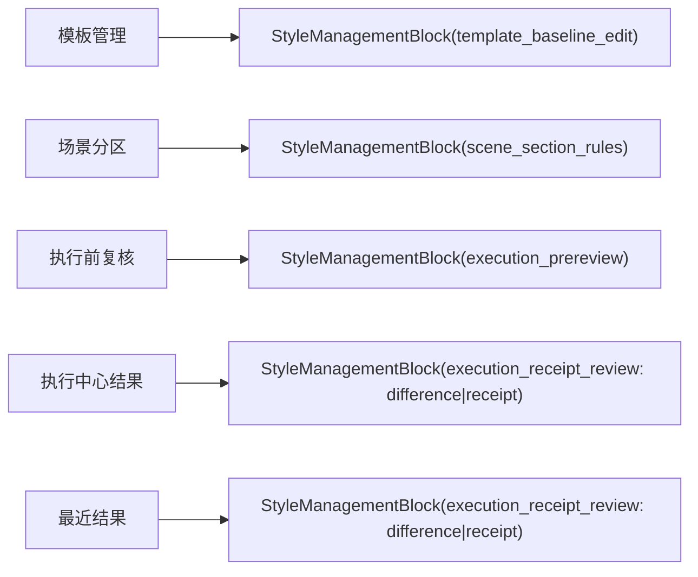

# 最近结果样式复核 Block 统一化执行记录

日期：2026-06-29

## 本轮目标

上一轮已经把 Workbench 执行后的差异摘要接入了：

- `ExecutionResultState.style_difference_summary`
- `RecentRunState.style_difference_summary`
- `ExecutionCenter` 的 `StyleManagementBlock(difference|receipt)`
- `RecentRunPanel` 的 `StyleDifferenceSummarySlot`

但还剩一个结构问题：最近结果面板只是把 `StyleDifferenceSummarySlot` 和 `StyleReceiptSlotFrame` 直接挂在 `Card` 内容里，并没有像执行中心一样通过完整的 `StyleManagementBlock` 承载。

这意味着从用户视角看起来已经有了“差异”和“回执”，但从产品结构和测试契约看，最近结果仍然不是模板管理同构链路的一部分。

## 问题判断

### 1. 散挂 slot 会让边界继续模糊

旧结构：

```text
RecentRunPanel(Card)
├── status
├── summary
├── StyleDifferenceSummarySlot
├── StyleReceiptSlotFrame
├── meta
└── artifacts
```

这个结构的问题不是功能缺失，而是语义边界弱：

- `difference` 和 `receipt` 没有共同的样式复核容器。
- 测试只能验证两个 slot 存在，不能验证“最近结果的样式区域也是同一种内容计划”。
- 后续如果继续加样式来源、预览或多分区明细，会自然变成更多散落控件。

### 2. 直接把 block 塞进 Card 会产生嵌套卡片

最省事的方式是保持 `RecentRunPanel(Card)`，再往里面放一个 `StyleManagementBlock`。

但 `StyleManagementBlock` 内部已经使用 `DetailSummaryCard`。如果继续这么做，会变成：

```text
Card
└── StyleManagementBlock
    └── DetailSummaryCard
```

这和当前 UI 约束冲突，也会让视觉层级变重。

### 3. 最近结果应是工作台面板，不必本身也是 Card

最近结果需要承载：

- 最近状态
- 执行摘要
- 样式复核
- 产物元信息
- 产物清单

它更像 Workbench 内的一个结果面板，而不是一个可复用 Card 原语。因此本轮把 `RecentRunPanel` 从 `Card` 子类改为普通 `QWidget`，内部再用完整的 `StyleManagementBlock` 承载样式复核。

## 本轮实现

### 1. RecentRunPanel 改为普通 QWidget 面板

文件：`src/ui/panels/workbench/recent_run_panel.py`

旧：

```python
class RecentRunPanel(Card):
    def __init__(self, parent=None):
        super().__init__("最近结果", parent=parent)
```

新：

```python
class RecentRunPanel(QWidget):
    def __init__(self, parent=None):
        super().__init__(parent)
        self.setObjectName("wb_recent_run")
        self._layout = QVBoxLayout(self)
```

同时补上：

- `_title_label = QLabel("最近结果")`
- `objectName == "wb_recent_run"`
- 本地 `_apply_theme()` 控制标题、状态、摘要、产物行样式

这也修复了一个已有问题：`styles.py` 里存在 `#wb_recent_run` 选择器，但旧类没有设置这个 objectName。

### 2. 样式区域统一为 StyleManagementBlock

新增结构：

```text
RecentRunPanel(QWidget)
├── title
├── status
├── summary
├── StyleManagementBlock(execution_receipt_review)
│   ├── difference
│   └── receipt
├── meta
└── artifacts
```

关键对象：

```python
self._style_review_block = StyleManagementBlock(
    self,
    title="样式回执",
    icon_name="type-outline",
    object_name_prefix="wb_recent_style_review",
    mode="execution_receipt_review",
    difference_slot=self._style_difference_slot,
    receipt_slot=self._style_receipt_slot,
)
```

执行中心和最近结果现在一致：

| 位置 | 容器 | 内容计划 |
| --- | --- | --- |
| `ExecutionCenter` | `StyleManagementBlock` | `difference|receipt` |
| `RecentRunPanel` | `StyleManagementBlock` | `difference|receipt` |

### 3. 显隐逻辑归一

最近结果现在和执行中心采用同样判断：

```python
self._style_review_block.setVisible(
    self._style_receipt_slot.has_receipt()
    or not self._style_difference_slot.isHidden()
)
```

结果：

- 没有差异、没有回执：整块隐藏。
- 只有差异：显示样式复核 block。
- 只有回执：显示样式复核 block。
- 差异和回执都有：同一 block 内上下呈现。

这比把文案拼进摘要更清楚，因为摘要不再承担样式解释职责。

## 测试补强

文件：`tests/test_recent_run_panel.py`

新增/更新断言：

- `panel.objectName() == "wb_recent_run"`
- `_style_review_block` 是 `StyleManagementBlock`
- `_style_review_block.property("style_management_mode") == "execution_receipt_review"`
- `_style_review_block.property("style_management_content_plan") == "difference|receipt"`
- `_style_review_block.difference_slot is _style_difference_slot`
- `_style_review_block.receipt_slot is _style_receipt_slot`
- 无差异无回执时 block 隐藏
- 有差异或有回执时 block 显示

## 验证结果

最近结果专项：

```powershell
python -X utf8 -m pytest tests\test_recent_run_panel.py -q
```

结果：

```text
21 passed
```

共享控件与 Workbench 回归：

```powershell
python -X utf8 -m pytest tests\test_small_widget_architecture.py tests\test_workbench_execution_center.py tests\test_recent_run_panel.py tests\test_design_system_refactor.py tests\test_ui_exports.py tests\test_workbench_detail_architecture.py -q
```

结果：

```text
164 passed
```

## 当前链路状态



这一轮之后，最近结果不再是“看起来有差异摘要”，而是真正使用同一个样式管理 block 体系。

## 后续仍需推进

### P0：清理主界面的实现语言

还需要继续把这些内容从用户主路径移出：

- `custom_basic`
- `quick_formatting`
- `Green/L5`
- `template 13 / scene 37 / material 6 / output 17`
- `manual / 提示`

建议规则：

- 主界面只显示用户结论。
- 实现 key、计数、内部策略进入 tooltip、审计详情或调试面板。
- 卡片首行回答“发生了什么”，次行回答“影响什么”，不要暴露配置字段名。

### P1：差异明细展开态

`StyleDifferenceSummarySlot` 目前还是单条比较 strip。多分区差异虽然能聚合，但还不能展开成逐分区明细。

建议下一轮在 `difference` slot 内部增加可选明细：

```text
差异：2 个分区已调整
- 参考文献：行距
- 致谢：字号、中文字体
```

这应该作为 `StyleDifferenceSummarySlot` 的增强，而不是在 Workbench 单独写一套列表。

### P1：执行前与执行后标题统一

现在执行前是“场景与模板”，执行后是“样式回执”。两者语义已经接近，但标题还可以更统一：

- 执行前：`样式复核`
- 执行后：`样式回执`
- 最近结果：`样式回执`

如果后续要进一步减轻理解负担，可以考虑统一成：

- 执行前：`本次将如何套用样式`
- 执行后：`本次实际如何套用样式`

但这需要配合整体文案清理，不建议单点替换。

## 本轮结论

本轮完成了上轮 P0：最近结果的样式区域已经从散挂 slot 升级为完整 `StyleManagementBlock`，并且避免了 Card 内嵌 Card。

现在 Workbench 的样式复核链路已经更清楚：

- 执行前看 `source / scope / difference`
- 执行后看 `difference / receipt`
- 最近结果继续复用 `difference / receipt`

下一步真正影响用户体验的是文案层：把实现语言从主界面清掉，让用户看到“按模板走了没有、哪里改了、是否能交付”。
