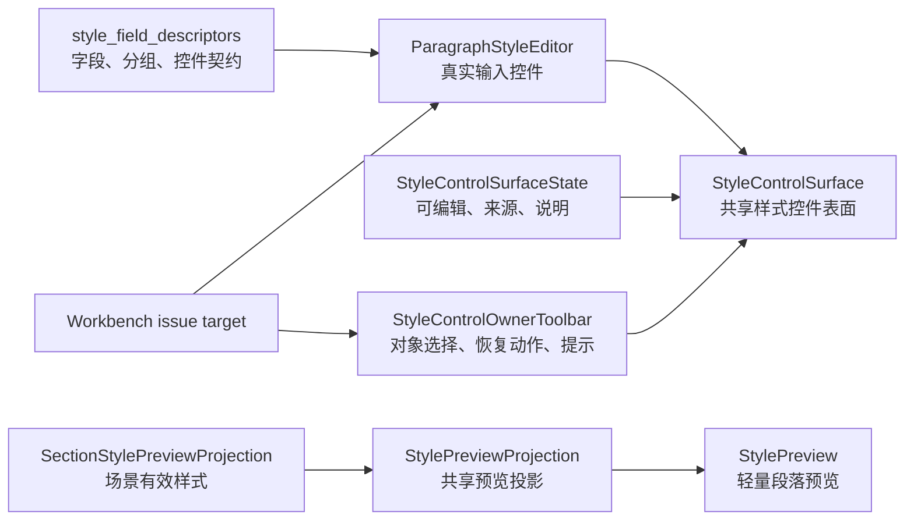

# 样式 Owner 工具条共享化与模板管理一致性执行记录

日期：2026-06-28

## 本轮结论

上一轮已经把“字段描述符 -> 段落样式编辑器 -> 样式控件表面 -> 表面状态 -> 轻量预览投影”串了起来，但场景规划里的样式区域仍有一层没有真正和模板管理同构：样式归属工具条。

这里的“Owner”不是工程概念展示给用户看，而是页面会话的归属关系：当前正在编辑哪个对象、是否跟随模板、能不能恢复到模板、提示文本应该由谁解释。之前这些内容在 `SceneScopeDetail` 里手工拼装，视觉上虽然接近模板管理，但代码和交互语义仍是场景页私有逻辑。结果就是：

- 控件长得像，但归属、状态、动作没有复用。
- “编辑分区 / 恢复模板 / 当前状态提示”散在场景页里，后续模板管理、题注、目录、参考文献独立样式很难共用。
- 用户看见的是一堆解释性文字，而不是清晰的状态和可操作入口。
- 工作台问题跳转能到控件，但外层会话状态没有统一组件承接。

本轮补上的是“样式控件表面的上沿”：新增 `StyleControlOwnerToolbar`，把对象选择、归属动作、提示文本收拢成共享控件，并将场景分区样式覆盖区迁移到这套工具条上。

## 与模板管理的对齐点

模板管理已经形成比较成熟的会话节奏：

1. 先明确当前对象。
2. 再进入成组设置。
3. 用户动作只保留必要命令，例如保存、恢复、跳转。
4. 描述性文字让位给控件状态。
5. 外部问题定位能落到真实控件。

场景样式覆盖区原来只复用了第 2 点：它用了共享段落样式编辑器，也用了共享样式表面，但第 1 点和第 3 点仍是私有实现。也就是说，模板管理是“当前模板 -> 参数分组 -> 动作闭环”，场景页还是“处理范围卡片里嵌一个样式编辑器”。

本轮迁移后，场景页的样式覆盖区更接近模板管理的产品语言：

| 层级 | 模板管理 | 场景样式覆盖当前状态 | 本轮处理 |
| --- | --- | --- | --- |
| 当前对象 | 当前模板 / 当前正文样式 | 当前分区样式 | 由 `StyleControlOwnerToolbar` 承接分区选择 |
| 分组编辑 | 共享表单与编辑器 | `StyleControlSurface` | 已经共享 |
| 状态说明 | summary / dirty / restore | hint 文本散在场景页 | hint 由工具条统一承接 |
| 动作入口 | 恢复、保存、预览 | 恢复模板按钮 | 按钮纳入工具条，复用 button style |
| 字段定位 | 可 focus 到编辑控件 | 可 focus 到分区和字段 | 工具条保留旧属性兼容工作台跳转 |

这不是视觉微调，而是把“谁在被编辑、能执行什么动作、为什么当前可编辑或不可编辑”放进一个复用边界里。

## 本轮实现

### 1. 新增共享 Owner 工具条

文件：`src/shared/ui/style_owner_toolbar.py`

新增：

- `StyleOwnerOption`
  - 表达可选择的样式归属对象，例如正文、参考文献、附录等。
- `StyleControlOwnerToolbar`
  - 内部使用 `StyledComboBox` 承接对象选择。
  - 内部使用 `QPushButton` 承接归属动作，例如“恢复模板”。
  - 内部使用 `hint_label` 承接状态提示。
  - 使用 `template_form_row()` 保持和模板管理表单行一致。
  - 使用 `build_button_stylesheet()` 和 `apply_button_variant()` 保持按钮视觉一致。
  - 暴露 `current_key_changed` 和 `action_requested`，页面只关心业务处理，不再关心控件拼装。

这个组件的边界是“样式表面外层的对象与动作会话”，不是段落字段编辑器。这样它可以被场景页、模板页、未来的题注/目录/参考文献独立样式页复用。

### 2. 场景页迁移到共享工具条

文件：`src/ui/panels/scene_panel.py`

`_build_section_style_editor()` 不再手工创建分区下拉、恢复模板按钮、提示文本，而是创建：

```python
self._style_owner_toolbar = StyleControlOwnerToolbar(...)
```

并连接：

- `current_key_changed -> _on_editor_variant_changed`
- `action_requested -> _on_restore_selected_style_to_template`

同时保留兼容属性：

- `_style_variant_combo = self._style_owner_toolbar.selector`
- `_restore_section_style_btn = self._style_owner_toolbar.action_button`
- `_style_editor_hint = self._style_owner_toolbar.hint_label`

保留这些属性是必要的，因为工作台问题跳转、既有测试和部分 UI 同步逻辑仍依赖它们。迁移没有打断现有链路，而是先把真实控件归属换到共享组件上。

### 3. 同步逻辑迁移

场景页原来的同步逻辑分散操作下拉框、按钮、提示文本。本轮改成通过工具条 API：

- `_set_style_editor_variant()` 调用 `set_current_key()`
- `_selected_style_variant()` 调用 `current_key()`
- `_sync_style_editor()` 调用 `set_action_enabled()` 和 `set_hint()`
- `_apply_theme()` 调用 `apply_theme()`

这让页面同步逻辑更像“更新一段状态”，而不是逐个操作散落控件。

## 当前链路

现在样式覆盖区的链路已经变成：



这条链路已经覆盖：

- 字段如何命名。
- 控件如何生成。
- 控件如何分组。
- 当前样式来自模板还是场景覆盖。
- 当前分区如何选择。
- 恢复模板动作如何暴露。
- 预览如何消费有效样式。
- 外部问题如何定位到分区或字段。

因此，当前状态已经从“场景页仿照模板页做了一套相似 UI”推进到“场景页开始消费模板管理同类的共享控件模型”。

## 可读性分析

用户觉得“不说人话”的根本原因不是某一句文案写得差，而是页面在展示内部契约：

- 让用户读 `template / scene / material / output` 这类统计。
- 让用户读 `quick_formatting`、`green_l5` 这类工程标记。
- 让用户读“契约”“Schema”“projection”一类非任务语言。
- 让用户在“处理范围”和“样式覆盖”之间自己判断边界。

这一轮没有把所有文案都重写，但通过工具条把其中一类高频文本收口了。后续优化应该遵循这个原则：

| 应删除或下沉 | 应保留给用户 |
| --- | --- |
| 内部字段路径 | 分区名称、当前状态、可执行动作 |
| 工程成熟度标记 | 是否跟随模板、是否本场景覆盖 |
| 长段契约解释 | 简短状态提示 |
| 重复说明文字 | 控件禁用、按钮状态、预览差异 |
| `schema`、`projection` 等实现词 | 资料结构、样式预览、恢复模板等任务词 |

优秀设计不是把解释写得更长，而是让解释变少。控件状态、分区选择、恢复按钮、预览差异应该替代大部分说明文字。

## 边界判断

本轮更清晰地区分了三类边界：

### 1. Owner 工具条不负责字段编辑

`StyleControlOwnerToolbar` 只管“当前编辑谁”和“当前对象的归属动作”。它不应该知道字体、字号、行距、缩进，也不应该读取具体 `StyleConfig`。

字段编辑继续由 `StyleControlSurface` 和 `ParagraphStyleEditor` 负责。

### 2. Owner 工具条不负责业务持久化

工具条只发出 `action_requested`。是否恢复模板、是否清空场景覆盖、是否写入工作区，仍由场景或模板业务层处理。

这样可以保证未来模板页也能用同一个工具条，但动作可以是“恢复默认”“保存为模板”“应用到全部分区”等。

### 3. hint 是状态，不是文档

工具条里的 hint 只应该呈现当前状态，例如：

- 跟随模板
- 本场景已覆盖
- 已恢复模板
- 当前分区未启用覆盖

它不应该承载长篇说明、内部路径、规则解释。更复杂的原因应进入 tooltip、诊断详情或文档，而不是主界面。

## 测试补强

### 小组件测试

文件：`tests/test_small_widget_architecture.py`

新增 `test_style_control_owner_toolbar_manages_selection_hint_and_action`，覆盖：

- 工具条可以设置多个 `StyleOwnerOption`。
- `current_key()` 返回当前业务 key。
- `set_current_key()` 可以通过业务 key 选择分区。
- 选择变化会发出 `current_key_changed`。
- action 按钮会发出 `action_requested`。
- `set_hint()` 和 `set_action_enabled()` 生效。

### 场景架构测试

文件：`tests/test_scene_panel_architecture.py`

补充检查：

- 场景页显式使用 `StyleControlOwnerToolbar`。
- 场景页显式使用 `StyleOwnerOption`。
- 工具条内部使用 `template_form_row()`、`StyledComboBox`、`QPushButton`。

这类测试不只是防止导入丢失，更重要的是防止未来又把场景页改回手工拼装控件。

## 验证记录

已执行聚焦验证：

```powershell
python -m pytest tests/test_small_widget_architecture.py::test_style_control_owner_toolbar_manages_selection_hint_and_action tests/test_scene_panel_architecture.py::test_scene_panel_controls_follow_template_management_contract tests/test_scene_panel_architecture.py::test_scene_panel_scope_style_override_editor_writes_section_styles -q
```

结果：

```text
3 passed in 9.03s
```

已执行相邻回归：

```powershell
python -m pytest tests/test_small_widget_architecture.py tests/test_style_variant_semantics.py tests/test_style_field_descriptors.py tests/test_field_display_names.py tests/test_paragraph_style_editor.py tests/test_template_style_detail.py tests/test_scene_panel_architecture.py tests/test_workbench_issue_navigation.py tests/test_control_contract_registry.py -q
```

结果：

```text
108 passed in 68.22s
```

## 仍未完成的优秀设计条件

这轮只补上了 Owner 工具条，距离优秀设计仍有几个明确缺口：

1. 模板页还没有消费 `StyleControlOwnerToolbar`。当前是场景页先接入，模板页仍通过自身 summary/action 区表达当前对象。
2. 场景页的“场景身份 / 处理范围 / 样式覆盖 / 运行能力 / 资料交付”还没有完全重排成清晰的功能域。
3. 部分卡片仍暴露工程统计或内部成熟度标记，应该继续转成任务语言或下沉到诊断详情。
4. `StylePreviewProjection.from_object()` 仍是兼容适配层，domain 层还没有直接产出共享 UI projection。
5. 截图级验收还没有补，无法确认窄屏、桌面宽屏下和模板管理页面是否真正达到视觉节奏一致。
6. hint 文案还没有进入统一 copy registry，未来仍可能在不同页面写出不同语气。

## 下一轮建议

下一轮不应该继续堆说明文字，而应该继续抽共享边界：

1. 抽 `StyleOwnerAdapter`：统一模板正文样式和场景分区样式的 base/effective/override/restore 语义。
2. 抽 `StyleSettingsHeader` 或复用 `TemplateSummaryCard`：统一当前对象、状态、主动作区。
3. 将场景页拆成更清晰的功能域：场景身份、处理范围、样式覆盖、运行能力、资料与交付。
4. 把当前 hint 文案改为短状态词，把长解释挪到 tooltip 或诊断详情。
5. 让模板页也消费共享 Owner/Surface/Preview 链路，完成双向验证。
6. 做截图级对比验收，检查场景样式覆盖区和模板正文排版区的间距、行高、禁用态、按钮节奏是否一致。

## 当前判断

现在的改动是一次“上沿控件复用”而不是单纯视觉修补。它把场景样式覆盖区最容易散掉的三件事：分区选择、恢复模板、状态提示，放进了共享组件。

这会让后续优化更有抓手：继续删冗余文本、继续把状态放回控件、继续让场景页和模板管理页消费同一套样式会话模型。真正的目标不是让场景页看起来像模板页，而是让两者在控件、状态、动作和预览的心智上成为同一类页面。
