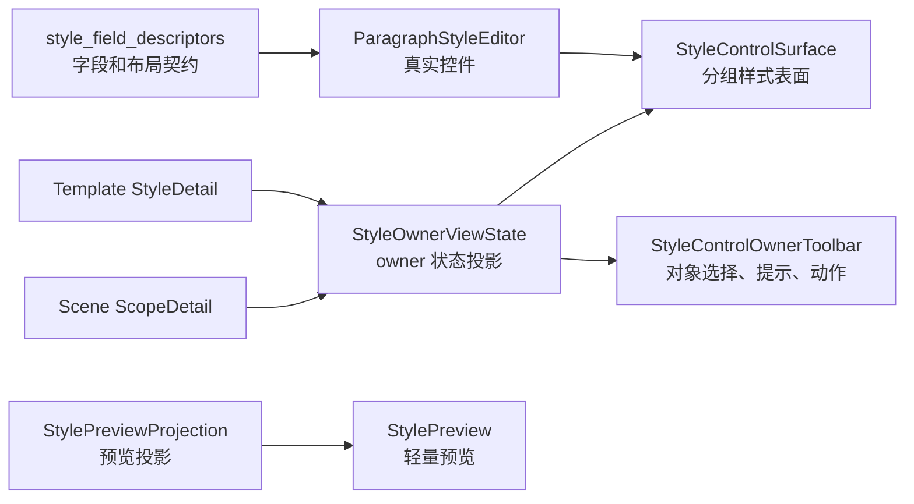

# 样式 Owner 状态投影共享化执行记录

日期：2026-06-28

## 本轮结论

上一轮已经把场景样式覆盖区的“编辑分区 / 恢复模板 / 状态提示”收进 `StyleControlOwnerToolbar`，但模板管理和场景规划之间还剩一个更隐蔽的不一致：两边仍然各自在页面里手工拼 `StyleControlSurfaceState`。

这会导致一个问题：控件已经共享了，但“当前对象是谁、来源是什么、是否可编辑、不可编辑原因是什么、动作是否可用”仍然不是同一套投影。换句话说，页面看起来开始统一，状态语言还没有真正统一。

本轮新增 `StyleOwnerViewState`，把模板正文和场景分区样式的 UI 状态统一投影成同一类对象，再由页面消费。这样模板管理和场景规划不再各自手写 `owner_kind / active_label / source_label / readonly_reason / action_enabled`。

## 本轮实现

### 1. 新增共享状态投影

文件：`src/shared/ui/style_owner_state.py`

新增：

- `StyleOwnerViewState`
  - `surface_state`: 供 `StyleControlSurface.apply_state()` 消费。
  - `hint`: 供 `StyleControlOwnerToolbar` 或其它状态提示位消费。
  - `action_enabled`: 供恢复、保存、应用等 owner action 消费。

新增函数：

- `template_body_style_owner_state(style)`
  - `style is None` 时返回“未选择模板”的只读状态。
  - `style` 存在时返回“正文排版 / 模板默认样式 / 可编辑”的状态。
- `scene_section_style_owner_state(...)`
  - 从场景分区 projection 读取 `label / status_value / status_detail / editor_hint / editable / overridden`。
  - 统一生成 `scene_section_style` 的表面状态。
  - 同时生成工具条 hint 和 action enabled。
  - 在没有 projection 时，提供清晰 fallback：暂无分区、未启用处理范围、跟随模板、正在编辑独立样式。

### 2. 模板正文详情迁移

文件：`src/ui/panels/template_style_detail.py`

原来模板正文页直接构造：

```python
StyleControlSurfaceState(
    owner_kind="template_body_style",
    active_label="正文排版",
    source_label="模板默认样式",
    ...
)
```

现在改为：

```python
template_body_style_owner_state(style).surface_state
```

空模板状态也改为：

```python
template_body_style_owner_state(None).surface_state
```

模板页仍保留 `TemplateSummaryCard` 的恢复和保存动作；本轮只把样式表面状态统一，避免过早重做模板页顶部动作区。

### 3. 场景分区样式迁移

文件：`src/ui/panels/scene_panel.py`

原来 `_sync_style_editor()` 里同时负责：

- 判断 active label。
- 判断 source label。
- 判断 detail。
- 拼 hint。
- 判断恢复模板按钮可用。
- 构造 `StyleControlSurfaceState`。

现在只保留业务输入：

- 当前分区。
- 当前有效 style。
- section 是否启用。
- override 是否启用。
- 分区 override projection。

再交给：

```python
scene_section_style_owner_state(...)
```

输出后分别应用到：

- `StyleControlSurface.apply_state(owner_state.surface_state)`
- `StyleControlOwnerToolbar.set_action_enabled(owner_state.action_enabled)`
- `StyleControlOwnerToolbar.set_hint(owner_state.hint)`

这让页面逻辑从“拼 UI 状态”退回到“提供业务事实”。

## 当前链路位置

本轮之后，样式复用链路继续向上补了一层：



现在共享链路覆盖：

- 字段命名。
- 控件实例。
- 控件分组。
- 样式表面状态。
- owner 工具条。
- 轻量预览投影。
- 场景字段跳转。

这比“场景页复用一个编辑器”更进一步：模板页和场景页开始使用同一个状态投影语言。

## 一致性收益

### 1. 页面层更薄

模板页和场景页不再直接拼 `StyleControlSurfaceState`。以后如果要改“只读原因”“来源文案”“owner kind property”，入口在 `style_owner_state.py`，不用两边找。

### 2. 状态比文本更可靠

用户不应该靠长说明理解当前状态。共享状态投影让页面可以稳定表达：

- 当前对象：正文排版 / 参考文献 / 附录。
- 当前来源：模板默认样式 / 跟随模板 / 已覆盖 N 项。
- 当前可编辑性：可编辑 / 需要先开启处理范围 / 需要先开启覆盖。
- 当前动作：恢复模板是否可用。

这些状态比堆说明文字更像产品界面，也更接近模板管理的心智。

### 3. 后续可继续下沉文案

当前 `scene_section_style_owner_state()` 只是承接已有 projection 文案，还没有完全重写所有文案。但它已经把入口集中起来，后续可以继续把长句改成短状态，而不是在 `scene_panel.py` 里散改。

## 测试补强

### 1. 新增小组件状态测试

文件：`tests/test_small_widget_architecture.py`

新增 `test_style_owner_view_state_projects_template_and_scene_states`，覆盖：

- 模板正文 style 存在时，状态是 `template_body_style / 正文排版 / 模板默认样式 / 可编辑`。
- 模板为空时，状态是只读且 reason 为“未选择模板”。
- 场景 projection 存在时，状态能带出 active/source/detail/hint/action。
- 场景 fallback 下，跟随模板状态会进入 hint。

### 2. 模板详情架构护栏

文件：`tests/test_template_style_detail.py`

新增断言：

- 模板详情必须使用 `template_body_style_owner_state`。
- 模板详情页面层不再直接构造 `StyleControlSurfaceState`。

### 3. 场景详情架构护栏

文件：`tests/test_scene_panel_architecture.py`

新增断言：

- 场景详情必须使用 `scene_section_style_owner_state`。
- 场景详情页面层不再直接构造 `StyleControlSurfaceState`。
- 共享 owner state 模块存在 `StyleOwnerViewState`。

## 验证记录

编译通过：

```powershell
python -m compileall src/shared/ui/style_owner_state.py src/ui/panels/template_style_detail.py src/ui/panels/scene_panel.py tests/test_small_widget_architecture.py tests/test_template_style_detail.py tests/test_scene_panel_architecture.py
```

聚焦测试通过：

```powershell
python -m pytest tests/test_small_widget_architecture.py::test_style_owner_view_state_projects_template_and_scene_states tests/test_template_style_detail.py::test_style_detail_syncs_widget_values_from_template tests/test_template_style_detail.py::test_style_detail_reuses_shared_controls tests/test_scene_panel_architecture.py::test_scene_panel_controls_follow_template_management_contract tests/test_scene_panel_architecture.py::test_scene_panel_scope_style_override_editor_writes_section_styles -q
```

结果：

```text
5 passed in 12.32s
```

相邻回归通过：

```powershell
python -m pytest tests/test_small_widget_architecture.py tests/test_style_variant_semantics.py tests/test_style_field_descriptors.py tests/test_field_display_names.py tests/test_paragraph_style_editor.py tests/test_template_style_detail.py tests/test_scene_panel_architecture.py tests/test_workbench_issue_navigation.py tests/test_control_contract_registry.py -q
```

结果：

```text
109 passed in 206.33s
```

## 仍然不够优秀的地方

这轮是状态投影共享化，不是完整体验重构。仍然缺：

1. 模板页还没有使用 `StyleControlOwnerToolbar`，它仍由 `TemplateSummaryCard` 管理恢复和保存动作。
2. `scene_section_style_owner_state()` 仍消费 `SectionStyleOverrideProjection` 的既有文案，部分句子还偏长。
3. 场景页的“处理范围”和“样式覆盖”仍在同一个 `_ScopeDetail` 内，功能边界还可以更清晰。
4. 场景页 summary 中仍有一些解释性 detail，可以继续压缩成状态词和动作。
5. 还没有截图级验证模板正文页和场景样式覆盖区的视觉节奏是否一致。

## 下一轮建议

下一步建议继续推进三件事：

1. 抽 `StyleOwnerAdapter` 或 domain owner projection，让模板 body、场景 section、未来参考文献/题注/目录局部样式都用同一套 base/effective/override/restore 语义。
2. 让模板详情也试点消费 `StyleControlOwnerToolbar` 或抽更高一层 `StyleSettingsHeader`，验证“当前对象 + 动作 + 状态”能否在模板和场景双向复用。
3. 对 `SectionStyleOverrideProjection` 做文案瘦身，把“输出使用模板中的有效样式；开启覆盖后只影响当前场景”这类解释句，改成更短的用户语言，例如“跟随模板”“仅本场景生效”“恢复后继续跟随模板”。

## 当前判断

现在样式链路已经从“共享控件”继续推进到“共享状态”。这一步很关键，因为优秀设计不只是控件一致，还要状态一致、动作一致、解释方式一致。

本轮之后，模板管理和场景规划在样式区的共同骨架更清楚了：字段由描述符定义，控件由编辑器提供，表面由 surface 组织，owner 状态由 `StyleOwnerViewState` 投影，工具条和预览分别消费这份状态。后续优化就可以更专注地删冗余文字、重排功能边界，而不是继续在页面里修修补补。
