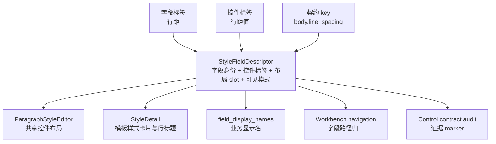

# 样式字段布局描述符与普通诊断边界执行记录

日期：2026-06-28

## 本轮目标

上一轮已经把段落样式字段的“身份”集中到 `style_field_descriptors`，包括字段别名、控件属性、模板路径、场景路径和控件契约 key。本轮继续往下推进：让描述符不仅回答“这个字段是谁”，还开始回答“这个字段在界面里怎么组织”。

这一步是为了补齐一个更深的设计边界：模板管理和场景规划不能只共用控件，还要共用布局语义。否则页面看起来相似，但实际仍会各自维护行标题、板块名、组合控件和诊断信息。

## 发现的问题

当前已有的复用程度：

- `ParagraphStyleEditor` 复用了实际控件。
- `StyleDetail` 复用了 `ParagraphStyleEditor` 的控件实例。
- 工作台导航和字段显示名已经开始依赖 `style_field_descriptors`。

但仍存在三个分叉：

1. 控件行标题分散
   - `line_spacing_pt` 的字段显示名是“行距”，但在编辑器行里应该显示“行距值”。
   - 之前“行距值”仍硬编码在共享控件和模板详情里。

2. 样式板块分散
   - 模板详情里硬写“文字样式 / 对齐与缩进 / 行距与段距”。
   - 描述符只知道字段属于 `text / alignment_indent / spacing`，不知道这些组在 UI 中怎么呈现。

3. 普通模式与诊断模式还没有字段级边界
   - 字段路径、contract id、raw key 需要保留给诊断。
   - 普通模式应主要展示业务标签和控件行标题。
   - 描述符里原来没有这类可见性信息。

## 本轮实现

### 1. 描述符增加布局与模式字段

`StyleFieldDescriptor` 新增：

- `control_label`：控件行标题，例如 `line_spacing_pt -> 行距值`
- `group_label`：板块名称，例如 `spacing -> 行距与段距`
- `group_icon`：板块图标，例如 `spacing -> sliders-horizontal`
- `layout_slot`：字段在板块里的位置，例如 `spacing.primary.2`
- `visible_in_standard_mode`
- `visible_in_diagnostic_mode`

这让描述符开始成为样式 UI 的布局语义来源，而不只是路径规范表。

### 2. 新增板块描述符

新增 `StyleFieldGroupDescriptor`：

- `text -> 文字样式 / whole-word`
- `alignment_indent -> 对齐与缩进 / layers`
- `spacing -> 行距与段距 / sliders-horizontal`

模板详情卡片标题开始消费这个描述符，而不是在页面里硬写标题和图标。

### 3. 区分字段标签和控件标签

新增 `style_field_control_label()`。

这解决了一个很典型的样式控件问题：

- 字段显示名：`line_spacing_pt -> 行距`
- 控件行标题：`line_spacing_pt -> 行距值`
- 契约归属：`line_spacing_pt -> body.line_spacing`

也就是说，同一个底层字段在不同语境下需要不同标签。以前这些差异散落在页面里，现在归到描述符层。

### 4. 模板详情和共享控件消费控件标签

已接入：

- `ParagraphStyleEditor`
- `StyleDetail`

现在 “行距值” 不再由页面硬编码，而是来自 `style_field_control_label("line_spacing_pt")`。

字号等字段也开始通过控件标签入口读取，为后续统一控件行标题留好入口。

### 5. 控件契约审计 marker 同步更新

描述符化后，源码里不再硬写某些中文 label。控件契约审计原来检查 `"行距值"` 或 `style_field_label("size_pt")`，因此出现误报。

本轮把 marker 改为：

- `style_field_control_label("size_pt")`
- `style_field_control_label("line_spacing_pt")`

这让审计验证的是“UI 消费了统一控件标签入口”，而不是验证“源码里有某个固定中文字符串”。

## 当前边界



关键设计约定：

| 语境 | 示例 | 来源 |
| --- | --- | --- |
| 字段业务名 | 行距 | `style_field_label()` |
| 控件行标题 | 行距值 | `style_field_control_label()` |
| 布局板块 | 行距与段距 | `style_field_group_descriptor()` |
| 页面路径 | `template.styles.body.line_spacing_pt` | `template_style_field_path()` |
| 场景路径 | `scene.section_styles.*.line_spacing_pt` | `scene_style_field_path()` |
| 契约归属 | `body.line_spacing` | `control_contract_key` |

## 为什么这一步必要

如果不区分字段标签和控件标签，UI 会在两个方向上变糟：

- 全部用字段标签：控件行会出现“行距 / 行距”，用户不知道哪个是类型、哪个是值。
- 全部用控件标签：工作台问题和证据会变啰嗦，例如“正文行距值”不如“正文行距”自然。

现在的设计允许同一个字段在不同语境里使用不同投影，同时仍由同一个描述符管理。

## 仍然未完成

这轮只是把布局语义放进描述符，页面布局还没有完全由描述符生成。

后续还需要继续做：

1. 把 `layout_slot` 真正用于生成模板样式详情和场景样式编辑器的行列结构。
2. 把 `visible_in_standard_mode` / `visible_in_diagnostic_mode` 接入工作台详情和场景高级证据。
3. 给复合控件增加更明确的 descriptor，例如“字形 = bold + italic”，“行距 = type + value”。
4. 让控件契约 registry 进一步复用 descriptor，而不是只复用 marker。

## 测试记录

编译通过：

```bash
python -m compileall src/config/style_field_descriptors.py src/shared/ui/paragraph_style_editor.py src/ui/panels/template_style_detail.py tests/test_style_field_descriptors.py
```

聚焦测试通过：

```bash
python -m pytest tests/test_style_field_descriptors.py tests/test_template_style_detail.py::test_style_detail_syncs_widget_values_from_template tests/test_template_style_detail.py::test_style_detail_field_labels_follow_column_alignment tests/test_template_style_detail.py::test_style_detail_text_to_control_gap_stays_compact -q
```

结果：`6 passed`

控件契约 marker 修复验证：

```bash
python -m pytest tests/test_control_contract_registry.py::test_control_contract_registry_covers_v16_required_style_controls tests/test_scene_panel_architecture.py::test_scene_overview_summary_projects_control_contract_registry -q
```

结果：`2 passed`

相邻回归通过：

```bash
python -m pytest tests/test_style_field_descriptors.py tests/test_field_display_names.py tests/test_template_style_detail.py tests/test_template_panel_architecture.py tests/test_scene_panel_architecture.py tests/test_workbench_issue_navigation.py tests/test_control_contract_registry.py -q
```

结果：`100 passed`

## 下一步建议

下一轮建议继续把描述符从“记录布局语义”推进到“驱动布局生成”：

- 先让 `StyleDetail` 根据 `layout_slot` 生成三个板块内的行列。
- 再让 `ParagraphStyleEditor` 的默认布局走同一套 slot。
- 最后把场景样式覆盖的编辑器提示、预览摘要和问题定位也接入 `layout_slot` 与 mode visibility。

这样模板管理和场景规划才会从“控件一致”继续走向“信息架构一致”。
