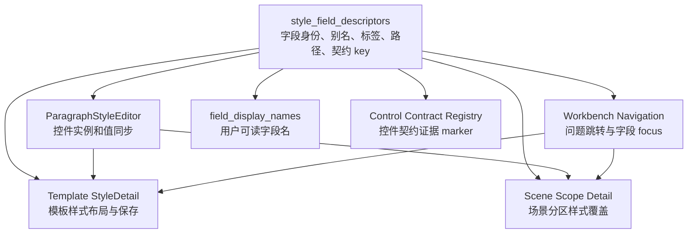

# 样式字段描述符与模板场景控件复用执行记录

日期：2026-06-28

## 本轮结论

上一轮已经把工作台问题队列的字段显示名做了归一，但继续检查后发现：模板管理与场景规划之间虽然已经共用了 `ParagraphStyleEditor`，仍然没有真正做到“样式、控件、跳转、审计”高度复用。

根因是共用只停在 widget 层：

- `ParagraphStyleEditor` 提供了同一批控件。
- 模板样式详情仍自己写一套行标题。
- 场景样式跳转、工作台问题导航、字段显示名仍各自解释字段路径。
- 控件契约审计还依赖源码中的硬编码中文 label 作为证据 marker。

因此，之前的状态是“控件看起来复用，但字段身份没有复用”。这会导致后续只要改一个字段名、别名或路径，就可能出现模板页能定位、场景页不能定位，或工作台审计误报的问题。

## 本轮已执行

### 1. 新增样式字段描述符

新增文件：

- `src/config/style_field_descriptors.py`

它集中定义段落样式字段的纯数据契约：

- 字段别名：如 `font_name -> font_cn`、`line_spacing_value -> line_spacing_pt`
- 控件属性：如 `font_cn -> _font_cn`
- 用户标签：如 `font_cn -> 中文字体`
- 字段分组：text / alignment_indent / spacing
- 模板路径：如 `template.styles.body.font_cn`
- 场景编辑路径：如 `section_style.font_cn`
- 控件契约 key：如 `line_spacing_type` 与 `line_spacing_pt` 都归到 `body.line_spacing`

这一步把字段身份从共享控件类里抽出来，变成模板、场景、工作台都能依赖的更底层配置。

### 2. 共享控件改为消费描述符

`ParagraphStyleEditor` 不再自己维护字段 alias 与 widget attr 表，而是从 `style_field_descriptors` 读取。

影响：

- `widget_for_field()` 仍保持原能力。
- 老的导出名仍兼容。
- 控件内部布局的标签开始从描述符读取。

这让控件实现只负责“控件怎么渲染和同步值”，不再独占“字段叫什么、字段怎么归一”的规则。

### 3. 模板样式详情接入同一标签入口

`StyleDetail` 是模板管理中的自定义布局，之前直接写：

- 中文字体
- 英文字体
- 字号
- 对齐
- 特殊缩进
- 左缩进
- 右缩进
- 行距类型
- 段前
- 段后

本轮改为通过 `style_field_label()` 获取。这样模板管理的自定义排布仍保留，但字段命名不再脱离共享描述符。

### 4. 工作台导航改为依赖配置描述符

`workbench_issue_navigation.py` 原来从 `src.shared.ui.paragraph_style_editor` 导入 `canonical_paragraph_style_field_id()`。

本轮改为从 `src.config.style_field_descriptors` 导入。

这一步很关键：工作台导航是纯映射层，不应该依赖某个 widget 模块来解释字段。现在它依赖的是字段契约，而不是控件实现。

### 5. 字段显示名移除重复样式 label 表

`field_display_names.py` 原来自己维护一份 `STYLE_FIELD_LABELS`，与共享控件里的 alias 表并列存在。

本轮改为调用 `style_field_label()`：

- 场景路径显示名继续可读。
- 模板路径显示名继续可读。
- `line_spacing_type/value/pt` 在审计展示中仍统一显示为“行距”，避免普通文案啰嗦。

### 6. 控件契约证据 marker 更新

抽取描述符后，`ParagraphStyleEditor` 源码里不再硬写 `"中文字体"` 等 label。控件契约审计原来用这些硬编码中文作为 marker，因此出现误报。

本轮把证据 marker 更新为：

- `style_field_label("font_cn")`
- `style_field_label("special_indent")`
- `style_field_label("line_spacing_type")`
- 等

这比把中文重新硬塞回源码更合理，因为审计现在验证的是“控件确实消费共享描述符”，而不是验证“源码里有一段固定中文”。

## 现在的分层边界



新的职责边界：

| 层级 | 负责什么 | 不再负责什么 |
| --- | --- | --- |
| `style_field_descriptors` | 字段身份、别名、显示标签、路径、契约 key | 不渲染控件 |
| `ParagraphStyleEditor` | 控件实例、值同步、控件查找 | 不独占字段路径规则 |
| 模板样式详情 | 模板页布局、保存、预览刷新 | 不维护独立字段标签表 |
| 场景样式详情 | 分区覆盖、当前场景 override | 不重新定义样式字段身份 |
| 工作台导航 | repair target 到页面/控件 focus | 不从 widget 模块借字段规范 |
| 控件契约登记 | 审计控件存在、证据和归属 | 不用硬编码中文 label 作为唯一证据 |

## 为什么这比只改 UI 文案更重要

如果只把页面上的文案改成人话，用户会短期觉得更清楚，但系统内部仍然可能分叉：

- 模板叫“中文字体”，场景路径叫 `font_name`，工作台导航只认识 `font_cn`。
- 行距控件由两个字段组成，但审计可能把 `line_spacing_type` 和 `line_spacing_pt` 当两个独立控件。
- 模板详情改了标签，场景页 tooltip 没同步。
- 工作台问题能定位模板页，却不能定位场景页同一个控件。

本轮把这些问题收敛到描述符层，后续要新增或调整一个样式字段时，优先改一处描述符，而不是在模板页、场景页、字段显示名、工作台导航、控件契约里到处找。

## 仍然未完成的深层问题

这轮完成的是“段落样式字段身份”的统一，还没有把所有功能规划都优化到优秀设计。

### 1. 描述符还没有完全驱动布局生成

目前模板样式详情仍保留自定义布局，只是标签来自描述符。下一步可以把描述符扩展出更完整的布局信息：

- 所属分区
- 推荐行列位置
- 是否成对出现
- 是否是复合控件
- 是否普通模式可见
- 是否诊断模式可见

这样模板样式与场景样式可以在更高层复用布局规划，而不是只复用控件。

### 2. 控件契约登记还没有完全由描述符生成

现在 `control_contract_registry` 仍是手写登记，只是证据 marker 指向了描述符调用。下一步可以让描述符成为契约登记的一部分来源：

- descriptor 定义字段与控件身份。
- registry 补充高风险规则、证据文件、成对约束、禁用状态。

这样可以减少契约 id、路径和 label 的重复维护。

### 3. 普通模式与诊断模式还需要明确分离

描述符现在已经能提供“用户标签”和“原始路径”，但 UI 还没有统一模式：

- 普通模式：只显示用户标签、影响范围、动作。
- 诊断模式：显示 raw key、contract id、evidence file、registry source。

工作台问题详情、场景高级证据、模板跳转 tooltip 后续都应该按这个模式收敛。

### 4. 样式预览与控件状态仍需进一步统一

模板管理的预览已经比较成熟，场景规划中的样式覆盖预览仍更偏“局部 override 视角”。后续应继续对齐：

- 同一字段描述符驱动预览变更摘要。
- 同一字段描述符驱动 dirty state。
- 同一字段描述符驱动返回条与问题定位说明。

## 测试记录

已通过编译：

```bash
python -m compileall src/config/style_field_descriptors.py src/config/control_contract_registry.py src/shared/ui/paragraph_style_editor.py src/ui/panels/template_style_detail.py src/ui/adapters/field_display_names.py src/ui/adapters/workbench_issue_navigation.py tests/test_style_field_descriptors.py tests/test_field_display_names.py tests/test_template_style_detail.py tests/test_workbench_issue_navigation.py
```

已通过聚焦测试：

```bash
python -m pytest tests/test_style_field_descriptors.py tests/test_field_display_names.py tests/test_workbench_issue_navigation.py::test_workbench_scene_field_focus_projection_normalizes_reusable_controls tests/test_workbench_issue_navigation.py::test_workbench_template_field_focus_projection_normalizes_reusable_controls -q
```

结果：`8 passed`

控件契约修复后通过：

```bash
python -m pytest tests/test_style_field_descriptors.py tests/test_control_contract_registry.py tests/test_scene_panel_architecture.py::test_scene_overview_summary_projects_control_contract_registry tests/test_quick_execution_detail_architecture.py::test_quick_execution_detail_exposes_material_readiness_issue_queue -q
```

结果：`11 passed`

相邻回归通过：

```bash
python -m pytest tests/test_style_field_descriptors.py tests/test_field_display_names.py tests/test_template_style_detail.py tests/test_template_panel_architecture.py tests/test_scene_panel_architecture.py tests/test_workbench_issue_navigation.py tests/test_workbench_execution_center.py tests/test_quick_execution_detail_architecture.py tests/test_control_contract_registry.py -q
```

结果：`217 passed`

## 下一步建议

下一轮建议继续从“描述符只管字段身份”推进到“描述符参与功能板块规划”：

1. 给描述符增加 layout group 和 mode visibility。
2. 梳理模板样式详情与场景样式覆盖的板块是否能由同一组 layout group 驱动。
3. 把普通模式/诊断模式的显示规则从页面代码中抽出来。
4. 让工作台问题详情根据 descriptor 自动决定“主文案、详情文案、跳转目标、证据 raw key”。

做到这一步，才算真正从“看起来一致”走向“结构上复用”。
