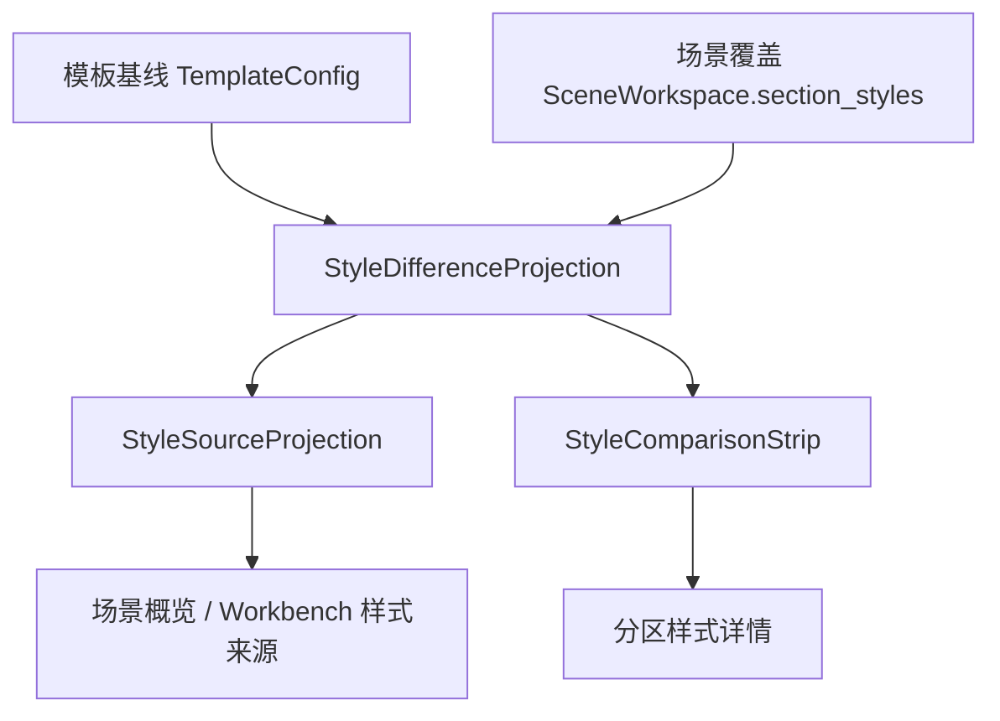

# 样式差异投影独立化与模板场景详情共用执行记录

日期：2026-06-29

## 1. 本轮继续解决的问题

上一轮已经让样式来源行能够显示字段级差异，例如：

```text
分区：1 个分区独立设置：参考文献（行距）
```

但这层能力仍然藏在 `StyleSourceProjection` 的私有 helper 里。这样会留下一个结构性问题：

```text
概览页知道“参考文献（行距）”，
分区详情页知道“不同：行距”，
但两者不是同一个投影对象。
```

这会让后续 Workbench、执行报告、模板管理高级区继续各自拼差异文案。表面看都在说“差异”，实际还是多套口径。

本轮目标是把字段级差异抽成独立产品契约：

```text
StyleDifferenceProjection
```

让概览短标签、详情对照条和 Workbench 执行前复核共享同一份差异语义。

## 2. 新增投影契约

文件：

- `src/ui/panels/style_difference_projection.py`

新增：

```text
StyleDifferenceProjection
build_style_difference_projection(...)
build_scene_style_difference_projections(...)
compact_changed_labels(...)
```

核心字段：

| 字段 | 用途 |
| --- | --- |
| `scope_label` | 分区名称，例如 `参考文献` |
| `overridden` | 当前场景是否有独立样式 |
| `follows_template` | 当前是否跟随模板 |
| `template_available` | 是否拿到了可比较的模板基线 |
| `changed_labels` | 字段级差异，例如 `("行距",)` |
| `compact_label` | 概览短标签，例如 `参考文献（行距）` |
| `detail_label` | 差异短语，例如 `行距` / `与模板一致` / `独立设置` |
| `diff_tag` | 结构化标签，例如 `参考文献：行距` |
| `template_status/current_status/difference_status/detail` | 兼容 `StyleComparisonStrip` 的详情对照语义 |

这里有一个重要设计：同一个投影既服务概览，也服务详情。

```text
概览使用：compact_label / source_line_label / diff_tag
详情使用：template_status / current_status / difference_status / detail
```

这样后续不需要再维护两套差异生成规则。

## 3. 已接入链路

### 3.1 样式来源接入

文件：

- `src/ui/panels/style_source_projection.py`

变更：

- 移除本地私有的 `_SectionStyleSourceItem`
- 移除本地私有的 `_section_style_diff_detail`
- 改为调用 `build_scene_style_difference_projections(..., overridden_only=True)`
- `StyleSourceProjection` 新增 `section_differences`
- `section_diff_labels` 和 `diff_tags` 都来自 `StyleDifferenceProjection.diff_tag`
- `section_status_label` 使用 `StyleDifferenceProjection.source_line_label`

这让样式来源不再自己判断差异。

### 3.2 分区详情接入

文件：

- `src/ui/panels/scene_style_override_service.py`

变更：

- `scene_section_style_comparison_projection(...)` 改为返回 `build_style_difference_projection(...)`
- 现有 `StyleComparisonStrip` 不需要改，因为新投影保留了同名字段：
  - `template_status`
  - `current_status`
  - `difference_status`
  - `detail`

这意味着分区详情页的对照条和概览页已经开始共享同一套差异对象。

### 3.3 测试接入

新增：

- `tests/test_style_difference_projection.py`

覆盖：

- 没有模板对象时保守显示 `独立设置`
- 有模板对象且字段不同，输出 `参考文献（行距）`
- 有独立样式但字段与模板一致，输出 `与模板一致`
- 批量投影可按 `overridden_only=True` 只返回独立分区

更新：

- `tests/test_scene_overview_projection.py`

新增断言：

```text
projection.section_differences[0].changed_labels == ("行距",)
projection.section_differences[0].compact_label == "参考文献（行距）"
```

这避免以后只改字符串、却绕开差异投影本体。

## 4. 链路状态更新

当前已经打通：



这一轮之后，概览和详情不再各说各话：

| 入口 | 使用字段 |
| --- | --- |
| 场景概览样式来源 | `source_line_label` / `diff_tag` |
| Workbench 样式来源 | `source_line_label` / `diff_tag` |
| 分区样式详情对照条 | `current_status` / `difference_status` / `detail` |

## 5. 仍未完全完成的边界

### 5.1 执行报告尚未消费差异投影

执行前复核已经能通过样式来源看到差异，但执行结果报告仍主要走问题队列和诊断路径。后续应把最终有效样式来源写入报告摘要：

```text
本次按模板“默认格式”处理；参考文献使用场景独立样式（行距）。
```

### 5.2 模板管理高级区尚未显示场景覆盖引用

模板管理主层只需要表达“我是基线”，不应展示所有场景覆盖。但高级区可以统计：

```text
当前有 N 个场景存在分区独立样式。
```

这要等场景库引用关系梳理后再做，不适合硬塞进当前样式来源行。

### 5.3 视觉审计仍需真实 Windows 字体确认

Qt offscreen 已经能证明 50px 高度和字段级差异字符串不破坏布局，但中文真实字体、窄窗口断点仍需要桌面截图验证。

## 6. 验证

语法编译：

```powershell
python -X utf8 -m py_compile src/ui/panels/style_difference_projection.py src/ui/panels/style_source_projection.py src/ui/panels/scene_style_override_service.py tests/test_style_difference_projection.py tests/test_scene_overview_projection.py
```

结果：通过。

聚焦回归：

```powershell
python -X utf8 -m pytest tests/test_style_difference_projection.py tests/test_scene_overview_projection.py tests/test_style_variant_semantics.py tests/test_small_widget_architecture.py::test_style_source_compact_row_projects_template_section_and_actions tests/test_small_widget_architecture.py::test_style_comparison_strip_projects_template_current_and_diff tests/test_scene_panel_architecture.py -q
```

结果：

```text
72 passed in 274.74s (0:04:34)
```

## 7. 当前判断

这一轮把“字段级差异”从样式来源行里抽了出来，变成一个独立、可复用的产品投影。现在概览、Workbench 和分区详情已经可以共享同一份差异对象。

下一步最有价值的是把执行结果报告接入 `StyleDifferenceProjection`，让用户在运行完成后也能追溯“本次到底按模板走，还是哪些分区用了场景独立样式”。这会把链路从“配置一致”推进到“配置、执行、报告一致”。
