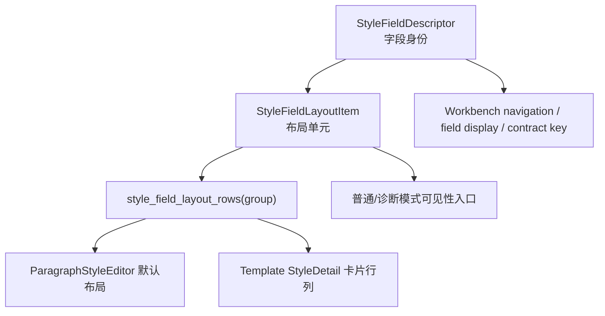

# 样式布局描述符驱动模板详情执行记录

日期：2026-06-28

## 本轮推进点

上一轮已经把样式字段描述符扩展到布局语义，包括 `control_label`、`group_label`、`group_icon`、`layout_slot` 和普通/诊断模式字段。但当时 `layout_slot` 仍主要是“记录信息”，模板样式详情里的行列结构还在页面代码中手写。

本轮把 `layout_slot` 往真正驱动布局推进：新增布局项规划接口，并让模板样式详情与共享默认编辑器都消费同一套布局行。

## 问题复盘

单纯把字段放进描述符还不够，因为 UI 行不总是等于一个字段。

典型例子：

- `bold` 是字段。
- `italic` 是字段。
- 但界面上它们是一个复合控件行：`字形`。

如果只按字段生成布局，就会变成“加粗 / 斜体”两个行项，既不符合模板管理现有交互，也不符合用户理解。优秀的布局复用必须能表达“一个 UI 行由多个字段组成”。

## 本轮实现

### 1. 新增 `StyleFieldLayoutItem`

新增布局项数据结构：

- `item_id`
- `label`
- `field_ids`
- `group`
- `group_label`
- `group_icon`
- `layout_slot`
- `visible_in_standard_mode`
- `visible_in_diagnostic_mode`

它和 `StyleFieldDescriptor` 的区别是：

- `StyleFieldDescriptor` 描述字段身份。
- `StyleFieldLayoutItem` 描述界面中的一个布局单元。

例如：

```text
field: bold
field: italic
layout item: emphasis / 字形 / (bold, italic) / text.secondary.2
```

### 2. 新增布局行接口

新增：

- `style_field_layout_item(item_id)`
- `style_field_layout_rows(group_id)`

当前布局行：

```text
text:
  [中文字体, 字号]
  [英文字体, 字形]

alignment_indent:
  [对齐, 特殊缩进]
  [左缩进, 右缩进]

spacing:
  [行距类型, 行距值]
  [段前, 段后]
```

这些顺序现在来自描述符的 `layout_slot`，而不是页面代码里的局部排列。

### 3. `ParagraphStyleEditor` 默认布局改为消费布局行

共享控件默认布局现在遍历：

```python
style_field_layout_rows(group_id)
```

然后生成 `template_form_row` 和 `template_form_pair_row`。

这让默认编辑器不再手写：

- `font_cn_row`
- `size_row`
- `font_en_row`
- `emphasis_row`
- 等局部变量排列。

### 4. `StyleDetail` 模板详情改为消费布局行

模板详情仍保留自己的卡片结构，但卡片内的行列通过：

```python
self._add_style_layout_grid(group_id, form)
```

统一生成。

这意味着模板管理的自定义排版不丢失，但排版信息来源变成共享描述符。

### 5. 控件契约审计更新为验证布局驱动

由于 `ParagraphStyleEditor` 不再直接调用 `style_field_label("font_cn")` 或 `style_field_control_label("size_pt")`，控件契约审计 marker 同步调整为验证：

- `style_field_layout_rows`
- 对应 widget 映射，如 `"font_cn": self._font_cn`
- 组合控件相关字段，如 `"line_spacing_pt"`

这样审计验证的是“共享编辑器使用描述符布局”，而不是“源码里存在某个旧式手写标签”。

## 当前信息架构状态



现在已经形成两层描述：

| 层 | 示例 | 作用 |
| --- | --- | --- |
| 字段描述 | `line_spacing_pt -> 行距 / body.line_spacing` | 路径、显示名、契约归属 |
| 布局描述 | `line_spacing_pt -> 行距值 / spacing.primary.2` | UI 行标题和位置 |
| 复合布局项 | `emphasis -> bold + italic` | 多字段合成一个控件行 |

## 为什么这一步重要

这一步把模板管理从“看起来复用控件”推进到“由同一套布局规划组织控件”。

如果没有 `StyleFieldLayoutItem`：

- 复合控件会被拆碎。
- 页面还是要知道哪些字段应该同行。
- 模板页和场景页仍会复制“哪两个控件放一起”的规则。
- 工作台问题定位只能知道字段，不能知道它属于哪个 UI 区块。

现在至少模板详情和共享默认编辑器已经开始共用行列规划，后续场景样式覆盖可以继续接入同一套布局行。

## 仍未完成

这轮主要完成了模板样式详情与共享默认编辑器。场景样式覆盖目前使用 `ParagraphStyleEditor` 的默认布局，因此控件行列已经间接受益，但场景页自己的提示、预览摘要、问题定位说明还没有直接消费布局项。

后续建议：

1. 场景样式覆盖面板读取 `StyleFieldLayoutItem.group_label`，用于问题定位提示和摘要。
2. 工作台问题详情使用 layout item 判断普通模式显示“字形”，诊断模式显示 `bold/italic`。
3. 控件契约 registry 进一步由 descriptor 生成基础 style contract，手写部分只保留高风险规则与证据。
4. 为 `visible_in_standard_mode` / `visible_in_diagnostic_mode` 增加实际 UI 消费点。

## 测试记录

编译通过：

```bash
python -m compileall src/config/style_field_descriptors.py src/shared/ui/paragraph_style_editor.py src/ui/panels/template_style_detail.py src/config/control_contract_registry.py tests/test_style_field_descriptors.py tests/test_scene_panel_architecture.py tests/test_template_style_detail.py tests/test_control_contract_registry.py
```

聚焦测试通过：

```bash
python -m pytest tests/test_style_field_descriptors.py tests/test_template_style_detail.py::test_style_detail_syncs_widget_values_from_template tests/test_template_style_detail.py::test_style_detail_field_labels_follow_column_alignment tests/test_scene_panel_architecture.py::test_scene_panel_controls_follow_template_management_contract tests/test_control_contract_registry.py::test_control_contract_registry_covers_v16_required_style_controls -q
```

结果：`8 passed`

相邻回归通过：

```bash
python -m pytest tests/test_style_field_descriptors.py tests/test_field_display_names.py tests/test_template_style_detail.py tests/test_template_panel_architecture.py tests/test_scene_panel_architecture.py tests/test_workbench_issue_navigation.py tests/test_control_contract_registry.py tests/test_workbench_execution_center.py tests/test_quick_execution_detail_architecture.py -q
```

结果：`218 passed`

## 下一步建议

下一轮继续把布局描述符接到“问题定位和普通/诊断模式”：

- 当问题定位到 `bold` 或 `italic` 时，普通模式应显示“字形”，诊断模式显示具体字段。
- 当问题定位到 `line_spacing_pt` 时，普通模式显示“行距值”或“行距”，取决于上下文。
- 工作台详情可以从 layout item 得到 `group_label`，把问题归到“文字样式 / 对齐与缩进 / 行距与段距”。

这会把“控件复用”继续推进到“问题解释也复用同一套信息架构”。
