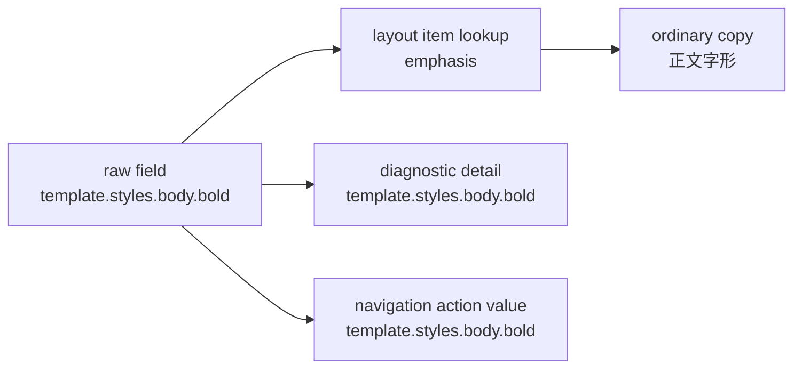

# 样式布局项驱动工作台普通文案执行记录

日期：2026-06-28

## 本轮目标

上一轮已经让 `layout_slot` 真正驱动模板样式详情和共享样式编辑器的行列生成。本轮继续把布局项推进到工作台问题解释：普通用户看到的是控件行/布局项，诊断信息继续保留底层字段 key。

核心例子：

- 底层字段：`bold`
- 底层字段：`italic`
- 普通 UI 控件：`字形`
- 诊断路径：`template.styles.body.bold`

以前普通文案可能显示“正文加粗”或“正文斜体”。这虽然准确，但用户理解成本更高，也和模板管理里的控件行不一致。现在普通文案归并为“正文字形”，raw key 仍保留在详情/证据动作里。

## 本轮实现

### 1. 新增字段到布局项的归并接口

新增：

```python
style_field_layout_item_for_field(field_id)
```

它回答的是：“这个底层字段在 UI 普通模式中属于哪个布局项？”

示例：

```text
template.styles.body.bold -> emphasis / 字形
body.italic -> emphasis / 字形
line_spacing_value -> line_spacing_pt / 行距值
```

这和 `style_field_layout_item(item_id)` 不同：

- `style_field_layout_item("emphasis")` 是按布局项 id 查。
- `style_field_layout_item_for_field("bold")` 是按底层字段反查所属布局项。

### 2. 字段显示名开始使用布局项标签

`field_display_names.py` 中的样式字段显示名现在会识别复合布局项。

已调整：

- `template.styles.body.bold -> 正文字形`
- `scene.section_styles.references_body.italic -> 参考文献正文字形`

仍保留原有简化：

- `line_spacing_type/value/pt -> 行距`

原因是行距在普通解释里更适合显示为“行距”，而在控件行里才需要区分“行距类型 / 行距值”。

### 3. 工作台问题文案自然继承布局项显示

工作台问题显示依赖 `workbench_issue_display_text()` 和 `replace_field_keys_with_display_names()`。

因此本轮不需要在工作台 UI 控件里增加特殊判断，普通文案会自动变为：

```text
模板样式不一致：template.styles.body.bold
-> 模板样式不一致：正文字形
```

证据行显示：

```text
参数路径：template.styles.body.bold
-> 参数：正文字形
```

但 action value 保持：

```text
("parameter_path", "navigate_parameter", "template.styles.body.bold")
```

这保证“用户读得懂”和“系统能定位”同时成立。

## 当前普通/诊断边界



当前规则：

| 场景 | 显示 |
| --- | --- |
| 队列标题/普通摘要 | 正文字形 |
| 参数证据行 | 参数：正文字形 |
| 详情含 raw key | 正文字形（template.styles.body.bold） |
| 导航动作值 | `template.styles.body.bold` |

## 为什么这一步重要

用户不应该被迫理解：

- `bold`
- `italic`
- `line_spacing_pt`
- `special_indent_mode`

这些是实现字段，不是用户的任务语言。

真正对用户有意义的是：

- 字形
- 行距
- 特殊缩进
- 中文字体

本轮把“字段解释”继续向模板管理的控件语言靠拢，这比单纯翻译字段名更进一步。

## 已验证的行为

新增/更新测试覆盖：

- `bold/italic` 能归并到 `emphasis / 字形`
- 模板路径 `template.styles.body.bold` 显示为“正文字形”
- 场景路径 `scene.section_styles.references_body.italic` 显示为“参考文献正文字形”
- 句内替换能把 raw key 转成布局项显示
- 工作台证据行显示“参数：正文字形”
- 工作台导航 action value 保持 `template.styles.body.bold`

## 测试记录

编译通过：

```bash
python -m compileall src/config/style_field_descriptors.py src/ui/adapters/field_display_names.py src/ui/adapters/workbench_execution_adapter.py tests/test_style_field_descriptors.py tests/test_field_display_names.py tests/test_workbench_execution_center.py
```

聚焦测试通过：

```bash
python -m pytest tests/test_style_field_descriptors.py tests/test_field_display_names.py tests/test_workbench_execution_center.py::test_workbench_issue_evidence_projection_keeps_ui_semantics_in_adapter -q
```

结果：`8 passed`

相邻回归通过：

```bash
python -m pytest tests/test_style_field_descriptors.py tests/test_field_display_names.py tests/test_workbench_execution_center.py tests/test_quick_execution_detail_architecture.py tests/test_workbench_issue_navigation.py tests/test_template_style_detail.py tests/test_scene_panel_architecture.py tests/test_control_contract_registry.py -q
```

结果：`205 passed`

## 下一步建议

下一轮可以继续把布局项接入工作台问题详情的结构化信息：

1. 问题详情显示所属板块：文字样式 / 对齐与缩进 / 行距与段距。
2. 普通模式显示 layout item，诊断模式展开底层 field ids。
3. 对 `emphasis`、`line_spacing` 这类复合控件，在问题详情里显示“包含字段”而不是让用户猜。
4. 场景样式覆盖的返回条也可以用 layout item label，避免跳转提示里出现过细字段名。
