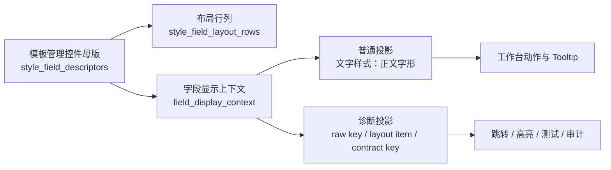

# 样式控件与模板管理双投影复用闭环执行记录

日期：2026-06-28

## 本轮结论

场景页和工作台的问题不是单纯“文案不好听”，而是样式控件还没有完全复用模板管理的信息架构。优秀设计应该让用户始终看见同一套任务语言，同时让系统内部始终保留可跳转、可诊断、可测试的底层身份。

本轮把字段上下文明确拆成两层：

- 普通投影：给用户看的名称，例如“文字样式：正文字形”。
- 诊断投影：给跳转、测试、审计看的身份，例如 `template.styles.body.bold`、`emphasis`、`body.line_spacing`。

这样可以避免两个极端：

- 只显示 raw key：用户读不懂。
- 只显示友好名称：系统后续无法确认它对应模板管理中的哪个控件。

## 现在走到哪一步

已形成一条更清晰的主链路：



当前代码已经做到：

| 链路 | 状态 | 说明 |
| --- | --- | --- |
| 模板详情样式布局 | 已接入 | `template_style_detail.py` 使用 `style_field_layout_rows()` 生成文字、缩进、行距板块 |
| 场景样式编辑器布局 | 已接入 | `paragraph_style_editor.py` 使用同一套布局描述符 |
| 普通字段名 | 已接入 | `bold/italic` 归并为“字形”，不再直接暴露“加粗/斜体” |
| 工作台动作文案 | 已接入 | 显示“去模板页调整文字样式：正文字形” |
| 工作台诊断上下文 | 本轮补齐 | active issue context 现在携带 raw key、layout item、field ids、contract key |
| 控件契约审计 | 已部分接入 | registry 现在检查描述符和布局映射存在性 |

## 本轮发现的核心缺口

### 1. 可读性和一致性以前被混在一起处理

之前 `field_display_name()` 主要负责把 `template.styles.body.bold` 翻译成“正文字形”。这只能解决“读得懂”，不能保证“和模板管理控件完全对齐”。

更好的模型是：

- `field_display_name()`：只负责短名称。
- `field_display_context()`：负责短名称、板块名称、布局项身份、契约身份。
- 页面和工作台不再自己拼 raw key，不再自己猜板块。

### 2. 模板管理应该是样式控件的母版，不只是视觉参考

模板管理里的真实控件结构是：

- 文字样式：中文字体 / 字号 / 英文字体 / 字形
- 对齐与缩进：对齐方式 / 特殊缩进 / 左缩进 / 右缩进
- 行距与段距：行距类型 / 行距值 / 段前 / 段后

场景页和工作台应该复用这套控件语言，而不是重新解释一套“功能卡片”“契约卡片”“字段卡片”。否则用户会在三个页面里看到三种模型。

### 3. 诊断信息需要在数据结构里保留，而不是写进普通文案

截图中的问题卡片仍有“contract / preset / schema / fixed-layout”等偏工程文本。它们不应该直接出现在普通路径中。

建议边界：

| 信息 | 普通 UI | 诊断/高级证据 |
| --- | --- | --- |
| raw key | 不显示 | 显示 |
| layout item id | 不显示 | 显示 |
| control contract key | 不显示 | 显示 |
| 板块名 | 显示 | 可显示 |
| 用户动作 | 显示 | 显示 |

## 本轮实现

### 1. 扩展 FieldDisplayContext 为双投影上下文

文件：`src/ui/adapters/field_display_names.py`

新增上下文字段：

```python
raw_key
layout_item_id
field_ids
control_contract_key
diagnostic_summary()
```

示例：

```text
template.styles.body.bold
普通投影：文字样式：正文字形
诊断投影：template.styles.body.bold / 布局项：emphasis
```

```text
template.styles.body.line_spacing_value
普通投影：行距与段距：正文行距
诊断投影：template.styles.body.line_spacing_value / 布局项：line_spacing_pt / 控件契约：body.line_spacing
```

### 2. 工作台 active issue context 同步样式控件身份

文件：`src/ui/panels/workbench/quick_execution_detail.py`

active issue 现在会携带：

```text
issue_target_type
issue_target_key
issue_target_label
issue_target_label_with_group
issue_target_layout_item_id
issue_target_field_ids
issue_target_control_contract_key
```

这一步不会改变用户看到的普通文案，但会让工作台跳转、返回提示、问题高亮和后续调试可以确认同一个目标。

同时修补了列表刷新时只更新 active issue id、未同步 navigation context 的断点。

## 功能分布边界

### 模板管理

模板管理是样式控件母版，负责定义：

- 控件分组
- 控件行列
- 控件标签
- 控件与底层字段的绑定
- 控件与契约 key 的绑定

### 场景页

场景页不重新发明样式编辑器，只表达：

- 哪些分区启用模板默认值
- 哪些分区覆盖模板值
- 覆盖值落到哪个模板控件
- 恢复模板值的动作

### 工作台

工作台不解释底层配置名，只表达：

- 当前问题影响什么
- 用户应该去哪个页面、哪个板块、哪个控件处理
- 诊断链路保留 raw key，但不污染普通文案

### 高级证据

高级证据承接工程信息：

- raw parameter path
- source file
- contract id
- layout item id
- registry source
- fixture/sample boundary

## 冗余文本删除原则

后续 UI 重构时，普通页面应删除或收敛以下类型文本：

| 当前常见文本 | 问题 | 建议替换 |
| --- | --- | --- |
| `custom_basic` | 用户不知道是什么 | “基础合规检查”或放入高级证据 |
| `template 9 / scene 3 / material 1` | 像内部统计 | 普通页只显示“影响 13 个设置”，详情页展开来源 |
| `static closed != green_l5` | 纯工程判断 | 改为“当前场景还未达到发布标准” |
| `control_contract` | 偏工程 | 普通页叫“控件边界”，高级证据保留 contract id |
| 大段英文边界说明 | 扫描困难 | 普通页一句结论，高级证据显示原文 |

普通界面应该优先使用：

- “要处理什么”
- “在哪里处理”
- “是否阻断生成”
- “处理后会影响什么”

工程细节放在“高级证据”或折叠详情中。

## 后续真正值得做的优化

1. 将场景概览卡片重新分成“用户任务层”和“高级治理层”。普通层只保留输入、范围、样式、输出、生成前问题；契约、样本、覆盖矩阵进入高级证据。
2. 将样式覆盖区改为模板管理同构布局：文字样式、对齐与缩进、行距与段距。每个覆盖项直接映射模板控件，而不是独立卡片语言。
3. 给所有 `template_style_field` 和 `scene_style_field` 问题统一使用 `FieldDisplayContext`，禁止页面内手写“中文字体/正文字号/首行缩进”等散落文案。
4. 将普通 Tooltip 限制为一行动作说明；raw key、source file、contract id 只放到高级证据 Tooltip 或详情面板。
5. 增加架构测试，扫描样式字段文案是否绕过 `field_display_context()`。

## 本轮测试记录

编译通过：

```bash
python -m compileall src/ui/adapters/field_display_names.py src/ui/panels/workbench/quick_execution_detail.py tests/test_field_display_names.py tests/test_quick_execution_detail_architecture.py
```

聚焦测试通过：

```bash
python -m pytest tests/test_field_display_names.py tests/test_quick_execution_detail_architecture.py::test_quick_execution_detail_action_copy_includes_style_layout_group -q
```

结果：`5 passed`

相邻回归通过：

```bash
python -m pytest tests/test_style_field_descriptors.py tests/test_field_display_names.py tests/test_workbench_execution_center.py tests/test_quick_execution_detail_architecture.py tests/test_workbench_issue_navigation.py tests/test_template_style_detail.py tests/test_scene_panel_architecture.py tests/test_control_contract_registry.py -q
```

结果：`207 passed in 170.21s`
