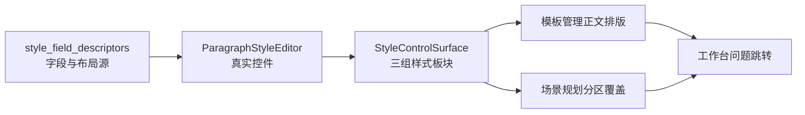

# 样式控件表面共享化首片执行记录

日期：2026-06-28

## 本轮结论

上一轮分析确认：模板管理和场景规划已经复用了字段描述符与底层控件，但用户实际看到的“样式板块表面”仍不一致。模板管理是三组卡片，场景规划是一个混合“样式覆盖”卡中嵌入编辑器，导致代码上同源、体验上不同源。

本轮把这个问题推进到首片代码执行：新增共享 `StyleControlSurface`，让模板管理正文排版和场景分区样式覆盖都通过同一套表面渲染“文字样式 / 对齐与缩进 / 行距与段距”。这不是最终完成全部重构，但已经把复用层级从“控件类”上移到“控件板块表面”。

## 本轮实现

### 1. 新增共享样式控件表面

文件：`src/shared/ui/paragraph_style_surface.py`

新增：

- `STYLE_CONTROL_SURFACE_GROUPS`
- `StyleControlSurface`

职责：

- 内部创建唯一的 `ParagraphStyleEditor`。
- 使用 `style_field_group_descriptor()` 渲染三组板块标题和图标。
- 使用 `style_field_layout_rows()` 渲染字段行列。
- 使用 `InspectorForm` 和 `template_form_row()` 保持模板管理同款表单布局。
- 对外暴露：
  - `editor`
  - `card_for_group()`
  - `form_for_group()`
  - `widget_for_field()`
  - `widget_for_layout_item()`
  - `set_style()`
  - `apply_to_style()`
  - `set_editable()`

这让调用页面不再需要知道“字形控件由 bold/italic 组合而来”“行距值要挂 suffix”“对齐与缩进组要使用 trailing label 对齐”等实现细节。

### 2. ParagraphStyleEditor 补公开 layout item 定位接口

文件：`src/shared/ui/paragraph_style_editor.py`

新增：

```python
widget_for_layout_item(item_id)
```

原因：

- `widget_for_field()` 解决 raw field path 到真实控件。
- `widget_for_layout_item()` 解决布局项到真实控件，例如 `emphasis -> bold/italic 组合控件`、`line_spacing_pt -> 行距值输入控件`。

这一步减少了模板详情和场景详情中的重复映射。

### 3. 模板正文排版迁移到共享表面

文件：`src/ui/panels/template_style_detail.py`

变化：

- `StyleDetail` 改为持有 `StyleControlSurface`。
- 删除页面内重复的：
  - `_add_card_header()`
  - `_build_form_row()`
  - `_build_text_card()`
  - `_build_alignment_indent_card()`
  - `_build_spacing_card()`
  - `_add_style_layout_grid()`
  - `_layout_widget_for_item()`
- 保留原有模板 owner 职责：
  - 保存
  - 恢复
  - dirty state
  - 摘要刷新
  - 导航高亮

兼容保留：

- `_text_card`
- `_alignment_indent_card`
- `_spacing_card`
- `_text_form`
- `_alignment_indent_form`
- `_spacing_form`
- `_font_cn` 等控件属性

这样现有测试和调用方仍可运行，但字段布局已经不再由模板详情单独维护。

### 4. 场景分区样式覆盖迁移到共享表面

文件：`src/ui/panels/scene_panel.py`

变化：

- `SceneScopeDetail` 改为持有 `StyleControlSurface`。
- 原“样式覆盖”卡继续负责：
  - 覆盖分区开关
  - 当前编辑分区
  - 恢复模板
  - 覆盖状态摘要
  - 轻量样式预览
- 具体字段编辑区移到共享表面，作为“样式覆盖”卡之后的同源样式板块。

为什么不把三张样式卡塞进“样式覆盖”卡内：

- 避免卡片嵌套卡片。
- 让场景规划里的样式字段像模板管理一样成为独立板块，而不是“样式覆盖”说明区里的附属表单。

兼容保留：

- `_section_style_editor`
- `_section_font_cn`
- `_section_special_indent`
- `_section_line_value`
- `_style_editor_hint`
- `_section_style_preview`
- `_restore_section_style_btn`

场景写回逻辑仍然是：

- 跟随模板时只读。
- 开启覆盖后写入 `scene.section_styles[variant_key]`。
- 恢复模板后删除对应 section style。

## 本轮测试护栏

### 1. 更新模板详情架构测试

文件：`tests/test_template_style_detail.py`

测试从“模板详情直接包含 `ParagraphStyleEditor` / `InspectorForm`”改成：

- 模板详情必须使用 `StyleControlSurface`。
- 模板详情不再直接手写 `_layout_widget_for_item()` 或 `_add_style_layout_grid()`。
- `ParagraphStyleEditor`、`Card`、`InspectorForm`、`style_field_layout_rows()` 必须位于共享表面层。

### 2. 更新场景面板架构测试

文件：`tests/test_scene_panel_architecture.py`

测试从“场景面板直接包含 `ParagraphStyleEditor`”改成：

- 场景面板必须使用 `StyleControlSurface`。
- 场景面板不能直接依赖 `ParagraphStyleEditor`。
- 真实控件仍只能在 editor 层出现。

### 3. 新增共享表面测试

文件：`tests/test_paragraph_style_editor.py`

新增覆盖：

- `StyleControlSurface` 三组卡片存在。
- 表单行标签顺序与 `style_field_layout_rows()` 完全一致。
- `widget_for_field("template.styles.body.font_name")` 能定位到中文字体控件。
- `widget_for_layout_item("emphasis")` 能定位到字形组合控件。
- `widget_for_layout_item("line_spacing_pt")` 能定位到行距值控件。

## 验证记录

编译通过：

```bash
python -m compileall src/shared/ui/paragraph_style_editor.py src/shared/ui/paragraph_style_surface.py src/ui/panels/template_style_detail.py src/ui/panels/scene_panel.py
```

聚焦测试通过：

```bash
python -m pytest tests/test_paragraph_style_editor.py tests/test_template_style_detail.py::test_style_detail_reuses_shared_controls tests/test_template_style_detail.py::test_style_detail_organizes_body_controls_into_cards tests/test_scene_panel_architecture.py::test_scene_panel_controls_follow_template_management_contract tests/test_scene_panel_architecture.py::test_scene_panel_scope_style_override_editor_writes_section_styles -q
```

结果：`7 passed`

相邻回归通过：

```bash
python -m pytest tests/test_style_field_descriptors.py tests/test_field_display_names.py tests/test_paragraph_style_editor.py tests/test_template_style_detail.py tests/test_scene_panel_architecture.py tests/test_workbench_issue_navigation.py tests/test_control_contract_registry.py -q
```

结果：`92 passed in 152.58s`

## 当前仍未完成的部分

本轮是共享表面的首片，不等于整体优秀设计已经完成。仍需要继续推进：

1. 场景样式覆盖区的信息架构还需要进一步瘦身，“覆盖分区 / 编辑分区 / 恢复模板 / 预览”可以继续收敛为更像模板管理的顶部工具条。
2. `StyleControlSurface` 还只是 UI 表面，没有引入完整的 `StyleControlSurfaceSpec`，owner 行为仍散落在模板详情和场景详情里。
3. 模板页面级预览 `TemplateStylePreview` 和场景段落预览 `StylePreview` 还没有共享预览投影。
4. 普通 UI 文案与高级诊断的隔离已有基础，但还需要继续扫描场景概览、高级证据 Tooltip 和矩阵类卡片。
5. 还缺少视觉截图级验证，尤其是场景页新增三组样式卡后窄屏布局是否仍然稳定。

## 本轮状态判断

链路比上一轮更真实地打通了一层：



现在可以说：

- 模板管理和场景规划已经共享同一套样式字段表面。
- 字段顺序、字段标签、卡片分组和 layout item 定位同源。
- 页面 owner 仍各自负责保存/恢复/覆盖，但不再各自维护字段表单。

后续应继续把 owner 行为也规格化，最终让模板管理和场景规划都只是在同一个表面模型上做不同投影。
