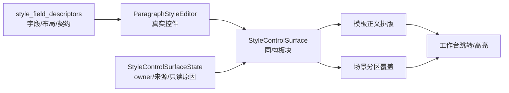

# 样式控件表面状态规格接入执行记录

日期：2026-06-28

## 本轮结论

上一轮已经把模板管理和场景规划的具体样式字段区迁移到共享 `StyleControlSurface`，但 owner 状态仍然散在调用页面里：模板页自己知道它是“模板正文排版”，场景页自己知道它是“参考文献跟随模板 / 已覆盖 0 项 / 当前只读”。共享表面只负责渲染控件，还不知道自己正在服务哪个 owner、当前样式来源是什么、为什么只读。

本轮把这层继续收进共享表面：新增 `StyleControlSurfaceState`，让模板管理和场景规划都用同一份状态对象描述当前样式表面。

## 本轮实现

### 1. 新增 StyleControlSurfaceState

文件：`src/shared/ui/paragraph_style_surface.py`

新增数据结构：

```python
@dataclass(frozen=True, slots=True)
class StyleControlSurfaceState:
    owner_kind: str = ""
    active_label: str = ""
    source_label: str = ""
    detail: str = ""
    editable: bool = True
    style: StyleConfig | None = None
    readonly_reason: str = ""
```

字段边界：

| 字段 | 作用 |
| --- | --- |
| `owner_kind` | 标识当前表面属于模板正文、场景分区等 owner |
| `active_label` | 用户当前正在看的对象，例如“正文排版”“参考文献” |
| `source_label` | 当前样式来源或覆盖状态，例如“模板默认样式”“跟随模板”“已覆盖 0 项” |
| `detail` | 状态细节，例如差异项或跟随模板说明 |
| `editable` | 控件是否允许编辑 |
| `style` | 当前显示/编辑的 `StyleConfig` |
| `readonly_reason` | 不可编辑时给 owner/诊断使用的原因 |

### 2. StyleControlSurface 支持 apply_state()

文件：`src/shared/ui/paragraph_style_surface.py`

新增：

```python
state()
apply_state(state)
```

`apply_state()` 会：

- 保存当前状态。
- 将 owner / active label / source label / detail / editable / readonly reason 写入 widget property。
- 调用共享 editor 的 `set_style()` 和 `set_editable()`。

这些 property 不是普通 UI 文案，而是为后续诊断、跳转、高级证据和测试保留结构化上下文。

### 3. 模板管理接入状态规格

文件：`src/ui/panels/template_style_detail.py`

模板正文排版现在通过：

```python
StyleControlSurfaceState(
    owner_kind="template_body_style",
    active_label="正文排版",
    source_label="模板默认样式",
    editable=True,
    style=style,
)
```

未选择模板时：

```python
StyleControlSurfaceState(
    owner_kind="template_body_style",
    active_label="正文排版",
    source_label="未选择模板",
    editable=False,
    style=None,
    readonly_reason="未选择模板",
)
```

模板页仍保留模板 owner 职责：保存、恢复、dirty state、摘要刷新、导航高亮。

### 4. 场景分区样式接入状态规格

文件：`src/ui/panels/scene_panel.py`

场景分区样式现在从 `SectionStyleOverrideProjection` 派生表面状态：

- `active_label` 来自当前分区，例如“参考文献”。
- `source_label` 来自覆盖状态，例如“跟随模板”“已覆盖 0 项”。
- `detail` 来自覆盖说明或差异项。
- `editable` 来自“分区启用 + 覆盖开启 + 有有效样式”。
- `readonly_reason` 复用当前 hint，例如“开启覆盖后可编辑”。

这样场景页不再只是把状态写进一段 QLabel；共享表面本身也知道当前处在什么状态。

## 测试护栏

### 1. 共享表面单测

文件：`tests/test_paragraph_style_editor.py`

新增断言：

- `StyleControlSurface.apply_state()` 保存 `owner_kind`。
- widget property 能读到：
  - `style_surface_owner_kind`
  - `style_surface_active_label`
  - `style_surface_source_label`
  - `style_surface_editable`
  - `style_surface_readonly_reason`
- 只读状态会禁用底层 editor 控件。

### 2. 模板详情接入测试

文件：`tests/test_template_style_detail.py`

在模板同步测试中新增断言：

- `style_surface_owner_kind == "template_body_style"`
- `style_surface_active_label == "正文排版"`
- `style_surface_source_label == "模板默认样式"`
- `style_surface_editable is True`

### 3. 场景详情接入测试

文件：`tests/test_scene_panel_architecture.py`

在场景分区样式覆盖测试中新增断言：

跟随模板时：

- `style_surface_owner_kind == "scene_section_style"`
- `style_surface_active_label == "参考文献"`
- `style_surface_source_label == "跟随模板"`
- `style_surface_editable is False`
- `style_surface_readonly_reason` 包含“开启覆盖后可编辑”

开启覆盖后：

- `style_surface_source_label == "已覆盖 0 项"`
- `style_surface_editable is True`
- `style_surface_readonly_reason == ""`

## 验证记录

编译通过：

```bash
python -m compileall src/shared/ui/paragraph_style_surface.py src/ui/panels/template_style_detail.py src/ui/panels/scene_panel.py tests/test_paragraph_style_editor.py tests/test_template_style_detail.py tests/test_scene_panel_architecture.py
```

聚焦测试通过：

```bash
python -m pytest tests/test_paragraph_style_editor.py tests/test_template_style_detail.py::test_style_detail_syncs_widget_values_from_template tests/test_scene_panel_architecture.py::test_scene_panel_scope_style_override_editor_writes_section_styles -q
```

结果：`5 passed`

相邻回归通过：

```bash
python -m pytest tests/test_style_field_descriptors.py tests/test_field_display_names.py tests/test_paragraph_style_editor.py tests/test_template_style_detail.py tests/test_scene_panel_architecture.py tests/test_workbench_issue_navigation.py tests/test_control_contract_registry.py -q
```

结果：`92 passed in 146.09s`

## 现在走到哪一步

目前样式链路已经推进到：



比上一轮多打通了一层：

- 不只是同一套控件。
- 不只是同一套三组板块。
- 现在同一套表面也持有 owner 状态和只读状态。

## 仍需继续的部分

1. `StyleControlSurfaceState` 目前只落到了控件表面属性，还没有驱动统一预览。
2. 场景页的样式覆盖工具条仍在 `SceneScopeDetail` 里手工拼装，后续可以抽为 owner toolbar。
3. 模板详情和场景详情仍各自管理摘要卡，后续可以抽统一 `StyleSurfaceSummaryProjection`。
4. `readonly_reason` 目前是结构化状态，不应直接扩大成普通 UI 长文案；后续要继续保持普通路径简洁。
5. 还需要视觉截图验证，尤其是场景页三组样式卡和覆盖卡在窄屏下的上下关系。

## 本轮状态判断

这一步让“模板管理是样式母版、场景规划是样式覆盖投影”更接近真实架构。模板和场景现在不仅共用字段和控件，还共用一个能表达 owner 状态的表面对象。后续再统一预览投影和 owner toolbar 时，就有了可以承接状态的地方。
