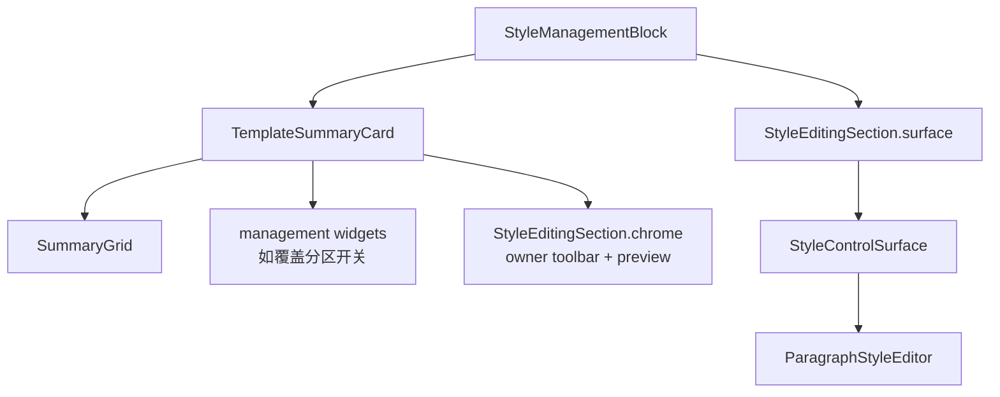

# 样式管理 Block 共享化与场景只读态折叠执行记录

日期：2026-06-29

## 1. 本轮目标

上一份分析已经指出：模板正文排版和场景样式覆盖虽然共用了 `StyleEditingSection`，但页面级结构仍然分叉。模板页是“摘要 -> 字段编辑”，场景页是“摘要 -> 覆盖开关 -> 编辑对象 -> 预览 -> 灰色字段区”。用户感到不一致，核心不是字段控件，而是样式管理这件事没有同一个成品结构。

本轮执行 P0：

- 抽共享 `StyleManagementBlock`。
- 模板正文排版和场景样式覆盖都接入它。
- 场景分区未启用覆盖时折叠字段区，不再展示大面积灰色控件。
- 用测试锁住新的结构边界。

## 2. 本轮实现

### 2.1 新增共享 StyleManagementBlock

文件：`src/shared/ui/style_management_block.py`

职责：

- 承载顶部摘要卡。
- 承载管理控件，例如场景的覆盖分区开关。
- 承载 owner toolbar。
- 承载轻量预览。
- 承载 `StyleEditingSection` 的字段编辑区。
- 可选择在只读态折叠字段区。

结构变为：



关键点：`StyleControlSurface` 仍然只由 `StyleEditingSection` 创建，`StyleManagementBlock` 不碰字段控件细节，只管页面级顺序。

### 2.2 模板正文排版接入共享 Block

文件：`src/ui/panels/template_style_detail.py`

调整前：

```text
StyleDetail
  TemplateSummaryCard
  StyleEditingSection
```

调整后：

```text
StyleDetail
  StyleManagementBlock
    TemplateSummaryCard
    StyleEditingSection
```

保留兼容访问口：

- `_summary_card`
- `_summary_grid`
- `_editor_column`
- `_style_editing_section`
- `_style_surface`
- `_paragraph_style_editor`

这样现有保存、恢复、字段同步、导航高亮不需要重写。

### 2.3 场景样式覆盖接入共享 Block

文件：`src/ui/panels/scene_style_override_sections.py`

调整前：

```text
SceneStyleOverrideSection
  Card
    SummaryGrid
    StyleOverrideToggleList
    StyleEditingSection.chrome
  StyleEditingSection.surface
```

调整后：

```text
SceneStyleOverrideSection
  StyleManagementBlock
    TemplateSummaryCard
      SummaryGrid
      StyleOverrideToggleList
      StyleEditingSection.chrome
    StyleEditingSection.surface
```

这一步让场景样式覆盖从“自己拼卡片”变成“把业务控件放进共享样式管理结构”。

### 2.4 场景只读态折叠字段区

场景分区没有启用覆盖时，`StyleManagementBlock(collapse_surface_when_readonly=True)` 会在 `apply_owner_state(...)` 后隐藏字段区。

用户看到的结构从：

```text
覆盖状态
覆盖分区开关
编辑分区
预览
三组灰色字段卡
```

变成：

```text
覆盖状态
覆盖分区开关
编辑分区
预览
```

这比继续给灰色字段区加说明更有效，因为未启用覆盖时用户不需要看不可编辑字段。

## 3. 边界变化

### 3.1 新边界

| 层级 | 组件 | 职责 |
| --- | --- | --- |
| 页面级样式管理 | `StyleManagementBlock` | 摘要、管理控件、owner、预览、字段区顺序 |
| 编辑 shell | `StyleEditingSection` | owner toolbar、preview、style surface 的组合 |
| 字段 surface | `StyleControlSurface` | 三组字段卡 |
| 字段编辑器 | `ParagraphStyleEditor` | 字体、缩进、行距、段距等实际控件 |

### 3.2 不允许回退的点

- 模板正文排版不应直接创建 `StyleEditingSection`。
- 场景样式覆盖不应直接创建 `StyleEditingSection`。
- 场景样式覆盖不应直接创建 `StyleControlSurface`、`StyleControlOwnerToolbar`、`StylePreview`。
- 页面级“摘要 + 预览 + 字段区”的顺序应由 `StyleManagementBlock` 统一。

## 4. 视觉审查

本轮重新生成离屏 Qt 截图：

- `docs/visual_audit/2026-06-29/template_style_panel_after_style_management_block.png`
- `docs/visual_audit/2026-06-29/template_style_detail_after_style_management_block.png`
- `docs/visual_audit/2026-06-29/scene_scope_panel_after_style_management_block.png`
- `docs/visual_audit/2026-06-29/scene_scope_detail_after_style_management_block.png`

辅助裁剪图：

- `docs/visual_audit/2026-06-29/scene_scope_panel_after_style_management_block_top_crop.png`
- `docs/visual_audit/2026-06-29/scene_scope_panel_after_style_management_block_editor_crop.png`

观察结果：

- 模板正文排版仍保持“摘要卡 -> 三组字段卡”的节奏。
- 场景样式覆盖顶部变成同等级摘要结构。
- 场景跟随模板状态下，预览后不再继续展开三组灰色字段卡。
- owner toolbar、preview、surface 没有重叠。

说明：离屏环境仍缺少中文字体，所以截图中的中文可能显示为方块；这属于测试环境字体限制，不代表真实应用中文渲染异常。

## 5. 测试守门

### 5.1 新增/调整测试

文件：`tests/test_small_widget_architecture.py`

- 新增 `test_style_management_block_wraps_summary_controls_preview_and_surface`
- 验证共享 block 能承载 summary、管理控件、owner、preview、surface。
- 验证只读态折叠字段区。

文件：`tests/test_template_style_detail.py`

- `StyleDetail` 现在必须使用 `StyleManagementBlock`。
- `StyleDetail` 不再直接创建 `StyleEditingSection`。

文件：`tests/test_scene_panel_architecture.py`

- `SceneStyleOverrideSection` 现在必须使用 `StyleManagementBlock`。
- `SceneStyleOverrideSection` 不再直接创建 `StyleEditingSection`。
- `StyleManagementBlock` 负责创建 `TemplateSummaryCard` 和 `StyleEditingSection`。

文件：`tests/test_ui_layout_hardening.py`

- 新增 `test_scene_style_management_block_collapses_readonly_surface`
- 验证场景只读态字段区隐藏，覆盖态字段区展开。

### 5.2 验证结果

编译通过：

```powershell
python -X utf8 -m compileall src/shared/ui/style_management_block.py src/shared/ui/__init__.py src/ui/panels/scene_style_override_sections.py src/ui/panels/template_style_detail.py
```

聚焦测试通过：

```powershell
python -X utf8 -m pytest tests/test_small_widget_architecture.py::test_style_management_block_wraps_summary_controls_preview_and_surface tests/test_scene_panel_architecture.py::test_scene_style_override_section_wraps_owner_preview_and_surface tests/test_template_style_detail.py::test_style_detail_reuses_shared_controls tests/test_ui_layout_hardening.py::test_template_and_scene_style_shells_keep_summary_preview_surface_order tests/test_ui_layout_hardening.py::test_scene_style_management_block_collapses_readonly_surface -q
```

结果：

```text
5 passed in 2.14s
```

相邻回归通过：

```powershell
python -X utf8 -m pytest tests/test_small_widget_architecture.py tests/test_template_style_detail.py tests/test_scene_panel_architecture.py tests/test_ui_layout_hardening.py -q
```

结果：

```text
127 passed in 313.92s
```

## 6. 本轮判断

这一轮不是继续微调文本，而是把样式管理的复用层级再次上移：

```text
StyleControlSurface
-> StyleEditingSection
-> StyleManagementBlock
```

现在模板正文排版和场景样式覆盖都走同一个页面级样式管理结构。场景页仍然在 `scn_scope` 里同时包含“处理范围”和“样式规则”，但样式规则本身已经不再是手写拼装，且只读态不再暴露大面积灰色字段区。

下一步如果继续推进，应处理更大的信息架构边界：

- 把 `处理范围` 与 `分区样式` 拆成独立导航或至少独立详情 section。
- 将 `TemplateSummaryCard` 泛化命名为 `DetailSummaryCard`，避免共享组件仍带模板语义。
- 清理 `_ScopeDetail` 暴露的历史兼容字段，让外部访问逐步转向 `StyleManagementBlock`。
