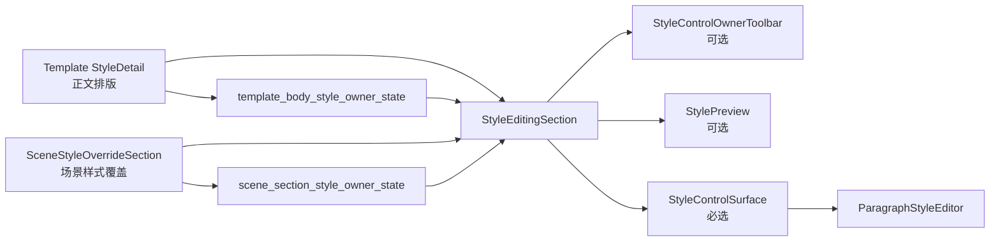

# 样式编辑 Shell 共享化与模板场景一致性执行记录

日期：2026-06-28

## 本轮结论

上一轮已经把场景里的“处理范围”和“样式覆盖”拆成两个语义 section，但样式编辑区仍有一层复用没有打通：

- 模板管理 `StyleDetail` 直接创建 `StyleControlSurface`。
- 场景样式覆盖 `SceneStyleOverrideSection` 直接创建 owner toolbar、轻量预览和 `StyleControlSurface`。

这说明复用已经到了控件表面层，但还没有到“样式编辑 shell”层。用户看到的“当前编辑谁、能不能恢复、当前预览、下面编辑字段”这一组结构，仍然由模板和场景各自组织。

本轮新增共享 `StyleEditingSection`，并让模板正文排版与场景样式覆盖都接入它。现在复用层级变为：

```text
StyleEditingSection
  ├─ 可选 StyleControlOwnerToolbar
  ├─ 可选 StylePreview
  └─ StyleControlSurface
```

场景启用 owner toolbar 与轻量预览；模板正文排版只启用同一个 shell 的 `StyleControlSurface`，保留原有 summary、保存、恢复布局。

## 本轮实现

### 1. 新增 StyleEditingSection

文件：`src/shared/ui/style_editing_section.py`

职责：

- 创建共享样式编辑 shell。
- 持有可选 owner toolbar。
- 持有可选轻量预览。
- 持有必选 `StyleControlSurface`。
- 转发：
  - `current_key_changed`
  - `action_requested`
  - `style_changed`
- 提供统一方法：
  - `set_current_key()`
  - `current_key()`
  - `apply_preview_projection()`
  - `apply_owner_state()`
  - `set_action_enabled()`
  - `set_hint()`

这个 shell 不知道模板或场景业务，只负责把“样式编辑的上沿 + 预览 + 字段表面”组合成可复用单元。

### 2. 场景样式覆盖接入 StyleEditingSection

文件：`src/ui/panels/scene_style_override_sections.py`

迁移前：

- `SceneStyleOverrideSection` 直接创建 `StyleControlOwnerToolbar`。
- 直接创建 `StylePreview`。
- 直接创建 `StyleControlSurface`。

迁移后：

```python
self._editing_section = StyleEditingSection(...)
```

场景 section 仍然负责：

- 样式覆盖标题。
- 覆盖 summary。
- 覆盖分区 toggle list。
- 把共享 shell 的 chrome 区放入样式覆盖卡片。
- 把共享 shell 的 surface 放在下方。

这样保留了上一轮形成的可见结构，同时把 owner/preview/surface 的组合逻辑下沉到共享层。

### 3. 模板正文排版接入 StyleEditingSection

文件：`src/ui/panels/template_style_detail.py`

迁移前：

```python
self._style_surface = StyleControlSurface(...)
```

迁移后：

```python
self._style_editing_section = StyleEditingSection(
    self,
    object_name_prefix="tpl_style_body",
    show_owner_toolbar=False,
    show_preview=False,
)
self._style_surface = self._style_editing_section.style_surface
```

模板正文排版仍保留：

- `TemplateSummaryCard`
- “恢复”
- “保存”
- summary grid
- 原有字段控件引用
- 原有导航高亮

但底层样式表面现在也经由同一个 `StyleEditingSection` 创建。

### 4. 导出共享组件

文件：`src/shared/ui/__init__.py`

新增导出：

```python
"StyleEditingSection": (".style_editing_section", "StyleEditingSection")
```

后续题注、目录、参考文献等局部样式编辑也可以直接复用。

## 当前链路



现在模板和场景的共同点更清楚：

| 层级 | 模板正文排版 | 场景样式覆盖 |
| --- | --- | --- |
| 页面/section | `StyleDetail` | `SceneStyleOverrideSection` |
| 共享 shell | `StyleEditingSection` | `StyleEditingSection` |
| owner 状态 | `template_body_style_owner_state()` | `scene_section_style_owner_state()` |
| 样式字段表面 | `StyleControlSurface` | `StyleControlSurface` |
| 字段编辑器 | `ParagraphStyleEditor` | `ParagraphStyleEditor` |

## 为什么这比继续拆场景更重要

之前的改动主要是在场景内部变清晰：

- `SceneScopeZoneSection`
- `SceneStyleOverrideSection`

这解决的是“场景规划自己不乱”。本轮解决的是“场景规划和模板管理真的开始共用同一套样式编辑组织方式”。

也就是说，复用层级从：

```text
只复用字段控件
```

推进到：

```text
复用样式编辑 shell
```

这才更接近用户说的“和模板管理保持一致性与高度复用”。

## 边界判断

### 1. 不把 TemplateStylePreview 和 StylePreview 强行合并

模板管理的 `TemplateStylePreview` 是页面级版式预览，会展示纸张、页边距、标题、正文、表格、页眉页脚等整体效果。

场景覆盖里的 `StylePreview` 是分区级轻量预览，只回答“当前分区最终段落样式是什么”。

这两者不是同一层级，不能为了“复用”强行合并。正确边界是：

- 共享轻量 preview projection 和渲染控件。
- 保留模板页面级总预览。
- 让场景入口继续使用模板预览上下文说明模板覆盖范围。

### 2. 模板页暂时不启用 owner toolbar

模板正文排版已经有 `TemplateSummaryCard` 的“恢复 / 保存”动作。如果强行再显示 owner toolbar，会造成重复动作和视觉噪声。

因此本轮让模板通过 `StyleEditingSection(show_owner_toolbar=False, show_preview=False)` 使用 shell 的 surface 部分。这样先建立共享结构，不破坏模板管理已有交互。

### 3. 场景 section 仍保留可见结构

场景仍保持：

```text
样式覆盖卡片
  - summary
  - 覆盖分区
  - 编辑分区 / 恢复模板
  - 轻量预览
下方
  - 文字样式 / 对齐与缩进 / 行距与段距
```

只是 owner/preview/surface 的实际创建改由 `StyleEditingSection` 承接。

## 测试补强

新增：

- `test_style_editing_section_wraps_owner_preview_and_surface`

覆盖：

- owner toolbar object name。
- 分区选择 signal。
- 恢复动作 signal。
- preview 空状态。
- `apply_owner_state()` 能写入 `StyleControlSurface` property。
- shell 暴露 editor 与 unit label。

更新：

- 模板详情架构测试：`StyleDetail` 不再直接创建 `StyleControlSurface`，而是创建 `StyleEditingSection`。
- 场景架构测试：`SceneStyleOverrideSection` 不再直接创建 `StyleControlOwnerToolbar` / `StyleControlSurface` / `StylePreview`，而是通过 `StyleEditingSection`。

## 本轮验证

编译通过：

```powershell
python -m compileall src/shared/ui/style_editing_section.py src/shared/ui/__init__.py src/ui/panels/scene_style_override_sections.py src/ui/panels/template_style_detail.py tests/test_small_widget_architecture.py tests/test_scene_panel_architecture.py tests/test_template_style_detail.py
```

聚焦测试通过：

```powershell
python -m pytest tests/test_small_widget_architecture.py::test_style_editing_section_wraps_owner_preview_and_surface tests/test_scene_panel_architecture.py::test_scene_style_override_section_wraps_owner_preview_and_surface tests/test_scene_panel_architecture.py::test_scene_panel_controls_follow_template_management_contract tests/test_scene_panel_architecture.py::test_scene_panel_scope_style_override_editor_writes_section_styles tests/test_template_style_detail.py::test_style_detail_reuses_shared_controls tests/test_template_style_detail.py::test_style_detail_syncs_widget_values_from_template tests/test_template_style_detail.py::test_template_panel_style_edit_updates_preview_and_dirty_state -q
```

结果：

```text
7 passed in 9.43s
```

相邻回归通过：

```powershell
python -m pytest tests/test_small_widget_architecture.py tests/test_style_variant_semantics.py tests/test_style_field_descriptors.py tests/test_field_display_names.py tests/test_paragraph_style_editor.py tests/test_template_style_detail.py tests/test_scene_panel_architecture.py tests/test_workbench_issue_navigation.py tests/test_control_contract_registry.py -q
```

结果：

```text
119 passed in 62.80s
```

## 仍然不足

### 1. 模板详情没有可见地使用 owner toolbar

这是有意保留的，因为模板页已有 summary header 动作。下一步如果要统一动作区，需要先设计：

- 模板的“保存”是否属于 owner toolbar。
- 模板的“恢复”是否等价于场景的“恢复模板”。
- summary card action 与 owner toolbar action 谁是主入口。

不建议在没有视觉验证前强行合并。

### 2. 场景 `_ScopeDetail` 仍有兼容字段

为了不打断工作台跳转和测试，`_ScopeDetail` 仍暴露：

- `_style_surface`
- `_section_style_preview`
- `_style_owner_toolbar`
- `_section_*` 字段控件

这些已经来自 section/shell，但对外仍挂在 `_ScopeDetail` 上。后续可以逐步把测试和跳转改为访问 `_style_override_section.editing_section`，再减少兼容字段。

### 3. 还缺截图级验收

代码链路已经打通，但优秀设计还需要实际观察：

- 模板正文排版详情是否和之前视觉一致。
- 场景样式覆盖卡片是否因为 shell 迁移产生间距变化。
- owner/preview/surface 在窄窗口是否仍清晰。

## 下一步建议

### P0：做截图级视觉验收

启动应用，分别打开：

- 模板管理 -> 正文排版
- 场景规划 -> 处理范围 / 样式覆盖

对比：

- section 标题层级。
- summary 密度。
- owner toolbar 与 preview 的位置。
- 文字样式三组卡片是否一致。
- 窄窗口是否拥挤或重叠。

### P1：减少兼容字段

逐步把测试和导航从：

```python
scope._section_style_preview
scope._style_surface
```

迁到：

```python
scope._style_override_section.editing_section.preview
scope._style_override_section.editing_section.style_surface
```

### P2：评估模板动作区统一

如果视觉验收确认模板 summary header 和场景 owner toolbar 差异仍显著，再设计一个更高层的 action slot，而不是让两个页面继续各自处理恢复/保存。

## 本轮判断

这一轮把“模板管理”和“场景样式覆盖”的复用层级真正上移了。之前是共同使用 `StyleControlSurface`；现在是共同使用 `StyleEditingSection`。这一步比单纯继续拆场景内部更接近最终目标，因为它让两条用户链路开始共享同一个样式编辑外壳。

目前还不能说已经达到优秀设计。下一步需要实际截图验收，确认结构复用有没有转化成用户可感知的一致性。
