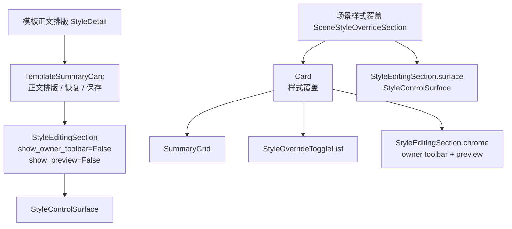

# 样式编辑 Shell 视觉验收与布局修复记录

日期：2026-06-29

## 本轮结论

上一轮已经把模板正文排版和场景样式覆盖都接入了共享 `StyleEditingSection`。本轮推进到视觉/布局验收层：新增 Qt 渲染与几何测试，验证共享 shell、模板正文排版、场景样式覆盖在实际 `show()` / `resize()` 后不是空白、不重叠、顺序符合用户阅读链。

这轮测试发现并修复了一个真实布局问题：`StyleEditingSection` 构造时用 `self._chrome_widget.isVisible()` 判断是否把 owner/preview chrome 加入自身 layout。由于构造阶段父控件还没有 show，`isVisible()` 返回 `False`，导致 chrome 没有加入布局；owner toolbar / preview 与 surface 会在 shell 内部重叠到 y=0。

已修复为使用显式状态：

```python
chrome_enabled = bool(show_owner_toolbar or show_preview)
self._chrome_widget.setVisible(chrome_enabled)
if embed_chrome and chrome_enabled:
    layout.addWidget(self._chrome_widget)
```

这说明视觉/几何验收是有必要的：纯架构测试和常规功能测试没有暴露这个问题。

## 本轮实现

### 1. 修复 StyleEditingSection chrome 布局判断

文件：`src/shared/ui/style_editing_section.py`

问题代码：

```python
self._chrome_widget.setVisible(show_owner_toolbar or show_preview)
if embed_chrome and self._chrome_widget.isVisible():
    layout.addWidget(self._chrome_widget)
```

问题：

- 构造阶段父控件未显示。
- `isVisible()` 会受父级可见性影响。
- chrome 没有加入 layout。
- 后续 show 后 chrome 仍是 child，但不受 layout 管理，和 surface 重叠。

修复后：

```python
chrome_enabled = bool(show_owner_toolbar or show_preview)
self._chrome_widget.setVisible(chrome_enabled)
if embed_chrome and chrome_enabled:
    layout.addWidget(self._chrome_widget)
```

这用配置状态判断是否加入 layout，不依赖运行时可见性。

### 2. 清理 SceneStyleOverrideSection 小瑕疵

文件：`src/ui/panels/scene_style_override_sections.py`

清理重复 `@property`：

```python
@property
@property
def editing_section(...)
```

改为单个 property。该问题不影响运行，但会降低代码可读性。

### 3. 补视觉/几何验收测试

文件：`tests/test_ui_layout_hardening.py`

新增：

- `test_style_editing_section_renders_chrome_preview_and_surface_in_order`
- `test_template_and_scene_style_shells_keep_summary_preview_surface_order`

覆盖点：

1. `StyleEditingSection` show/resize 后，owner toolbar、preview、surface 均可见。
2. preview 在 owner toolbar 下方。
3. surface 在 preview 下方。
4. shell grab 图像存在足够深色采样点，不是空白。
5. 模板正文排版中 summary card 位于 style editing shell 上方。
6. 场景样式覆盖中样式覆盖 card 位于 style editing shell 上方。
7. 场景 owner toolbar 与 preview 不重叠。
8. 模板和场景都仍通过同一个 shell 暴露 `StyleControlSurface`。

## 当前视觉链路



模板和场景现在共享同一个编辑 shell，但保留不同可见层级：

| 页面 | shell chrome | shell surface | 原因 |
| --- | --- | --- | --- |
| 模板正文排版 | 不显示 | 显示 | 模板已有 summary header 的恢复/保存动作 |
| 场景样式覆盖 | 显示并放入样式覆盖 card | 显示在 card 下方 | 场景需要分区选择、恢复模板、轻量预览 |

## 本轮验证

编译通过：

```powershell
python -m compileall src/shared/ui/style_editing_section.py tests/test_ui_layout_hardening.py
```

新增视觉/几何测试通过：

```powershell
python -m pytest tests/test_ui_layout_hardening.py::test_style_editing_section_renders_chrome_preview_and_surface_in_order tests/test_ui_layout_hardening.py::test_template_and_scene_style_shells_keep_summary_preview_surface_order -q
```

结果：

```text
2 passed in 1.36s
```

聚焦测试通过：

```powershell
python -m pytest tests/test_ui_layout_hardening.py::test_style_editing_section_renders_chrome_preview_and_surface_in_order tests/test_ui_layout_hardening.py::test_template_and_scene_style_shells_keep_summary_preview_surface_order tests/test_small_widget_architecture.py::test_style_editing_section_wraps_owner_preview_and_surface tests/test_scene_panel_architecture.py::test_scene_style_override_section_wraps_owner_preview_and_surface tests/test_scene_panel_architecture.py::test_scene_panel_controls_follow_template_management_contract tests/test_scene_panel_architecture.py::test_scene_panel_scope_style_override_editor_writes_section_styles tests/test_template_style_detail.py::test_style_detail_reuses_shared_controls tests/test_template_style_detail.py::test_style_detail_syncs_widget_values_from_template tests/test_template_style_detail.py::test_template_panel_style_edit_updates_preview_and_dirty_state -q
```

结果：

```text
9 passed in 9.90s
```

相邻回归通过：

```powershell
python -m pytest tests/test_small_widget_architecture.py tests/test_style_variant_semantics.py tests/test_style_field_descriptors.py tests/test_field_display_names.py tests/test_paragraph_style_editor.py tests/test_template_style_detail.py tests/test_scene_panel_architecture.py tests/test_ui_layout_hardening.py tests/test_workbench_issue_navigation.py tests/test_control_contract_registry.py -q
```

结果：

```text
154 passed in 73.81s
```

## 当前不足

### 1. 仍不是完整截图级人工验收

本轮是自动化渲染与几何验收，能证明：

- 不是空白。
- 顺序正确。
- 关键块不重叠。

但它不能完全替代真实截图对比，尤其不能评价：

- 视觉密度是否舒服。
- 用户是否一眼能理解“跟随模板 / 当前场景覆盖”。
- 窄窗口中视觉节奏是否足够好。
- 颜色、间距、字号是否和模板管理主观一致。

### 2. 场景样式覆盖仍可能偏长

场景样式覆盖现在包含：

- 覆盖状态 summary
- 覆盖分区 toggle
- 编辑分区 owner toolbar
- 轻量预览
- 三组样式字段卡片

结构已清晰，但垂直长度偏长。后续可以考虑：

- 将覆盖分区与编辑分区合并为同一行控制条。
- 将 preview 做得更薄。
- 当未开启覆盖时，折叠 style surface，只显示 preview 与开启入口。

这些需要真实界面截图后决定。

### 3. 兼容字段仍未完全收敛

`_ScopeDetail` 仍对外暴露旧字段，例如：

- `_section_style_preview`
- `_style_surface`
- `_style_owner_toolbar`
- `_section_font_cn`

这些字段现在来自 section/shell，但长期看应逐步改为从 `_style_override_section.editing_section` 访问。

## 下一步建议

### P0：生成并检查真实页面截图

建议下一轮启动应用或用 Qt grab 生成两张页面级截图：

- 模板管理 -> 正文排版
- 场景规划 -> 处理范围 / 样式覆盖

保存到 docs 的 visual audit 目录，并在 MD 中记录观察：

- 是否有可见重叠。
- 是否有空白过大。
- 样式覆盖是否过长。
- section 标题是否一致。
- summary 是否能替代冗余解释文字。

### P1：压缩场景样式覆盖上沿

如果截图确认过长，优先考虑把：

```text
覆盖分区
编辑分区
恢复模板
```

收敛成更紧凑的一条 owner/control strip。

### P2：减少 `_ScopeDetail` 兼容字段

把测试和跳转逐步迁到：

```python
scope._style_override_section.editing_section
```

减少 `_ScopeDetail` 继续像“全局字段仓库”的倾向。

## 本轮判断

这一轮把“共享 shell”从结构正确推进到了布局可信。更重要的是，自动化视觉验收确实抓到了一个布局重叠 bug，并且已经修复。现在模板正文排版和场景样式覆盖不只是代码上共享 `StyleEditingSection`，也通过了基础的渲染和层级顺序验证。

距离优秀设计还差真实截图审查和视觉节奏优化，但链路已经更稳。
