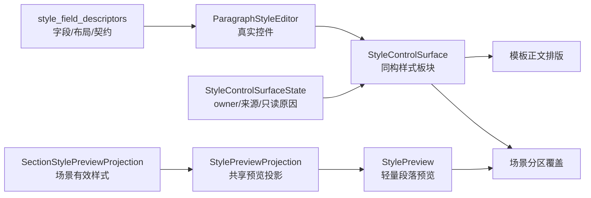

# 样式预览共享投影接入执行记录

日期：2026-06-28

## 本轮结论

前两轮已经完成了“共享样式控件表面”和“共享样式表面状态”。但场景分区样式的小预览仍然停留在场景页私有实现：`SceneScopeDetail._sync_section_style_preview()` 手动把 `SectionStylePreviewProjection` 拆成字体、字号、字形、缩进、段距等参数，再逐项调用 `StylePreview.update_preview()`。

这意味着预览层仍然没有完全站到共享链路上。字段控件已经共享，owner 状态已经共享，但预览还没有共享投影。

本轮新增 `StylePreviewProjection` 和 `StylePreview.apply_projection()`，让场景分区预览改为使用共享预览投影。这样后续模板轻量预览、参考文献独立样式预览、题注/目录局部预览都可以继续接同一条预览模型，而不是各页面各自拆字段。

## 本轮实现

### 1. 新增 StylePreviewProjection

文件：`src/shared/ui/style_preview.py`

新增：

```python
@dataclass(frozen=True, slots=True)
class StylePreviewProjection:
    sample_text: str
    source_label: str
    detail: str
    font_cn: str
    font_en: str
    size_pt: float
    bold: bool
    italic: bool
    alignment: str
    line_spacing: float
    left_indent_pt: float
    right_indent_pt: float
    first_indent_pt: float
    hanging_indent_pt: float
    space_before_pt: float
    space_after_pt: float
```

并提供：

- `from_object(projection)`：从 domain projection 适配到 UI preview projection。
- `tooltip_text()`：统一生成预览 Tooltip。

`from_object()` 兼容当前 `SectionStylePreviewProjection` 的 `line_spacing_value` 字段，也兼容未来直接使用 `line_spacing` 的 projection。

### 2. StylePreview 支持 apply_projection()

文件：`src/shared/ui/style_preview.py`

新增：

```python
apply_projection(projection, empty_text=...)
```

行为：

- `projection is None` 时，显示空态文本、禁用预览、清空 Tooltip 和结构化属性。
- 有 projection 时，统一调用 `update_preview()`，并写入：
  - `style_preview_source_label`
  - `style_preview_detail`

这些 property 继续走“普通 UI 不暴露工程细节，结构化上下文给测试/诊断保留”的路线。

### 3. 场景分区样式预览迁移到共享投影

文件：`src/ui/panels/scene_panel.py`

原先：

```python
self._section_style_preview.update_preview(
    font_cn=preview_projection.font_cn,
    ...
)
self._section_style_preview.setToolTip(...)
```

现在：

```python
self._section_style_preview.apply_projection(
    StylePreviewProjection.from_object(preview_projection),
)
```

场景页不再自己关心预览字段如何拆，也不再自己拼 Tooltip。

## 测试护栏

### 1. 小组件测试

文件：`tests/test_small_widget_architecture.py`

新增 `test_style_preview_applies_shared_projection_state`，覆盖：

- 从兼容 domain object 构造 `StylePreviewProjection`。
- `apply_projection()` 后文本、Tooltip、source/detail property 正确。
- 段落布局参数如 `line_spacing`、`hanging_indent_pt` 被写入 preview。
- 空态 projection 会禁用预览并清空 Tooltip。

### 2. 场景面板测试

文件：`tests/test_scene_panel_architecture.py`

在既有场景样式覆盖测试中补充：

- 跟随模板时 `style_preview_source_label == "跟随模板"`。
- 开启覆盖后 `style_preview_source_label == "已覆盖 0 项"`。
- `style_preview_detail` 保留“模板有效样式一致”等状态细节。

这证明真实场景面板已经走共享预览投影，而不是只在小组件层可用。

## 验证记录

编译通过：

```bash
python -m compileall src/shared/ui/style_preview.py src/ui/panels/scene_panel.py tests/test_small_widget_architecture.py tests/test_scene_panel_architecture.py
```

聚焦测试通过：

```bash
python -m pytest tests/test_small_widget_architecture.py::test_style_preview_applies_shared_projection_state tests/test_scene_panel_architecture.py::test_scene_panel_scope_style_override_editor_writes_section_styles tests/test_style_variant_semantics.py::test_section_style_preview_projection_uses_effective_scene_style -q
```

结果：`3 passed`

相邻回归通过：

```bash
python -m pytest tests/test_small_widget_architecture.py tests/test_style_variant_semantics.py tests/test_style_field_descriptors.py tests/test_field_display_names.py tests/test_paragraph_style_editor.py tests/test_template_style_detail.py tests/test_scene_panel_architecture.py tests/test_workbench_issue_navigation.py tests/test_control_contract_registry.py -q
```

结果：`107 passed in 62.94s`

## 现在走到哪一步

当前链路已经变为：



与上一轮相比，新增打通的是“轻量段落预览”这条链：

- 场景页不再手动拆 preview 字段。
- 预览 Tooltip 和 source/detail 属性由共享 `StylePreviewProjection` 管。
- 未来其它局部样式预览可以复用同一投影。

## 仍需继续的部分

1. `TemplateStylePreview` 是页面级预览，仍然不是这个轻量投影的直接消费者；后续应定义“页面级预览”和“段落级预览”的上下游关系。
2. 场景样式覆盖区的分区选择、覆盖开关、恢复模板按钮仍在 `SceneScopeDetail` 内手工拼装；下一步可以抽 owner toolbar。
3. `StylePreviewProjection.from_object()` 目前是兼容适配层，后续可以让 domain 层直接输出共享 projection 或明确 adapter 函数。
4. 仍缺少截图级验证，尤其是共享样式表面和预览在窄屏下的布局关系。

## 本轮状态判断

这一步不是大而全的视觉重做，但它把预览链路从页面私有逻辑里抽了出来。现在“字段、控件、表面状态、轻量预览”已经形成连续链条，场景规划越来越像模板管理的投影，而不是另一套独立实现。
