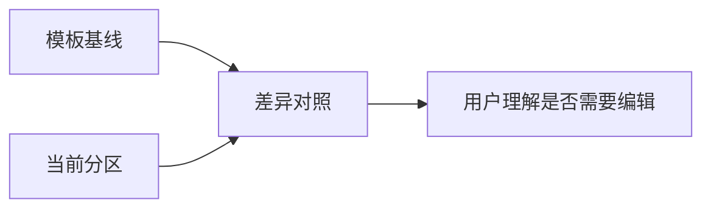

# 模板基线与分区样式对照执行记录（2026-06-29）

后续进展：本文第 8 节提到的“恢复当前分区 / 恢复全部分区”的明确选择已在 `docs/refactor-records/分区样式全部跟随模板执行记录_2026-06-29.md` 中推进落地。当前分区样式页已经有 `全部跟随模板` 动作，并通过 tooltip 告知会关闭哪些分区的独立样式。

## 1. 本轮目标

上一轮已经让模板管理和分区样式共享了 `来源 / 影响 / 编辑` 三段 owner 状态。但用户理解样式差异时仍然缺一个关键桥梁：当前分区到底是“跟随模板”、还是“独立但未改字段”、还是“已经相对模板调整了哪些字段”。

本轮继续推进 `docs/refactor-records/样式Owner状态共享化执行记录_2026-06-29.md` 中的后续建议：补齐模板基线与当前分区的对照。

## 2. 设计判断

### 2.1 不做长说明

这里不适合再放一段“说明文字”。原因：

- 之前的问题之一就是说明文字多但不说人话。
- 用户需要扫读状态，不需要阅读操作手册。
- 状态应该跟随选择的分区实时变化。

### 2.2 先做状态对照，不急着做双画布预览

理想态是左侧渲染模板基线、右侧渲染当前分区效果。但那需要更完整的预览布局和真实字体验证。本轮先落地更稳的状态对照条：

```text
模板基线：模板基线
当前分区：跟随模板 / 独立样式 / 未处理
差异：无差异 / 未改字段 / 已调整 N 项 / 未比较
```

它解决的是认知链路：



## 3. 已执行代码改动

### 3.1 新增对照投影

更新：

- `src/config/style_variant_semantics.py`

新增：

- `SectionStyleComparisonProjection`
- `build_section_style_comparison_projection()`

状态规则：

| 条件 | 当前分区 | 差异 | 说明 |
| --- | --- | --- | --- |
| 处理范围未启用 | 未处理 | 未比较 | 先启用处理范围 |
| 未开启独立样式 | 跟随模板 | 无差异 | 直接使用模板基线 |
| 已独立但字段一致 | 独立样式 | 未改字段 | 可编辑，但尚未产生差异 |
| 已独立且字段不同 | 独立样式 | 已调整 N 项 | detail 展示字段名 |

### 3.2 新增共享 UI 组件

新增：

- `src/shared/ui/style_comparison_strip.py`

职责：

- 展示 `模板基线 / 当前分区 / 差异` 三段短状态。
- 暴露 `style_compare_template_status / style_compare_current_status / style_compare_difference_status / style_compare_detail` 属性，便于自动化测试和后续定位。
- 使用现有 theme token，不新增独立视觉体系。

### 3.3 接入场景分区样式页

更新：

- `src/ui/panels/scene_style_override_sections.py`
- `src/ui/panels/scene_style_override_service.py`
- `src/ui/panels/scene_panel.py`

接入方式：

- `SceneStyleOverrideSection` 内部持有 `StyleComparisonStrip`。
- `_StyleRulesDetail` 根据当前选中分区生成 comparison projection。
- 每次切换分区、开启独立样式、编辑字段、恢复模板时，对照条跟随刷新。

## 4. 当前用户链路

### 4.1 未开启独立样式

```text
来源：跟随模板
影响：来自模板
编辑：开启独立样式后可编辑

模板基线：模板基线
当前分区：跟随模板
差异：无差异
```

用户能理解：这里现在只是看模板基线，不能直接改。

### 4.2 开启独立样式但未改字段

```text
来源：已开启独立样式
影响：仅当前场景
编辑：可编辑

模板基线：模板基线
当前分区：独立样式
差异：未改字段
```

用户能理解：已经允许本场景单独编辑，但还没有和模板产生实际差异。

### 4.3 已调整字段

```text
来源：已调整 N 项
影响：仅当前场景
编辑：可编辑

模板基线：模板基线
当前分区：独立样式
差异：已调整 N 项
```

tooltip / detail 中保留字段列表，例如：

```text
不同：中文字体、字号、行距
```

用户能理解：它不是“覆盖模板”，而是当前场景的当前分区和模板基线有明确差异。

## 5. 为什么这一步有价值

### 5.1 它补上了“已调整 N 项”的参照物

只说“已调整 N 项”仍然不完整，因为用户会问：和谁比？本轮把参照物固定为“模板基线”。

### 5.2 它减少错误操作

用户看到 `差异：无差异` 时，不会误以为这里已经有特殊规则。看到 `差异：未改字段` 时，能理解“开关已经打开，但字段还没动”。

### 5.3 它继续保持边界清楚

- 处理范围未启用：不比较。
- 跟随模板：无差异。
- 独立样式：只影响当前场景。
- 字段不同：列出差异字段。

这比“覆盖/不覆盖”更符合用户任务。

## 6. 验证记录

聚焦测试：

```text
5 passed in 26.11s
8 passed in 29.21s
```

更宽回归：

```text
48 passed in 47.48s
```

覆盖范围：

- `tests/test_style_variant_semantics.py`
- `tests/test_small_widget_architecture.py`
- `tests/test_scene_panel_architecture.py`
- `tests/test_ui_layout_hardening.py`
- `tests/test_template_style_detail.py`

文案回归搜索：

```text
rg "样式覆盖|覆盖分区|开启覆盖后可编辑|已覆盖 0 项|已覆盖 [0-9]+ 项|已覆盖 [0-9]+ 个分区|覆盖状态|关闭当前分区覆盖" ...
```

结果：本轮触达的样式链路与相关测试未命中旧用户可见表达。

## 7. 当前限制

### 7.1 还不是完整双预览

本轮是“状态对照”，不是完整的左右渲染预览。下一步如果继续提升，可以做：

- 左侧渲染模板基线预览。
- 右侧渲染当前分区有效样式。
- 中间或下方列出差异字段。

### 7.2 Git 状态仍不可用

当前仓库 worktree 元数据仍指向旧路径：

```text
C:/Users/Administrator/Desktop/Lark-Formatter 1.0/Lark-Formatter V1.0/.git/worktrees/awesome-tu-3d3302
```

因此 `git status` / `git diff` 仍报：

```text
fatal: not a git repository
```

本轮未修改 `.git` 元数据。

## 8. 后续建议

1. 将状态对照升级成真正的双预览：模板基线预览 + 当前分区预览。
2. 给 `恢复模板` 增加“恢复当前分区 / 恢复全部分区”的明确选择。
3. 已完成：概览页已把 `模板与样式`、`分区样式` 合并成 `样式来源`，详见 `docs/refactor-records/场景概览样式来源合并与双跳转执行记录_2026-06-29.md`。
4. 用真实桌面窗口截图补中文字体和状态条换行验证。

## 9. 当前判断

本轮之后，场景分区样式的理解链路更完整：

- `来源 / 影响 / 编辑` 告诉用户当前样式由谁控制。
- `模板基线 / 当前分区 / 差异` 告诉用户当前分区相对模板发生了什么。
- `StylePreview` 继续展示当前有效样式。

这三个层次分别回答“谁控制”“和谁比”“现在长什么样”，比单纯堆样式字段更接近用户真正需要的设计。
