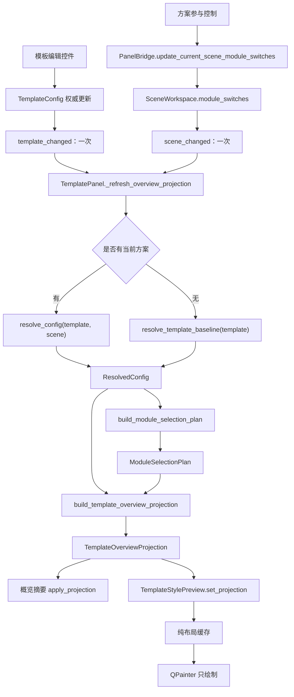
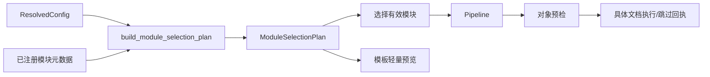

# 模板样式预览单一投影与执行状态链重构方案（2026-07-13）

## 0. 文档状态

- 状态：已实施；实现与验证记录见[实施记录](./模板样式预览单一投影与执行状态链实施记录_2026-07-13.md)。
- 项目阶段：尚未公开发布；本次不承担未发布内部 JSON、旧 UI 协议和旧预览 API 的长期兼容成本。
- 前置审计：[模板样式预览完整性与执行开关联动深度分析](../audits/模板样式预览完整性与执行开关联动深度分析_2026-07-13.md)。
- 本文作用：在前置审计基础上确定最终状态所有权、有效模块计算、预览投影、交互状态、代码拆分、删除清单和验收门禁。
- 实施边界：本文保留设计与验收合同；实际落地、删除项、测试和视觉复核结果单独记录在实施记录中。

本文取代前置审计中“把输入文档预检摘要接入模板概览”和“保留 `TocConfig.enabled` 与模块开关做 AND 计算”的保守建议。最终实现中：

1. 模板概览只表达模板基线或当前方案的计划级结果，不表达某一份输入文档的对象预检结果；
2. 目录是否执行只由方案模块开关决定，模板只保存目录的模式、深度、插入位置和样式；
3. 目录依赖标题识别，不硬依赖标题编号；允许“无编号标题 + 目录”；
4. 最终分支只保留一条预览链、一个模块选择算法和一个刷新入口。

## 1. 最终结论

当前模板概览中的“样式预览”不能被视为完整的当前方案预览。它读取的是可变 `TemplateConfig`，没有读取方案开关，没有使用运行时真正的依赖裁剪结果，还会在只读预览期间补写标题编号默认值。继续在 `paintEvent()` 中零散增加 `if`，只会把运行时、配置和 UI 三套判断继续拉开。

后续应一次性完成以下收敛：

1. 将预览输入改为 `ResolvedConfig + ModuleSelectionPlan`；
2. 将模板基线与当前方案明确区分为两个预览模式；
3. 将预览构建改为纯函数投影，绘制组件只接收不可变投影；
4. 将运行时和预览的模块启用、关闭、自动裁剪统一到同一个选择计划；
5. 将模板外观、方案参与状态、对象级预检三种所有权彻底分层；
6. 将当前无标签、靠 tooltip 解释、聚合后语义不准确的开关改为可见的逐模块参与控制；
7. 移除模板概览专用的放大、点击、tooltip、弹窗和共享样式外壳兼容协议；
8. 修复 TOC 依赖、预览写配置、横向比例、静默溢出和重复刷新；
9. 在同一改造分支删除旧接口、旧注册表、僵尸场景字段和旧 JSON 字段，不保留双轨。

最终产品应满足一句话合同：

> 模板定义“怎么排”，当前方案定义“这次排不排”，有效模块计划定义“实际上能不能排”，轻量预览只读地展示这个计划级结果；具体文档是否因复杂对象而跳过，交给真实文档预览和执行回执说明。

## 2. 当前链路的结构性问题

### 2.1 当前预览不是有效配置的投影

现有链路为：

```text
TemplateConfig（可变）
  -> TemplateOverviewDetail.refresh(cfg)
  -> StyleManagementBlock(template_overview_preview)
  -> StylePreviewSurface
  -> TemplateStylePreview.refresh(cfg)
  -> _build_template_preview_paragraphs(cfg)
  -> 布局缓存
  -> paintEvent()
```

运行时实际链路为：

```text
TemplateConfig + SceneWorkspace + Session Overrides
  -> resolve_config()
  -> ResolvedConfig
  -> select_enabled_modules()
  -> 硬依赖自动裁剪
  -> 对象预检再跳过部分模块
  -> Pipeline
```

两条链在三个关键点不一致：

- 预览没有使用场景覆盖后的 `ResolvedConfig`；
- 预览没有使用运行时的硬依赖裁剪结果；
- 预览没有明确区分“计划级关闭”和“某份文档对象级跳过”。

因此，当前画布即便补齐所有对象，也仍可能展示运行时不会执行的结果。

### 2.2 预览的只读操作会修改模板

`_build_template_preview_paragraphs()` 为了生成标题样例创建 `HeadingNumberingAdapter`，随后调用 `set_template()`；适配器会执行 `ensure_default_scheme()`。`template_summary_projection.py` 的标题摘要和导航摘要也各有同类 adapter 绑定，因此副作用覆盖整个概览投影链，并不只发生在画布。这意味着只要打开或刷新模板概览，一个原本没有标题绑定的模板就可能被补入默认编号方案。

风险不是理论上的：内置 `official_gbt` 明确把 `heading_numbering.level_bindings` 设为空，当前预览会把这一有意状态改成默认多级编号。之后如果用户保存模板，预览产生的副作用会被持久化。

该问题定为 P0：任何预览、摘要、布局和绘制调用前后，配置深比较必须完全相等。

### 2.3 模块开关写入与刷新是旁路

当前 `_ReformatToggleCard` 直接修改 `scene.module_switches`，随后：

- 以 `emit_signal=False` 回写当前场景；
- 手工发出仅模板面板使用的 `module_toggled`；
- 手工同步开关；
- 不刷新概览预览。

这条旁路绕过权威 `scene_changed`，也迫使每个消费者猜测应该监听哪个信号。与此同时，模板编辑会先手工刷新概览，再发布 `template_changed`，脏状态首次变化时又可能刷新一次。

问题本质不是缺少一个预览刷新调用，而是同一个状态变化存在多条通知路径。

### 2.4 当前聚合开关表达了错误状态

页面卡片同时控制 `page_setup` 和 `section_format`。当前实现用 `any(states)` 决定一个二态开关是否打开，用 `partial` 只设置不可见状态文案。结果是：

- 一个模块开、一个模块关时，开关视觉上仍是“开”；
- 用户点击一次会同时覆盖两个原本不同的选择；
- 页面卡片的“部分开启”主要依赖 tooltip，正文界面不可见；
- 开关没有可见标签，键盘和读屏语义不足。

这不是适合三态开关的场景。两个独立模块必须显示为两行独立控制。

### 2.5 模板编辑与方案参与状态被错误耦合

当前同步方案开关时还会调用详情页的 `set_reformat_enabled(enabled)`。这容易把“当前方案这次不执行”解释为“模板参数不可编辑”。两者所有权不同：

- 模板参数是可复用外观基线，即使当前方案跳过，也应允许编辑；
- 方案开关只决定当前方案执行时是否应用；
- 模板保存不应隐式保存方案，方案保存也不应隐式保存模板。

后续必须取消“模块关闭就禁用模板编辑器”的耦合。

### 2.6 目录存在双重总开关和错误硬依赖

目录当前同时受两层总开关控制：

- `scene.module_switches["toc"]`；
- `TocConfig.enabled`，且模板详情中还有“启用目录”控件。

运行时 `TocModule.apply()` 再次检查 `toc_cfg.enabled`。用户因此可能看到方案显示执行，但模板内部又静默使其不执行。

同时，`TocModule.meta.depends_on=("heading_numbering",)` 会在标题编号关闭时自动裁剪目录。但目录只需要识别到标题层级，不要求标题必须带编号。正确依赖应为：

```python
depends_on=("heading_recognition",)
soft_after=("heading_numbering",)
```

标题编号关闭时，目录应继续存在，只是条目不带编号。

### 2.7 场景模型仍保留未进入有效解析的模板外观字段

`SceneWorkspace` 目前仍保留一组标注为兼容用途的旧版内嵌模板字段。静态引用审计显示，下列字段没有生产代码直接读取以形成 `ResolvedConfig`，主要只出现在序列化、迁移和旧测试中：

- `scene.table`；
- `scene.header_footer`；
- `scene.toc`；
- `scene.caption`；
- `scene.formula_table`。

这些字段给人“场景保存了该配置”的错觉，实际上有效配置仍取模板和 `template_overrides`。项目尚未发布，不应继续保留这种僵尸状态。

仍由场景真实拥有并进入运行时的字段不在此删除范围，例如 `formula_style`、`equation_numbering`、`reference_style`、`watermark` 和 `output`。但发布前仍应按“模块总开关唯一”原则另做一次全局双门审计，尤其核查 `watermark.enabled`。

### 2.8 UI 元数据被重复定义

同一功能身份目前散落在：

- `template_panel.py` 的 `CARD_DEFINITIONS`、`DETAIL_CARDS`、`DETAIL_REFORMAT_MODULES`、目标文案；
- `template_format.py` 的 `TEMPLATE_PREVIEW_SPECS`、动作标签和 `_group_id()`；
- `template_summary_projection.py` 的 `DETAIL_ORDER` 和各类摘要映射；
- 工作台问题导航对 `template_panel.CARD_DEFINITIONS` 的反向导入。

任何新增功能或改名都要同时维护多处，预览覆盖说明也可能与真正绘制块分离。

### 2.9 预览外壳承担了不必要的兼容协议

模板概览为了显示一张不可交互的页面，当前经过：

```text
TemplateOverviewDetail
  -> StyleManagementBlock(mode="template_overview_preview")
  -> StylePreviewSurface(show_metadata=False, show_tooltip=False)
  -> TemplateStylePreview
```

这迫使共享组件增加模板页面专用的：

- `template_overview_preview` mode 和 content plan；
- `StylePresentationEnvelope.from_template_page()`；
- `presentation_envelope` renderer 协议；
- `show_tooltip` 例外参数；
- 一批只验证兼容层存在的测试。

模板页面投影和段落样式预览、执行回执并不是同一种渲染协议。概览应直接使用摘要卡和页面预览组件，不再穿过共享编辑/回执外壳。

### 2.10 预览实现体积过大且职责混合

当前相关文件体积：

| 文件 | 行数 | 类/函数数量 | 主要混合职责 |
| --- | ---: | ---: | --- |
| `template_panel.py` | 2252 | 123 | 导航、选择、保存、详情装配、开关、概览刷新 |
| `template_style_preview.py` | 1324 | 59 | 配置解释、样例生成、布局、缓存、绘制、元数据 |
| `template_summary_projection.py` | 1124 | 71 | 七类功能摘要和格式化规则 |
| `style_management_block.py` | 819 | 53 | 编辑、只读、回执、模板概览多模式 |

文件大小不是独立目标，但这里已直接反映职责边界缺失。尤其预览绘制类同时持有可变配置、解释业务开关并执行布局，无法做纯函数真值测试。

### 2.11 布局和覆盖仍不完整

当前预览还存在以下正确性缺口：

- 横向纸张外框交换了宽高，但内容区和页眉页脚距离仍按未交换尺寸换算；
- 目录和题注只进入覆盖说明，未进入页面块；
- 标题只取前三层且默认样例固定；
- “摘要”被无条件加入；
- 表格用魔法 `style_key="table_preview"` 伪装成段落；
- 空间不足时后续块会返回 `None`，用户无法知道内容被静默丢弃；
- 页眉页脚仅表达部分配置；
- 画布持有 `TemplateConfig` 指针，缓存失效原因不清晰。

## 3. 产品边界：轻量示意与真实 Word 预览分层

后续保留两级预览，但入口和承诺必须分开。

| 层级 | 位置 | 输入 | 证明什么 | 不证明什么 |
| --- | --- | --- | --- | --- |
| 一级：轻量样式预览 | 模板概览 | 有效配置、有效模块计划、内置语义样例 | 当前模板/方案将表达哪些代表样式和参数 | Word 分页、域刷新、字体回退、具体文档复杂对象 |
| 二级：真实 Word 预览 | 方案或文档专用页面 | 具体输入/样本、有效配置、有效模块计划、对象预检 | 该输入在真实 DOCX/Office 渲染链上的结果 | 所有机器和所有 Office 版本像素完全一致 |

现有 `DocumentWordPreviewController` 已具备串行后台执行、700 ms 防抖、generation 防旧结果覆盖和缓存结果等基础，不应把它嵌进模板概览，也不应以“放大查看”重新包装一级预览。

一级预览必须始终满足：

- 即时；
- 无磁盘 I/O；
- 不启动 Word/WPS；
- 不依赖当前输入文件；
- 无按钮、点击、放大、弹窗、tooltip 或悬停卡片；
- 能在没有当前方案时稳定显示模板基线。

对象预检导致的模块跳过只属于二级预览、执行前确认和执行回执。模板概览不得显示“某份文档因为浮动对象而跳过表格”等输入相关结论。

## 4. 最终状态所有权

| 状态 | 唯一所有者 | 允许表达 | 禁止表达 |
| --- | --- | --- | --- |
| `TemplateConfig` | 模板编辑会话/模板资源 | 外观、样式、参数默认值 | 当前方案是否执行模块 |
| `SceneWorkspace.module_switches` | 当前方案 | 当前执行计划请求启用哪些模块 | 模板字体、边距等外观值 |
| `SceneWorkspace.template_overrides` | 当前方案 | 对模板基线的显式方案覆盖 | 第二份同名直接配置字段 |
| `ResolvedConfig` | resolver 纯解析结果 | 模板、场景覆盖、会话覆盖合并后的有效值 | UI 本地猜测或写回 |
| `ModuleSelectionPlan` | 模块选择器纯计算结果 | 请求状态、有效状态、自动裁剪原因 | 对象预检跳过 |
| `TemplatePreviewProjection` | 预览 projector 纯计算结果 | 应显示的页面几何、语义块、状态文案 | 可变配置对象或 Qt 控件 |
| 对象预检结果 | 文档执行链 | 某份输入文件的风险与模块跳过 | 模板基线状态 |

必须建立以下不变量：

1. 模块总执行开关只存在于 `module_switches`；
2. 模板内部 `enabled` 只能表示真正的子元素开关，例如只关闭页眉、只关闭页脚，不能重复控制整个模块；
3. resolver、selector、projector、layout、paint 均不得修改输入；
4. 预览显示依据有效模块状态，不依据开关原始布尔值；
5. UI 显示请求状态和有效状态的差异，不静默把自动裁剪写回为关闭；
6. 模板脏状态和方案脏状态分别保存、分别提示；
7. 同一用户动作只触发一次权威配置变化事件和一次预览投影刷新。

## 5. 目标架构



运行时必须复用同一个模块选择计划：



这里不新增第二套模块规则，也不让 UI 复制 `depends_on` 判断。

## 6. 核心不可变数据合同

### 6.1 模块选择计划

建议从 `scheduler.py` 中抽出公开、不可变的选择合同：

```python
class ModuleDisposition(str, Enum):
    ENABLED = "enabled"
    DISABLED_BY_PLAN = "disabled_by_plan"
    AUTO_PRUNED = "auto_pruned"


@dataclass(frozen=True, slots=True)
class ModuleDecision:
    module_name: str
    requested_enabled: bool
    disposition: ModuleDisposition
    unmet_dependencies: tuple[str, ...] = ()


@dataclass(frozen=True, slots=True)
class ModuleSelectionPlan:
    decisions: tuple[ModuleDecision, ...]
    ordered_enabled_names: tuple[str, ...]

    def is_effectively_enabled(self, module_name: str) -> bool: ...
    def decision_for(self, module_name: str) -> ModuleDecision: ...
    def select_modules(self, modules: Sequence[BaseModule]) -> tuple[BaseModule, ...]: ...


def build_module_selection_plan(
    modules: Sequence[BaseModule],
    is_requested: Callable[[str], bool],
) -> ModuleSelectionPlan: ...
```

选择计划必须区分：

- 用户请求关闭；
- 用户请求开启且依赖满足；
- 用户请求开启但因硬依赖未满足被自动裁剪。

运行时调用点 `cli_runner.py`、工作台执行运行时、旧工作台入口和资料装配运行时全部改用此计划。旧 `select_enabled_modules() -> tuple[list, dict]` 删除，不保留包装别名。

### 6.2 预览模式

```python
class TemplatePreviewMode(str, Enum):
    TEMPLATE_BASELINE = "template_baseline"
    CURRENT_PLAN = "current_plan"
```

- `TEMPLATE_BASELINE`：没有当前方案；展示模板已配置的代表能力，不伪造场景对象。
- `CURRENT_PLAN`：存在当前方案；严格按有效模块计划显示或隐藏。

`resolve_template_baseline(template)` 应作为 resolver 中的显式纯函数存在。禁止为了基线预览临时构造一个假的 `SceneWorkspace()`，否则默认模块和场景策略会悄悄混入模板语义。

基线路径仍使用同一个 `build_module_selection_plan()`，但请求状态直接取已注册模块的 `ModuleMeta.enabled_by_default`：

```python
resolved = resolve_template_baseline(template)
default_requests = {
    module.meta.name: module.meta.enabled_by_default
    for module in modules
}
selection = build_module_selection_plan(
    modules,
    is_requested=lambda module_name: default_requests[module_name],
)
```

这样既不会把空 `module_switches` 错解为“全部关闭”，也不需要从 `migration.py` 或伪场景获取默认值。当前方案模式则把 `ResolvedConfig.is_module_enabled` 作为请求状态来源。两种模式只更换请求状态来源，不更换依赖裁剪算法。

### 6.3 语义块模型

禁止继续用 `style_key="table_preview"` 作为类型哨兵。建议使用带类型的块：

```python
class PreviewBlockKind(str, Enum):
    HEADING = "heading"
    BODY = "body"
    TABLE = "table"
    HEADER = "header"
    FOOTER = "footer"
    TOC = "toc"
    FIGURE_CAPTION = "figure_caption"
    TABLE_CAPTION = "table_caption"
    EMPTY_STATE = "empty_state"


@dataclass(frozen=True, slots=True)
class TemplatePreviewBlock:
    kind: PreviewBlockKind
    text: str = ""
    style: PreviewTextStyle | None = None
    payload: object | None = None
```

### 6.4 页面和最终投影

```python
@dataclass(frozen=True, slots=True)
class TemplatePreviewProjection:
    mode: TemplatePreviewMode
    page_geometry: PreviewPageGeometry
    show_page_guides: bool
    blocks: tuple[TemplatePreviewBlock, ...]
    feature_decisions: tuple[PreviewFeatureDecision, ...]
    hidden_feature_labels: tuple[str, ...]
    auto_pruned: tuple[ModuleDecision, ...]
    status_text: str
    accessible_description: str


@dataclass(frozen=True, slots=True)
class TemplateOverviewProjection:
    feature_summaries: tuple[TemplateFeatureSummary, ...]
    preview: TemplatePreviewProjection
```

Qt 组件只保存投影和几何缓存，不保存 `TemplateConfig`、`SceneWorkspace`、adapter 或 resolver。

## 7. 单一功能注册表

新增 `template_feature_specs.py`，用一个注册表定义模板功能的稳定身份和 UI 呈现元数据。建议合同：

```python
@dataclass(frozen=True, slots=True)
class ModuleControlSpec:
    module_name: str
    label: str


@dataclass(frozen=True, slots=True)
class TemplateFeatureSpec:
    feature_id: str
    card_id: str
    title: str
    nav_label: str
    icon_name: str
    config_sections: tuple[str, ...]
    module_controls: tuple[ModuleControlSpec, ...]
    preview_kinds: tuple[PreviewBlockKind, ...]
    action_label: str
```

页面功能必须明确保留两个控制：

```python
module_controls=(
    ModuleControlSpec("page_setup", "应用纸张与页边距"),
    ModuleControlSpec("section_format", "整理分节"),
)
```

该注册表统一驱动：

- 导航卡顺序、标题和图标；
- 参数摘要的功能身份；
- 方案参与控制；
- 导航状态徽标；
- 预览覆盖对象；
- 场景到模板的跳转上下文；
- 工作台问题导航可用 card id。

详情组件工厂可留在独立装配模块，因为它需要 bridge、回调和懒加载参数；不要把 QWidget 工厂塞进纯元数据注册表。摘要构建函数也可以按功能拆文件，由注册表做完整性校验，不应把所有格式化逻辑硬塞进 spec。

删除以下重复常量和转换：

- `template_panel.CARD_DEFINITIONS`；
- `DETAIL_CARDS` 的手工副本；
- `DETAIL_REFORMAT_MODULES`；
- `DETAIL_REFORMAT_TARGETS`；
- `template_format.TEMPLATE_PREVIEW_SPECS`；
- `TEMPLATE_PREVIEW_ACTION_LABELS`；
- `_group_id()`；
- `template_summary_projection.DETAIL_ORDER`。

## 8. 单向写入与一次刷新

### 8.1 方案模块开关

不新增会与 `scene_changed` 竞争的第二套通知。删除 `PanelBridge.module_toggled`，新增唯一写入口：

```python
def update_current_scene_module_switches(
    self,
    changes: Mapping[str, bool],
) -> bool:
    """Copy-on-write update, mark scene dirty, emit scene_changed once."""
```

行为要求：

1. 对当前场景做 copy-on-write，不在外部共享对象上原地修改；
2. 过滤无变化字段；无变化时不发信号、不标脏；
3. 更新 bridge 中的权威当前场景；
4. 标记方案脏状态；
5. 只发一次 `scene_changed(updated_scene)`；
6. 不调用会把普通字段编辑误当成“切换场景”的资源挂起逻辑；
7. 不使用 `emit_signal=False`；
8. 不由发起控件手工同步其它消费者。

所有已有 `scene_changed` 消费者继续得到权威更新，不需要再猜测 `module_toggled`。

### 8.2 模板编辑

模板详情编辑完成后：

```text
详情控件修改模板工作副本
  -> 发布一次 template_changed
  -> TemplatePanel.on_template_changed
  -> 重绑需要的详情 + 刷新一次 overview projection
  -> 标记模板 dirty
```

需要删除的旁路：

- `_on_template_edited()` 中的手工 `_overview_detail.refresh()`；
- `_on_template_edited()` 中与事件处理重复的字幕刷新；
- `_on_template_dirty_changed()` 中的概览刷新；
- 为忽略自身事件而存在的回声深度机制，前提是重绑控件使用 `QSignalBlocker` 不反向产生编辑事件。

`template_dirty_changed` 只更新保存按钮和“有未保存更改”提示，不重算外观投影。

### 8.3 唯一刷新入口

TemplatePanel 只保留：

```python
def _refresh_overview_projection(self, reason: ProjectionRefreshReason) -> None:
    ...
```

`reason` 仅用于诊断计数和测试，不用于复制业务分支。方法内部固定执行：

1. 读取 bridge 中的当前模板和当前方案；
2. 构建 baseline 或 `ResolvedConfig`；
3. 构建 `ModuleSelectionPlan`；
4. 构建 `TemplateOverviewProjection`；
5. 一次性 `apply_projection()` 到摘要和画布。

允许触发投影刷新的事件只有：

- 初始加载；
- `template_changed`；
- `scene_changed`；
- 主题或可用字体变化（只需重建布局/绘制，不重做 resolver 时可单独处理）。

禁止由 dirty 信号、tooltip、焦点、导航切换、保存按钮状态和 hover 触发业务投影重建。

## 9. 方案参与控制的交互规格

### 9.1 有当前方案时

每个详情摘要卡正文顶部显示“应用到当前方案”区域，使用有可见标签的 `FeatureToggleRow` 或同等专用控件。不要再把一个小型无标签开关塞进标题右侧。

每一行必须显示：

- 模块的人类可读名称；
- 用户请求状态；
- 必要时显示有效状态说明；
- 键盘焦点；
- 可读的 accessible name 和 description。

三种状态：

| 请求状态 | 有效状态 | 控件表现 | 可见说明 |
| --- | --- | --- | --- |
| 开 | 开 | 开关保持开启 | “当前方案将执行” |
| 关 | 关 | 开关关闭 | “当前方案已跳过” |
| 开 | 自动裁剪 | 开关仍保持开启，附 warning 状态 | “依赖未满足，本次不会执行” |

自动裁剪不能偷偷把开关视觉改成关闭，也不能回写用户选择。用户需要看见“我请求了开启，但当前计划无法执行”的差异。

页面卡显示两行，不使用聚合开关：

- 应用纸张与页边距；
- 整理分节。

导航卡可以汇总为“执行 / 部分 / 跳过 / 依赖未满足”，但详情中的每个模块必须独立可见。

### 9.2 没有当前方案时

- 完全隐藏“应用到当前方案”控制区；
- 不显示一个不可用且无解释的关闭开关；
- 预览状态 chip 显示“模板基线”；
- 页面只表达模板配置，不制造方案脏状态。

### 9.3 编辑权限与保存归属

- 方案模块关闭后，模板参数编辑器仍保持可编辑；
- 模板参数变化只标记模板 dirty；
- 参与控制变化只标记方案 dirty；
- 模板保存按钮只保存模板；
- 方案需要保存时，使用现有方案保存入口并显示持久的“当前方案有未保存更改”，不能依赖瞬时 Toast；
- 不让模板详情的“保存”暗示同时保存了方案开关。

### 9.4 控件复用

现有 `FeatureToggleRow` 已明确用于“可选模块或功能行”，比 `ToggleSwitch` 更符合语义。可以在未发布版本直接增强它：

- 支持可选状态说明；
- 支持 warning / neutral / success 状态；
- 支持隐藏“配置”动作；
- 支持 accessible description；
- 支持程序同步时阻断用户事件。

如果增强后职责过重，则建立 `ModuleParticipationRow`，但不得复制一套新的开关绘制和主题系统。

## 10. 样式预览卡交互规格

标题固定为“样式预览”，右侧只允许非交互状态 chip：

- `模板基线`；
- `当前方案`。

标题下显示一行始终可见的状态文案：

| 状态 | 推荐文案 |
| --- | --- |
| 无方案 | 展示模板已配置的代表样式 |
| 当前方案全部参与 | 当前方案将应用全部可预览格式 |
| 部分跳过 | 当前方案已跳过：页面设置、表格 |
| 存在自动裁剪 | 部分功能因依赖未满足不会执行 |
| 全部相关模块关闭 | 当前方案未启用可预览的格式处理 |

交互禁令：

- 不显示“放大查看”；
- 整张画布不可点击；
- 不响应 Enter 或 Space 打开弹窗；
- 不显示 tooltip；
- 不显示悬停卡片；
- 不使用手型指针；
- 不制造“还能进入下一层”的视觉暗示。

无交互不等于无可访问性：

- `accessibleName = "模板样式预览"`；
- `accessibleDescription` 由模式、状态文案和可见块自动生成；
- 状态文案必须在正常界面可见，不能只给读屏或 tooltip；
- 画布本身不进入键盘 Tab 顺序，参与控制进入 Tab 顺序。

## 11. 各功能的精确显示规则

一级预览按“模块拥有的视觉结果”显示/隐藏，不能简单地把某个内容对象整体归给一个模块。

| 功能/模块 | 有效关闭后的预览 | 有效开启后的预览 | 独立关系 |
| --- | --- | --- | --- |
| `page_setup` | 保留中性白纸；隐藏纸型徽标、方向语义、页边距色带、内容区角标、装订线、尺寸线和页眉页脚距离线；使用中性内缩 | 按有效纸型、方向、页边距、装订线和距离绘制 | 不控制正文、表格等内容块是否存在 |
| `section_format` | 不绘制分节标记或分节说明 | 多页样例需要时显示分节边界 | 单页普通示意可能没有视觉差异，必须由可见状态文案说明 |
| `paragraph_style` | 删除模板正文样式样例；标题编号若仍有效，可保留中性标题载体 | 显示正文、标题文字和非编号标题的有效排版 | 不控制标题编号 token |
| `heading_numbering` | 只移除标题编号 token | 按有效绑定显示编号 | 不删除标题文字；不关闭 TOC |
| `table_format` | 删除表格块并回收空间 | 显示代表表格 | 不自动删除表题 |
| `header_footer` | 删除页眉文字、横线、页脚、页码及对应距离线 | 再按 header/footer/page-number 子开关显示 | 一级预览不假设保留源文档原有页眉页脚 |
| `toc` | 删除目录块并回收空间 | 显示目录标题和代表条目 | 依赖标题识别；编号关闭时条目不带编号 |
| `caption` | 删除图题和表题块并回收空间 | 显示图题、表题代表样例 | 表格关闭时表题仍可存在；`auto_insert=false` 不代表已有题注不处理 |

### 11.1 页面设置关闭

纸张容器必须保留，因为预览仍需要承载其它内容；但它必须退化为中性画布，不能继续显示模板 A4、横向、3.2 cm 等会被理解为“本次将应用”的信息。

如果 `page_setup` 开而 `header_footer` 关，页眉/页脚距离线仍隐藏，避免尺寸线指向不存在的内容。一级预览不模拟“来源文档可能保留旧页眉”的不确定状态。

### 11.2 正文与标题编号组合

| 正文排版 | 标题编号 | 结果 |
| ---: | ---: | --- |
| 开 | 开 | 模板标题样式 + 编号，正文样式可见 |
| 开 | 关 | 模板标题样式保留，编号 token 删除，正文样式可见 |
| 关 | 开 | 中性标题载体 + 编号，正文样式样例删除 |
| 关 | 关 | 标题和正文样式块均不表达模板排版；其它独立块仍可见 |

单级绑定自身关闭时，只去掉该级编号，不影响其它级别。

### 11.3 目录与标题模块组合

| 标题识别 | 标题编号 | TOC 请求 | 有效结果 |
| ---: | ---: | ---: | --- |
| 开 | 开 | 开 | 目录存在，条目可带编号 |
| 开 | 关 | 开 | 目录存在，条目不带编号 |
| 关 | 任意 | 开 | TOC 自动裁剪，显示依赖未满足说明 |
| 任意 | 任意 | 关 | 目录不显示 |

### 11.4 表格与题注组合

| 表格格式 | 题注 | 结果 |
| ---: | ---: | --- |
| 开 | 开 | 表格、图题、表题都可见 |
| 关 | 开 | 表格块删除，图题和表题仍可见 |
| 开 | 关 | 表格可见，题注删除 |
| 关 | 关 | 两类块均删除并回收空间 |

### 11.5 全部相关模块关闭

只显示中性白纸和页内空态：

> 当前方案未启用可预览的格式处理

空态属于页面内容，不使用弹窗、tooltip 或覆盖层；页面外的状态行仍保留简短说明。

## 12. 目录与配置合同清理

### 12.1 删除目录双门

同一改造分支中完成：

1. 从 `TocConfig` 删除 `enabled`；
2. 从模板目录详情删除“启用目录”行；
3. 从 `TocModule.apply()` 删除 `toc_cfg.enabled` 判断；
4. 从模板摘要删除“目录开启/关闭”文案；
5. 更新模板和计划 JSON，删除嵌套 TOC `enabled`；
6. 更新 resolver、序列化、测试和示例；
7. 以 `module_switches["toc"]` 作为唯一总执行开关。

保留的模板目录字段：

- `mode`；
- `max_level`；
- `insert_position`；
- `styles.toc_title`、`styles.toc_levelN` 等样式。

### 12.2 修正目录依赖

修改 `TocModule.meta`：

```python
depends_on=("heading_recognition",)
soft_after=("heading_numbering",)
```

必须同时修改运行时测试和预览真值测试，不能只改 UI。

### 12.3 删除无效场景内嵌外观字段

在确认生产引用审计继续为零后，从 `SceneWorkspace`、迁移逻辑、场景 JSON 和旧测试删除：

- `table`；
- `header_footer`；
- `toc`；
- `caption`；
- `formula_table`。

对应外观差异继续走 `template_overrides`，不再存在第二份直接字段。resolver 中因 `_SCENE_FEATURE_FIELDS` 不包含 `header_footer` 而不可达的过滤代码也应删除或迁到真实调用点，不保留死分支。

### 12.4 未发布数据处理规则

- 不提供永久双读；
- 不在 dataclass 中保留 deprecated 字段；
- 不在 serializer 中写旧字段；
- 不增加运行时 compatibility alias；
- 仓库内置模板、计划、场景和 `config_library` 制品一次性重写；
- 如需保留本机开发配置，只运行一次离线重写脚本，验证后删除该脚本；
- 回滚依靠 Git 提交边界，不依靠运行时开关。

## 13. 标题编号纯函数与预览零副作用

### 13.1 抽取公共格式化函数

把 `src/modules/structure/heading_numbering.py::_format_level_number` 抽到：

```text
src/shared/engine/heading_numbering_format.py
```

公开命名，例如 `format_heading_level_number()`，由以下三方共同使用：

- 运行时 `HeadingNumberingModule`；
- 标题编号编辑适配器；
- 模板预览 projector。

禁止 UI 从模块文件导入私有下划线函数。

### 13.2 取消绑定模板时补默认值

`HeadingNumberingAdapter.set_template()` 只绑定，不再执行 `ensure_default_scheme()`。默认方案的建立归属：

- 新建模板工厂；
- 用户明确选择编号预设；
- 明确的导入/规范化流程。

空绑定必须被解释为“没有标题编号绑定”，不能被预览或打开编辑页自动修复。

### 13.3 强制只读测试

对以下入口分别做深比较测试：

- 所有模板详情摘要构建入口；
- 导航摘要和模板预览覆盖说明入口；
- `build_template_overview_projection()`；
- `build_template_preview_projection()`；
- `TemplateStylePreview.set_projection()`；
- 布局计算；
- 绘制一次；
- 主题切换与 resize。

至少覆盖普通模板和 `official_gbt` 空绑定模板。测试前后 `asdict(template)`、`asdict(scene)` 必须完全相等。

## 14. 预览包拆分

目标目录：

```text
src/ui/panels/template_preview/
  __init__.py       # 只导出稳定公共 API
  model.py          # frozen enums/dataclasses
  sample.py         # 语义代表样例，无 Qt
  projector.py      # ResolvedConfig + ModuleSelectionPlan -> projection
  layout.py         # projection + size/font metrics -> geometry cache
  widget.py         # QWidget/QPainter，只绘制
```

依赖方向固定为：

```text
model <- sample <- projector <- panel coordinator
model <- layout <- widget
```

`layout.py` 可以依赖 Qt 的字体测量类型，但不得依赖 `TemplateConfig`、resolver、bridge 或 panel。`widget.py` 不得根据 module name 重新判断显隐。

建议同时拆分：

```text
src/ui/panels/template_summary/
  model.py
  page_style.py
  elements.py
  projector.py
```

目标不是机械追求小文件，而是让业务决策、布局和绘制可以分别测试。新建或大改文件建议控制在约 500 行以内；`template_panel.py` 最终只保留面板协调、导航和详情生命周期，概览、参与控制、功能注册表移出。

## 15. 概览外壳清理

模板概览使用：

```text
DetailSummaryCard("样式预览", "eye", compact_header=True)
  -> 可见模式 chip
  -> 可见状态行
  -> TemplateStylePreview（直接）
```

不再使用 `StyleManagementBlock` 和 `StylePreviewSurface` 包装模板页面。

最终删除：

- `StyleManagementBlock` 的 `template_overview_preview` contract/content plan；
- `build_template_page_presentation_envelope()`；
- `StylePresentationEnvelope.from_template_page()`；
- `STYLE_PRESENTATION_KIND_TEMPLATE_PAGE` 及只服务该类型的常量；
- `TemplateStylePreview.presentation_envelope`；
- `TemplateStylePreview.apply_presentation_envelope()`；
- 模板页面专用动态 property；
- `StylePreviewSurface.show_tooltip` 参数（若移除模板调用后无其它显式需求）；
- 相关兼容导出和只验证这些中间层存在的测试。

`StyleManagementBlock`、`StylePreviewSurface` 和 `StylePresentationEnvelope` 仍可服务真正的段落样式编辑、执行前复核和执行回执，但只保留这些真实消费者需要的协议。

## 16. 样例内容与布局策略

### 16.1 代表样例

正常密度下建议最多包含：

- 3 级标题；
- 1 至 2 个短正文段；
- 1 个 2 行代表表格；
- 2 条目录条目；
- 1 条图题；
- 1 条表题；
- 代表性的页眉、页脚和页码。

样例是语义数据，不应散落在绘制函数中。标题文本、TOC 条目和题注应共享同一语义样例，以保证标题编号关闭后，正文标题和目录条目同时去掉编号。

### 16.2 溢出处理

禁止静默丢块。布局采用两次排版：

1. 正常代表样例；
2. 如果溢出，切换为更短的 compact 样例，但不缩放用户配置的字号、行距或段距。

如果 compact 仍溢出，则生成第二页。不得为了塞进一页而修改真实样式数值。

多页展示：

- 宽屏并排；
- 窄屏纵向堆叠；
- 不使用轮播、翻页按钮、放大按钮或弹窗。

### 16.3 页面几何

页面几何投影先统一计算经过方向处理后的实际宽高，后续内容区、pt/cm 比例、页眉页脚距离全部使用同一尺寸对象。禁止外框用横向尺寸、内容区仍用纵向尺寸。

`page_setup` 关闭时使用固定中性纸张几何，不读取模板边距和纸型生成引导线。

### 16.4 主题和缓存

- 深色主题下打印页仍保持白色，应用背景和阴影随主题变化；
- 缓存键至少包含 `projection + viewport width + font/theme revision`；
- `set_projection()` 在投影相等时不重建缓存；
- resize 只重排几何，不重新 resolve 配置；
- theme/font 变化重排字体度量；
- 一级预览不得创建后台线程。

## 17. 文件级改造地图

### 17.1 新增

| 文件 | 责任 |
| --- | --- |
| `src/pipeline/module_selection.py` | `ModuleSelectionPlan`、决策模型和唯一选择算法 |
| `src/shared/engine/heading_numbering_format.py` | 公共标题编号格式化纯函数 |
| `src/ui/panels/template_feature_specs.py` | 单一功能注册表 |
| `src/ui/panels/template_overview_detail.py` | 概览 UI 外壳和投影应用 |
| `src/ui/panels/template_participation_controls.py` | 逐模块参与控制和状态展示 |
| `src/ui/panels/template_preview/model.py` | 预览不可变模型 |
| `src/ui/panels/template_preview/sample.py` | 语义样例 |
| `src/ui/panels/template_preview/projector.py` | 纯业务投影 |
| `src/ui/panels/template_preview/layout.py` | 纯布局 |
| `src/ui/panels/template_preview/widget.py` | 绘制组件 |

### 17.2 修改

| 文件/区域 | 修改 |
| --- | --- |
| `src/ui/bridge.py` | 删除 `module_toggled`；增加 copy-on-write 模块开关写入口 |
| `src/config/resolver.py` | 增加明确的模板 baseline 解析；删除不可达兼容分支 |
| `src/pipeline/scheduler.py` | 只保留拓扑、schema/data-flow 等调度职责，选择逻辑迁出 |
| 所有 `select_enabled_modules` 调用点 | 统一消费 `ModuleSelectionPlan` |
| `src/modules/structure/toc.py` | 修正依赖；删除配置总开关检查 |
| `src/config/feature_configs.py` | 删除 `TocConfig.enabled` |
| `src/config/scene.py` | 删除确认无效的旧内嵌外观字段 |
| `src/config/migration.py` | 删除未发布旧场景兼容路径和 TOC 双读 |
| `src/ui/adapters/heading_numbering_adapter.py` | 绑定不再补默认；使用公共格式化函数 |
| `src/ui/panels/template_elements_toc.py` | 删除“启用目录”控件和禁用联动 |
| `src/ui/panels/template_panel.py` | 变为协调器；单一刷新；移除开关卡、概览类和重复注册表 |
| `src/ui/panels/scene_panel.py` | 模板预览跳转上下文改用统一功能注册表 |
| `src/ui/adapters/workbench_issue_navigation.py` | 不再反向导入 panel 常量 |
| 模板摘要代码 | 按功能拆分，TOC 文案改为模式/深度/位置而非总开关 |
| `templates/`、`scenes/`、`config_library/` | 一次性更新新合同 |

### 17.3 删除或完全替换

| 对象 | 处理 |
| --- | --- |
| `src/ui/panels/template_style_preview.py` | 被 `template_preview/` 包替换，不留 re-export shim |
| `src/ui/panels/template_format.py` | 功能注册、跳转上下文和投影职责迁出后删除 |
| `_ReformatToggleCard` | 删除 |
| `_set_toggle_checked` 的模板专用辅助 | 无其它消费者则删除 |
| `module_toggled` | 删除 |
| `template_overview_preview` mode | 删除 |
| 模板页 `presentation_envelope` 协议 | 删除 |
| 私有 `_format_level_number` 跨层导入 | 删除 |
| `TocConfig.enabled` | 删除 |
| 未使用的场景内嵌外观字段 | 删除 |

## 18. 分阶段实施方案

### 阶段 A：建立回归合同，不改 UI

1. 为当前正式内置模板生成只读快照；
2. 增加 `official_gbt` 空标题绑定不被读取路径修改的失败测试；
3. 增加当前模块依赖图快照；
4. 增加现有运行时模块选择用例，作为新选择计划的等价基线；
5. 增加一次刷新计数探针；
6. 记录桌面、窄屏、横向、深色主题的视觉基线。

完成门禁：除已经确认要改变的 TOC 语义外，现有行为基线可复现。

### 阶段 B：共享纯语义基础

1. 抽取 `format_heading_level_number()`；
2. 新建 `ModuleSelectionPlan`；
3. 将 CLI、工作台、资料装配和旧入口全部切换到新计划；
4. 删除旧 `select_enabled_modules()`；
5. 加入 requested/effective/auto-pruned 单测。

完成门禁：运行时只有一个模块选择算法，所有调用点的有效模块集合一致。

### 阶段 C：配置合同清理

1. 修正 TOC 依赖；
2. 删除 `TocConfig.enabled` 和模板控件；
3. 删除确认无效的场景内嵌外观字段；
4. 清理 resolver/migration 死分支；
5. 重写仓库模板、场景和配置库制品；
6. 更新序列化和运行时测试。

完成门禁：TOC 总开关唯一；无编号标题可以生成目录；新 JSON 不再写旧字段。

### 阶段 D：纯投影和注册表

1. 建立单一 `TemplateFeatureSpec` 注册表；
2. 建立 baseline resolver；
3. 建立预览模型、语义样例和 projector；
4. 为功能真值矩阵写纯函数测试；
5. 为投影前后输入深比较写测试；
6. 摘要和覆盖说明改为从同一投影/注册表生成。

完成门禁：不启动 QApplication 也能验证所有功能显隐和文案；投影零副作用。

### 阶段 E：布局与绘制替换

1. 拆出 layout 和 widget；
2. 修复横向尺寸统一；
3. 加入 TOC、题注和空态块；
4. 实现 compact 与第二页；
5. 建立投影相等缓存；
6. 完成主题、响应式和字体度量测试。

完成门禁：没有块静默丢失；绘制层没有 module/config 判断。

### 阶段 F：面板单链切换

1. 增加 bridge 单一模块开关写入口；
2. 用逐模块参与控制替换 `_ReformatToggleCard`；
3. 取消模块关闭对模板编辑器的禁用；
4. 将概览改为直接摘要卡 + 新预览 widget；
5. 模板/场景事件都只进入唯一刷新入口；
6. dirty 信号只更新保存 UI；
7. 验证一个动作只 resolve/project 一次。

完成门禁：页面两个开关独立；自动裁剪可见；无方案模式友好；无重复刷新。

### 阶段 G：删除旧链和最终验收

1. 删除旧预览文件、template format 兼容层、模板页 envelope 和 shared mode；
2. 删除旧导出、旧测试和旧 JSON；
3. 执行架构 grep 门禁；
4. 执行定向、全量、视觉和手工交互验收；
5. 检查模板 dirty 与方案 dirty 保存归属；
6. 检查最终包中没有离线迁移脚本和 feature flag。

完成门禁：仓库只剩一条生产链，不存在旧/新切换开关。

## 19. 自动化测试矩阵

### 19.1 模块选择与运行时一致性

1. 原始开关关闭时 disposition 为 `DISABLED_BY_PLAN`；
2. 硬依赖缺失时为 `AUTO_PRUNED`，并保留请求开启；
3. 连锁依赖反复裁剪直到闭包；
4. soft dependency 缺失不裁剪；
5. 计划选择出的模块顺序与运行时一致；
6. CLI、工作台和资料装配消费同一计划；
7. 标题识别关闭时编号和 TOC 均裁剪；
8. 标题编号关闭时 TOC 不裁剪。

### 19.2 预览纯投影

1. 无场景时为模板基线；
2. 页面设置关闭后白纸存在、页面引导全部消失；
3. `page_setup` 与 `section_format` 分别计算；
4. 正文关闭、编号开启时保留中性编号标题；
5. 编号关闭时标题文字仍在、编号为空；
6. 单级绑定关闭只影响该级；
7. 表格关闭后无表格块且空间回收；
8. 表格关、题注开时表题仍在；
9. 页眉页脚关闭后内容和距离线均消失；
10. 只关页眉时页脚仍可见；
11. 只关页码时固定页脚文字仍可见；
12. TOC 开、编号关时目录存在且条目无编号；
13. TOC 因识别关闭被裁剪时有可见原因；
14. 题注关闭后图题和表题均消失；
15. `auto_insert=false` 时仍能显示已有题注样式代表；
16. 全关时只有中性白纸和页内空态；
17. 覆盖说明对象集合与实际块集合一致；
18. 预览前后模板和场景深比较相等。

### 19.3 布局与绘制

1. A4 纵向比例；
2. A4 横向所有几何统一按 29.7 cm × 21 cm；
3. 大字号、大段距触发 compact；
4. compact 仍溢出时生成第二页；
5. 不存在静默丢块；
6. 宽屏并排、窄屏堆叠；
7. 深色主题下纸张保持白色；
8. 投影相等时不重建布局；
9. resize 不重新调用 resolver/projector；
10. theme/font revision 变化会重建字体度量。

### 19.4 面板事件与交互

1. 一个模板字段编辑只刷新投影一次；
2. 一个方案模块切换只刷新投影一次；
3. dirty-only 变化不刷新投影；
4. 无变化模块写入不发信号；
5. 页面两个参与开关互不覆盖；
6. 自动裁剪时开关保持请求开启并显示 warning；
7. 方案跳过不禁用模板参数编辑；
8. 无场景时参与控制完全隐藏；
9. 模板 dirty 与方案 dirty 分别变化；
10. 不存在放大按钮、画布点击、键盘激活、tooltip 或弹窗；
11. 所有参与控制可用 Tab、Space 操作；
12. accessible name/description 与可见状态一致。

### 19.5 配置和资产

1. 新模板 JSON 不含 `toc.enabled`；
2. 新场景 JSON 不含已删除的旧内嵌外观根字段；
3. resolver 只从模板/overrides 得到这些外观值；
4. 所有内置模板、场景和 config library 可加载；
5. 保存再加载等价；
6. `official_gbt` 空编号绑定保持为空；
7. TOC runtime 在无标题编号时仍工作。

## 20. 架构删除门禁

最终合并前，以下搜索必须无生产代码命中，测试也不得继续验证旧协议存在：

```text
module_toggled
_ReformatToggleCard
template_overview_preview
build_template_page_presentation_envelope
STYLE_PRESENTATION_KIND_TEMPLATE_PAGE
from_template_page
TemplateStylePreview.presentation_envelope
TemplateStylePreview.apply_presentation_envelope
TocConfig.enabled
toc_cfg.enabled
from src.modules.structure.heading_numbering import _format_level_number
style_key="table_preview"
```

还需增加架构测试：

- `template_preview/projector.py` 不导入 Qt；
- `template_preview/widget.py` 不导入 config、resolver、bridge 或 module registry；
- `template_panel.py` 不定义功能元数据注册表；
- 工作台导航不从具体 panel 文件导入 card 常量；
- 预览包不导入任何 editor adapter；
- 生产代码不存在对已删除 `scene.table/header_footer/toc/caption/formula_table` 的读取。

## 21. 性能、可靠性与可观测性

一级预览不需要极端优化，但应建立清晰预算：

- resolver + module plan + projector 不进行 I/O；
- 常规模板的一次纯投影应在毫秒级完成；
- 用户切换模块时界面应在一帧或可感知的即时范围内更新，不出现 loading skeleton；
- 同一 revision 不重复 resolve/project；
- 预览刷新计数仅在 debug/test 暴露，不在用户界面显示技术信息；
- projector 异常时显示页内失败空态并记录日志，不能让整个模板面板崩溃；
- 不用 broad `except Exception: pass` 吞掉布局或投影错误；
- 状态文案由投影产生，避免 UI 和测试各拼一套。

建议给配置和方案维护本地单调 revision：

```text
template_revision + scene_revision + theme_revision + viewport_width
```

作为调试和缓存依据。revision 只用于判断是否重算，不替代结构相等测试。

## 22. 风险与控制

| 风险 | 级别 | 控制 |
| --- | --- | --- |
| TOC 依赖调整改变真实运行结果 | 高 | 先写 runtime 语义测试，再改 meta；同时验证 Word native/plain 两种模式 |
| 删除旧场景字段导致内置资产加载失败 | 高 | 一次性资产重写、全库 load/save/load 测试、提交边界可回滚 |
| 标题适配器取消自动补默认后新建模板无编号 | 高 | 默认值移到新建模板工厂；新建流程测试；空模板语义明确 |
| 事件单链改造产生回声或漏刷新 | 高 | copy-on-write、QSignalBlocker、刷新计数测试、无变化不发事件 |
| 新布局与旧视觉差异较大 | 中 | 以语义正确性优先，桌面/窄屏/横向/深色视觉审计 |
| 第二页增加概览高度 | 中 | 宽屏并排、窄屏堆叠、compact 样例先行，不引入轮播 |
| 注册表过度承载业务逻辑 | 中 | spec 只放静态身份；摘要/projector 保持纯函数模块 |
| 为未发布数据保留临时兼容后忘记删除 | 高 | 最终 grep、无 feature flag、无 deprecated 字段、无迁移脚本门禁 |

回滚策略：按阶段形成可独立回滚的 Git 提交；不增加运行时“旧预览/新预览”切换，不保留双 serializer。

## 23. 最终验收场景

至少人工走通以下用户路径：

1. 未绑定方案：打开模板概览，只看到“模板基线”，没有方案开关；
2. 绑定方案：逐项切换页面设置、分节、正文、编号、表格、页眉页脚、目录、题注，预览即时更新；
3. 页面设置关闭：A4、边距和尺寸线消失，但其它内容仍在中性纸张上；
4. 表格关闭：表格消失，题注保持；
5. 编号关闭：标题和目录仍在，只去掉编号；
6. 标题识别关闭而 TOC 请求开启：TOC 控制仍显示请求开启，同时明确显示依赖未满足；
7. 模块关闭后继续编辑模板字体和样式：编辑器可用，只标记模板 dirty；
8. 切换参与状态：只标记方案 dirty；
9. 保存模板后方案仍提示未保存；保存方案后模板 dirty 不被误清除；
10. 全关：页内空态友好，没有空白大洞；
11. 横向、大字号和窄窗口：不截断、不静默丢块；
12. 鼠标悬停、点击、双击、Enter、Space：画布不弹出任何卡片或窗口；
13. 键盘操作逐模块控制：焦点、标签、状态和读屏说明正确；
14. 打开 `official_gbt` 再离开，不保存：标题绑定仍为空，模板不被标脏。

## 24. Definition of Done

只有同时满足以下条件，重构才算完成：

1. 轻量预览消费 `ResolvedConfig + ModuleSelectionPlan`，不消费可变模板指针；
2. 运行时和预览使用同一个模块选择计划；
3. 模板基线与当前方案模式可见且语义清晰；
4. 所有功能显隐符合第 11 节真值规则；
5. TOC 总开关唯一，且不硬依赖标题编号；
6. 预览、摘要、布局和绘制零副作用；
7. 一个输入变化只刷新一次，dirty-only 不刷新；
8. 模板参数编辑与方案参与状态互不禁用、互不混存；
9. 无放大、无悬停卡片、无 tooltip、无画布激活；
10. 无块静默丢失，横向尺寸正确；
11. 旧预览链、兼容 mode、旧 envelope、旧信号、旧字段和旧 JSON 已删除；
12. 定向测试、全量测试、架构门禁和视觉验收全部通过；
13. 最终包内没有 feature flag、deprecated alias、双读、临时迁移脚本或未使用兼容层。

## 25. 推荐的首个实施切片

首个切片不应从画布加条件开始，而应按以下顺序完成一个可验证的基础闭环：

1. 抽取 `ModuleSelectionPlan` 并让所有运行时调用点切换；
2. 修正 TOC 依赖；
3. 抽取公共标题编号格式化函数并消除预览写配置；
4. 建立纯 `TemplatePreviewProjection`，先覆盖页面、正文、编号、表格、页眉页脚、TOC、题注的真值测试；
5. 再替换 widget 和面板刷新链；
6. 最后一次性删除旧外壳和兼容接口。

这样可以先固定“真正会执行什么”，再实现“应该画什么”，避免 UI 完成后才发现运行时依赖语义仍然不同。
