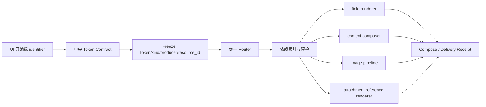

# 资料 Token 双层语义与五类资料链路统一重构记录

日期：2026-07-13  
状态：已实施并完成本次范围的全链路回归  
适用范围：字段资料、文件资料、时间计划、图片资料、附件资料

## 1. 结论

五类资料必须有不同的用户外显 Token，但不能让 UI、路由、依赖索引和各渲染器分别猜测其内部语义。

本次采用三轴模型：

- `namespace`：用户在 Word 中看到的资料类别；
- `kind`：引擎采用的消费方式，由中央注册表根据 namespace 唯一派生，不允许独立编辑；
- `producer`：冻结资料由谁产生，进入快照证据并参与快照哈希。

因此，`@text` 和 `@time` 可以同属 `kind="field"`，却保持清楚的用户分类和不同生产来源；文件、图片、附件也不需要在下游靠字符串前缀临时分支。

## 2. 最终 Token 矩阵

| 外显 Token | namespace | 内部 kind | producer | 运行行为 |
| --- | --- | --- | --- | --- |
| `{{@text:company_name}}` | `text` | `field` | `manual` / `function` | 标量文本替换 |
| `{{@time:phase_1_start}}` | `time` | `field` | `timeline` | 时间计划计算后按字段替换 |
| `{{@file:technical_route}}` | `file` | `content` | `file_binding` | 在独占正文段落插入 MD/DOCX 内容块 |
| `{{@img:qualification1}}` | `img` | `image` | `image_binding` | 按图片规则转换、缩放并插图 |
| `{{@attach:supporting}}` | `attach` | `attachment` | `attachment_binding` | 在独占正文段落渲染附件清单引用 |

约束：

1. namespace 只能来自中央注册表；
2. identifier 不得为空，也不得包含空白、花括号、`@` 或冒号；
3. `kind` 始终从 namespace 派生，任何冲突都在入口拒绝；
4. producer 必须属于该 namespace 的允许集合；
5. 内部 `field_id`、`content_id`、`role` 等保持短且稳定，不把 `@text:` 写进业务主键；
6. 用户模板只使用完整 namespaced Token，不再维护裸 `{{字段}}` 与旧语法的双轨运行时兼容。

## 3. 为什么不把所有信息都塞进 Token

Token 的职责是让用户在模板上看懂“这里会插入什么类别的资料”，不是承载全部运行元数据。

例如：

```text
{{@text:technical_route}}
```

只能说明它是文本型字段；它究竟来自手填还是函数，应由冻结证据记录：

```json
{
  "token": "{{@text:technical_route}}",
  "namespace": "text",
  "identifier": "technical_route",
  "kind": "field",
  "producer": "function",
  "resource_id": "technical_route"
}
```

这样既避免 `{{@text:function:...}}` 一类过长、难理解的语法，又保证执行时不是靠猜。

## 4. 单一链路



职责边界：

- UI 不决定 kind；
- router 不猜 producer；
- renderer 不重新解析旧式别名；
- snapshot 不保存可相互矛盾的 namespace 与 kind；
- 依赖索引只接收冻结后的声明与资源关系；
- 每个 renderer 只消费自己的 kind。

## 5. 五类资料边界

### 5.1 字段资料与时间资料

两者都是标量替换，因此内部共用 `kind="field"`；外显必须分为 `@text` 和 `@time`。

- 普通字段、固定字段、函数字段使用 `@text`；
- 时间计划的输入字段和输出节点使用 `@time`；
- 时间归属由时间计划模块统一提供，UI、Freeze、预览和运行时不得分别按中文名称猜测；
- 普通运行配置只携带冻结后的 `timeline_field_keys`，不把整份可编辑计划再次传给字段渲染器；
- alias 继承目标字段的 namespace；
- 替换映射仍以短 field ID 取值。

### 5.2 文件资料

`@file` 表示结构化内容块，不表示把一个文件当附件复制。

- 源可为 Markdown 或受支持的 DOCX；
- 编译阶段产出不可变内容 artifact；
- Token 必须处于正文独占段落；
- 内容块内部首版只允许 `@text` / `@time` 标量 Token；
- 禁止嵌套 `@file` 与 `@attach`，避免递归装配和循环依赖；
- 样式、资源、编号和关系由内容合并器处理，不走附件交付链。

### 5.3 图片资料

图片目录与附件目录必须在 intake 时物理分域、类型校验，不能因为同一文件夹里混入 DOCX/PDF/XLSX 就让图片插入器尝试消费。

- 图片绑定只接收经扩展名、媒体类型和实际图片 payload 校验的文件；
- 非图片污染在快照前阻断，不进入图片排序、预览、变换与插入；
- 图片规则是图片资料上方的独立卡片，对当前资料包的所有图片统一生效；
- “自适应缩放”与“图片水印”相互独立启用；
- 未启用自适应缩放即直接插入；
- 水印只提供固定字段或自由字段两种来源，固定字段在资料页填写，自由字段留给工作台；
- 水印样式固定为浅灰斜向平铺，不增加无必要的逐图参数。

自适应缩放的目标不是靠标题数量或字号估算空间，而是在真实 Word 布局能力可用时，以“标题与图片保持同页”为约束缩小图片。它属于交付变体阶段，不写入原始资料快照；无布局能力时必须显式降级，不能伪装已完成多轮校对。

### 5.4 附件资料

附件有两条相互独立但共享同一 binding 的结果：

1. 文件交付：PDF、DOCX、XLSX 等原文件进入交付包；
2. 正文引用：只有模板存在 `{{@attach:role}}` 时，渲染确定性附件清单。

`@attach` 不会把附件文件正文合并进主文档。模板没有该 Token 时不应报错，因为“随包交付附件”并不等于“正文必须出现附件清单”。若模板存在 Token 但绑定为空，则必须阻断。

附件清单 Token 与文件交付都由 attachment binding 的 `role` 派生，避免另建一张可漂移的 Token 配置表。

## 6. UI 交互契约

字段、文件、时间、图片和附件列表共享如下规则：

- 顶层列语义统一为：序号、预览、占位符、名称、来源、操作；
- 窄宽度下先隐藏来源列，保留能识别行语义的核心列；
- Token 单击复制完整真实值，双击仅编辑 identifier；
- `{{@text:`、`{{@file:`、`{{@time:`、`{{@img:`、`{{@attach:` 与尾部 `}}` 在编辑态冻结；
- 名称单击复制、双击编辑；
- Enter 提交，Esc 回滚，Tab 提交并移动焦点，点击组件外部提交并退出编辑；
- 不显示“单击复制，双击修改”的悬浮提示弹窗；
- Token 与名称过长时只在显示投影中省略，复制、编辑、保存与执行始终使用完整值；
- Token 省略仍保留前后结构，例如 `{{@img:ISO9001…}}`；
- 文件名优先保留扩展名，路径采用中间省略；
- 文件夹图标语义固定为“在文件夹中显示”，与“选择文件/目录”分开；
- 图片、文件、附件名称都进入资料包配置，不从文件名临时反推。

## 7. 快照与防漂移规则

资料冻结使用 `material-snapshot-v5`，并记录 `material-token-v1`。

快照包含：

- 外显 Token；
- 由中央注册表验证后的 kind；
- producer；
- 对应稳定 resource ID；
- 文件内容哈希、规则版本和源修订。

这些事实进入 canonical payload 与 snapshot ID。反序列化时会重新验证：

- Token 自述 namespace 是否真实；
- kind 是否与 namespace 唯一映射一致；
- producer 是否允许；
- token/resource 是否与冻结的五类资料域完全一致；
- snapshot ID 是否匹配 canonical payload。

任何一项冲突都拒绝加载，不在运行中“尽量修复”。

## 8. 母版与预检

母版索引保留 DOCX 中的完整外显形式，例如 `@text:official_title`，用于检查母版文件哈希和占位符清单是否变化；母版业务契约继续使用稳定 identifier `official_title`。

预检边界统一执行一次“外显 Token → identifier”投影。这样既不会把 `@text:` 写进业务字段 ID，也不会让内置母版、用户母版和正式装配各自维护一套比较规则。

## 9. 迁移决定

本项目尚未发布，因此本次采用一次性迁移，不保留长期双语法：

- 裸字段 Token → `@text` 或由时间归属转换为 `@time`；
- `@content` → `@file`；
- 图片 Token → `@img`；
- 附件 role 派生 `@attach`；
- 内置配置、内置公文母版和 manifest 同步重建；
- 旧审计文档仍作为决策过程保留，但其中 `@content` 的最终结论由本文覆盖。

特别说明：考试母版的 `{{af_*}}` 是另一套专用母版控制协议，不属于本次五类资料 Token，不应被机械迁移。

## 10. 已建立的回归边界

测试覆盖至少包括：

- 中央注册表解析、格式化、kind/producer 冲突拒绝；
- router 对五类 Token 的唯一分流；
- Freeze 证据、快照确定性、篡改拒绝；
- 图片目录非图片污染阻断；
- 文件内容中的非法递归 Token 阻断；
- 附件正文清单的独占段落、空绑定与缺省 Token 行为；
- 公文母版索引、预检与正式装配；
- 长文本显示投影、真实值复制、冻结前后缀、双击编辑、外部点击退出；
- 图片与附件名称、路径和操作列的统一布局。

2026-07-13 最终聚合回归：`389 passed, 1 skipped`。跳过项仅为当前 Windows 账户不支持创建符号链接的既定测试分支；本次范围内无失败。全库另有既存的 scene release-gate、模板 UI 守卫、参数所有权锚点和本地发布日志检查失败，未在本次资料链路重构中越界修改。

## 11. 后续开发原则

新增资料类型时，顺序必须是：

1. 在中央 contract 注册 namespace、kind 和 producer；
2. 定义唯一 binding 与 Freeze evidence；
3. 接入 router 和 dependency index；
4. 实现单一 renderer 与 receipt；
5. 最后接 UI。

禁止直接在 UI、composer 或某个 presenter 内新增 `startswith("@xxx:")` 临时分支。若某项需求无法通过中央契约表达，应先扩展契约，而不是复制一条旁路。
