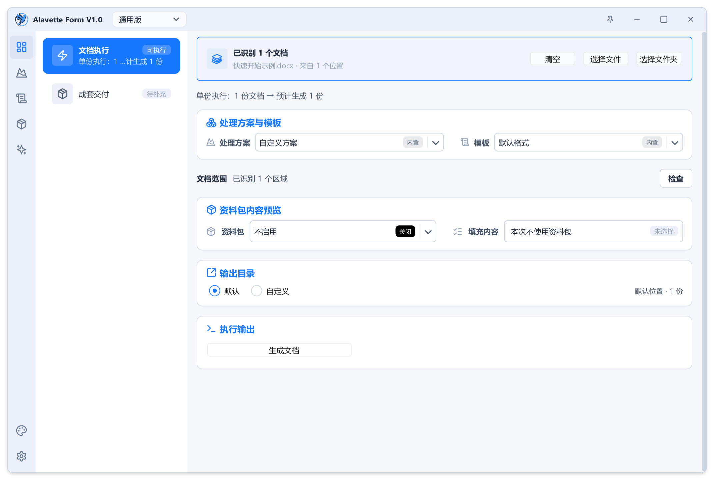
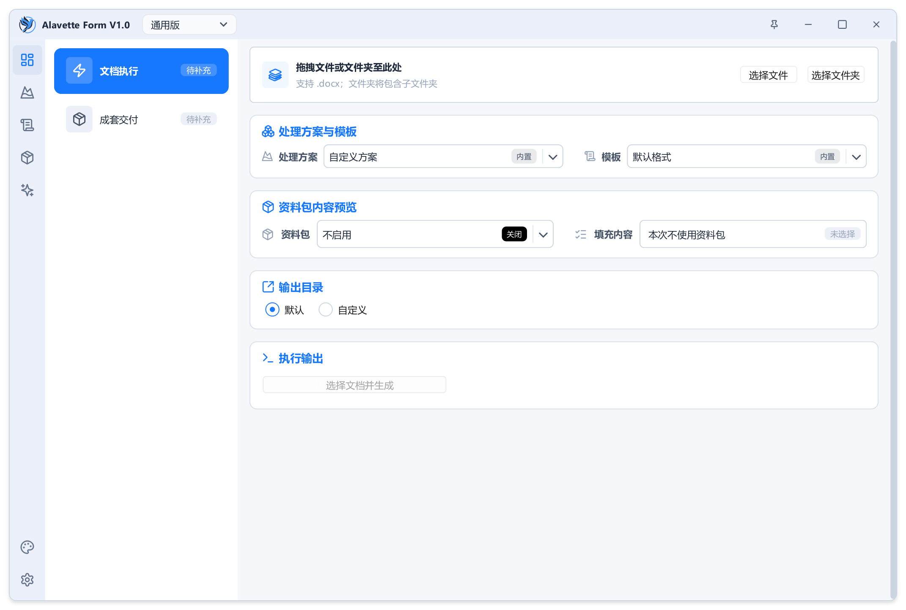
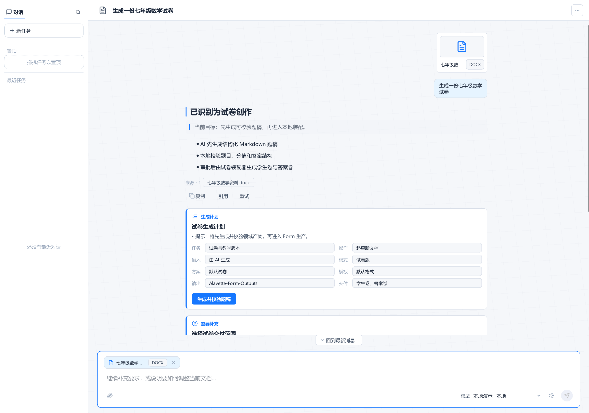

# Alavette Form V1.0 用户手册

> 适用版本：Alavette Form V1.0
> 文档定位：任务教程、操作指南、概念参考与排障手册
> 最后更新：2026 年 7 月

## 1. 产品与边界

Alavette Form 是 Windows 桌面文档编排工具，用于把已有 Word 文档或结构化资料按选定方案和模板生成新的 DOCX。它帮助用户统一格式、装配内容、执行预检并保留交付记录。

它不是 Word 的替代品，也不会替用户判断专业内容是否正确。生成结果仍应在 Word 中复核，尤其是页眉页脚、复杂分页、公式、域、交叉引用、浮动图片和打印效果。

### 1.1 V1.0 正式工作模式

| 工作模式 | 适合的任务 | 典型结果 |
| --- | --- | --- |
| 通用版 | 整理一般报告、通知、方案和已有 Word | 新的规范化 DOCX |
| 试卷版 | 把试题资料装配成教学交付版本 | 学生卷、答案速查等 |
| 论文版 | 按论文规则整理标题、目录和正文 | 论文排版结果 |
| 公文版 | 按文种和资料生成公文 | 通知、请示、报告、函等 |

标书版、技术文档版和报告版不属于 V1.0 正式开放入口。

### 1.2 安全原则

- 默认把输入文档视为原稿，输出为新文件；
- 正式处理前保留独立备份；
- 不在执行期间移动、改名或删除输入文件；
- 生成成功后仍进行人工检查；
- AI 能力可能涉及外部模型服务，是否联网取决于用户配置和所选提供方。

## 2. 10 分钟快速开始

首次使用请先完成发布包中的《Alavette Form V1.0 - 快速开始》。完成后，你应能独立：

1. 启动完整解压的程序；
2. 在通用版工作台的“文档执行”中添加一个 DOCX；
3. 确认处理方案、模板和输出目录；
4. 识别预检中的可执行、警告和阻断；
5. 生成新文档并找到输出；
6. 确认原稿未被覆盖。

## 3. 先理解四个核心概念

### 3.1 方案：决定做什么

方案描述处理目标和功能组合，例如是否整理标题编号、清理多余格式、处理表格图片，或生成特定交付版本。

### 3.2 模板：决定长什么样

模板描述字号、字体、段落、标题层级、页面和其他版式规则。相同内容使用不同模板，可以得到不同外观。

### 3.3 资料包：决定填什么

资料包保存可复用的字段和记录，例如单位名称、日期、发文信息、试题记录或其他结构化内容。缺少必填字段时，资料驱动任务可能被阻断。

### 3.4 母版：决定内容装到哪里

母版提供稳定的文档骨架和占位位置。资料驱动生成会把记录中的内容装入母版，再应用规则和模板。

可以用一句话记忆：

| 对象 | 回答的问题 |
| --- | --- |
| 方案 | 这次要做什么？ |
| 模板 | 结果要长什么样？ |
| 资料包 | 这次要填什么？ |
| 母版 | 内容要装到哪里？ |

## 4. 工作台：从输入到结果

工作台是大多数任务的起点。左侧任务卡负责选择流程，右侧详情区按当前任务显示输入、规则、预检、输出和执行结果。

### 4.1 选择输入

单文档任务使用 `.docx`。选择后检查文件名是否正确，并确保文件能够在 Word 中正常打开。

不要把临时下载文件、云盘占位文件或正在同步的不完整文件作为正式输入。若文件来自邮件或协作平台，先保存到本地稳定目录。

### 4.2 选择处理方案和模板

第一次执行优先使用当前模式的默认方案和默认模板。正式任务中，确认两者都属于当前工作模式。

如果切换模式时提示存在未保存修改，应先保存、放弃或取消切换。不要在不清楚影响时丢弃自定义配置。

### 4.3 选择输出目录

默认输出适合试运行。正式交付建议为每个任务创建独立目录，并在目录名中加入项目或日期。

以下情况容易导致输出失败：

- 目录没有写入权限；
- 同名结果正在 Word 中打开；
- 输出路径过长或包含异常字符；
- 磁盘空间不足；
- 安全软件阻止程序写入。

### 4.4 预检与风险确认

预检是生成前的决策门：

| 状态 | 含义 | 用户动作 |
| --- | --- | --- |
| 可执行 | 未发现必须修复的问题 | 可以生成 |
| 警告 | 存在需要生成后复核的风险 | 阅读影响范围，决定是否继续 |
| 阻断 | 当前条件不足，继续会产生不可靠结果 | 先修复，再重新检查 |

高风险对象可能包括复杂域、公式、浮动对象、异常分节或难以可靠重建的 Word 结构。确认继续不等于风险消失。

### 4.5 执行和结果

点击“生成文档”后等待任务完成。结果应至少回答三个问题：

1. 最终状态是什么；
2. 文件保存在哪里；
3. 如果没有完全成功，下一步该做什么。

优先使用“打开文档”检查结果，再用“打开目录”确认相关报告和其他产物。

## 5. 按工作模式完成任务

### 5.1 通用版：整理一份已有 Word

**完成结果**：得到一份按通用规则整理的新 DOCX。

**步骤**

1. 在窗口顶部选择“通用版”。
2. 进入“工作台 > 文档执行”并添加 DOCX。
3. 保留默认方案，或选择与你的目标相符的通用方案。
4. 选择通用模板。
5. 设置独立输出目录。
6. 处理所有阻断项；阅读警告。
7. 点击“生成文档”。
8. 在 Word 中检查标题层级、正文、表格、图片、编号和分页。

**完成判断**

- 生成了新文件；
- 原稿未变化；
- 主要版式与所选模板一致；
- 没有遗漏预检要求人工复核的对象。

### 5.2 试卷版：生成试卷交付版本

**完成结果**：根据当前试卷方案生成学生卷、答案速查或方案中定义的交付版本。

**步骤**

1. 切换到“试卷版”。
2. 选择试题来源或准备好的试卷 DOCX。
3. 确认试卷方案、模板和需要的交付版本。
4. 检查题号、题型、分值和答案资料是否完整。
5. 设置输出目录并预检。
6. 生成后分别打开各交付文件。
7. 核对题目顺序、分值合计、答案对应关系和分页。

**重点复核**

- 学生卷中不应意外出现答案；
- 答案版与题号一一对应；
- 公式、图片和选择项没有错位；
- 试卷总分和各题分值一致。

### 5.3 论文版：整理标题、目录和正文

**完成结果**：得到符合所选论文模板结构的 DOCX。

**步骤**

1. 切换到“论文版”。
2. 添加论文 DOCX。
3. 选择与学校或任务要求匹配的论文模板。
4. 核对标题层级、摘要、关键词、正文、参考文献和附录结构。
5. 完成预检并生成。
6. 用 Word 打开结果，更新目录和域。
7. 检查页码、分节、图表题注、公式、引用和参考文献。

**边界**

软件可以帮助应用结构和版式规则，但不会判断学术内容、引用真实性或学校最新规范。最终以学校或机构要求为准。

### 5.4 公文版：按文种和资料生成

**完成结果**：得到所选文种的公文 DOCX。

**步骤**

1. 切换到“公文版”。
2. 选择通知、请示、报告、批复、函或纪要等文种。
3. 选择公文方案、模板和需要的资料包。
4. 补齐标题、主送机关、正文、发文机关、日期等当前文种要求的字段。
5. 检查资料预览和缺失项。
6. 设置输出目录，完成预检并生成。
7. 核对版记、日期、机关名称、附件说明和分页。

**边界**

公文格式和字段完整不等于行文内容合规。正式发文前应由本单位责任人审核。

## 6. 配置与复用

### 6.1 方案配置

“方案配置”用于查看和维护处理目标。修改前先确认当前工作模式和方案来源。

内置方案用于提供稳定默认值。需要长期复用的调整应保存为用户配置，并使用能表达用途的名称，例如“内部月报-正文清理”。

### 6.2 模板管理

“模板管理”用于查看和维护版式规则。不要把多个完全不同的交付规范堆进一个模板；按组织、文种或交付渠道建立清晰的用户副本。

修改模板后，用专门的样例文档回归检查标题、正文、列表、表格和分页。

### 6.3 资料包

“资料包”用于维护字段、记录、预览和生成前检查。

处理资料问题时遵循：

1. 先看缺失字段和错误字段；
2. 回到对应记录修复；
3. 重新预览；
4. 重新执行生成检查；
5. 只在没有阻断后生成。

不要在截图、问题报告或公开仓库中提交真实身份证号、手机号、地址、合同金额、密钥或未公开业务资料。

## 7. AI 文档助手

AI 文档助手是可选入口，适合用自然语言描述目标、添加材料、审阅计划并在确认后生成。

### 7.1 使用前

- 在“偏好设置”中完成所需模型连接配置；
- 确认所选模型服务的联网、计费和数据政策；
- 只上传允许发送给该服务的材料；
- 不把模型输出直接视为最终专业结论。

### 7.2 推荐流程

1. 明确描述目标、受众、文档类型和输出要求。
2. 添加当前任务真正需要的 DOCX 材料。
3. 查看助手给出的理解和执行计划。
4. 修正歧义、缺少的资料和错误假设。
5. 只在计划清楚后确认执行。
6. 生成后按普通工作台结果进行人工验收。

### 7.3 何时不要使用

- 任务必须完全离线且没有可用本地模型；
- 材料禁止发送到外部服务；
- 只需要确定性的格式处理；
- 无法安排人工复核；
- 需要模型承担法律、医疗、财务或其他专业决策责任。

## 8. 验收生成结果

### 8.1 最低验收清单

- 文件能正常打开；
- 原稿未被覆盖；
- 输出文件名和目录正确；
- 标题与正文样式正确；
- 表格、图片、公式没有丢失；
- 编号连续、交叉引用可用；
- 页眉、页脚、页码和分节正确；
- 目录和域已按需要更新；
- 预检警告涉及的内容已人工确认。

### 8.2 状态解释

| 状态 | 解释 | 下一步 |
| --- | --- | --- |
| 成功 | 计划内产物已生成 | 打开并人工复核 |
| 部分成功 | 一部分产物成功，一部分失败 | 保留成功项，修复失败项后重试 |
| 失败 | 没有得到可用的计划产物 | 查看错误与输出权限，修复后重试 |
| 已取消 | 用户或系统终止执行 | 确认没有残留临时产物，再重新执行 |

## 9. 排障与恢复

| 问题 | 可能原因 | 建议处理 |
| --- | --- | --- |
| 程序无法启动 | 发布包未完整解压、依赖文件缺失 | 重新完整解压；不要单独移动 EXE |
| 中文显示异常 | 系统字体或显示环境异常 | 使用标准 Windows 中文字体环境并重启程序 |
| 文件无法添加 | 不是受支持 DOCX、文件损坏或占用 | 先用 Word 打开并另存为 DOCX；关闭占用程序 |
| 生成按钮不可用 | 存在预检阻断 | 打开阻断详情并逐项修复 |
| 提示缺少字段 | 资料包记录不完整 | 回到资料包补齐必填字段并重新预览 |
| 输出文件写入失败 | 权限不足、同名文件占用、路径异常 | 关闭同名文件；选择短且可写的本地目录 |
| 复杂对象有风险 | 文档包含浮动对象、域、公式或复杂分节 | 保留原稿，生成后在 Word 中逐项复核 |
| 目录或页码未更新 | Word 域未刷新 | 在 Word 中全选并更新域，再检查分页 |
| 批量任务部分失败 | 个别输入或资料记录不合格 | 查看失败项，修复后只重试失败项 |
| AI 助手不可用 | 模型配置、网络、余额或权限问题 | 检查偏好设置和模型服务状态 |

### 9.1 提交可复现的问题

问题报告至少包含：

1. Alavette Form 版本；
2. Windows 版本和 Word 版本；
3. 工作模式、方案和模板名称；
4. 从添加输入到报错的最短步骤；
5. 完整错误文字或脱敏截图；
6. 预期结果与实际结果；
7. 是否每次都能复现。

提交前移除真实业务内容、用户名、本地目录、密钥和个人信息。能用自制最小样例复现时，不要发送原始业务文件。

## 10. 发布包与升级

正式版推荐使用 `Setup.exe`。安装器默认仅为当前用户安装到 `%LOCALAPPDATA%\Programs\Alavette Form`，不需要管理员权限；开始菜单快捷方式会自动创建，桌面快捷方式可在安装时选择。

安装新补丁时关闭正在运行的程序，直接运行相同或更高版本的 `Setup.exe` 即可。安装器会沿用原安装位置和快捷方式选择，并替换程序文件；用户方案、模板、资料包、日志和助手状态保存在 `%LOCALAPPDATA%\Alavette-Form`，不会随程序文件被覆盖。为避免配置与程序不兼容，安装器会阻止用旧安装包覆盖更高版本。

卸载时会询问是否同时删除当前用户数据和应用保存的 API 凭据，默认选择“否”。选择保留后，以后重新安装仍可继续使用原数据；选择删除后，本机当前用户的上述数据会被清除。通过开发环境变量指定的自定义数据目录不会由卸载器自动删除。

如另行提供 ZIP 便携包，解压后应保留完整目录结构，至少包含：

- `Alavette-Form.exe`
- `Alavette Form V1.0 - 快速开始.pdf`
- `Alavette Form V1.0 - 用户手册.pdf`
- `快速开始示例.docx`
- `LICENSE`
- `THIRD_PARTY_NOTICES.md`
- 程序运行所需目录

升级前仍建议备份重要用户方案、资料包和结果。ZIP 便携包的不同版本不要覆盖式混用程序目录；应解压到新的独立目录，完成样例验证后再迁移正式任务。

## 11. 快速索引

| 我想做什么 | 去哪里 |
| --- | --- |
| 第一次生成文档 | 《快速开始》 |
| 选择正确工作模式 | 第 1.1 节 |
| 理解方案和模板 | 第 3 章 |
| 处理已有 Word | 第 5.1 节 |
| 生成试卷版本 | 第 5.2 节 |
| 整理论文 | 第 5.3 节 |
| 生成公文 | 第 5.4 节 |
| 使用 AI 文档助手 | 第 7 章 |
| 判断成功或部分成功 | 第 8 章 |
| 修复生成按钮不可用 | 第 9 章 |
